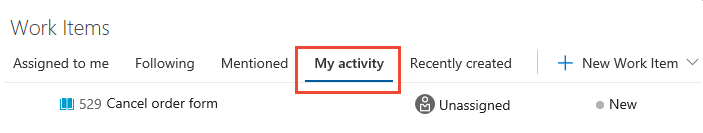

# Plan and track work 

[!INCLUDE [temp](../_shared/version-vsts-tfs-all-versions.md)]

To plan and manage your project, you add work items. You use different types of work items to track different types of work. The types of work include user stories or product backlog items, tasks, bugs, or issues. You can describe the work to be done, assign work, track status, and coordinate efforts within your team. 

Here we show how to add work items from the web portal and view work items that you created. 

## Prerequisites

After you connect to a team project, you can add work items. If you don't have a team project yet, create one in [Azure DevOps](sign-up-invite-teammates.md).

## Open the Work Items page
After you connect to a project, you can view and add work items. 

<a id="browser" /> 

> [!NOTE]
> The **New navigation** feature, which provides a vertical navigation experience, is in preview for Azure DevOps. To enable it, see [Turn preview features on or off](../../project/navigation/preview-features.md). When you enable **New navigation**, you automatically enable several new Agile tool features described in the [New Work Hubs](https://blogs.msdn.microsoft.com/devops/2018/06/22/new-work-hubs/) blog post. >
> For on-premises TFS users, select **Previous navigation** for guidance. 

# [New navigation](#tab/new-nav)

Check that you selected the right project. Then select **Boards** > **Work Items**. 

> [!div class="mx-imgBorder"]  
> 

# [Previous navigation](#tab/previous-nav)

Open a browser window, select **Work**, and then select **Work Items**. 

> [!div class="mx-imgBorder"]

---

> [!NOTE]    
>When you create a project in [Agile](/azure/devops/boards/work-items/guidance/agile-process-workflow), [Scrum](/azure/devops/boards/work-items/guidance/scrum-process-workflow), or [CMMI](/azure/devops/boards/work-items/guidance/cmmi-process-workflow), the types of work items you can create might differ. For example, backlog items might be called user stories in Agile, product backlog items in Scrum, or requirements in CMMI. All three work items are similar. They describe the customer value to deliver and the work to be performed.
>
> For an overview of all three processes, see [Choose a process](/azure/devops/boards/work-items/guidance/choose-process). 

## Add a work item 

Follow these steps to add a work item. 

1. Select the work item type from the **New Work Item** drop-down menu.  

	For example, **User Story** is shown here. 

	> [!div class="mx-imgBorder"]
	> 
<!---
	> [!TIP]    
	> Work items you add are automatically scoped to the [Currently selected team's area and iteration paths](../../organizations/settings/set-team-defaults.md). To change the team context, see [Switch project or team focus](../../project/navigation/go-to-project-repo.md?toc=/azure/devops/boards/get-started/toc.json&bc=/azure/devops/boards/get-started/breadcrumb/toc.json). -->

2. Enter a title, and then save the work item. Before you can change the state from its initial default, you must save it.  

	  

	You can [add tags to any work item](../queries/add-tags-to-work-items.md) to filter backlogs, queries, and work item lists.
 

To track the work you want to manage, create as many work items of the type that you need.  

<a id="pivot-views" />
## View the work items you created  

By using the drop-down menu, you can focus on relevant items inside a project. Use one of the seven pivots described in the following list. You also can [filter](#filter) and [sort](#sort) each pivot view.  

<table>
<tbody valign="top">
<tr>
<td>

</td>
<td>
<ul>
<li>**Assigned to me**: Lists all work items assigned to you in the project in the order they were last updated. To open or update a work item, select its title.</li>
<li>**Following**: Lists work items that you elected to [follow](../work-items/follow-work-items.md). </li>
<li>**Mentioned**: Lists work items in which you were mentioned in the last 30 days. </li>
<li>**My activity**: Lists work items that you recently viewed or updated.</li>
<li>**Recently updated**: Lists work items recently updated in the project. </li>
<li>**Recently completed**: Lists work items completed or closed in the project.</li>
<li>**Recently created**: Lists work items created within the last 30 days in the project.</li>
</ul>
</td>
</tr>
</tbody>
</table>

For example, select **My activity** to list all work items you recently viewed, created, or modified. 

> [!div class="mx-imgBorder"]  
>   

To view any work item listed, select the title. 

For more information on how to use the **Work Items** page, see [View and add work items](../work-items/view-add-work-items.md).

## Try this next  
 
> [!div class="nextstepaction"]
> [Create your backlog](../backlogs/create-your-backlog.md)
> [Kanban quickstart](../boards/kanban-quickstart.md). 

Or, [learn more about how to plan and track work](../work-items/index.md).
 
