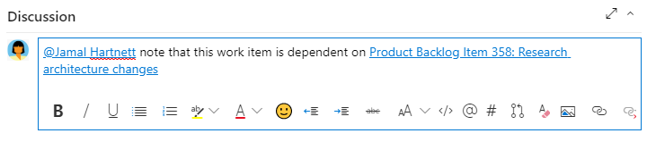

# Track user stories, tasks, and features 

[!INCLUDE [temp](../_shared/version-vsts-only.md)]

This article walks you through creating user stories and tasks using a Kanban board for the Agile process. 

> [!IMPORTANT]  
> **Select the version that meets your location and process**:
> We are experimenting with a new acquisition model which is 
> currently available for users located in the United States and that sign up through [azure.com/boards](https://azure.microsoft.com/en-us/services/devops/boards/?nav=min). This model supports a new Basic process.  
> For International users and others who sign up through another method, the Agile process is used. Select your version of this article based on your location and process used.
> - [**Basic process**](track-issues-tasks.md?toc=/azure/devops/boards/get-started/toc.json&bc=/azure/devops/boards/get-started/breadcrumb/toc.json)
> - [**Agile process**](plan-track-work.md?toc=/azure/devops/boards/get-started-agile/toc.json&bc=/azure/devops/boards/get-started-agile/breadcrumb/toc.json) 

Your first project uses the default Agile process which provides several work item types&mdash;for example, user stories, tasks, bugs, features, and epics among others&mdash;to plan and track work. We recommend you start by adding user stories. If you need to group them into a hierarchy, you can define features. If you want to track additional details of work, you can add tasks to a user story.  

> [!div class="mx-tdCol2BreakAll"]
> |Work item types| Backlog hierarchy |
> |------|---------|
> | |  

Within each work item form, you can describe the work to be done, assign work to project contributors, track status, and collaborate with others through the Discussion section. 

Here we show how to add issues and child tasks from the web portal and add details to those work items . 

<!---
## Prerequisites

- After you connect to a project, you can add work items. If you don't have a project yet, [create one in Azure DevOps](sign-up-invite-teammates.md). 
- To add issues and tasks to the board, and use all other board features, you must be granted **Basic** access and have been added as a member of the Contributors or Project Administrators group. 
- If you have been granted **Stakeholder** access for a private project and have been added as a member of the Contributors or Project Administrators group, you can view boards, open and modify issues and tasks, and add child tasks to a checklist. However, you can't update the status of an issue or reorder or reparent an issue using drag-and-drop, nor update a field on a card. 
- If you have been granted **Stakeholder** access for a public project, and have been added as a member of the Contributors or Project Administrators group, you have full access to all Boards features. 

For details, see [Default permissions and access for Azure Boards](permissions-access-boards.md)

-->

## Open the User Stories board 

The User Stories Kanban board is the best tool for quickly adding user stories and child tasks. To open, choose **Boards>Boards**.  

  

The Features Kanban board is the best tool for quickly adding features and user stories that are children of those features. 
To open the Features board from the User Stories board, choose **Features** from the board selector. 

> [!div class="mx-imgBorder"]  
>   

## Add user stories  

0. From the User Stories board, choose **New item** and start adding those stories you want to track. 

	> [!div class="mx-imgBorder"]  
	>  

0. Enter return and the system assigns a work item ID to the user story. 

	> [!div class="mx-imgBorder"]  
	>  

0. To track the work you want to manage, add as many user stories that you need.  

## Add details to a user story

0.	Choose the user story title to open it. Change one or more field values, add a description, or make a note in the **Discussion** section. You can also choose the  **Attachments** tab and drag-and-drop a file to share the file with others.  

	For example, here we assign the story to Raisa Pokrovskaya and we add a discussion note, at-mentioning Raisa. 

	> [!div class="mx-imgBorder"]
	> 

	> [!NOTE]  
	> You can only assign work to a user who has been added to the project. 

0.	Choose **Save & Close** when done. 

### Field descriptions
<table valign="top" width="100%">
<tbody valign="top" >
<tr>
<th width="20%">Field</th>
<th width="80%">Definition</th>
</tr>
<tr>
	<td width="18%">
[Title](/azure/devops/boards/queries/titles-ids-descriptions) 
</td>
	<td>
Enter a description of 255 characters or less. You can always modify the title later.
</td></tr>
<tr>
	<td>
[Assigned To](/azure/devops/boards/queries/query-by-workflow-changes)
</td>
	<td>
Assign the work item to the team member responsible for performing the work. Depending on the context you are working in, the drop-down menu will list only team members or contributors to the project.
</td></tr>
<tr>
	<td>
[State](/azure/devops/boards/queries/query-by-workflow-changes)
</td>
	<td>
When the work item is created, the State defaults to the first state in the workflow. As work progresses, update it to reflect the current state.
</td></tr>
<tr>
	<td>
[Reason](/azure/devops/boards/queries/query-by-workflow-changes)
</td>
	<td>
Use the default first. Update it when you change state as need. Each State is associated with a default reason.
</td></tr>
<tr>
	<td>[Area](/azure/devops/organizations/settings/set-area-paths)</td>
	<td>Choose the area path associated with the product or team, or leave blank until assigned during a planning meeting. To change the dropdown list of areas, see [Define area paths and assign to a team](../../organizations/settings/set-area-paths.md).</td>
</tr>
<tr>
	<td>[Iteration](/azure/devops/organizations/settings/set-area-paths)</td>
	<td>Choose the sprint or iteration in which the work is to be completed, or leave it blank and assign it later during a planning meeting. To change the drop-down list of iterations, see [Define iteration paths (aka sprints) and configure team iterations](../../organizations/settings/set-iteration-paths-sprints.md).</td>
</tr>
<tr>
<td>[Description](../queries/titles-ids-descriptions.md)</td> 
<td>Provide enough detail to create shared understanding of scope and support estimation efforts. Focus on the user, what they want to accomplish, and why. Don't describe how to develop the product. Do provide sufficient details so that your team can write tasks and test cases to implement the item.</td> 
</tr>
<tr>
	<td>
[Acceptance Criteria](../queries/titles-ids-descriptions.md) 
</td>
	<td>
Provide the criteria to be met before the user story can be closed. Before work begins, describe the customer acceptance criteria as clearly as possible. Conversations between the team and customers to define the acceptance criteria will help ensure that your team understands your customers' expectations. The acceptance criteria can be used as the basis for acceptance tests so that you can more effectively evaluate whether an item has been satisfactorily completed.

</td>
</tr>
<tr>
	<td>
[Priority](../queries/planning-ranking-priorities.md)
</td>
	<td>
A subjective rating of the issue or task it relates to the business. You can specify the following values:

<strong>1</strong>: Product cannot ship without the successful resolution of the work item, and it should be addressed as soon as possible.

<strong>2</strong>: Product cannot ship without the successful resolution of the work item, but it does not need to be addressed immediately.

<strong>3</strong>: Resolution of the work item is optional based on resources, time, and risk.

<strong>4</strong>: Resolution of the work item is not required.

</td>
</tr>
<tr>
<tr>
	<td>
[Value Area](../queries/planning-ranking-priorities.md)
</td>
	<td>
The area of customer value addressed by the epic, feature, requirement, or backlog item. Values include:

        <ul>
        <li>
          

            <strong>Architectural </strong>: Technical services to implement business features that deliver solution 
          

        </li>
        <li>
          

            <strong>Business</strong>: Services that fulfill customers or stakeholder needs that directly deliver customer value to support the business (Default)
          

        </li>
      </ul>
</td>
</tr>
<tr>
<td>[Story Points](../queries/query-numeric.md)
<td>

Provide a relative estimate of the amount of work required to complete an issue.

Most Agile methods recommend that you set estimates for backlog items based on relative size of work. Such methods include powers of 2 (1, 2, 4, 8) and the Fibonacci sequence (1, 2, 3, 5, 8, etc.). Use any numeric unit of measurement your team prefers. 

The estimates you set are used to calculate [velocity](../../report/dashboards/velocity-chart-data-store.md) and [forecast sprints](../sprints/forecast.md).

</td> 
</tr>
</tbody>
</table>

## Update user story status

As work starts, drag the user story card from the **Backlog** column to the **Active** column. Once work is ready for review, move to the **Resolved** column. After it is reviewed and accepted, move to the **Closed** column. 

> [!div class="mx-imgBorder"]  
>  

You can add or rename columns as needed, see [Customize your board](customize-boards.md).

## Add tasks to a user story

Task checklists provide a quick and easy way to track elements of work which are important to support completing a user story. In addition, you can assign individual tasks to different team members. 

0. To start adding tasks, choose the  actions icon for the story and select the   **Add Task** option.  

	> [!div class="mx-imgBorder"]  
	>  

	Enter a title for the task and type Enter when done.

	> [!div class="mx-imgBorder"]  
	>  

0. If you have a number of tasks to add, simply keep typing your task titles and type Enter.   

	> [!div class="mx-imgBorder"]  
	>   

0. You can mark a task as done, expand or collapse the task checklist, or reorder and reparent tasks. 

	> [!div class="mx-tdCol2BreakAll"]  
	> |Mark a task as done |Reorder and reparent tasks | Expand or collapse the checklist| 
	> |------------------|--------------|--------------|  
	> |To mark a task as complete, check the task checkbox. The task State changes to **Done**.  |To reorder a task, drag it within the checklist. To reparent a the task, drag it to another issue on the board.   |To expand or collapse a task checklist, simply choose the task annotation.  |  

## Add details to a task

0. If you have details you want to add about a task, choose the title, to open it. Change one or more field values, add a description, or make a note in the **Discussion** section.

	Here we assign the task to Christie Church.   

	> [!div class="mx-imgBorder"]  
	>   

0. Choose **Save & Close** when done.

### Field descriptions

In addition to the fields you can define for a user story, you can specify the following fields for a task to support capacity and time tracking. 
<table valign="top" width="100%">
<tbody valign="top" >
<tr>
<th width="20%">Field</th>
<th width="80%">Definition</th>
</tr>
<tr>
<tr>
	<td>[Activity](../queries/query-numeric.md)</td>
	<td>
The type of activity that is required to perform a task.To learn more about how this field is used, see [Capacity planning](../sprints/set-capacity.md). Allowed values are:
<ul><li>
Deployment
</li><li>
Design
</li><li>
Development
</li><li>
Documentation
</li><li>
Requirements
</li><li>
Testing
</li></ul>

</td>
</tr>
<tr>
<td>
[Original Estimate](../queries/query-numeric.md)
</td>
<td>
The amount of estimated work required to complete a task. Typically, this field doesn't change after it is assigned.

You can specify work in hours or in days. There are no inherent time units associated with this field.

</td>
</tr>
<tr>
<td>
[Completed Work](../queries/query-numeric.md) 
</td>
<td>
The amount of work spent implementing a task.
</td>
</tr>
<tr>
<td>[Remaining Work](../queries/query-numeric.md)
</td>
<td>
The amount of work remaining to complete a task. As work progresses, update this field. It's used to calculate [capacity charts](../sprints/set-capacity.md), the [sprint burndown chart](../sprints/sprint-burndown.md). If you divide a task into subtasks, specify hours for the subtasks only. You can specify work in any unit of measurement your team chooses.
 
</td> 
</tr>
</tbody>
</table>

## Capture comments in the Discussion section 

Use the **Discussion** section within a form to add and review comments about the work under development. 

> [!div class="mx-imgBorder"]  
>    

Use the **@mention** control to notify another team member about the discussion. Simply type **@** and their name. Or, bring a group into the discussion by typing **@** and the group name, such as a team or security group. To reference another issue, task, or work item, use the **#ID** control. Type **#** and a list of work items that you've recently referenced will appear from which you can select.  

The rich text editor tool bar displays below the text entry area when you click your cursor within the each text box that can be formatted. 

> [!div class="mx-imgBorder"]  
>   

Use the icons&mdash; at-mention,  #-work-item-ID, and  pull-request ID &mdash;to facilitate bringing others into the discussion or linking to work items or pull requests. Choose one of these icons and a menu displays with the most recent options that you've previously selected. 

## Try this next  
 
> [!div class="nextstepaction"]
> [Customize your board](customize-boards-agile.md)

## Related articles

- [Index to field descriptions](../work-items/guidance/basic-field-reference.md?toc=/azure/devops/boards/get-started/toc.json&bc=/azure/devops/boards/get-started/breadcrumb/toc.json)  
- [Add tags to issues or tasks](../queries/add-tags-to-work-items.md)   
- [Use @mentions in work items](../../notifications/at-mentions.md)  
- [Use #ID to link to work items](../../notifications/add-links-to-work-items.md) 

