# Sign up for free and invite others to collaborate in Azure Boards

[!INCLUDE [temp](../includes/version-vsts-only.md)]

Sign up for an Azure DevOps and Azure Boards to start planning and tracking work. We walk you through the sign-up process for [Azure Boards](https://azure.microsoft.com/services/devops/boards/?nav=min). Follow these steps when you want to accomplish the following tasks: 
- Create a private or public project with Azure Boards enabled services  
- Track work using the Basic, Agile, Scrum, or CMMI process for tracking work  
- Create a Git or Team Foundation Version control (TFVC) repository for managing your code 
- Invite others to contribute to your project 
 
To sign up and enable all Azure DevOps Services, see [Sign up, sign in to Azure DevOps](../../user-guide/sign-up-invite-teammates.md). To learn more about the choices available to you, see these articles: 
-  [What is Azure Boards?](./what-is-azure-boards.md) 
-  [Choose a process work tracking work](../work-items/guidance/choose-process.md)
-  [Choose the right version control for your project](../../repos/tfvc/comparison-git-tfvc.md). 

## Choose your sign-up option  

1. From your web browser, open the [Azure Boards](https://azure.microsoft.com/services/devops/boards/) sign-up page. Supported web browsers include the latest versions of Edge, Internet Explorer, Safari (Mac), Firefox, and Chrome. 

	> [!div class="mx-imgBorder"]  
	> 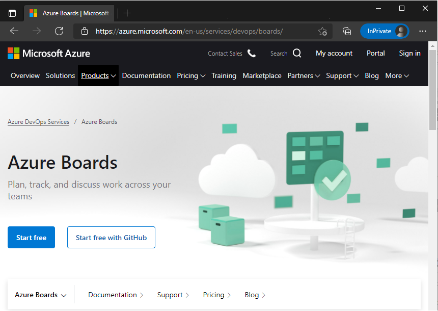

1. Choose one of the following buttons based on the account you want to use. 

	- **Start free**: Choose this option when: 
		- You have a Microsoft account and will sign in using your account email address, phone number, or Skype ID. If you're a Visual Studio subscriber and you get Azure DevOps as a benefit, use the Microsoft account associated with your subscription. Go to [Sign up with a personal Microsoft account](#MicrosoftAccount)
		- You want to sign up using a general email address you want to use. Continue to [Sign up by creating an account using your email address](#create-account).  
		> [!TIP]  
		> You can sign up with any valid email address. Signing up for Azure Boards enables your email address as a Microsoft account.  
	- **Start free with GitHub**: Choose this option if you have an  existing GitHub account. Then go to [Sign up with a GitHub account](#github-account).  
 

1. If you've already signed up or have an organization set up to use Azure Boards, choose the **Sign in** link. 

	> [!div class="mx-imgBorder"]  
	> 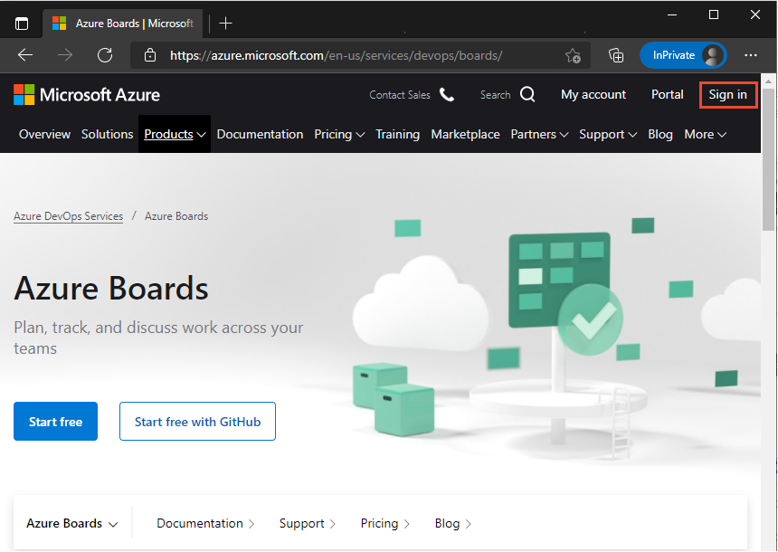

## Sign up by creating an account using your email address 

1. To sign up with a valid email address, choose **Create one!**.  Enter the email address you want to use.

	> [!div class="mx-imgBorder"]  
	> 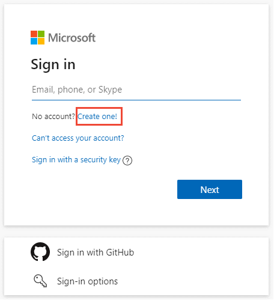

1. Enter the email address you want to use and then choose **Next**. 
 
	> [!div class="mx-imgBorder"]  
	> 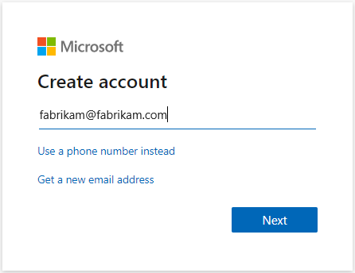

	Or, you choose **Get a new email address** to  create an Outlook or Hotmail account at this time. To learn more, see [create a Microsoft account](https://support.microsoft.com/help/4026324/microsoft-account-how-to-create). 

1. Enter the password you want to use with your Azure Boards Microsoft account and then choose **Next**. 

	> [!div class="mx-imgBorder"]  
	> 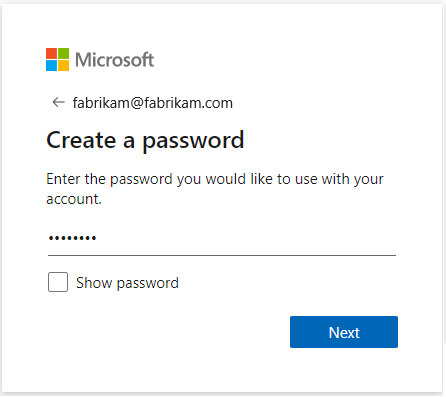
  
1. Choose the region and specify your birthday to complete your account registration and then choose **Next**.  
 
	> [!div class="mx-imgBorder"]  
	> 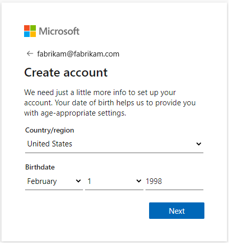 

1. Enter the code sent to your email address to verify your account and then choose **Next**.   

	> [!div class="mx-imgBorder"]  
	> 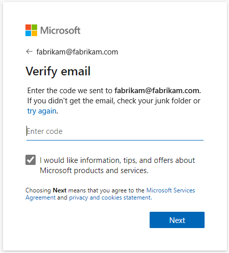 

1. Check your email account and enter the code provided. Choose **Next**.

	> [!div class="mx-imgBorder"]  
	> 

	An organization is created based on your account name. Sign in to your organization at any time by entering `https://dev.azure.com/{yourorganization}`) in your web portal. You can change the organization name as indicated in [Change organization or project settings](#change-settings) later in this article.

1. Also, a project is created based on your account name. You can change the project name later.  To get started with Azure DevOps, choose **Continue**.

   

	- **Project name**: Can't contain special characters (such as /: \ ~ & % ; @ ' " ? < > | # $ * } { , + = [ ]), can't begin with an underscore, can't begin or end with a period, and must be 64 characters or less. 
	- **Visibility**: Choose **Public** if you want to create an open-source project. Otherwise, choose **Private**, so only people who you give access to can view your project. 

1. Your next step is to start using your Kanban board to [track issues and tasks](plan-track-work.md), or [invite other users](#invite-others) to collaborate with your project.  

> [!NOTE]   
> Your  project was created using the Basic process which uses Epics, Issues, and Tasks to track work. If you want a project that uses the Agile, Scrum, or CMMI process, then you can add another project and specify the process through advanced setting options as described in the next section. See [Create a project using Advanced settings](#advanced-settings). 

## Sign up with a personal Microsoft account 

If you have a Microsoft account or Azure Active Directory organizational account, follow these steps to sign up for Azure Boards. 

1. Enter your email address, phone number, or Skype ID for your Microsoft account. If you're a Visual Studio subscriber and you get Azure DevOps as a benefit, use the Microsoft account associated with your subscription. Select **Next**.

	> [!div class="mx-imgBorder"]  
	> 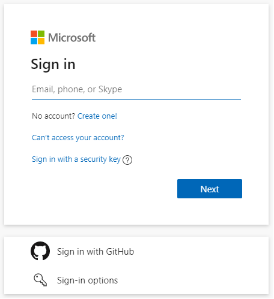

1. Enter your password and select **Sign in**.

	> [!div class="mx-imgBorder"]  
	> 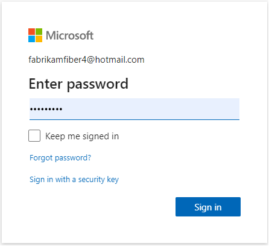
 
1. To get started with Azure Boards, select **Continue**.

	> [!div class="mx-imgBorder"]  
	> 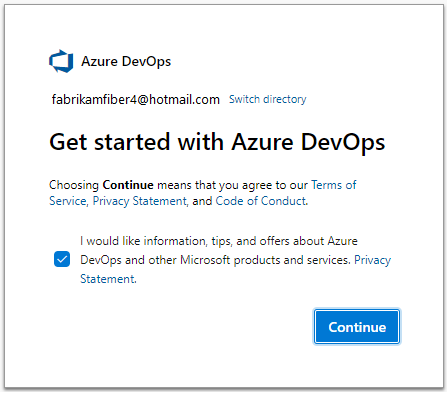

1. An organization is suggested based on the account you used to sign in. You can modify the account name. Choose the region where you want your projects hosted. Then enter the characters you see into the text box, and then choose **Continue**.

	> [!div class="mx-imgBorder"]  
	> 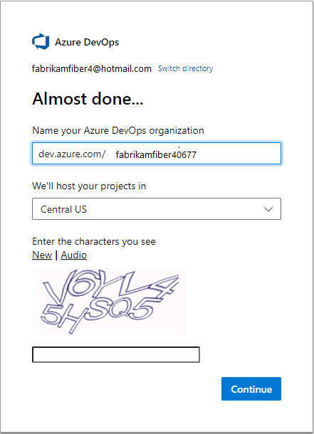
	 
	An organization is created based on the name entered in the **Name your Azure DevOps organization** box.  

	Use the following URL to sign in to your organization at any time:

	`https://dev.azure.com/{yourorganization}`

	You can change the organization name as indicated in [Change organization or project settings](#change-settings) later in this article.
	
1. To complete your sign-up process, go to [create a project](#create-project). 

<a id="github-account" /> 

## Sign up with a GitHub account

If you have a GitHub account, follow these steps to sign up for Azure Boards. 

> [!IMPORTANT]
> If your GitHub email address is associated with an Azure AD-backed organization in Azure DevOps, you can't sign in with your GitHub account, rather you must sign in with your Azure AD account.

1. From the [Azure Boards](https://azure.microsoft.com/en-us/services/devops/boards/) sign-up page, choose **Start Boards free with GitHub**. 

	> [!div class="mx-imgBorder"]  
	> 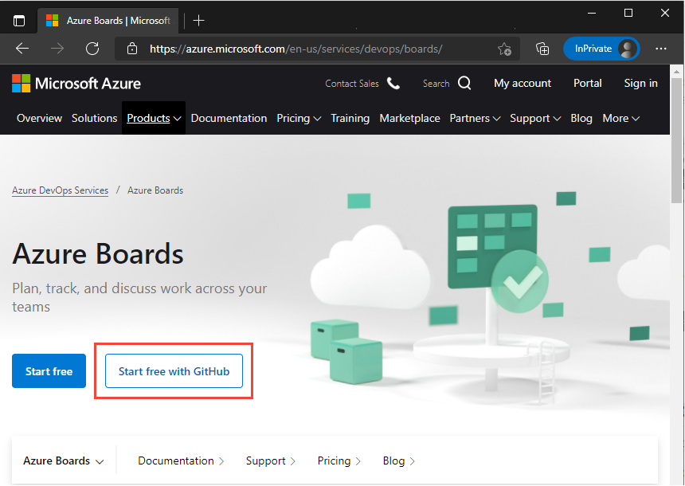

2. Enter your GitHub account credentials, and then select **Sign in**.

	

1. Select **Authorize Microsoft corporation**.

	

	For more information about GitHub authentication, see [FAQs](../../organizations/security/faq-github-authentication.yml).

1. Choose **Continue**.

   

	An organization is created based on your GitHub account.  

	Use the following URL to sign in to your organization at any time:

	`https://dev.azure.com/{yourorganization}`

	You can change the organization name as indicated in [Change organization or project settings](#change-settings) later in this article.
	
1. To complete your sign-up process, go to [create a project](#create-project).  
 
<a id="create-project" />

## Create a project 

If you signed up for Azure DevOps with an existing Microsoft account or GitHub identity, you're automatically prompted to create a project. You can create either a public or private project. To learn more about public projects, see [What is a public project?](../../organizations/public/about-public-projects.md). 

1. Enter a name for your project, select the visibility, and optionally provide a description. Then choose **Create project**. 

	> [!div class="mx-imgBorder"]  
	> 

	- **Project name**: Can't contain special characters (such as / : \ ~ & % ; @ ' " ? < > | # $ * } { , + = [ ]), can't begin with an underscore, can't begin or end with a period, and must be 64 characters or less. 
	- **Visibility**: Choose **Public** if you want to create an open-source project. Otherwise, choose **Private**, so only people who you give access to can view your project. 
	
2. Your Kanban board automatically appears. You're now set to start [tracking issues, tasks, and features](plan-track-work.md), or [invite other users](#invite-others) to collaborate with your project. 

	> [!div class="mx-imgBorder"]
	> 

	

> [!NOTE]   
> Your first project was created using the Basic process which uses Epics, Issues, and Tasks to track work. If you want a project that uses the Agile, Scrum, or CMMI process, then you can add another project and specify the process through advanced setting options as described in the next section. See [Choose a process for a comparison of processes](../work-items/guidance/choose-process.md). 

## Create a project with Advanced options

Your first project is automatically created using the Basic process and a Git repository. If you want to use the Agile, Scrum, or CMMI process and a different repository, you can create another project and choose the process by expanding the **Advanced** settings. You can then [delete the project](../../organizations/projects/delete-project.md) with the process you don't want to use. 

1. Select  **Azure DevOps** to open the **Projects** page, and then select **New project**.

   > [!div class="mx-imgBorder"]  
   > 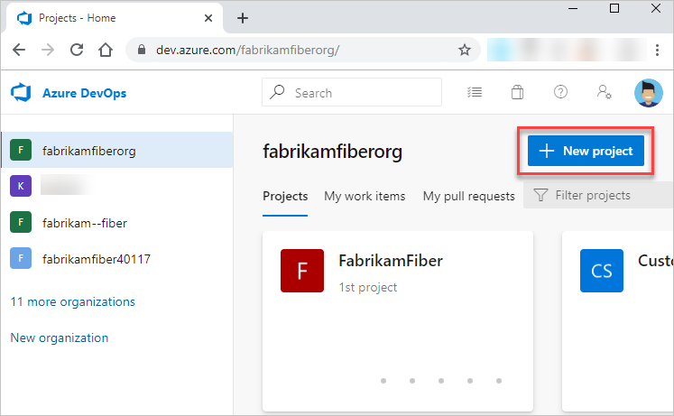  

2. Fill out the form, expand **Advanced** to choose the options available for [**Version control**](../../repos/tfvc/comparison-git-tfvc.md) and [**Work item process**](../work-items/guidance/choose-process.md). 

   > [!div class="mx-imgBorder"]  
   > 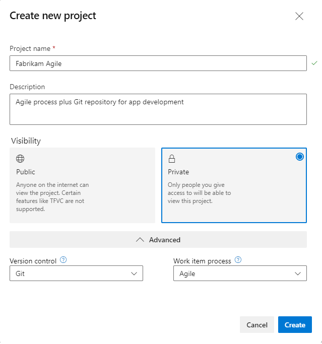  

2. Choose **Create** to complete the action.

<a id="invite-others" />

## Invite team members

You can add and invite others to work on your project by adding their email address to your organization and project.

1. From your project web portal, choose the :::image type="icon" source="../../media/icons/project-icon.png" border="false"::: Azure DevOps icon, and then select :::image type="icon" source="../../media/icons/gear-icon.png" border="false"::: **Organization settings**. 

   

2. Select **Users** > **Add new users**.

   :::image type="content" source="../../media/add-new-users.png" alt-text="Select Add users"::: 

3. Complete the form by entering or selecting the following information:  
	- **Users:** Enter the email addresses (Microsoft accounts) or GitHub IDs for the users. You can add several email addresses by separating them with a semicolon (;). An email address appears in red when it's accepted.  
	- **Access level:** Assign one of the following access levels: 
		- **Basic**: Assign to users who must have access to all Azure Boards features. You can grant up to five users <strong>Basic</strong> access for free.  
        - **Stakeholder**: Assign to users who will have limited access to features to view, add, and modify work items. You can assign an unlimited amount of users Stakeholder access for free.   
	- **Add to project**: Select the project you named in the preceding procedure.  
    - **Azure DevOps Groups**: Select one of the following security groups, which will determine the permissions the users have to perform select tasks (To learn more, see [Default permissions and access for Azure Boards](permissions-access-boards.md).):  
        - **Project Readers**: Assign to users who only require read-only access.   
        - **Project Contributors**: Assign to users who will contribute fully to the project.  
        - **Project Administrators**: Assign to users who will configure project resources.  
		
	> [!NOTE]  
	> Add email addresses for [personal Microsoft accounts](https://account.microsoft.com/account) and IDs for GitHub accounts unless you plan to use [Azure Active Directory (Azure AD)](/azure/active-directory/fundamentals/active-directory-whatis) to authenticate users and control organization access. If a user doesn't have a Microsoft or GitHub account, ask the user to [sign up](https://signup.live.com/) for a Microsoft account or a GitHub account.  

4. When you're done, select **Add** to complete your invitation.

For more information, see [Add users or groups to a team or project](../../organizations/security/add-users-team-project.md) and [Add organization users for Azure DevOps Services](../../organizations/accounts/add-organization-users.md).

<a id="change-settings" />

## Change organization or project settings

You can rename and delete your organization, or change the organization location. To learn more, see the following articles:

- [Manage organizations](../../organizations/accounts/organization-management.md)
- [Rename an organization](../../organizations/accounts/rename-organization.md)
- [Change the location of your organization](../../organizations/accounts/change-organization-location.md)

You can rename your project or change it's visibility. To learn more about managing projects, see the following articles:

- [Manage projects](../../organizations/projects/about-projects.md)  
- [Rename a project](../../organizations/projects/rename-project.md)  
- [Delete a project](../../organizations/projects/delete-project.md)
- [Change the project visibility, public or private](../../organizations/public/make-project-public.md)

## Try this next  
 
> [!div class="nextstepaction"]
> [Track issues and tasks](plan-track-work.md)

## Related articles  

- [Manage projects](../../organizations/projects/about-projects.md)
- [Manage organizations](../../organizations/accounts/organization-management.md)
- [About access levels](../../organizations/security/access-levels.md)
- [Define organizations and projects](../../user-guide/plan-your-azure-devops-org-structure.md)