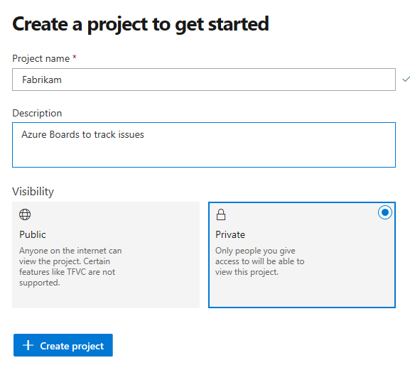
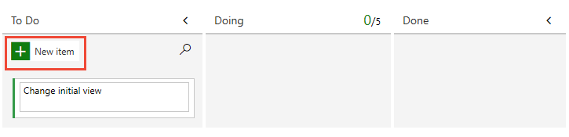
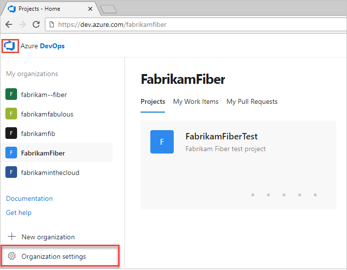

# Sign up for free and invite others to collaborate on your project

[!INCLUDE [temp](../_shared/version-vsts-only.md)]

Sign up for an Azure DevOps organization and Azure Boards to begin planning and tracking work. This sequence walks you through the sign-up process for users located in the United States and that sign up through [azure.com/boards](https://azure.microsoft.com/en-us/services/devops/boards/?nav=min). In the end, you'll have a project the uses the [Basic process for work tracking](what-is-azure-boards-basic-process.md).

> [!IMPORTANT]  
> **Select the version that meets your location and process**:
> We are experimenting with a new acquisition model which is 
> currently available for users located in the United States and that sign up through [azure.com/boards](https://azure.microsoft.com/en-us/services/devops/boards/?nav=min). This model supports a new Basic process.  
> For International users and others who sign up through another method, the Agile process is used. Select your version of this article based on your location and process used.
> - [**Basic process**](sign-up-invite-teammates.md?toc=/azure/devops/boards/get-started/toc.json&bc=/azure/devops/boards/get-started/breadcrumb/toc.json)  
> - [**Agile process**](sign-up-invite-teammates-agile.md?toc=/azure/devops/boards/get-started-agile/toc.json&bc=/azure/devops/boards/get-started-agile/breadcrumb/toc.json) 
 

## Sign up for Azure DevOps

1. Select the sign-up link for [Azure DevOps](https://go.microsoft.com/fwlink/?LinkId=307137).

2. Enter your email address, phone number, or Skype ID for your Microsoft account. If you're a Visual Studio subscriber and you get Azure DevOps as a benefit, use the Microsoft account associated with your subscription. Select **Next**.

   

3. Enter your password and select **Sign in**.

   If you don't have a Microsoft account, you can [create a Microsoft account](https://login.live.com/login.srf?lw=1) at this time.

   

4. To get started with Azure DevOps, select **Continue**.

   

5. Enter a name for your organization. The name can't contain spaces or special characters
 (such as / \ [ ] : | < > + = ; ? or &#42;), can't end in a period or comma, must be less than 256 characters, and must be unique within the DevOps namespace. You can also choose between several locations for where you want your data hosted. Select **Continue**.

   

   You see the following dialog box as your organization is created.

   

	Congratulations, you're now an organization owner!

	To sign in to your organization at any time, go to `https://dev.azure.com/{yourorganization}`.

6. Next, enter a name for the project, select the visibility, and optionally provide a description. Then choose **Create project**. 

	> [!div class="mx-imgBorder"]  
	> 

	The name can't contain spaces or special characters (such as / : \ ~ & % ; @ ' " ? < > | # $ * } { , + = [ ]), can't begin with an underscore, can't begin or end with a period, and must be 64 characters or less. Visibility can be either public or private. With public visibility, anyone on the internet can view your project. With private visibility, only people who you give access to can view your project.

	When your project has been created, the Kanban board appears.

	> [!div class="mx-imgBorder"]
	> 

	You're now set to start [tracking issues, tasks, and features](track-issues-tasks.md). 

<a id="invite-others" />

## Invite team members

You can add and invite others to work on your project by adding their email address to your organization and project.

0. From your project web portal, choose the  Azure DevOps icon, and then select  **Organization settings**. 

   

0. Select **Users** > **Add new users**.

   

0. Complete the form by entering or selecting the following information:
	<ul>
	<li>**Users:** Enter the email addresses (Microsoft account) for the users. You can add several email addresses by separating them with a semicolon (;). An email address appears in red when it's accepted.</li>
	<li>**Access level:** Assign one of the following access levels: 
		<ul>
		<li>**Basic**: Assign to users who must have access to all Azure Boards features. You can grant up to five users **Basic** access for free. </li>
		<li>**Stakeholder**: Assign to users who will have limited access to features to view, add, and modify work items. You can assign an unlimited number of users **Stakeholder** access for free.</li>
		</ul>
	</li>
	<li>**Add to project:** Select the project you named in the preceding procedure.</li>
	<li>**Azure DevOps Groups:** Select one of the following security groups which will determine the permissions the users have to perform select tasks (To learn more, see [Default permissions and access for Azure Boards](permissions-access-boards.md).):
	<ul>
		<li>**Project Readers**: Assign to users who only require read-only access. </li>
		<li>**Project Contributors**: Assign to users who will contribute fully to the project. </li>
		<li>**Project Administrators**: Assign to users who will configure project resources.</li>
		</ul></li>
	</ul>

	> [!NOTE]  
	> You must add email addresses for [personal Microsoft accounts](https://account.microsoft.com/account) unless you plan to use [Azure Active Directory (Azure AD)](https://azure.microsoft.com/documentation/articles/active-directory-whatis/) to authenticate users and control organization access. If a user doesn't have a Microsoft account, ask the user to [sign up](https://signup.live.com/) for a Microsoft account.  

5. When you're done, select **Add** to complete your invitation.

For more information, see [Add organization users for Azure DevOps Services](../../organizations/accounts/add-organization-users.md).

## Try this next  
 
> [!div class="nextstepaction"]
> [Track issues and tasks](track-issues-tasks.md)

## Related articles  
- [About access levels](../../organizations/security/access-levels.md)
- [Define organizations and projects](../../user-guide/define-organizations-and-projects.md)

> [!NOTE]   
> Your first project was created using the Basic process which uses Epics, Issues, and Tasks to track work. If you want a project that uses the Agile, Scrum, or CMMI process, then you can [add another project](../../organizations/projects/create-project.md) and specify the process through advanced setting options. See [Choose a process for a comparison of processes](../work-items/guidance/choose-process.md). 