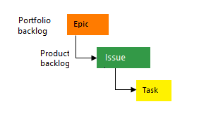
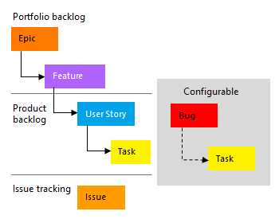
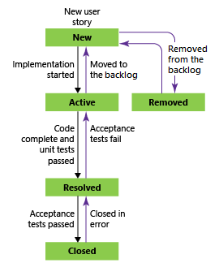
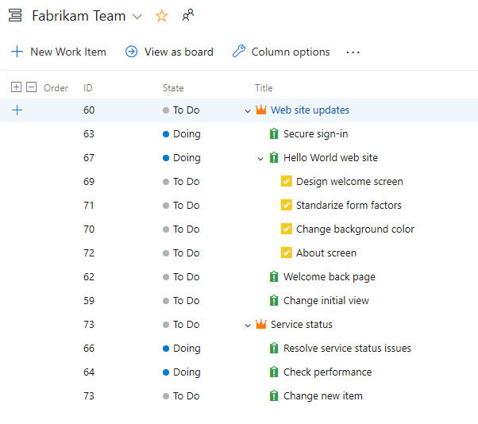

# What is Azure Boards?

[!INCLUDE [temp](../_shared/version-vsts-tfs-all-versions.md)]

With the Azure Boards web service, teams can manage their software projects. It provides a rich set of capabilities including native support for Scrum and Kanban, customizable dashboards, and integrated reporting. These tools can scale as your business grows. 
  
You can quickly and easily start tracking user stories, backlog items, task, features, and bugs associated with your project. You do this by adding work items based on the process and work item types available to your project. 

### Video: Plan your work with Azure Boards

> [!VIDEO https://channel9.msdn.com/Events/Microsoft-Azure/Azure-DevOps-Launch-2018/A105/player]

<!---
<iframe src="https://channel9.msdn.com/Events/Microsoft-Azure/Azure-DevOps-Launch-2018/A105/player" width="960" height="540" allowFullScreen frameBorder="0"></iframe>
-->

## Work item types 
 
Two of the most popular processes used are Basic and Agile. A process determines the work item types and workflow available in Azure Boards. 

#### [Basic process](#tab/basic-process) 

Basic provides three work item types&mdash;epics, issues, and tasks&mdash;and a very simple workflow. As works progresses from not started to completed, you update the State workflow field from **To Do**, **Doing**, and **Done**.

> [!div class="mx-tdCol2BreakAll"]
> |Work item types| Workflow |
> |------|---------|
> | |  

When you add an issue, task, or epic, you create a work item. Each work item represents an object stored in the work item data store. Each work item is assigned an identifier. The IDs are unique within your projects.

Add epics to track significant features or requirements. Use issues to track user stories, bugs, or other smaller items of work. And, use tasks to track even smaller amounts of work for which you want to track time either in hours or days.

#### [Agile process](#tab/agile-process) 

The Agile process provides several work item types&mdash;user stories, bugs, features, epics, and tasks&mdash.  As works progresses from not started to completed, you update the State workflow field from **New**, **Active**, **Resolved**, and **Closed**.

> [!div class="mx-tdCol2BreakAll"]
> |Work item types| Workflow |
> |------|---------|
> | | 

When you add a user story, bug, task, or feature, you create a work item. Each work item represents an object stored in the work item data store. Each work item is assigned a unique identifier (ID) within your projects. 

Add epics to track significant business initiatives. Add features to track specific applications or set of work. Define user stories to track work that you'll assign to specific team members, and bugs to track code defects. Lastly, use tasks to track even smaller amounts of work for which you want to track time either in hours or days.

--- 

If you want a project that uses the Scrum or CMMI process, then you can [add another project](../../organizations/projects/create-project.md) and specify the process through advanced setting options. See [Choose a process for a comparison of processes](../work-items/guidance/choose-process.md).

## Track work on interactive backlogs and boards

Quickly add and update the status of work using the Kanban board. You can also assign work to team members and tag with labels to support queries and filtering. Share information through descriptions, attachments, or links to network shared content. Prioritize work through drag-and-drop.  

#### [Basic process](#tab/basic-process) 

**Update the status of issues**

Add and update the status  from **To Do**, **Doing**, and **Done**. Add tasks as child items to issues.  To learn more, see [Track issues and tasks](plan-track-work.md).   

> [!div class="mx-imgBorder"]  
>   

**Prioritize your backlog of issues**

Prioritize work through drag-and-drop on your team backlog. To learn more, see [Create your backlog](../backlogs/create-your-backlog.md). 

> [!div class="mx-imgBorder"]  
>   

#### [Agile process](#tab/agile-process) 

**Update the status of user stories**

Add and update the status of work from **New**, **Active**, **Resolved**, and **Closed** using the Kanban board. Add tasks as child items to user stories. To learn more, see [Track user stories, features, and tasks](plan-track-work.md).  

> [!div class="mx-imgBorder"]  
>   

**Prioritize your backlog of user stories**

Prioritize work through drag-and-drop on your team backlog. To learn more, see [Create your backlog](../backlogs/create-your-backlog.md). 

> [!div class="mx-imgBorder"]  
>   

--- 

## Collaborate

Collaborate with others through the **Discussion** section of the work item form. Use <strong>@mention</strong>s and **#ID** controls to quickly include others in the conversation or link to other work items. Choose to follow specific issues to get alerted when they are updated. 

Create dashboards that track status and trends of work being accomplished.  Set notifications to get alerted when an issue is created or changed. 

#### [Basic process](#tab/basic-process) 

**Get updated when a work item is updated**

> [!div class="mx-imgBorder"]  
>   

#### [Agile process](#tab/agile-process) 

**Get updated when a work item is updated**

> [!div class="mx-imgBorder"]  
>   

--- 

To learn more, see:
- [Discussion section](plan-track-work.md#discussion). 
- [Follow a work item](../work-items/follow-work-items.md)
- [Add and manage dashboards](../../report/dashboards/dashboards.md)
- [Set personal notifications](../../notifications/howto-manage-personal-notifications.md)

## Work in sprints, implement Scrum

Plan sprints by assigning work to current or future sprints. Forecast work that can get completed based on effort estimates. Determine how much work can be done within a sprint. Bulk assign issues and tasks to team members and sprints. 

#### [Basic process](#tab/basic-process) 

**Assign backlog items to a sprint**

> [!div class="mx-imgBorder"]  
>   
 
#### [Agile process](#tab/agile-process) 

**Assign backlog items to a sprint**

> [!div class="mx-imgBorder"]  
>   

--- 

To learn more, see:
- [Assign work to sprints](../sprints/assign-work-sprint.md)
- [Forecast work](../sprints/forecast.md)  
- [Set team capacity](../sprints/set-capacity.md)  
- [Bulk modify work items](../backlogs/bulk-modify-work-items.md).  

## Work effectively

You'll find you can work more effectively through these actions: 

- Organize work into a hierarchy by grouping issues under epics, and tasks under issues.
- Create queries and quickly triage issues and tasks. 
- Create work item templates to help contributors quickly add and define open meaningful issues and tasks.  
- Quickly find work items that are assigned to you. Pivot or filter your work items based on other criteria, such as work items that you follow, that you're mentioned in, or that you viewed or updated.  

#### [Basic process](#tab/basic-process) 

**Group items to create a hierarchy**

> [!div class="mx-imgBorder"]
>  

#### [Agile process](#tab/agile-process) 

**Group items to create a hierarchy**

> [!div class="mx-imgBorder"]
> 

--- 

To learn more, see:
- [Organize your backlog](../backlogs/organize-backlog.md)
- [View and run queries](../queries/view-run-query.md) 
- [Triage work](../queries/triage-work-items.md)
- [Use work item templates](../backlogs/work-item-template.md)
- [View and add work items](../work-items/view-add-work-items.md)

::: moniker range=">= azure-devops-2019"

## Connect with GitHub

If you use Azure Boards connected with GitHub, you can also do the following tasks:

- From GitHub, use #AB to link GitHub commits and pull requests to your issues and tasks.
- From Azure Boards issues and tasks, link to GitHub commits and pull requests.

To learn more, see [GitHub & Azure Boards](../github/index.md).  

::: moniker-end

## Best tool for the job

Azure Boards provides the following interactive lists and signboards. Each tool provides a filtered set of work items. All tools support viewing and defining work items. To learn more about effective use of these tools, see  [Best tool to add, update, and link work items](../work-items/best-tool-add-update-link-work-items.md).   

::: moniker range=">= azure-devops-2019"

- [**Work items**](../work-items/view-add-work-items.md): Use to quickly find work items that are assigned to you. Pivot or filter work items based on other criteria, such as work items that you follow, that you're mentioned in, or that you viewed or updated.
- [**Boards**](../boards/kanban-quickstart.md): Boards present work items as cards and support quick status updates through drag-and-drop. The feature is similar to sticky notes on a physical whiteboard. Use to implement Kanban practices and visualize the flow of work for a team.
- [**Backlogs**](../backlogs/create-your-backlog.md): Backlogs present work items as lists. A product backlog represents your project plan and a repository of all the information you need to track and share with your team. Portfolio backlogs allow you to group and organize your backlog into a hierarchy. Use to plan, prioritize, and organize work.  
- [**Sprints**](../sprints/assign-work-sprint.md): Sprint backlogs and taskboards provide a filtered view of work items a team assigned to a specific iteration path, or sprint. From your backlog, you can assign work to an iteration path by using drag-and-drop. You can then view that work in a separate *sprint backlog*. Use to implement Scrum practices.
- [**Queries**](../queries/view-run-query.md): Queries are filtered lists of work items based on criteria that you define by using a query editor. You use queries to support the following tasks:
	- Find groups of work items with something in common.
	- List work items for the purposes of sharing with others or doing bulk updates. Triage a set of items to prioritize or assign.
	- Create status and trend charts that you then can add to dashboards.  

::: moniker-end

::: moniker range="<= tfs-2018"

- [**Boards**](../boards/kanban-quickstart.md): Boards present work items as cards and support quick status updates through drag-and-drop. The feature is similar to sticky notes on a physical whiteboard. Use to implement Kanban practices and visualize the flow of work for a team.
- [**Backlogs**](../backlogs/create-your-backlog.md): Backlogs present work items as lists. A product backlog represents your project plan and a repository of all the information you need to track and share with your team. Portfolio backlogs allow you to group and organize your backlog into a hierarchy. Use to plan, prioritize, and organize work.  
- [**Sprints**](../sprints/assign-work-sprint.md): Sprint backlogs and taskboards provide a filtered view of work items a team assigned to a specific iteration path, or sprint. From your backlog, you can assign work to an iteration path by using drag-and-drop. You can then view that work in a separate *sprint backlog*. Use to implement Scrum practices.
- [**Queries**](../queries/view-run-query.md): Queries are filtered lists of work items based on criteria that you define by using a query editor. You use queries to support the following tasks:
	- Find groups of work items with something in common.
	- List work items for the purposes of sharing with others or doing bulk updates. Triage a set of items to prioritize or assign.
	- Create status and trend charts that you then can add to dashboards.  

::: moniker-end

<a id="scale" />

## Support independent, autonomous teams 

A team refers to a group of project members who work in a particular product area. Those areas are represented as *area paths*. Area paths are hierarchical paths that denote the possible areas of ownership in an organization. A team is defined by a name, its members, and its area paths.

Boards, Backlogs, Sprints rely on team configurations. For example, if you want to add a Kanban board or product backlog, you define a team. For more information on teams, see [About teams and Agile tools](../../organizations/settings/about-teams-and-settings.md).  

## Manage work across projects

Most work is tracked within a project. However, many enterprises create several projects to support their business needs as described in [Plan your organizational structure](../..//user-guide/plan-your-azure-devops-org-structure.md). 

To track work across several projects, you can: 
- [Create work item queries that list work items across projects](../queries/using-queries.md#query-across-projects)
- [Gain visibility across teams](../plans/visibility-across-teams.md)

## Get access to more tools 

Extensions provide support for additional tools. An extension is an installable software unit that adds new capabilities to your projects. Find extensions in the [Azure DevOps Marketplace](https://marketplace.visualstudio.com/azuredevops). Extensions can support planning and tracking of work items, sprints, scrums, and more and collaboration among team members.  

## Related articles

- [Agile culture](../plans/agile-culture.md)
- [Practices that scale](../plans/practices-that-scale.md)
- [About teams and Agile tools](../../organizations/settings/about-teams-and-settings.md)