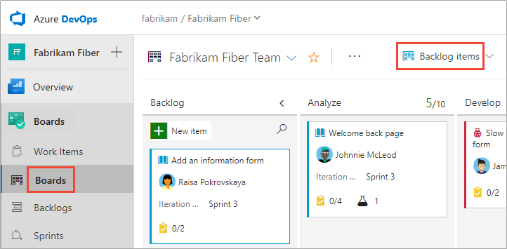

# What is Azure Boards?

[!INCLUDE [temp](../_shared/version-vsts-tfs-all-versions.md)]

Azure Boards provides a suite of interactive Agile tools that you can use to plan and track work, bugs, and issues. Azure Boards is available from Azure DevOps Services and Team Foundation Server (TFS).

Agile is a term that was coined in 2001 in the [Agile Manifesto](http://agilemanifesto.org). Agile approaches to software development emphasize incremental delivery, team collaboration, and continual planning and learning. The Agile tools that Azure Boards provides are designed to support teams that work with Agile methodologies, such as Kanban and Scrum. To learn more, see [What is Agile?](/azure/devops/learn/agile/what-is-agile).

All tools support viewing and defining work items. Each work item represents an object stored in the work item data store. Each work item is assigned a unique identifier. The IDs are unique within an account or project collection. 

Your Agile tool set, available from Azure Boards, consists of the following main interactive lists and signboards. Each of these pages provides a filtered set of work items. 

[!INCLUDE [temp](../_shared/new-agile-hubs-feature.md)] 

[!INCLUDE [temp](../_shared/page-work-item-tasks.md)] 

<a id="scale" />
## Teams and Agile tools
A team refers to a group of project members who work in a particular product area. Those areas are represented as *area paths*. Area paths are hierarchical paths that denote the possible areas of ownership in an organization. A team is defined by a name, its members, and its area paths.

The Agile tools Boards, Backlogs, Sprints, and Plans rely on team configurations. For example, if you want to add a Kanban board or product backlog, you define a team. For more information on teams, see [About teams and Agile tools](../../organizations/settings/about-teams-and-settings.md). 

::: moniker range="vsts"   
Your view and options available differ somewhat depending on whether you [enabled the New Navigation feature](../../project/navigation/preview-features.md). This feature displays a vertical navigation interface along with several changes to navigation of Agile tools. 
::: moniker-end  

## Work items and work item types

Open **Work Items** to access several personalized pivots and filter functions to focus on work items you care about. You can quickly find work items assigned to you. You also can find work items that you're following or viewed or modified recently. You can even find work items defined for different teams and projects. To learn more, see [View and add work items](../work-items/view-add-work-items.md). 

# [New navigation](#tab/new-nav)
::: moniker range="vsts"
> [!div class="mx-imgBorder"]  
> 
::: moniker-end

::: moniker range=">= tfs-2013 <= tfs-2018"
[!INCLUDE [temp](../_shared/new-agile-hubs-feature-not-supported.md)] 
::: moniker-end

# [Previous navigation](#tab/previous-nav)

::: moniker range="vsts"   
> [!div class="mx-imgBorder"]
> 

::: moniker-end

::: moniker range="tfs-2018"

> [!div class="mx-imgBorder"]
> 

::: moniker-end   

::: moniker range=">=tfs-2013 <= tfs-2017"

The **Work Items** page isn't an available feature for TFS 2017 and earlier versions.  
::: moniker-end   

---
 

## Boards 

Boards present work items as cards and support quick status updates through a drag-and-drop feature. The feature is similar to sticky notes on a physical whiteboard. Each board supports many Kanban practices. You can define columns and swim lanes, set Work-in-Progress (WIP) limits, define the Definition of Done, and more. To get started, see [Kanban quickstart](../boards/kanban-quickstart.md). 

# [New navigation](#tab/new-nav)
::: moniker range="vsts"
   

::: moniker-end

::: moniker range=">= tfs-2013 <= tfs-2018"
[!INCLUDE [temp](../_shared/new-agile-hubs-feature-not-supported.md)] 
::: moniker-end 

# [Previous navigation](#tab/previous-nav)

::: moniker range=">= tfs-2017"   
     
::: moniker-end   
::: moniker range=">= tfs-2013 <= tfs-2015"    
> [!div class="mx-imgBorder"]  
>        
::: moniker-end   

---

## Backlogs

Backlogs present work items as lists. A product backlog represents your project plan, the roadmap for what your team plans to deliver. Your backlog also provides a repository of all the information you need to track and share with your team. Portfolio backlogs allow you to group and organize your backlog into a hierarchy. To get started, see [Create your backlog](../backlogs/create-your-backlog.md). 

# [New navigation](#tab/new-nav)
::: moniker range="vsts"
    
::: moniker-end

::: moniker range=">= tfs-2013 <= tfs-2018"
[!INCLUDE [temp](../_shared/new-agile-hubs-feature-not-supported.md)] 
::: moniker-end 

# [Previous navigation](#tab/previous-nav)

::: moniker range=">= tfs-2017"

::: moniker-end
::: moniker range=">= tfs-2013 <= tfs-2015"

::: moniker-end

---

## Sprints

Sprint backlogs and taskboards provide a filtered view of work items a team assigned to a specific iteration path, or sprint. Sprints are defined for a project and then selected by teams. From your backlog, you can map work to an iteration path by using the drag-and-drop feature. You then can view that work in a separate *sprint backlog*. 

# [New navigation](#tab/new-nav)
::: moniker range="vsts"
    
::: moniker-end

::: moniker range=">= tfs-2013 <= tfs-2018"
[!INCLUDE [temp](../_shared/new-agile-hubs-feature-not-supported.md)] 
::: moniker-end 

# [Previous navigation](#tab/previous-nav)

::: moniker range=">= tfs-2017"

::: moniker-end
::: moniker range=">= tfs-2013 <= tfs-2015"

::: moniker-end

---

You also can filter the cards on your taskboard to show only those cards mapped to a given sprint. We recommend that an entire organization share the same sprint interval to align multiple teams in a single org to the same rhythm. A common sprint rhythm is sometimes referred to as the "heartbeat" of an org. 

## Queries

Queries are filtered lists of work items based on criteria that you define by using a query editor. You use queries to find groups of work items with something in common. You can use queries to triage a set of items to prioritize or assign them. You also use queries to create status and trend charts that you then can add to dashboards. To get started, see [Create a managed query](../queries/using-queries.md). 

> [!div class="mx-imgBorder"]  
>    

## Delivery plans

Delivery plans display work items as cards along a timeline or calendar view. This format can be an effective communication tool with managers, partners, and stakeholders for a team. It also can be used for several teams that collaborate on specific features or requirements.

