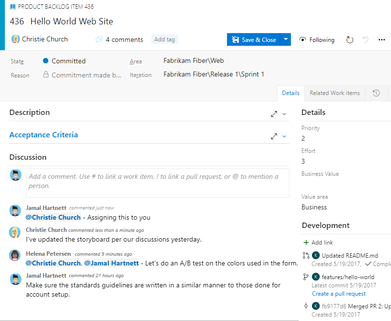

# 11 Reasons for using Azure Boards to plan and track your work 

[!INCLUDE [temp](../_shared/version-vsts-only.md)]

We know you have a choice of tracking systems. So why use Azure Boards to plan and track your work, bugs, and customer issues? 

In [What is Azure Boards?](what-is-azure-boards.md), we describe the main features you get with Azure Boards. Here, we provide 11 compelling reasons to take Azure Boards for a free test spin. 

## 1. Start simply, scale as you grow  

Azure Boards provides you with a set of predefined work item types to support tracking features, user stories, bugs, and tasks. You can quickly get up and running by using your product backlog or Kanban board. Whatever Agile method you use, Azure Boards supports you with the tools you need to implement that method.  

As your organization grows, you can [add teams](../../organizations/projects/about-projects.md#add-team) to provide them the autonomy to track their work according to their needs.  

> [!TIP]   
> Quickly add work items by using your backlog or Kanban board. Or, use [work item templates](../backlogs/work-item-template.md) to simplify defining work items by setting values for select fields. 

## 2. Visual, interactive tools  

Visual tools help teams quickly see and share progress. For example, with [Kanban boards](../boards/kanban-quickstart.md) you can add work, update the status of work, and monitor work in progress. 

> [!div class="mx-imgBorder"]  
> 

With [product backlogs](../backlogs/create-your-backlog.md), you can quickly add work items and prioritize work to keep the most important work at the top of the stack. And, with [delivery plans](../plans/review-team-plans.md), teams can share their plans against a calendar view. 

Use [built-in scrum boards and planning tools](../sprints/index.md) to help your teams run effective stand-ups, planning meetings, and retrospectives.

## 3. Easy to customize

Kanban boards, taskboards, and delivery plans are easy to configure and customize through the user interface.  

For example, with Kanban boards, you can configure columns, swim lanes, card styles, fields shown on cards, and more. You can configure them all through a common configuration dialog. 

> [!div class="mx-imgBorder"]  
> 

> [!TIP]   
> Define [area paths and iteration paths](../../organizations/settings/about-areas-iterations.md) to group work items by product or feature, You also can group work items into sprints, milestones, or other time-related periods. 

And, you can easily add [custom fields, work item types, and portfolio backlogs](../../organizations/settings/work/inheritance-process-model.md).  

## 4. Built-in social tools and communication

Work item forms provide built-in discussion that you can use to capture questions, notes, and communication as they occur. With this feature, you can maintain a history of what a team decides on any particular work item. You can quickly bring a team member or an entire team into the conversation [by using @mentions](../../notifications/at-mentions.md). 

> [!div class="mx-imgBorder"]  
> 

## 5. Capture information, generous cloud storage 

Work items are designed to track all the information you need to track. You can perform rich text editing,   drag and drop inline images, and add larger attachments. You can add attachments up to 60 MB and as many as 100 attachments. 

In addition, you can link work items within a hierarchy or by simple related links. Each work item form maintains a history of changes, so you can review what changed, by whom, and when.

## 6. Quickly find what you need, get notified of changes 

As your project grows, the number of work items used to track it grows. To support your ability to quickly find a specific work item, Azure Boards provides you with easy-to-use tools: 

- A follow feature so you can [follow work items](../work-items/follow-work-items.md) to monitor updates and changes
- [Pivot views](../work-items/view-add-work-items.md ) that show you work items assigned to you, that you elected to follow, were recently modified, and more  
- A powerful [query engine](../queries/example-queries.md) that filters work item lists based on any field and used to update or triage work items
- Fast, flexible [ad-hoc search](../queries/search-box-queries.md) with quick inline filters 
- Alert management settings so you can [personalize the alerts](../../notifications/howto-manage-personal-notifications.md) you receive when work items are assigned to you or are changed, or other filter criteria

## 7. Monitor status and progress with built-in dashboards and analytics  

With Azure Boards, you gain access to a number of tools to generate reports to support tracking status and trends.

By using [configurable dashboards](../../report/dashboards/dashboards.md), you can add one or more widgets. You configure widgets to display the information and data you want, such as the following bug burndown widget. 

> [!div class="mx-imgBorder"]  
>   

In addition to dashboards, you have access to the [Analytics service](../../report/powerbi/what-is-analytics.md), which is optimized for fast read-access and server-based aggregations. By using [Analytics views](../../report/powerbi/what-are-analytics-views.md) and [Power BI](../../report/powerbi/what-are-analytics-views.md), you can create highly sophisticated reports on the project data of interest. 

## 8. Office integration 

Project managers who want to use familiar tools can import and export work item queries to and from Microsoft Office Excel and Project. To learn more, see: 
- [Bulk add or modify work items with Excel](../backlogs/office/bulk-add-modify-work-items-excel.md)
- [Create your backlog and tasks by using Project](../backlogs/office/create-your-backlog-tasks-using-project.md)

## 9. Extensions and extensibility  

You can gain even greater functionality by adding Marketplace extensions, many of which are free. An extension is an installable unit that adds capabilities to Visual Studio, Azure DevOps Services, Team Foundation Server, or Visual Studio Code. You can find extensions within these products or in the [Visual Studio Marketplace](https://marketplace.visualstudio.com/azuredevops), Azure DevOps tab.

Here are a few extensions available from the Marketplace.

> [!div class="mx-imgBorder"]  
>  

In addition, by using the [REST API](/rest/api/azure/devops/index), you can create your own extensions or tools to integrate with Azure DevOps Services.

## 10. Mobile app 

Azure Boards makes it easy to stay on top of changes as they occur. 
By using the [mobile browser](../../project/navigation/mobile-work.md), you can be notified and respond to changes made to work items.  

## 11. Start for free

Last but not least, you can start for free and add up to five free users and unlimited [stakeholders](../../organizations/security/get-started-stakeholder.md). 

Get started today. To learn how, see [Sign up for free and invite others to collaborate on your project](sign-up-invite-teammates.md). 

##Related articles

- [Best tool to add, update, and link work items](../work-items/best-tool-add-update-link-work-items.md)
