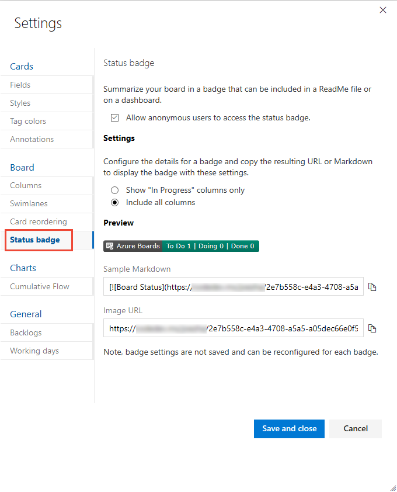
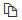
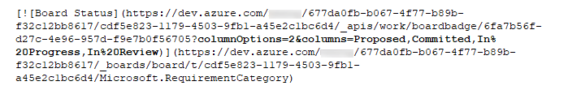
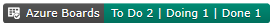

# Configure status badges to appear on GitHub repositories 

[!INCLUDE[temp](../_shared/version-vsts-only.md)] 
 
You can add Markdown syntax to a GitHub repo README.md file to display the status of your Kanban board. You do this by adding the syntax you choose from your Kanban board settings.  
 
> [!NOTE]   
> This syntax will work whether you have or haven't [connected your project to a GitHub.com or GitHub Enterprise Server repository](connect-to-github.md). For GitHub Enterprise Server, your server must be network accessible to Azure DevOps Services. 

## Prerequisites 

* You must connect to an Azure Boards or Azure DevOps project. If you don't have a project yet, [create one](../../boards/get-started/sign-up-invite-teammates.md). 
- You must have a Kanban board you want to configure. When you add a team, you add a Kanban board for that team. To learn more, see [About teams and Agile tools](../../organizations/settings/about-teams-and-settings.md).
* You must be added to the team administrator role for the team's settings you want to modify, or be a member of the <strong>Project Administrators</strong> security group. To get added, see [Add a team administrator](/azure/devops/organizations/security/add-team-administrator) or [Set permissions at the project- or collection-level](/azure/devops/organizations/security/set-project-collection-level-permissions).
* You must be granted <strong>Stakeholder</strong> access or higher. For details, see [About access levels](/azure/devops/organizations/security/access-levels).
* To add the status badge to the GitHub.com repository, you must be a contributor of the repository.  

## Open your Kanban board settings 

1. Sign into Azure Boards. 

1.  [Open your Kanban board](../boards/kanban-quickstart.md). If you're not a team admin, [get added as one](../../organizations/settings/add-team-administrator.md). Only team and project admins can customize the Kanban board.

1. Choose the  gear icon to configure the board and set general team settings.  

	> [!div class="mx-imgBorder"]
	>   

1. Choose <strong>Status badge</strong> and then check or uncheck the <strong>Allow anonymous users to access the status badge</strong>. When unchecked, users who aren't signed in can still view the status badge.

	> [!div class="mx-imgBorder"]
	>  

1. Choose the badge type you want and choose the  copy icon to copy the Markdown syntax for the badge. 

	In progress items ignores the first and last columns.
	All columns includes the first and last columns. 
	
	Also, you can customize the set of columns by specifying `2` for the columnOptions and then a comma-delimited list of the board columns to appear. For example, `columnOptions=2&columns=Proposed,Committed,In%20Progress,In%20Review`, as shown in the following syntax. For column labels that include spaces, you must encode the space with <strong>%20</strong>. For example, <strong>In%20Progress</strong>.

	> [!div class="mx-imgBorder"]
	>  

	And which will cause a badge similar to the following to display. 

	> [!div class="mx-imgBorder"]
	>  

1. When done, choose <strong>Save and close</strong> or <strong>Cancel</strong>.

	> [!NOTE]  
	> The only setting that you can configure is the <strong>Allow anonymous users to access the status badge</strong>. The badge type under <strong> Settings</strong> only switches the  Markdown syntax for you to copy from the <strong>Sample Markdown</strong> and <strong>Image URL</strong> values. 

1. Open the README file in your GitHub repo and paste the syntax you copied to have the badge display.  

	You should see the same preview image that you selected with values that correspond to your Kanban board. For example: 

	 

## Related articles

- [What is Azure Boards?](../get-started/what-is-azure-boards.md)
- [Customize cards](../boards/customize-cards.md)
- [Configure team settings](../../organizations/settings/manage-teams.md) 
- [Troubleshoot GitHub & Azure Boards integration](troubleshoot-github-connection.md)
