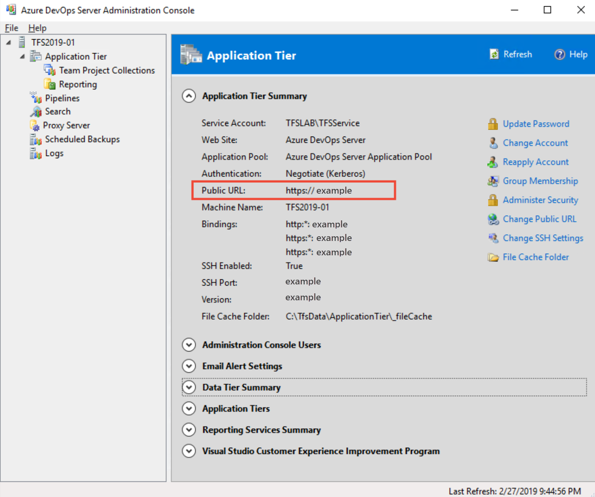
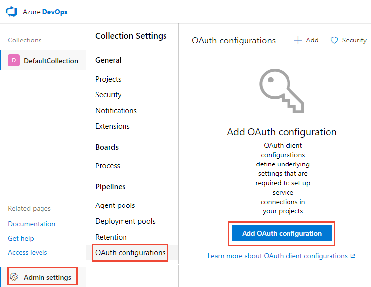

# Connect Azure DevOps Server to GitHub Enterprise Server (On-premises)

[**Azure Boards**](/azure/devops/boards/github/connect-to-github?view=azure-devops&preserve-view=true) | **Azure DevOps Server 2020 | Azure DevOps Server 2019**

<!--- Supports https://go.microsoft.com/fwlink/?linkid=2095009 --> 

By connecting your Azure DevOps Server project with your GitHub Enterprise Server repositories, you support linking between GitHub commits and pull requests to work items. You can use GitHub Enterprise for software development while using Azure Boards to plan and track your work. 

> [!NOTE]   
> On-premises Azure DevOps Servers support integration with GitHub Enterprise Server repositories. If you want to connect from Azure DevOps Services, see [Connect Azure Boards to GitHub](/azure/devops/boards/github/connect-to-github?view=azure-devops&preserve-view=true).

## Prerequisites 
 
* [Install the Azure Boards app for GitHub](install-github-app.md) on the GitHub organizations or account. 
* You must connect to an Azure Boards or Azure DevOps project. If you don't have a project yet, [create one](../../organizations/projects/create-project.md). 
* You must be a member of the [Project Administrators group](../../organizations/security/set-project-collection-level-permissions.md) and the project's [Contributors group](../../organizations/security/add-users-team-project.md). If you created the project, then you have permissions. 
* You must be an administrator of the GitHub Enterprise Server you'll connect to. 
 

## Authentication options

The following authentication options are supported. 

::: moniker range="azure-devops-2020"

- [PAT](#server-github-ent-pat)
- [Username plus password](#server-github-ent-username)

> [!NOTE] 
> OAuth is no longer supported for Azure DevOps Server 2020.  
 
::: moniker-end

 
::: moniker range="azure-devops-2019"
- [OAuth (Recommended, registration required)](#server-github-ent-oauth-register) 
- [PAT](#server-github-ent-pat)
- [Username plus password](#server-github-ent-username)
::: moniker-end
 

<a id="github-oauth" />
<a id="github-pat" />
<a id="server-github-ent-oauth-register" />

 
::: moniker range="azure-devops-2019"

## Register Azure DevOps in GitHub as an OAuth App

If you plan to use OAuth to connect Azure DevOps Server with your GitHub Enterprise Server, you first need to register the application as an OAuth App. For details, see [Creating an OAuth App](https://docs.github.com/en/developers/apps/building-oauth-apps/creating-an-oauth-app).

 
<a id="register-services-oauth" />
<a id="register-server-oauth" />
 

###  Register Azure DevOps Server 

1. Sign into the web portal for your GitHub Enterprise server.  

	> [!div class="mx-imgBorder"]  
	>   

1. Open <strong>Settings>Developer settings>Oauth Apps</strong> and choose <strong>New OAuth App</strong>. 

	> [!div class="mx-imgBorder"]  
	>   

2. Fill out the form to register your Azure DevOps Server application.  

	> [!div class="mx-imgBorder"]  
	>   

	For the **Homepage URL**, specify the **Public URL** of your project collection. You can find this URL by [opening the Azure DevOps Administration Console](/azure/devops/server/admin/open-admin-console) and viewing the **Application Tier** node. 

	> [!div class="mx-imgBorder"]  
	>   

	For the **Authorization callback URL**, use the following pattern to construct the URL. 

	`{Azure DevOps Server Public Url}/{Collection Name}/_admin/oauth2/callback`

	For example: 

	`http://contoso/DefaultCollection/_admin/oauth2/callback`

	Or, 

	`https://tfs.contoso.com/MyCollection/_admin/oauth2/callback`

3. Choose **Register application**.

4. Upon success, you'll see a page that provides the **Client ID** and **Client Secret** for your registered OAuth application. 

	> [!div class="mx-imgBorder"]  
	>   

  

<a id="register-server-github-ent-oauth" />
 

### Register your OAuth configuration in Azure DevOps Server

1. Sign into the web portal for your Azure DevOps Server. 

1. Add the GitHub Enterprise Oauth configuration to your Azure DevOps Server collection. 

2. Open <strong>Admin settings>Oauth configurations</strong>, and choose <strong>Add Oauth configuration</strong>.  

	> [!div class="mx-imgBorder"]  
	>   

3. Fill in the form that appears, and then choose <strong>Create</strong>.

	> [!div class="mx-imgBorder"]  
	>   
 

<a id="github-ent-oauth-services" />
 

<a id="github-ent-oauth-server" />
 
::: moniker-end

## Connect Azure DevOps Server to GitHub Enterprise Server

::: moniker range="azure-devops-2020"
You can connect up to 250 GitHub repositories to an Azure Boards project. 

> [!NOTE]   
> Connection to more than 100 GitHub repositories requires Azure DevOps Server 2020.1 update or later version.
::: moniker-end 

::: moniker range="azure-devops-2019"
You can connect up to 100 GitHub repositories to an Azure Boards project. This is a hard limit. 
 
::: moniker-end 

1. Open the web portal for your Azure DevOps Server.   

1. Choose the :::image type="icon" source="/azure/devops/media/icons/project-icon.png" border="false"::: Azure DevOps logo to open  **Projects**, and then choose the Azure Boards project you want to configure to connect to your GitHub Enterprise repositories.
::: moniker range="azure-devops-2020"
1. Choose (1) **Project Settings**> (2) **GitHub connections**.   

	:::image type="content" source="media/github-ent/open-project-settings-github-connections-2020-1.png" alt-text="Screenshot of open Project Settings>GitHub connections.":::  

1.	If it is the first time making a connection from the project, choose the authentication method you want to use to make the connection: 

	- **Personal Access Token**, for details see [Connect using a Personal Access Token](#github-ent-pat). 
	- **User Name and Password**, see [Connect using a Username and Password](#server-github-ent-username).

	:::image type="content" source="media/github-ent/connect-github-account-first-time.png" alt-text="Screenshot of first time connecting with GitHub credentials.":::

	Otherwise, choose :::image type="icon" source="../../media/icons/add-light-icon.png" border="false"::: **New connection**, and select your authentication method from the **New Connection** dialog.
::: moniker-end
::: moniker range="azure-devops-2019"

2. Choose (1) **Project Settings**> (2) **GitHub connections**, and then (3) **Connect your GitHub Enterprise account**.   

	> [!div class="mx-imgBorder"]  
	>    

	Or, choose a **personal access token** or **username and password**, if you are using those credentials.
::: moniker-end

::: moniker range="azure-devops-2019"
#### Connect using OAuth  

- Choose the configuration that you set up in [Step 4 of Register your OAuth configuration in Azure DevOps Server](#register-server-github-ent-oauth), and then choose <strong>Connect</strong>. 

	> [!div class="mx-imgBorder"]  
	>   
::: moniker-end

<a id="server-github-ent-pat" /> 
<a id="github-ent-pat" /> 

#### Connect using a Personal Access Token  

1.	To create a PAT, see [Creating a personal access token](https://help.github.com/en/articles/creating-a-personal-access-token-for-the-command-line).

	> [!TIP]  
	> When creating your GitHub PAT, make sure that you include these scopes: `repo, admin:repo_hook, read:user, user:email`. 
	
1.	Enter the URL for your GitHub Enterprise server and the <strong>Personal access token</strong> credentials recognized by that server. And then choose **Connect**.

	> [!div class="mx-imgBorder"]  
	>   

	<a id="server-github-ent-username" />

#### Connect using a Username and Password   

1.	Enter the URL for your GitHub Enterprise server and the administrator account credentials recognized by that server. And then choose **Connect**.

	> [!div class="mx-imgBorder"]  
	>   

1. The dialog lists all repositories for which you have GitHub administration rights. You can toggle between **Mine** and **All** to determine if others appear, and then check the ones that you want to add. Choose **Save** when done.

	> [!div class="mx-imgBorder"]  
	>   

1. If this is the first time connecting to a GitHub account or organization from Azure Boards, you'll also be installing the Azure Boards app for GitHub. Complete the integration by following the procedures outlined in [Confirm the connection](connect-to-github.md#confirm-connection). 

## Resolve connection issues

See [Troubleshoot GitHub repository connection](troubleshoot-github-connection.md).

## Try this next

> [!div class="nextstepaction"]
> [Link GitHub commits and pull requests to work items](link-to-from-github.md) 

## Related articles

- [Add or remove GitHub repositories](add-remove-repositories.md)
- [What is Azure Boards?](../../boards/get-started/what-is-azure-boards.md)
- [Troubleshoot GitHub & Azure Boards integration](troubleshoot-github-connection.md)
- [Build GitHub Enterprise Server repositories](../../pipelines/repos/github-enterprise.md)
- [Trigger an Azure Pipelines run from GitHub Actions](../../pipelines/ecosystems/github-actions.md)
