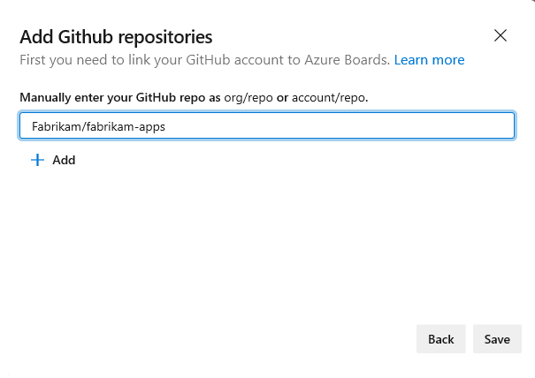

# Connect Azure Boards to GitHub  

[!INCLUDE[temp](../_shared/version-vsts-only.md)] 

By connecting your Azure Boards project with GitHub repositories, you support linking between GitHub commits and pull requests to work items. You can use GitHub for software development while using Azure Boards to plan and track your work.  

[!INCLUDE[temp](../_shared/github-platform-support.md)]

## Prerequisites 

* You must connect to an Azure Boards or Azure DevOps project. If you don't have a project yet, [create one](../../boards/get-started/sign-up-invite-teammates.md). 
* You must be a member of the [Project Administrators group](../../organizations/security/set-project-collection-level-permissions.md) and the project's [Contributors group](../../organizations/security/add-users-team-project.md). If you created the project, then you have permissions. 
* You must be an administrator or owner of the GitHub repository you'll be connecting to.  

> [!IMPORTANT]  
> You can connect to multiple repositories so long as you are an administrator for those repositories. 

## Add a GitHub connection and repository  

0. Sign into Azure Boards. Make sure that you have [enabled **New Navigation**](../../project/navigation/preview-features.md). You can only configure the GitHub repositories from the New Navigation user interface. 

0. Choose (1) **Project Settings**, choose (2) **GitHub connections** and then (3) **Connect your GitHub Account**.   

	> [!div class="mx-imgBorder"]  
	>    

0. Enter your GitHub account credentials. Choose an account for which you are an administrator for the repositories you want to connect to. 

	> [!div class="mx-imgBorder"]  
	>   

0. If you have enabled two-factor authentication, enter the authentication code that GitHub sent you and choose **Verify**. 

	> [!div class="mx-imgBorder"]  
	>   

0. Review the GitHub authorization dialog that appears which indicates the information you'll allow Azure Boards to access from GitHub. Choose **Authorize AzureBoards** when ready.

	> [!div class="mx-imgBorder"]  
	>   

0. In the Add GitHub repositories dialog, you'll see the list of repositories for which you are an administrator. 

	> [!div class="mx-imgBorder"]  
	>   

	 Check the ones that you want to add and then choose **Save**. When done, you should see the new connection with the selected repository listed.  

	> [!div class="mx-imgBorder"]  
	>    

> [!TIP]   
> We recommend that you only connect a GitHub repo to projects defined in a single Azure DevOps organization. Connecting the same GitHub repo to projects defined in two or more Azure DevOps organizations can lead to unexpected AB# mention linking. For details, see [Troubleshoot GitHub & Azure Boards integration](troubleshoot-git-hub-connection.md#integrate-repo-to-several-organizations). 

## Add or remove repositories, or remove a connection 

0. To add or remove repositories, open the  for the connection and choose **Add** repositories or **Remove** repositories from the menu. 

	> [!div class="mx-imgBorder"]  
	>   

0. To remove all repositories and the connection, choose the **Remove connection** option. Then, choose **Remove** to confirm.

	> [!div class="mx-imgBorder"]  
	>   

## Use a Personal Access Token (PAT) 

We recommend that you use OAuth to connect to your GitHub repository. However, if you need to use a PAT, you can by following these procedures. 

> [!TIP]  
> When creating your GitHub PAT, make sure that you include these scopes: `repo, read:user, user:email, admin:repo_hook`. 

0. To choose a PAT when connecting a GitHub repository, choose  **New Connection** and then choose the **Click here** link. 

	> [!div class="mx-imgBorder"]  
	>    

	To create a GitHub PAT, go to [GitHub Developer Settings>Personal access tokens](https://github.com/settings/tokens). 

0. Enter the PAT and choose **Connect**. 

	> [!div class="mx-imgBorder"]  
	>   

## Resolve connection issues

See [Troubleshoot GitHub repository connection](troubleshoot-git-hub-connection.md).

## Try this next
> [!div class="nextstepaction"]
> [Link GitHub commits and pull requests to work items](link-to-from-github.md) 

## Related articles

- [What is Azure Boards?](../../boards/get-started/what-is-azure-boards.md)
- [Troubleshoot GitHub & Azure Boards integration](troubleshoot-git-hub-connection.md)

<!---
 Enter the name of the GitHub repository and then choose **Save**. 
	> [!div class="mx-imgBorder"]  
	>    

	The dialog will lists all repositories that you have GitHub administration rights for the specified account. You can toggle between **Mine** and  **All** to determine if others appear, and then check the ones that you want to add. 
-->