# Connect Azure Boards to GitHub  

[!INCLUDE[temp](../_shared/version-vsts-plus-azdevserver-2019.md)] 
::: moniker range="azure-devops"

By connecting your Azure Boards project with GitHub.com repositories, you support linking between GitHub commits and pull requests to work items. You can use GitHub for software development while using Azure Boards to plan and track your work.  
::: moniker-end

::: moniker range="azure-devops-2019"

By connecting your Azure DevOps Server project with your GitHub Enterprise Server repositories, you support linking between GitHub commits and pull requests to work items. You can use GitHub Enterprise for software development while using Azure Boards to plan and track your work. 
::: moniker-end

[!INCLUDE[temp](../_shared/github-platform-support.md)]

## Prerequisites 

::: moniker range="azure-devops"
* You must connect to an Azure Boards or Azure DevOps project. If you don't have a project yet, [create one](../../boards/get-started/sign-up-invite-teammates.md). 
* You must be a member of the [Project Administrators group](../../organizations/security/set-project-collection-level-permissions.md) and the project's [Contributors group](../../organizations/security/add-users-team-project.md). If you created the project, then you have permissions. 
* You must be an administrator or owner of the GitHub repository you'll be connecting to.  

> [!IMPORTANT]  
> You can connect to multiple repositories so long as you are an administrator for those repositories. 
::: moniker-end

::: moniker range="azure-devops-2019"

* You must connect to an Azure Boards or Azure DevOps project. If you don't have a project yet, [create one](../../organizations/projects/create-project.md). 
* You must be a member of the [Project Administrators group](../../organizations/security/set-project-collection-level-permissions.md) and the project's [Contributors group](../../organizations/security/add-users-team-project.md). If you created the project, then you have permissions. 
* You must be an administrator of the GitHub Enterprise Server you'll be connecting to. 

::: moniker-end

## Authentication options

Depending on the platform you work from to connect to GitHub, you have a choice of the credentials you use. The recommended authentication method in all instances is <strong>OAuth</strong>.

<table>
<tr valign="bottom">
<th width="27%">Platform</th> 
<th width="35%">GitHub.com </th> 
<th width="38%">GitHub Enterprise Server </th> 
</tr>
<tbody valign="top">
<tr>
<td>Azure DevOps Services </td>
<td>
<ul>
<li>[OAuth (preferred, no registration steps)](#github-oauth)</li>
<li>[Personal access token (PAT)](#github-pat)</li>
</ul>
</td>
<td>
<ul>
<li>[OAuth (preferred, registration required)](#server-github-ent-oauth-register)</li>
<li>[PAT](#server-github-ent-pat)</li>
<li>[Username plus password](#server-github-ent-username)</li>
</ul>
</td>
</tr>
<tr>
<td>Azure DevOps Server</td>
<td>
<ul>
<li>Not supported</li>
</ul>
</td>
<td>
<ul>
<li>[OAuth (preferred, registration required)](#server-github-ent-oauth-register)</li>
<li>[PAT](#server-github-ent-pat)</li>
<li>[Username plus password](#server-github-ent-username)</li>
</ul>
</td>
</tr>

</tbody>
</table>
 
<a id="github-oauth" />

::: moniker range="azure-devops"

## Add a GitHub connection using OAuth 

0. Sign into Azure Boards. 

0. Choose (1) <strong>Project Settings</strong>, choose (2) <strong>GitHub connections</strong> and then (3) <strong>Connect your GitHub Account</strong>.   

	> [!div class="mx-imgBorder"]  
	>    

	If connecting using PAT, see [Add a GitHub connection using PAT](#github-pat).
	If connecting to a GitHub Enterprise Server, see [Register Azure DevOps in GitHub as an OAuth App](#server-github-ent-oauth-register).

0. Enter your GitHub account credentials. Choose an account for which you are an administrator for the repositories you want to connect to. 

	> [!div class="mx-imgBorder"]  
	> 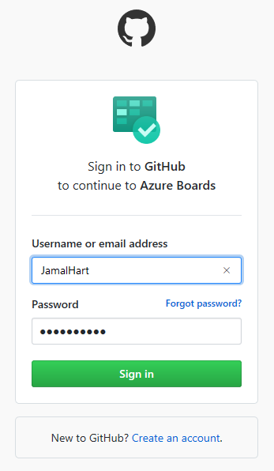  

0. If you have enabled two-factor authentication, enter the authentication code that GitHub sent you and choose <strong>Verify</strong>. 

	> [!div class="mx-imgBorder"]  
	>   

0. Review the GitHub authorization dialog that appears which indicates the information you'll allow Azure Boards to access from GitHub. Choose <strong>Authorize AzureBoards</strong> when ready.

	> [!div class="mx-imgBorder"]  
	> 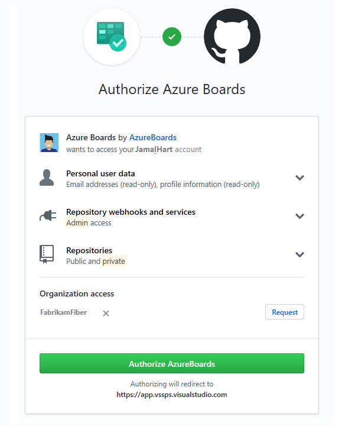  

0. In the Add GitHub repositories dialog, you'll see the list of repositories for which you are an administrator. 

	> [!div class="mx-imgBorder"]  
	> 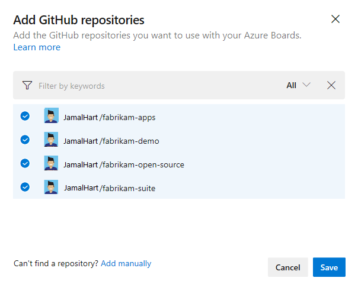  

	 Check the ones that you want to add and then choose <strong>Save</strong>. When done, you should see the new connection with the selected repository listed.  

	> [!div class="mx-imgBorder"]  
	> 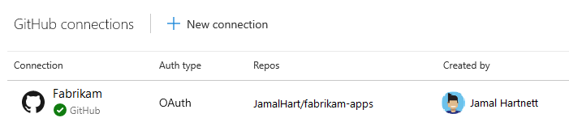   

> [!TIP]   
> We recommend that you only connect a GitHub repo to projects defined in a single Azure DevOps organization. Connecting the same GitHub repo to projects defined in two or more Azure DevOps organizations can lead to unexpected AB# mention linking. For details, see [Troubleshoot GitHub & Azure Boards integration](troubleshoot-github-connection.md#integrate-repo-to-several-organizations). 

::: moniker-end

<a id="github-pat" />
::: moniker range="azure-devops"

## Add a GitHub connection using PAT   

We recommend that you use OAuth to connect to your GitHub repository. However, if you need to use a PAT, you can by following these procedures. 

> [!TIP]  
> When creating your GitHub PAT, make sure that you include these scopes: `repo, read:user, user:email, admin:repo_hook`. 

0. To choose a PAT when connecting a GitHub repository, choose  <strong>New Connection</strong> and then choose the <strong>Click here</strong> link. 

	> [!div class="mx-imgBorder"]  
	> 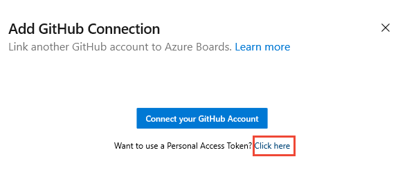   

	To create a GitHub PAT, go to [GitHub Developer Settings>Personal access tokens](https://github.com/settings/tokens). 

0. Enter the PAT and choose <strong>Connect</strong>. 

	> [!div class="mx-imgBorder"]  
	>   

::: moniker-end

<a id="server-github-ent-oauth-register" />

::: moniker range=">= azure-devops-2019"

## Register Azure DevOps in GitHub as an OAuth App

If you plan to use OAuth to connect Azure DevOps Services or Azure DevOps Server with your GitHub Enterprise Server, you first need to register the application as an OAuth App. For details, see [Creating an OAuth App](https://developer.github.com/apps/building-oauth-apps/creating-an-oauth-app/).

::: moniker-end

<a id="register-services-oauth" />

::: moniker range="azure-devops"

###  Register Azure DevOps Services   

0. Sign into the web portal for your GitHub Enterprise server.  

	> [!div class="mx-imgBorder"]  
	> 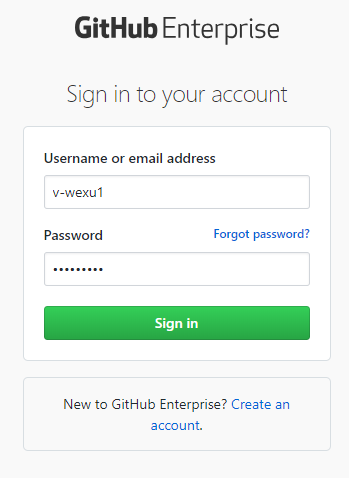  

0. Open <strong>Settings>Developer settings>Oauth Apps</strong> and choose <strong>New OAuth App</strong>. 

	> [!div class="mx-imgBorder"]  
	>   

0. Fill out the form to register your Azure DevOps Server application.  

	For the <strong>Homepage URL</strong>, specify the <strong>Organization URL</strong> of your organization.  
	For the <strong>Authorization callback URL</strong>, use the following pattern to construct the URL.  

	`{Azure DevOps Services Organization URL}/_admin/oauth2/callback`

	For example: 

	`http://dev.azure.com/fabrikam/_admin/oauth2/callback`

	> [!div class="mx-imgBorder"]  
	> 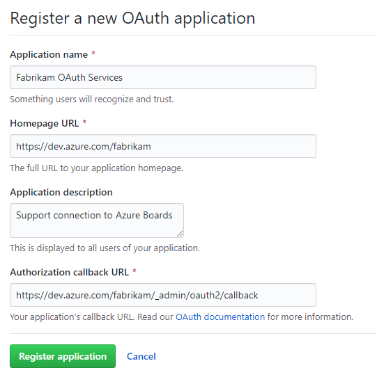  

0. Choose <strong>Register application</strong>.

0. Upon success, you'll see a page that provides the <strong>Client ID</strong> and <strong>Client Secret</strong> for your registered OAuth application. 

	> [!div class="mx-imgBorder"]  
	> 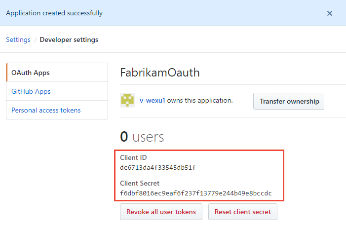  

::: moniker-end

<a id="register-server-oauth" />

::: moniker range="azure-devops-2019"

###  Register Azure DevOps Server 

0. Sign into the web portal for your GitHub Enterprise server.  

	> [!div class="mx-imgBorder"]  
	>   

0. Open <strong>Settings>Developer settings>Oauth Apps</strong> and choose <strong>New OAuth App</strong>. 

	> [!div class="mx-imgBorder"]  
	>   

0. Fill out the form to register your Azure DevOps Server application.  

	For the <strong>Homepage URL</strong>, specify the <strong>Public URL</strong> of your project collection. You can find this URL by [opening the Azure DevOps Administration Console](/azure/devops/server/admin/open-admin-console) and viewing the <strong>Application Tier</strong> node. 

	> [!div class="mx-imgBorder"]  
	> 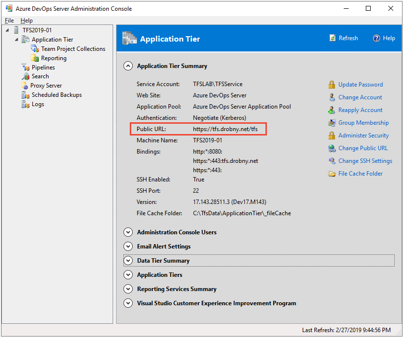  

	For the <strong>Authorization callback URL</strong>, use the following pattern to construct the URL. 

	`{Azure DevOps Server Public Url}/{Collection Name}/_admin/oauth2/callback`

	For example: 

	`http://contoso/DefaultCollection/_admin/oauth2/callback`

	Or, 

	`https://tfs.contoso.com/MyCollection/_admin/oauth2/callback`

	> [!div class="mx-imgBorder"]  
	> 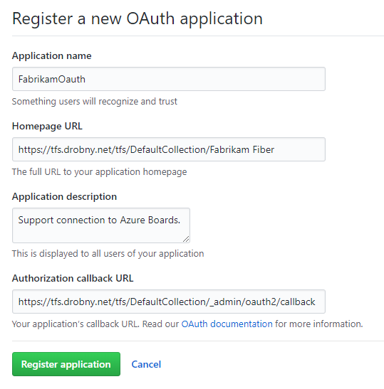  

0. Choose <strong>Register application</strong>.

0. Upon success, you'll see a page that provides the <strong>Client ID</strong> and <strong>Client Secret</strong> for your registered OAuth application. 

	> [!div class="mx-imgBorder"]  
	>   

::: moniker-end

<a id="register-services-github-ent-oauth" />

::: moniker range="azure-devops"

### Register your OAuth configuration in Azure DevOps Services

1. Sign into the web portal for Azure DevOps Services. 

2. Add the GitHub Enterprise Oauth configuration to your organization. 

3. Open <strong>Organization settings>Oauth configurations</strong>, and choose <strong>Add Oauth configuration</strong>.  

	> [!div class="mx-imgBorder"]  
	> 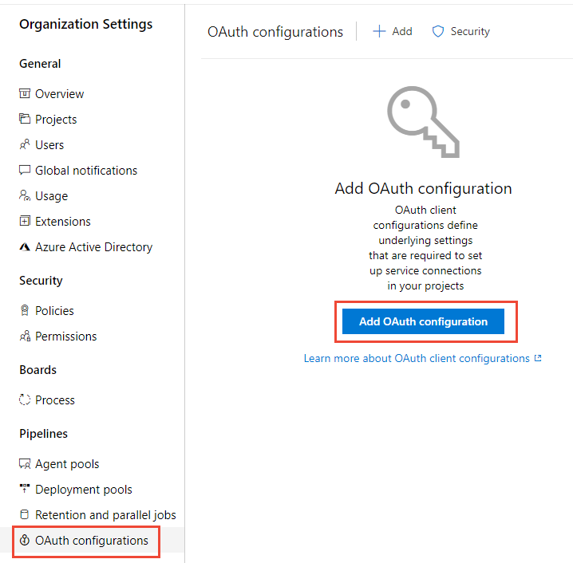  

4. Fill in the form that appears, and then choose <strong>Create</strong>.

	> [!div class="mx-imgBorder"]  
	> 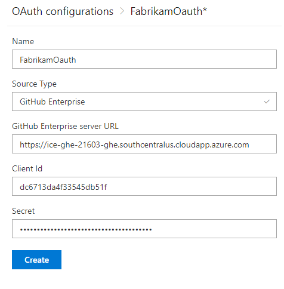  

::: moniker-end

<a id="register-server-github-ent-oauth" />

::: moniker range="azure-devops-2019"

### Register your OAuth configuration in Azure DevOps Server

0. Sign into the web portal for your Azure DevOps Server. 

0. Add the GitHub Enterprise Oauth configuration to your Azure DevOps Server collection. 

0. Open <strong>Admin settings>Oauth configurations</strong>, and choose <strong>Add Oauth configuration</strong>.  

	> [!div class="mx-imgBorder"]  
	> 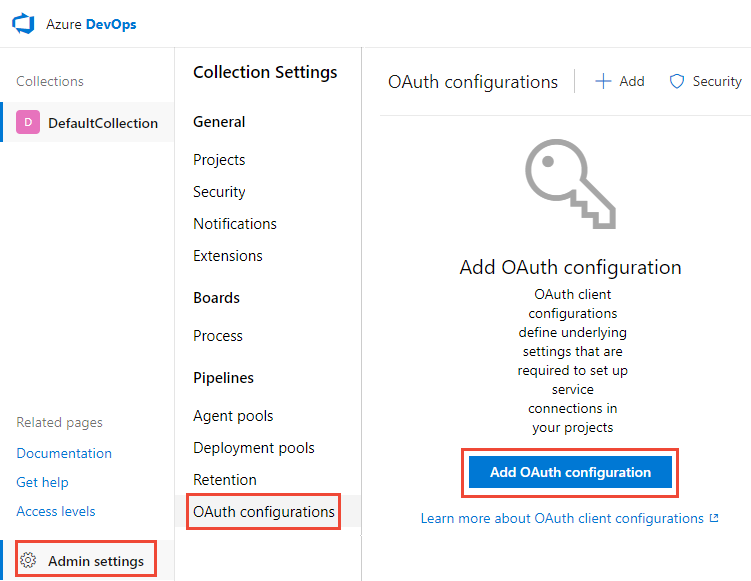  

0. Fill in the form that appears, and then choose <strong>Create</strong>.

	> [!div class="mx-imgBorder"]  
	>   

::: moniker-end

<a id="github-ent-oauth-services" />

::: moniker range="azure-devops"

## Connect Azure DevOps Services to GitHub Enterprise Server

> [!IMPORTANT]  
> To connect Azure DevOps Services to your GitHub Enterprise Server, your GitHub Enterprise Server must be sufficiently accessible from the Internet. Make sure Azure DNS can resolve your GitHub Enterprise Server name and your firewall allows access from Azure Data Center IP addresses. To determine the IP address range, see [Microsoft Azure Datacenter IP Ranges](https://www.microsoft.com/en-us/download/details.aspx?id=41653). A common error message encountered when connectivity issues exist is: 
> 
> <em>The remote name could not be resolved: 'github-enterprise-server.contoso.com'</em>
> 
> If you encounter this error, check that your server is accessible. For more information, see [Azure DNS FAQ](/azure/dns/dns-faq). 

0. Choose the  Azure DevOps logo to open <strong>Projects</strong>, and then choose the Azure Boards project you want to configure to connect to your GitHub Enterprise repositories.

0. Choose (1) <strong>Project Settings</strong>, choose (2) <strong>GitHub connections</strong> and then (3) <strong>Click here</strong> to connect to your GitHub Enterprise organization.   

	> [!div class="mx-imgBorder"]  
	> 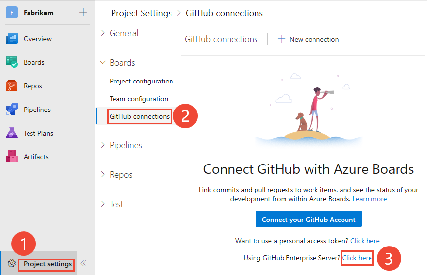   

	Choose from one of the following options&mdash;<strong>OAuth</strong>, <strong>Personal Access Token</strong>, <strong>Username and Password</strong>&mdash;based on the credentials you've chosen. 

	> [!div class="mx-imgBorder"]  
	> 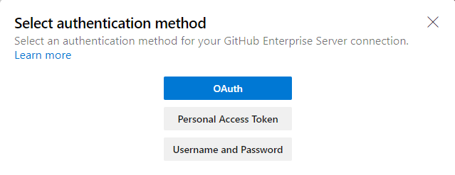 

	To create a PAT, see [Creating a personal access token](https://help.github.com/en/articles/creating-a-personal-access-token-for-the-command-line).

	> [!TIP]  
	> When creating your GitHub Enterprise Server PAT, make sure that you include these scopes: `repo, admin:repo_hook, read:user, user:email`. 

	### Connect using OAuth  

	Choose the configuration that you set up in [Step 4 of Register your OAuth configuration in Azure DevOps Services](#register-services-github-ent-oauth), and then choose <strong>Connect</strong>. 

	> [!div class="mx-imgBorder"]  
	> 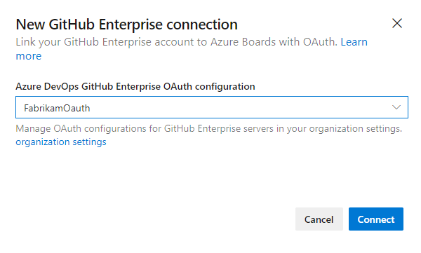  

	<a id="server-github-ent-pat" />

	### Connect using a Personal Access Token  

	Enter the URL for your GitHub Enterprise server and the <strong>Personal access token</strong> credentials recognized by that server. And then choose <strong>Connect</strong>.

	> [!div class="mx-imgBorder"]  
	>   

	<a id="server-github-ent-username" />

	### Connect using a Username and Password   

	Enter the URL for your GitHub Enterprise server and the administrator account credentials recognized by that server. And then choose <strong>Connect</strong>.

	> [!div class="mx-imgBorder"]  
	> 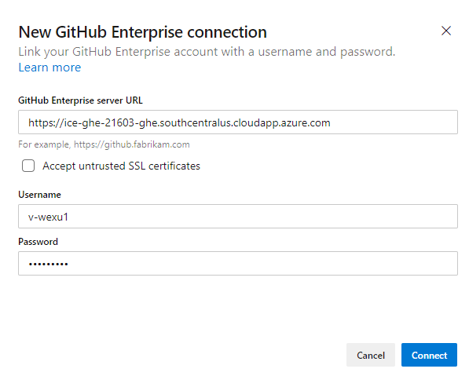  

0. The dialog lists all repositories for which you have GitHub administration rights. You can toggle between <strong>Mine</strong> and  <strong>All</strong> to determine if others appear, and then check the ones that you want to add. Choose <strong>Save</strong> when done.

	> [!div class="mx-imgBorder"]  
	> 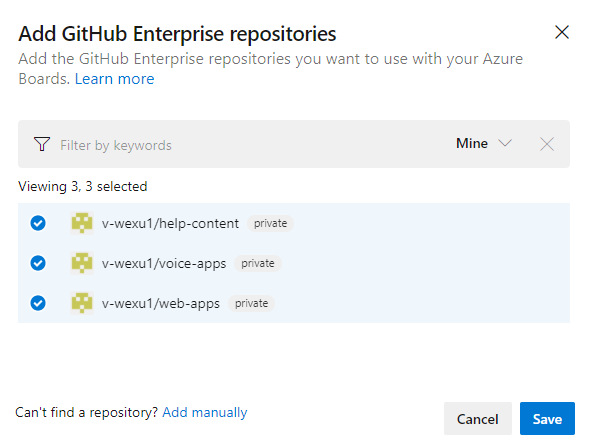  

::: moniker-end

<a id="github-ent-oauth-server" />

::: moniker range="azure-devops-2019"

## Connect Azure DevOps Server to GitHub Enterprise Server

0. Choose the  Azure DevOps logo to open <strong>Projects</strong>, and then choose the Azure Boards project you want to configure to connect to your GitHub Enterprise repositories.

0. Choose (1) <strong>Project Settings</strong>, choose (2) <strong>GitHub connections</strong> and then (3) <strong>Connect your GitHub Enterprise account</strong>.   

	> [!div class="mx-imgBorder"]  
	> 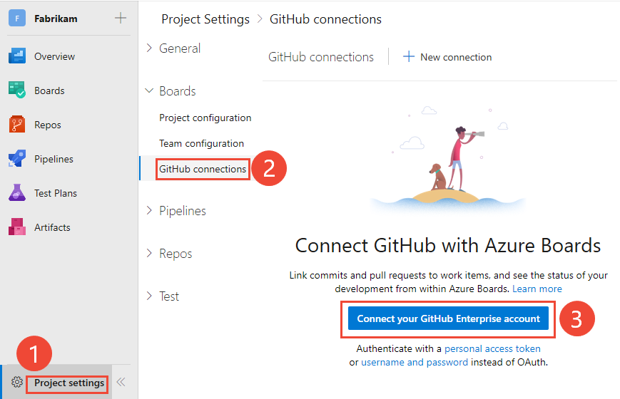   

	Or, choose a <strong>personal access token</strong> or <strong>username and password</strong>, if you are choosing to make your connection with those credentials.

	To create a PAT, see [Creating a personal access token](https://help.github.com/en/articles/creating-a-personal-access-token-for-the-command-line).

	> [!TIP]  
	> When creating your GitHub PAT, make sure that you include these scopes: `repo, admin:repo_hook, read:user, user:email`. 

	#### Connect using OAuth  

	Choose the configuration that you set up in [Step 4 of Register your OAuth configuration in Azure DevOps Server](#register-server-github-ent-oauth), and then choose <strong>Connect</strong>. 

	> [!div class="mx-imgBorder"]  
	>   

	<a id="server-github-ent-pat" />

	#### Connect using a Personal Access Token  

	Enter the URL for your GitHub Enterprise server and the <strong>Personal access token</strong> credentials recognized by that server. And then choose <strong>Connect</strong>.

	> [!div class="mx-imgBorder"]  
	>   

	<a id="server-github-ent-username" />
	#### Connect using a Username and Password   

	Enter the URL for your GitHub Enterprise server and the administrator account credentials recognized by that server. And then choose <strong>Connect</strong>.

	> [!div class="mx-imgBorder"]  
	>   

0. The dialog lists all repositories for which you have GitHub administration rights. You can toggle between <strong>Mine</strong> and  <strong>All</strong> to determine if others appear, and then check the ones that you want to add. Choose <strong>Save</strong> when done.

	> [!div class="mx-imgBorder"]  
	>   

::: moniker-end

## Add or remove repositories, or remove a connection 

0. To add or remove repositories, open the  actions icon for the connection and choose <strong>Add</strong> repositories or <strong>Remove</strong> repositories from the menu. 

	> [!div class="mx-imgBorder"]  
	> 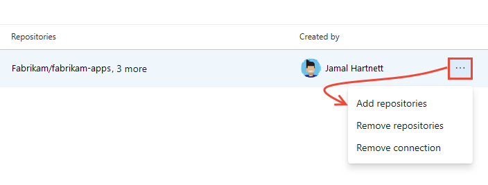  

0. To remove all repositories and the connection, choose the <strong>Remove connection</strong> option. Then, choose <strong>Remove</strong> to confirm.

	> [!div class="mx-imgBorder"]  
	> 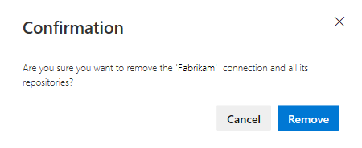  

## Resolve connection issues

See [Troubleshoot GitHub repository connection](troubleshoot-github-connection.md).

## Try this next
> [!div class="nextstepaction"]
> [Link GitHub commits and pull requests to work items](link-to-from-github.md) 

## Related articles

- [What is Azure Boards?](../../boards/get-started/what-is-azure-boards.md)
- [Troubleshoot GitHub & Azure Boards integration](troubleshoot-github-connection.md)
