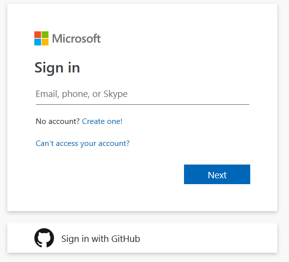

# GitHub integration overview

[!INCLUDE [temp](../includes/version-vsts-plus-azdevserver-2019.md)]

Use this guide to connect Azure Boards with one or more GitHub repositories. You make this connection by first installing the Azure Boards app for GitHub on your GitHub account or organization. This app is free for both public and private repositories. 

By connecting Azure Boards with GitHub repositories, you enable linking between GitHub commits, pull requests, and issues to work items. You can use GitHub for software development while using Azure Boards to plan and track your work. Azure Boards provides the scalability to grow as your organization and business needs grow.  

> [!NOTE]   
> Azure DevOps only supports integation with GitHub repositories or Azure Repos Git repositories. Integration with other Git repositories is not supported.  
  

::: moniker range="azure-devops"

To connect or disconnect Azure Boards to GitHub repositories, perform the following procedures: 

1. [Install and configure the Azure Boards app from GitHub](install-github-app.md)  
	This step installs the application on GitHub and creates an initial connection. Once the application is installed for an account or organization, you can add connections with the second step.  
2. [Connect Azure Boards to GitHub (Cloud)](connect-to-github.md)   
	Use the procedures provided here to add connections to other repositories in the account or organization you installed the Azure Boards app on. 
3. [Change repository access to Azure Boards](change-azure-boards-app-github-repository-access.md)  
	Use the procedures provided here to change which GitHub repositories can be connected to Azure Boards for the selected GitHub account or organization.  
4. [Add or remove GitHub repositories](add-remove-repositories.md)  
	Use the procedures provided here to add or remove GitHub connections to GitHub repositories from Azure Boards.  
::: moniker-end

::: moniker range=">= azure-devops-2019 < azure-devops"

To connect Azure DevOps Server to GitHub.com, perform the following procedures: 

1. [Install and configure the Azure Boards app from GitHub](install-github-app.md)
	This step installs the application on GitHub and creates an initial connection. Once the application is installed for an account or organization, you can add connections with the second step.  
2. [Connect Azure DevOps Server to GitHub Enterprise Server (On-premises)](connect-on-premises-to-github.md)   
	Use the procedures provided here to add connections to other repositories in the account or organization you installed the Azure Boards app on. 

::: moniker-end

 
Once you've configured the connection, you can then exercise these features:
- [Link GitHub commits and pull requests to work items](link-to-from-github.md)
- [Configure status badges](configure-status-badges.md)
- [Change GitHub repository access, or suspend or uninstall the integration](change-azure-boards-app-github-repository-access.md)

::: moniker range="azure-devops"

If you haven't yet signed up for Azure Boards, you can do that now. See [Sign up for free and invite others to collaborate on your project](../get-started/sign-up-invite-teammates.md). You can also sign up and sign in using your GitHub credentials. 

> [!div class="mx-imgBorder"]  
>    

In addition to accessing developer services such as Azure DevOps and Azure, you can use your GitHub account to access all Microsoft online services, from Excel Online to XBox.

::: moniker-end

## Videos

> [!VIDEO https://channel9.msdn.com/Shows/DevOps-Lab/Introducing-Azure-Boards-to-the-GitHub-Marketplace/player]

## Additional resources

- [Add or remove GitHub repositories](add-remove-repositories.md)
- [Build GitHub repositories](../../pipelines/repos/github.md) 
- [Build GitHub Enterprise Server repositories](../../pipelines/repos/github-enterprise.md)
- [Trigger an Azure Pipelines run from GitHub Actions](../../pipelines/ecosystems/github-actions.md)  
- [Link work items](../backlogs/add-link.md)
- [About work items](../work-items/about-work-items.md)
 

