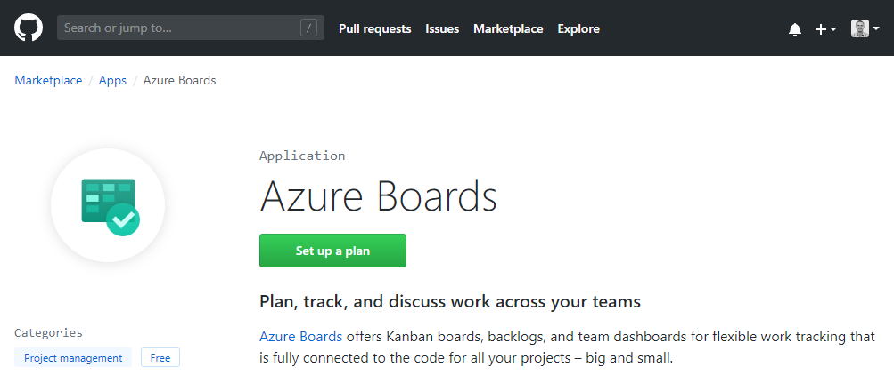
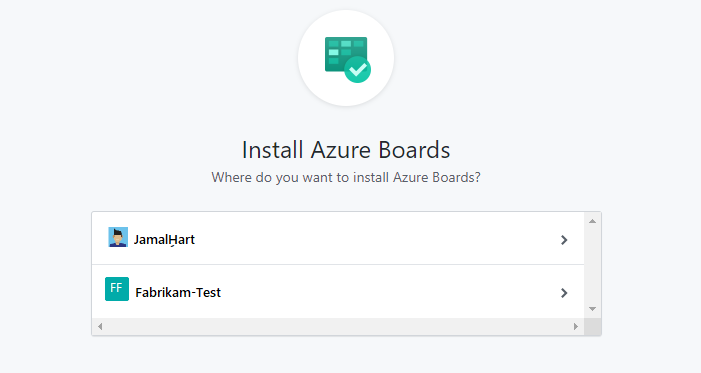
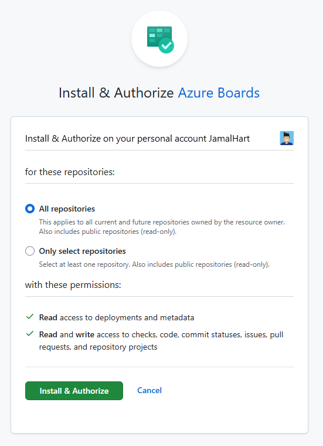
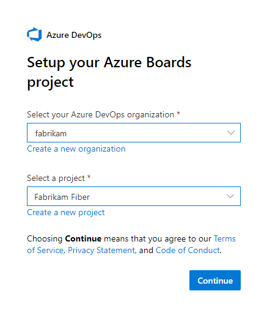
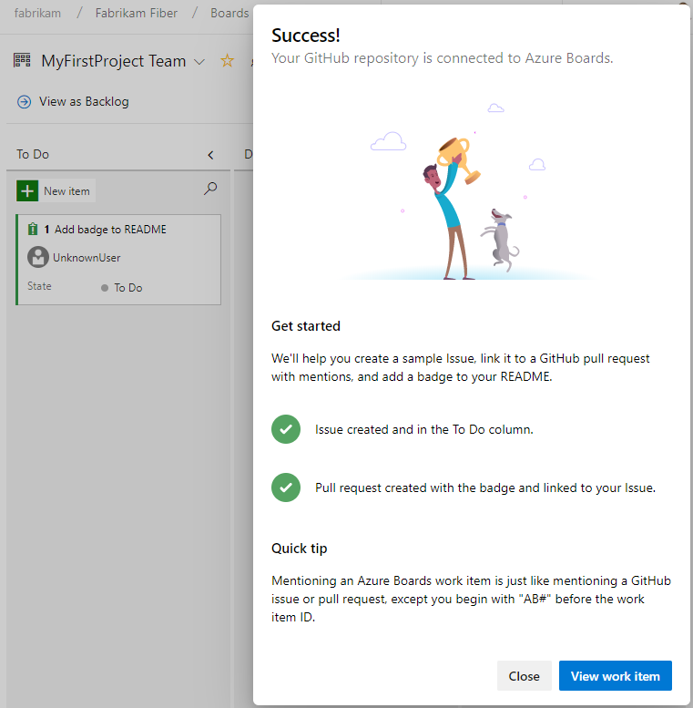
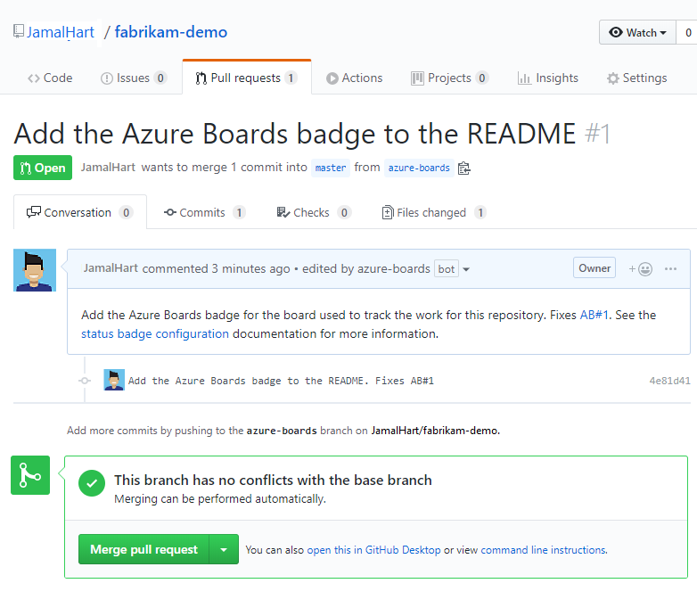

# Install the Azure Boards app for GitHub  

[!INCLUDE [temp](../includes/version-vsts-plus-azdevserver-2019.md)]

Installing the Azure Boards app for GitHub is the first step in connecting Azure Boards to your GitHub repositories. By connecting your Azure Boards projects with GitHub.com repositories, you support linking between GitHub commits and pull requests to work items. You can use GitHub for software development while using Azure Boards to plan and track your work. 
 
For an overview of the integration that the Azure Boards app for GitHub supports, see [Azure Boards-GitHub integration](index.md). Once you have installed the Azure Boards app for GitHub on your GitHub account or organization, you can choose which GitHub repositories you want to connect to from Azure Boards projects.

## Prerequisites 

* To install the Azure Boards app, you must be an administrator or owner of the GitHub organization.
* To connect to the Azure Boards project, you must have read permission to the GitHub repository. Also, you must be a member of the [Project Administrators group](../../organizations/security/set-project-collection-level-permissions.md). If you created the project, then you have permissions. 

> [!IMPORTANT]  
> If your repository is already connected via another authentication type such as OAuth, you'll need to remove that repository from your existing connection before re-connecting it via the GitHub App. Follow the steps provided in [Add or remove GitHub repositories](add-remove-repositories.md) before starting the GitHub App configuration.
>
> You can connect an Azure DevOps organization to multiple GitHub repositories so long as you are an administrator for those repositories. However, you shouldn't connect a GitHub repository to more than one Azure DevOps organization. To understand why, review [Troubleshoot GitHub & Azure Boards connection, Unexpected results when linking to projects defined in two or more Azure DevOps organizations](troubleshoot-github-connection.md#integrate-repo-to-several-organizations). 

<a id="install" />

## Install and configure the Azure Boards app 

1. Go to the Azure Boards app in the GitHub Marketplace, `https://github.com/marketplace/azure-boards`. 

	> [!div class="nextstepaction"]
	> [Azure Boards app](https://github.com/marketplace/azure-boards) 

1. Choose **Set up a plan**.

	> [!div class="mx-imgBorder"]  
	>   

1. Choose the GitHub organization you want to connect to Azure Boards. 

	> [!div class="mx-imgBorder"]  
	>   

1. Choose the repositories you want to connect to Azure Boards. 

	Here we choose to connect to all repositories.

	> [!div class="mx-imgBorder"]  
	>   

1. Choose the Azure DevOps organization and Azure Boards project you want to connect to GitHub.com.
  
	> [!div class="mx-imgBorder"]  
	>   

	You can only connect one project at a time. If you have other projects you want to connect, you can do that later as described in [Configure additional projects or repositories](#configure) later in this article.

1. Authorize your Azure Boards organization to connect with GitHub.com.

	> [!div class="mx-imgBorder"]  
	>   

1. Confirm the GitHub.com repositories that you want to connect. Select each repository you want to connect to. Unselect any repositories that you don't want to participate in the integration.  

	> [!div class="mx-imgBorder"]  
	>   

<a id="get-started" />

## Get started with the connection 

At this point, your Azure Boards-GitHub integration is complete. You can skip the next steps or run through them to understand the features supported with the connection.  

1. Choose **Create** to add a work item&mdash;Issue (Basic), User Story (Agile), or Product Backlog Item (Scrum)&mdash;depending on the process model used by your Azure Boards project. 

	> [!div class="mx-imgBorder"]  
	>   

	A work item titled *Add badge to README* appears on your Azure Boards. 

1. Next, choose **Create and link a pull request**. 

	> [!div class="mx-imgBorder"]  
	>   

	This step performs the following actions in the background:  
	- Adds a badge to the README file of the first repository in the list of connected GitHub repositories  
	- Creates a GitHub commit for the update made by adding the badge to the README file
	- Creates a GitHub pull request to merge the changes made to the README file  
	- Links the GitHub commit and pull request to the work item created in step 1.  

1. Lastly, choose **View work item** to open the work item created in step 1. Note the links under the **Development** section that correspond to the commit and pull request created in GitHub.com

	> [!div class="mx-imgBorder"]  
	>   

1.	Choose the pull request link, the first link in the list, to open the pull request in GitHub.  

	The GitHub pull request opens in a new browser tab.

	> [!div class="mx-imgBorder"]  
	>   

1. Go ahead and complete the pull request.

	> [!div class="mx-imgBorder"]  
	>   

1. Navigate to your repository README file and view the badge that has been added. 

	> [!div class="mx-imgBorder"]  
	>   

	To learn more about Azure Boards badges, see [Configure status badges to add to GitHub README files](configure-status-badges.md).

<a id="configure" />

## Configure additional projects or repositories

You can configure additional Azure Boards/Azure DevOps projects, GitHub.com repositories, or change the current configuration from the Azure Boards app page. To learn more, see [Change GitHub repository access, or suspend or uninstall the integration](change-azure-boards-app-github-repository-access.md).

## Add or remove repositories from Azure Boards

Once you've integrated Azure Boards with GitHub using the Azure Boards app, you can add or remove repositories from the web portal for Azure Boards. To learn how, see [Add or remove GitHub repositories](add-remove-repositories.md).

## Try this next
> [!div class="nextstepaction"]
> [Link GitHub commits and pull requests to work items](link-to-from-github.md) 

## Related articles
 
- [Drive Git development from a work item](../backlogs/connect-work-items-to-git-dev-ops.md)
- [Change GitHub repository access, or suspend or uninstall the integration](change-azure-boards-app-github-repository-access.md)
- [Add or remove GitHub repositories](add-remove-repositories.md)
- [Configure status badges to add to GitHub README files](configure-status-badges.md)
 