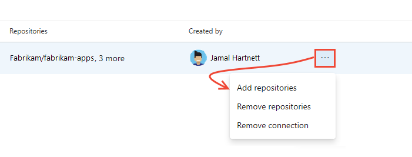

# Install and configure the Azure Boards app for GitHub  

[!INCLUDE[temp](../_shared/version-vsts-only.md)] 

By installing the Azure Boards app for GitHub, you can configure and manage the connections of your Azure Boards projects (hosted service only) with your GitHub.com repositories. By connecting your Azure Boards projects with GitHub.com repositories, you support linking between GitHub commits and pull requests to work items. You can use GitHub for software development while using Azure Boards to plan and track your work. 

> [!IMPORTANT]
> The Azure Boards app for GitHub is in preview. Watch for public availability in the [GitHub Marketplace](https://github.com/marketplace/category/project-management) and announcement in our [release notes](/azure/devops/release-notes/) and [blog](https://devblogs.microsoft.com/devops/) soon.

The Azure Boards app for GitHub is the preferred method for integrating Azure Boards with GitHub. While the end result is the same as the instructions provided to [Connect Azure Boards to GitHub](connect-to-github.md), it allows you to manage the connection and configuration from the GitHub.com web portal. 

This article walks you through the following 5 minute installation and configure process: 

- <strong>Install and configure</strong>
	- Choose the GitHub.com repositories you want to connect 
	- Choose the Azure DevOps Services organization and Azure Boards project you want to connect
	- Authorize connection to Azure Boards 
	- Confirm the repositories you want to connect
- (Optional) <strong>Get started</strong> 
	- In Azure Boards, create a work item for adding a badge to your GitHub.com repo README file
	- In GitHub.com, add the badge syntax to a repo README file, commmit the change, and create a pull request for the commit 
	- In Azure Boards, add links to the GitHub commit and pull request to the work item; choose the GitHub pull request link to open the pull request in GitHub.com
	- In GitHub.com, complete the pull request and view the badge added to your GitHub repo  

You can learn more about the Azure Boards app from the [GitHub Marketplace](https://github.com/marketplace/azure-boards), and Azure Boards from [Azure DevOps Services>Azure Boards](https://azure.microsoft.com/services/devops/boards/).

## Prerequisites 

* You must be an administrator or owner of the GitHub repository you'll be connecting to. 
- To install the Azure Boards app, you must be an administrator or owner of the GitHub repository or GitHub organization.
- To connect to the Azure Boards project, you must have read permission to the GitHub repository.

> [!IMPORTANT]  
> You can connect an Azure DevOps organization to multiple GitHub repositories so long as you are an administrator for those repositories. However, you can't connect a GitHub repository to more than one Azure Boards project. To understand why, review [Troubleshoot GitHub & Azure Boards connection, Unexpected results when linking to projects defined in two or more Azure DevOps organizations](troubleshoot-github-connection.md#integrate-repo-to-several-organizations). 

<a id="install" />

## Install and configure the Azure Boards app 

1. Go to the Azure Boards app in the GitHub Marketplace. 

	> [!div class="nextstepaction"]
	> [Azure Boards app](https://github.com/marketplace/azure-boards) 

1. Choose **Set up a plan**.

	> [!div class="mx-imgBorder"]  
	>   

1. Choose the GitHub organization you want to connect to Azure Boards. 

	> [!div class="mx-imgBorder"]  
	>   

1. Choose the repositories you want to connect to Azure Boards. 

	Here we choose to connect to all repositories.

	> [!div class="mx-imgBorder"]  
	>   

1. Choose the Azure DevOps organization and Azure Boards project you want to connect to GitHub.com.
  
	> [!div class="mx-imgBorder"]  
	>   

	You can only connect one project at a time. If you have other projects you want to connect, you can do that later as described in [Configure additional projects or repositories](#configure) later in this article.

1. Authorize your Azure Boards organization to connect with GitHub.com.

	> [!div class="mx-imgBorder"]  
	>   

1. Confirm the GitHub.com repositories that you want to connect. Select each repository you want to connect to. Unselect any repositories that you don't want to participate in the integration.  

	> [!div class="mx-imgBorder"]  
	>   

<a id="get-started" />

## Get started with the connection 

At this point, your Azure Boards + GitHub connection is complete. You can skip the next steps or run through them to understand the features supported with the connection.  

1. Choose <strong>Create</strong> to add a work item&mdash;Issue (Basic), User Story (Agile), or Product Backlog Item (Scrum)&mdash;depending on the process model used by your Azure Boards project. 

	> [!div class="mx-imgBorder"]  
	>   

	A work item titled <em>Add badge to README</em> appears on your Azure Boards. 

1. Next, choose <strong>Create and link a pull request</strong>. 

	> [!div class="mx-imgBorder"]  
	>   

	This step performs the following actions in the background:  
	- Adds a badge to the README file of the first repository in the list of connected GitHub repositories  
	- Creates a GitHub commit for the update made by adding the badge to the README file
	- Creates a GitHub pull request to merge the changes made to the README file  
	- Links the GitHub commit and pull request to the work item created in step 1.  

1. Lastly, choose <strong>View work item</strong> to open the work item created in step 1. Note the links under the <strong>Development</strong> section that correspond to the commit and pull request created in GitHub.com

	> [!div class="mx-imgBorder"]  
	>   

1.	Choose the pull request link (first link in the list) to open the pull request in GitHub.  

	The GitHub pull request opens in a new browser tab.

	> [!div class="mx-imgBorder"]  
	>   

1. Go ahead and complete the pull request.

	> [!div class="mx-imgBorder"]  
	>   

1. Navigate to your repository README file and view the badge that has been added. 

	> [!div class="mx-imgBorder"]  
	>   

	To learn more about Azure Boards badges, see [Configure status badges to add to GitHub README files](configure-status-badges.md).

<a id="configure" />

## Configure additional projects or repositories

You can configure additional Azure Boards/Azure DevOps projects, GitHub.com repositories, or change the current configuration from the Azure Boards app page. 

> [!NOTE]   
> The Azure Boards app prevents you from connecting a GitHub repo to more than one Azure Boards/Azure DevOps organization. You can, however, connect a repo to two or more projects within the same organization. To learn more, see [Troubleshoot GitHub & Azure Boards connection](troubleshoot-github-connection.md#integrate-repo-to-several-organizations).

1. Open the Azure Boards app page. 
	 
	> [!div class="mx-imgBorder"]  
	>   

1. Choose <strong>Configure</strong>.

1. To add repositories, scroll down the page and choose each repository to add from the <strong>Select repositories</strong> drop-down menu. 

	> [!div class="mx-imgBorder"]  
	>   

1. Follow steps 5 through 7 provided under the [Install and configure](#install) section earlier in this article.

## Uninstall the Azure Boards app

1. Open the Azure Boards app page. 

2. Choose <strong>Configure</strong>.

3. Scroll down and choose <strong>Uninstall</strong>. 

	> [!div class="mx-imgBorder"]  
	>   

4. Confirm that you understand that uninstalling the Azure Boards app will remove all connections you've made to connect to GitHub repositories. 

## Add or remove repositories from Azure Boards

Once you've integrated Azure Boards with GitHub using the Azure Boards app, you can add or remove repositories from the web portal for Azure Boards. 

1. From you Azure Boards project web portal, choose (1) <strong>Project Settings</strong>, expand <strong>Boards</strong> as needed, and then choose (2) <strong>GitHub connections</strong>.

	> [!div class="mx-imgBorder"]  
	>   

1. To add or remove repositories, open the  actions icon for the connection and choose <strong>Add</strong> repositories or <strong>Remove</strong> repositories from the menu. 

	> [!div class="mx-imgBorder"]  
	>   

0. To remove all repositories and the connection, choose the <strong>Remove connection</strong> option. Then, choose <strong>Remove</strong> to confirm.

	> [!div class="mx-imgBorder"]  
	>   
 

## Try this next
> [!div class="nextstepaction"]
> [Link GitHub commits and pull requests to work items](link-to-from-github.md) 

## Related articles

- [What is Azure Boards?](../../boards/get-started/what-is-azure-boards.md)
- [Link GitHub commits and pull requests to work items](link-to-from-github.md)
- [Configure status badges to add to GitHub README files](configure-status-badges.md)

