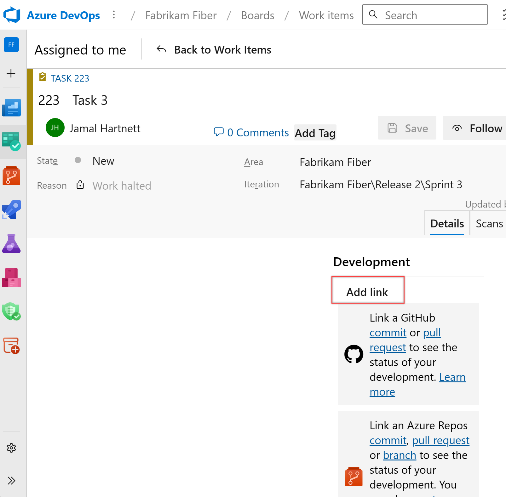
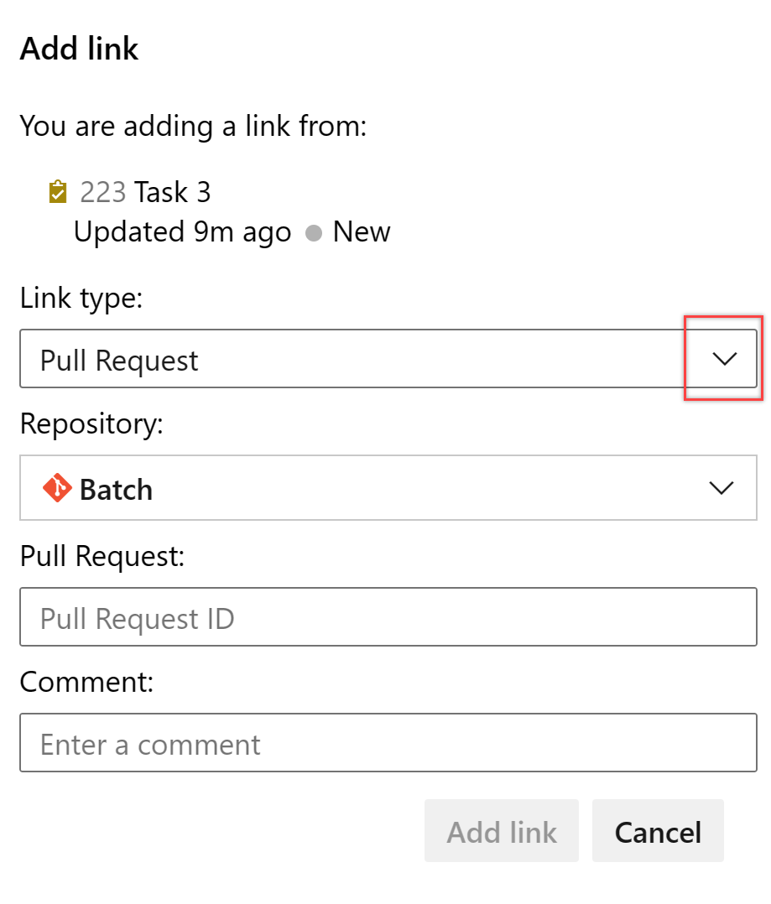
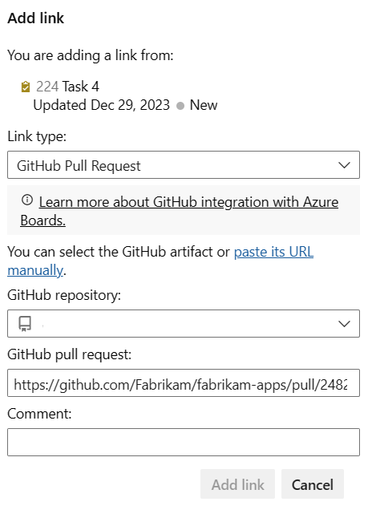
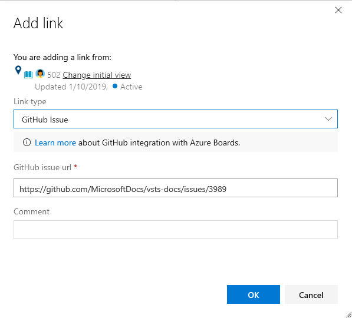

# Link GitHub commits, pull requests, and issues to work items in Azure Boards

[!INCLUDE [version-gt-eq-2019](../../includes/version-gt-eq-2019.md)] 

Once you've connected your Azure Boards project with a GitHub repository, you can link work items to your GitHub commits and pull requests. You can add links using the **#mention** syntax familiar to GitHub users or by adding a GitHub Commit or GitHub Pull Request link type from the Azure Boards work item.

[!INCLUDE[temp](../includes/github-platform-support.md)]

## Prerequisites 

* Your Azure Boards project must be connected to the GitHub repository where the commits and pull requests you want to link to/from exist. For details, see [Azure Boards-GitHub integration](index.md).  
* You must be a Contributor to Azure Boards project and to the GitHub repository.  

::: moniker range="azure-devops"
> [!NOTE]   
> Projects that use the Hosted XML process model require updates to the work item types to view the Development section and GitHub link types. For details, see [Update XML definitions for select work item types](troubleshoot-github-connection.md#update-wits). 
::: moniker-end


## Use `AB#` mention to link from GitHub to Azure Boards work items 
From a GitHub commit, pull request or issue, use the following syntax to create a link to your Azure Boards work item. Enter the `AB#ID` within the text of a commit message. Or, for a pull request or issue, enter the `AB#ID` within the title or description (not a comment).

::: moniker range="azure-devops-2019"

> [!NOTE]   
> Linking to GitHub issues requires Azure DevOps Server 2019 Update 1 or later version. 

::: moniker-end

```
AB#{ID}
```

For example, `AB#125` will link to work item ID 125. 

You can also enter a commit or pull request message to transition the work item. The system will recognize `fix, fixes, fixed` and apply it to the #-mention item that follows. Mentioned work items transition to the first **State** associated with the *Resolved* workflow category state. If there's no **State** associated with *Resolved*, then it transitions to the **State** associated with the *Completed* workflow category state. To understand how workflow states and category states are mapped, see [How workflow category states are used in Azure Boards backlogs and boards](../work-items/workflow-and-state-categories.md).

Some examples are provided as shown. 


| Commit or pull request message              | Action |
| :------------------------------------------ | :----------------------------------------------- |
| `Fixed AB#123`                              | Links and transitions the work item to the *Resolved* workflow state category or, if none is defined, then the *Completed* workflow state category. |
| `Adds a new feature, fixes AB#123.`         | Links and transitions the work item to  the *Resolved* workflow state category or, if none is defined, then the *Completed* workflow state category. |
| `Fixes AB#123, AB#124, and AB#126`          | Links to Azure Boards work items 123, 124, and 126. Transitions only the first item, 123 to the *Resolved* workflow state category or, if none is defined, then the *Completed* workflow state category.|
| `Fixes AB#123, Fixes AB#124, Fixes AB#125` | Links to Azure Boards work items 123, 124, and 126. Transitions all items to   either the *Resolved* workflow state category or, if none is defined, then the *Completed* workflow state category. |
| `Fixing multiple bugs: issue #123 and user story AB#234` | Links to GitHub issue 123 and Azure Boards work item 234. No transitions are made. |


> [!NOTE]   
> If you have connected the same GitHub repo to projects defined in two or more Azure DevOps organizations, you may see unexpected **AB#** mention linking. For details, see [Troubleshoot GitHub & Azure Boards integration](troubleshoot-github-connection.md). For this reason, we recommend that you only connect a GitHub repo to projects defined in a single Azure DevOps organization. 

<a id="link-existing"> </a> 


::: moniker range=">= azure-devops-2019"

## Add link from a work item to a GitHub commit, pull request, or issue

::: moniker-end
::: moniker range="azure-devops-2019"

> [!NOTE]   
> Linking to a GitHub issue requires Azure DevOps Server 2019 Update 1 or later version. 

::: moniker-end

::: moniker range=">= azure-devops-2019"

1. To link to a commit or pull request, open the work item and choose **Add Link** under the Development section. 

	> [!div class="mx-imgBorder"]  
	>  

	To link to an issue, choose the **Links** tab, and then choose **Add Link>Existing item**. 

	> [!div class="mx-imgBorder"]  
	>  

1. From the **Add link** dialog, select one of the **GitHub** link types, enter the URL to the commit, pull request, or issue and then choose **OK**.  
	Here, we add a link to a GitHub pull request. 

	> [!div class="mx-imgBorder"]  
	>   

	Azure Boards completes a check to ensure that you've entered a valid link. The linked-to GitHub repository [must be connected to the Azure Boards project](connect-to-github.md) or the validation will fail.

	Here, we add a link to a GitHub issue. 

	> [!div class="mx-imgBorder"]  
	>   

::: moniker-end

## View or open links from the Development section

The Development section within the work item form lists the links created to GitHub commits and pull requests with the :::image type="icon" source="../../media/icons/github.png" border="false"::: GitHub icon. 

> [!div class="mx-imgBorder"]  
>   

Choose the link provided to open the commit or pull request in GitHub.  

## View GitHub objects on Kanban board

With GitHub annotations enabled on the Kanban board, you can quickly open linked GitHub commits, pull requests, or issues for more detail. For details on enabling annotations, see [Customize cards](../boards/customize-cards.md).

> [!div class="mx-imgBorder"]  
>   

::: moniker range="azure-devops-2019"

> [!NOTE]   
> GitHub annotations requires Azure DevOps Server 2019 Update 1 or later version. 

::: moniker-end

## Try this next

> [!div class="nextstepaction"]
> [Configure status badges](configure-status-badges.md)

## Related articles

- [Azure Boards-GitHub integration](index.md)
- [How workflow category states are used in Azure Boards backlogs and boards](../work-items/workflow-and-state-categories.md)
- [Linking, traceability, and managing dependencies](../queries/link-work-items-support-traceability.md)
- [Troubleshoot GitHub & Azure Boards integration](troubleshoot-github-connection.md)


