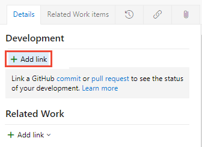
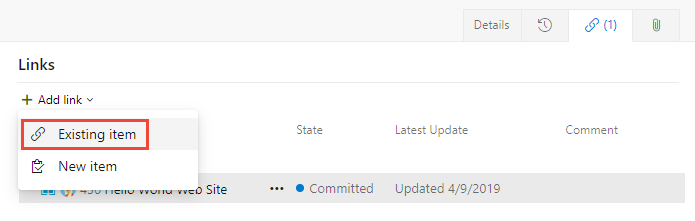

::: moniker range="azure-devops"
# Link GitHub commits, pull requests, and issues to work items
::: moniker-end

::: moniker range="azure-devops-2019"
# Link GitHub commits and pull requests to work items
::: moniker-end

[!INCLUDE[temp](../_shared/version-vsts-plus-azdevserver-2019.md)] 

 When using GitHub with Azure Boards, it's easy to keep all of your work connected. Links can be added using the **#mention** syntax familiar to GitHub users or from the Azure Boards work item.

[!INCLUDE[temp](../_shared/github-platform-support.md)]

## Prerequisites 

* Your Azure Boards project must be connected to the GitHub repository where the commits and pull requests you want to link to/from exist. For details, see [Connect Azure Boards to GitHub](connect-to-github.md).  
* You must be a Contributor to Azure Boards.  
* You must be a  Contributor to the GitHub repository.  
* If your organization uses the Hosted XML process model to customize the work tracking experience, you'll need to update the work item types to link to and view the GitHub link types from the Development section in the work item form. For details, see [Update XML definitions for select work item types](troubleshoot-github-connection.md#update-wits). 

## Use AB# mention to link from GitHub to Azure Boards work items 

::: moniker range="azure-devops"

From a GitHub commit, pull request or issue, use the following syntax to create a link to your Azure Boards work item. Enter the `AB#ID` within the text of a commit message. Or, for a pull request or issue, enter the `AB#ID` within the title or description (not a comment).

::: moniker-end

::: moniker range="azure-devops-2019"

From a GitHub commit or pull request, use the following syntax to create a link to your Azure Boards work item. Enter the `AB#ID` within the text of a commit message or for a pull request, enter the `AB#ID` within the pull request title or description (not a pull request comment). 

::: moniker-end


```
AB#{ID}
```

For example, `AB#125` will link to work item ID 125. 

In addition, you can enter a commit or pull request message to transition the work item. The system will recognize `fix, fixes, fixed` and apply it to the #-mention item that follows. Some examples are provided as shown. 

Examples: 

| Commit message                              | Action |
| :------------------------------------------ | :----------------------------------------------- |
| `Fixed AB#123`                              | Links and transitions the work item to the "done" state. |
| `Adds a new feature, fixes AB#123.`         | Links and transitions the work item to the "done" state. |
| `Fixes AB#123, AB#124, and AB#126`          | Links to Azure Boards work items 123, 124, and 126. Transitions only the first item, 123 to the "done" state. |
| `Fixes AB#123, Fixes AB#124, Fixes AB#125` | Links to Azure Boards work items 123, 124, and 126. Transitions all items to the "done" state. |
| `Fixing multiple bugs: issue #123 and user story AB#234` | Links to GitHub issue 123 and Azure Boards work item 234. No transitions. |


> [!NOTE]   
> If you have connected the same GitHub repo to projects defined in two or more Azure DevOps organizations, you may see unexpected **AB#** mention linking. For details, see [Troubleshoot GitHub & Azure Boards integration](troubleshoot-github-connection.md#integrate-repo-to-several-organizations). For this reason, we recommend that you only connect a GitHub repo to projects defined in a single Azure DevOps organization. 


<a id="link-existing"> </a> 


::: moniker range="azure-devops"

## Add link from a work item to a GitHub commit, pull request, or issue

0. To link to a commit or pull request, open the work item and choose <strong>Add Link</strong> under the Development section. 

	> [!div class="mx-imgBorder"]  
	>  

	To link to an issue, choose the <strong>Links</strong> tab, and then choose <strong>Add Link>Existing item</strong>. 

	> [!div class="mx-imgBorder"]  
	>  

1. From the Add link dialog, select one of the <strong>GitHub</strong> link types, enter the URL to the commit, pull request, or issue and then choose <strong>OK</strong>.  

	Here, we add a link to a GitHub pull request. 

	> [!div class="mx-imgBorder"]  
	>   

	Azure Boards performs a check to ensure that you've entered a valid link. The linked-to GitHub repository [must be integrated with the project](connect-to-github.md) or the validation will fail.

	Here, we add a link to a GitHub issue. 

	> [!div class="mx-imgBorder"]  
	>   

::: moniker-end

::: moniker range="azure-devops-2019"

## Add link from work items to GitHub commits and pull requests

0. Open the work item and choose **Add Link** under the Development section. 

	> [!div class="mx-imgBorder"]  
	>  

1. From the Add link dialog, select the **GitHub Commit** or **GitHub Pull Request** link type, enter the URL to the commit or pull request, and then choose **OK**.  

	Here, we add a link to a GitHub pull request. 

	> [!div class="mx-imgBorder"]  
	>   

	Azure Boards performs a check to ensure that you've entered a valid link. The linked-to GitHub repository [must be integrated with the project](connect-to-github.md) or the validation will fail.

::: moniker-end

## View or open links from the Development section

The Development section within the work item form lists the links created to GitHub commits and pull requests with the  GitHub icon. 

> [!div class="mx-imgBorder"]  
>   
Choose the link provided to open the commit or pull request in GitHub. 


## Try this next
> [!div class="nextstepaction"]
> [Configure status badges](configure-status-badges.md)

## Related articles

- [Connect Azure Boards to GitHub](connect-to-github.md)  
- [Linking, traceability, and managing dependencies](../queries/link-work-items-support-traceability.md)
- [Troubleshoot GitHub & Azure Boards integration](troubleshoot-github-connection.md)

