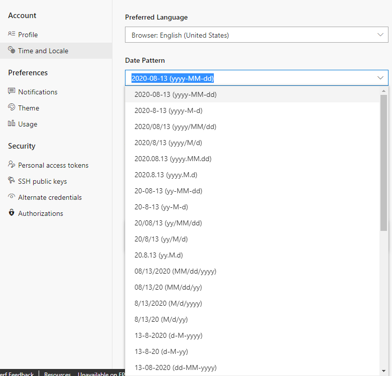

### Date and time pattern  
 
The date and time pattern you enter for **DateTime** fields should match that which you select through your profile. To view or change your selection, see [Set user preferences, Time and Locale](../../organizations/settings/set-your-preferences.md).

::: moniker range="azure-devops"  

> [!div class="mx-imgBorder"]
>    

::: moniker-end 

::: moniker range="< azure-devops"  

:::image type="content" source="../../organizations/settings/media/user-preferences/jamalh-locale-settings-server.png" alt-text="Time and Locale page, Date pattern options":::

::: moniker-end 

