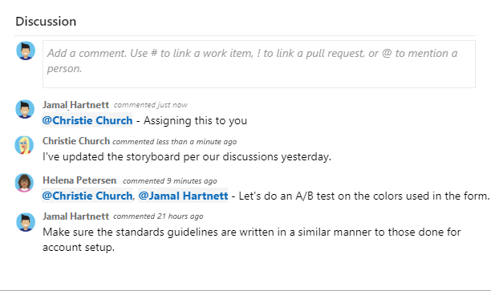
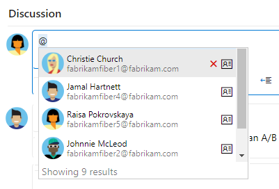
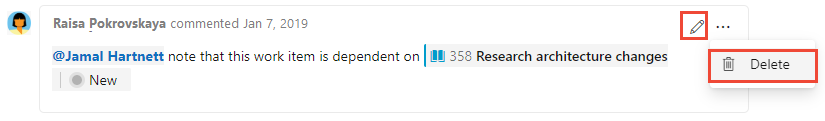
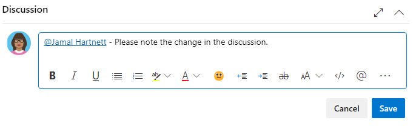

<a id="capture-comments-in-the-discussion-section" />

## Capture comments in the Discussion section 

Use the **Discussion** section to add and review comments made about the work being performed. 

> [!div class="mx-imgBorder"]  
>    

The rich text editor tool bar displays below the text entry area. It appears when you click your cursor within each text box that supports text formatting. 

> [!div class="mx-imgBorder"]  
>   

> [!NOTE]  
> There is no Discussion work item field. To query work items with comments entered in the Discussion area, you filter on the [**History** field](../queries/history-and-auditing.md). The full content of the text entered into the Discussion text box is added to the History field. 

### Mention someone, a group, work item, or pull request 

Choose one of these icons--:::image type="icon" source="../../media/icons/at-mention.png" border="false" alt-text="at mention":::, :::image type="icon" source="../../media/icons/work-id.png" border="false" alt-text="pound sign ":::, or :::image type="icon" source="../../media/icons/pr-id.png" border="false" alt-text="P R":::--to open a menu of recent entries you've made to mention someone, link to a work item, or link to a pull request. Or to open the same menu, you can type **@**, **#**, or **!**.

> [!div class="mx-imgBorder"]  
> 

Enter a name or number and the menu list filters to match your entry. Choose the entry you want to add. You can bring a group into the discussion by entering **@** and the group name, such as a team or security group. 

::: moniker range=">= azure-devops-2019" 

### Edit or delete a comment 

If you need to edit or delete any of your discussion comments, choose :::image type="icon" source="../../media/icons/edit.png" border="false"::: **Edit** or choose the :::image type="icon" source="../../media/icons/actions-icon.png" border="false"::: actions icon and then choose **Delete**. 

> [!div class="mx-imgBorder"]  
>   
::: moniker-end

::: moniker range="azure-devops-2019"  
> [!NOTE]   
> Editing and deleting comments requires Azure DevOps Server 2019 Update 1 or later version. 
::: moniker-end

::: moniker range=">= azure-devops-2019" 
After updating the comment, choose **Update**. To delete the comment, you'll need to confirm that you want to delete it.
A full audit trail of all  edited and deleted comments is maintained in the <strong>History</strong> tab on the work item form. 
::: moniker-end

::: moniker range=">= azure-devops-2020"

### Add a reaction to a comment 

Add one or more reactions to a comment by choosing a smiley icon at the upper-right corner of any comment. Or, choose from the icons at the bottom of a comment next to any existing reactions. To remove your reaction, choose the reaction on the bottom of your comment. The following image shows an example of the experience of adding a reaction, as well as the display of reactions on a comment.

> [!div class="mx-imgBorder"]  
>   

::: moniker-end

::: moniker range="azure-devops"

### Save a comment without saving the work item

If you only have permissions to add to the **Discussion** of a work item, then you can do so by saving comments. This permission is controlled by Area Path nodes and the **Edit work item comments in this node** permission. For more information, see [Set work tracking permissions, Create child nodes, modify work items under an area or iteration path](../../organizations/security/set-permissions-access-work-tracking.md#set-permissions-area-path).

Once you save the comments, you don't need to save the work item.  

> [!div class="mx-imgBorder"]  
>   

> [!NOTE] 
> When you save changes made to the **Discussion** control, only the comment is saved. No [work item rules](../../organizations/settings/work/rule-reference.md) defined for the work item type execute.

::: moniker-end
