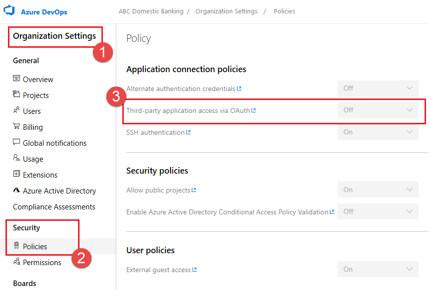
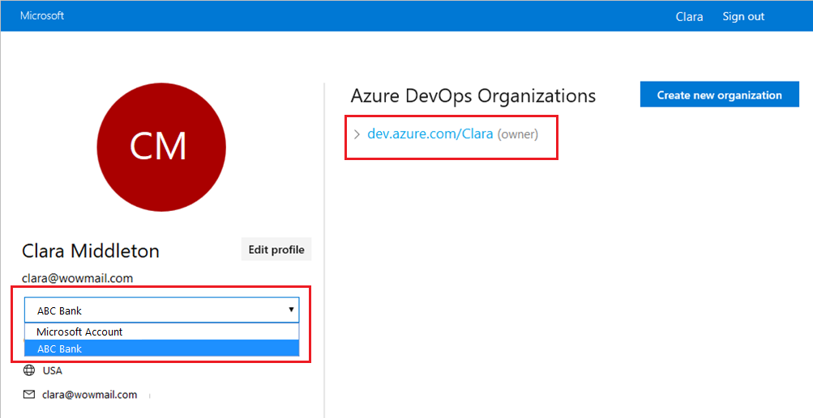

* [Sorry, something went wrong. Please try again.](#sorry-something-went-wrong-please-try-again)
* [Configuration failed. Please make sure that the organization '{organization name}' exists and that you have sufficient 
permissions.](#configuration-failed-please-make-sure-that-the-organization-organization-name-exists-and-that-you-have-sufficient-permissions)

### Sorry, something went wrong. Please try again.

The Azure Boards app uses the OAuth authentication protocol, and requires [Third-party application access via OAuth for the 
organization](/azure/devops/organizations/accounts/change-application-access-policies#change-application-access-policies) to be enabled. 
To enable this setting, navigate to **Organization Settings** > **Security** > **Policies**, and set the **Third-party application access
 via OAuth for the organization** setting to **On**.

> [!div class="mx-imgBorder"]
> 

### Configuration failed. Please make sure that the organization '{organization name}' exists and that you have sufficient permissions.

Sign out of Azure DevOps by navigating to `https://aka.ms/VsSignout` using your browser.

Open an **In private** or **incognito** browser window and navigate to `https://aex.dev.azure.com/me` and sign in. In the dropdown under the profile 
icon to the left, select the directory that contains the organization containing the project that you want to link.

> [!div class="mx-imgBorder"]
> 