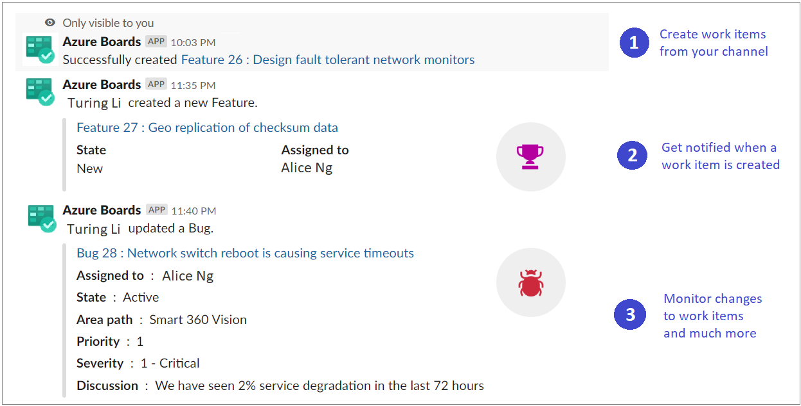

 
# Azure Boards with Slack

[!INCLUDE [temp](../_shared/version-vsts-only.md)]

If you use [Slack](https://slack.com), you can use the [Azure Boards app for Slack](https://azchatoppfeus2c.azchatops.visualstudio.com/_slack/installboardsapp) to add work items and monitor work item activity in your Azure Boards project from your Slack channel. 

> [!NOTE]  
> You can only link the Azure Boards app for Slack to a project hosted on Azure DevOps Services at this time.  

The Azure Boards app for Slack allows users to set up and manage subscriptions for create, update and other work item events, and get notifications for these 
events in their Slack channel. Conversations in the Slack channel can be used to add work items. Previews for work item URLs support users to initiate discussions around work.



Read this article to learn how to: 

> [!div class="checklist"]  
> * Add the Azure Boards app to your Slack workspace
> * Link and unlink your Azure Boards project to the Azure Boards app
> * Set up Azure board subscription events in your Slack channel
> * Add work items from your Slack channel
> * Monitor work item activity in your Slack channel  
> * Get notifications in private Slack channels

## Prerequisites

- To add a work item, you must be a contributor to the Azure Boards project. If you don't have a project yet, you can sign up and create a project. For details, see [Start using Azure Boards](../get-started/index.md). 
- To add subscriptions to a Slack channel for work item events, you must be a member of the Azure Boards Project Administrators group. To get added, see [Set permissions at the project- or collection-level](../../organizations/security/set-project-collection-level-permissions.md). 
- To receive notifications, the **Third party application access via OAuth** setting must be enabled for the organization. See [Change application access policies for your organization](../../organizations/accounts/change-application-access-policies.md)

> [!NOTE]
> * Notifications are currently not supported inside direct messages.

## Add the Azure Boards app to your Slack workspace

1. To install the Azure Boards app to your Slack workspace, open a web browser, sign into Slack, and open the [Azure Boards app](https://azchatopprodcus1.azchatops.visualstudio.com/_slack/installboardsapp). 

1. Once added, you will see a welcome message from the app as shown in the following image. 

	

1. Use the `/azboards` Slack handle to interact with the app. A list of commands are provided later in this article, [Command reference](#command-reference).

## Link your Azure Boards project to the Azure Boards app

To use the app, you must first link your Azure Boards project to your Slack channel. 

1. Once the app has been installed in your Slack workspace, connect and authenticate yourself to Azure Boards. 

	

1. After signing in, use the following slash command inside a Slack channel to link to the Azure Boards project which you specify with the URL, :

	```
	/azboards link [project url]
	```

	For example:

	```
	/azboards link https://dev.azure.com/myorg/myproject
	```

Once the project is linked, you can add work items using `/azboards create` command or use other message actions. 

## Set up subscriptions

You can create subscriptions to monitor work items at any time using the `/azboards subscriptions` command. You have an option of setting up 
subscriptions just after linking a project. 

1. Select the desired area path, event that you are interested in, and leverage the associated 
filters to customize your Slack channel. To easily set up subscriptions, your recently accessed area paths are shown in the area path dropdown.

	

	In case your team's area path doesn't appear in the Area path dropdown menu, follow the instructions mentioned in the [next section, Add area paths](#add-area-paths). Area paths added using the `/azboards addareapath` command and area paths for which subscriptions are created in the Slack channel always appear in the Area path dropdown along with recently accessed area paths.


## Add area paths

You can add areas that your team works on to the channel so that they are always available for adding work items and subscriptions. 

- Use the following command to add area paths.

	```
	/azboards addAreapath [area path]
	```

	For example:

	```
	/azboards addAreapath myproject\fabrikam
	```

	

## Add a work item with a command

With Azure Boards app you can create work items from your channel. The app supports custom work items as well.

- To add a work item, use `/azboards create`. 

	

## Add a work item from a message action

Often a channel discussion necessitates addition of work items. You can use message actions to add a work item. The selected message is prefilled in the description section of the work item. A link back to the conversation in the channel is stored in the Discussion section of the newly added work item, giving users 
access to the discussion that led to creation of the work item.

- To add work items using message actions

	> [!div class="mx-imgBorder"]  
	> 


## Manage subscriptions

1. To view, add and remove subscriptions for a channel, use the `/azboards subscriptions` command:

	```
	/azboards subscriptions
	```

	This command lists all the current subscriptions for the channel and allows you to add new subscriptions and remove existing ones. As part of adding subscriptions, you can also customize what you get notified on by using various filters.

	> [!div class="mx-imgBorder"]  
	> 

## Previews of work item URLs

To support collaboration around work items discussed within a channel, a preview of work items referenced in the channel is displayed. When a user pastes the work item URL, a preview is shown similar to that in the following image. This helps to keep work item related conversations relevant and accurate. 


## Unlink a project from a channel

A Slack channel can only link to one Azure Boards project at a time. To link to a different project, you must first unlink the current project use `/azboards unlink` command. 

Unlinking a project deletes all the subscriptions along with added area paths from the channel. If the channel has no subscriptions, any user can unlink a project. However if a channel has subscriptions, only project admins can unlink a project from a channel.


## Command reference

The following table lists all the `/azboards` commands you can use in your Slack channel. 

| Slash command        | Functionality  |
| -------------------- |----------------|
|/azboards link [project url]	|Link a project to this channel to create work items and receive notifications|
|/azboards subscriptions	| Add or remove subscriptions for this channel|
|/azboards create	| Create a work item|
|/azboards addAreapath	["area path"]| Add an area path from your project to this channel |
|/azboards signin	| Sign in to your Azure Boards organization|
|/azboards signout	| Sign out from your Azure Boards organization|
|/azboards unlink	| Unlink a project from this channel|
|/azboards feedback	| Report a problem or suggest a feature |

### Manage work in private channels

The Azure Boards app for Slack can help you add work items and monitor the work item activity in your private channels as well. To invite the bot to your private channel, enter 
 `/invite @azboards`. After you post that, you can add work items and manage your notifications in the same way as you would for a public channel.


## Troubleshoot 

If you are experiencing the following errors when using the [Azure Boards App for Slack](https://azchatoppfeus2c.azchatops.visualstudio.com/_slack/installboardsapp), follow the procedures in this section. 

[!INCLUDE [troubleshooting](_shared/boards-troubleshoot-authentication.md)]

In the **same browser**, start a new tab, navigate to `https://slack.com`, and sign in to your work space (**use web client**). Run the `/azboards signout` command followed by the `/azboards signin` command. 

Select the `Sign in` button and you'll be redirected to a consent page like the one in the following example. Ensure that the directory shown beside the email is same as what was chosen in the previous step. Accept and complete the sign-in process.

> [!div class="mx-imgBorder"]
> 

If these steps don't resolve your authentication issue, contact us at `AzureDevOpsSlackApps@microsoft.com`.


## Related articles

- [Define area paths and assign to a team](../../organizations/settings/set-area-paths.md)
- [Azure Pipelines with Slack](../../pipelines/integrations/slack.md)
- [Create a service hook for Azure DevOps with Slack](../../service-hooks/services/slack.md)
