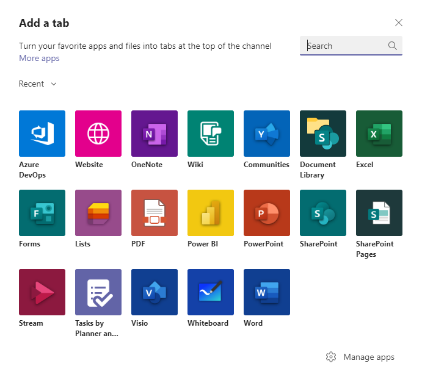

 
# Azure Boards with Microsoft Teams

[!INCLUDE [temp](../includes/version-azure-boards-plus-azure-devops-server-2020.md)]

If you use [Microsoft Teams](https://products.office.com/microsoft-teams/group-chat-software), you can use the [Azure Boards app for Microsoft Teams](https://appsource.microsoft.com/product/office/WA200000644?tab=Overview) to create work items and monitor work item activity in your Azure Boards project from your Teams channel. 

This app enables users to perform the following tasks: 
- Set up and manage subscriptions for creating and updating work items
- Manage other work item events
- Receive and manage notifications for work item events in their Teams channel
- Create work items from conversations in the channel
- Search and share work items with other members in the channel using the messaging extension
- Get previews for work item URLs to initiate discussions and keep the conversations contextual.
 


Read this article to learn how to: 

> [!div class="checklist"]  
> * Add the Azure Boards app to your team in Microsoft Teams
> * Link and unlink your Azure Boards project to the Azure Boards app
> * Set up subscriptions to work item related events in your Teams channel
> * Create work items from your Teams channel
> * Monitor work item activity in your Teams channel  


## Prerequisites

- To create a work item, you must be a contributor to the Azure Boards project. If you don't have a project yet, you can sign up and create a project. For details, see [Start using Azure Boards](../get-started/index.md). 
- To create subscriptions in a Teams channel for work item events, you must be a member of the Azure Boards Project Administrators group or Team Administrators group. To get added, see [Set permissions at the project- or collection-level](../../organizations/security/set-project-collection-level-permissions.md) or [Add Team Administrator](../../organizations/settings/add-team-administrator.md). 
- To receive notifications, the **Third party application access via OAuth** setting must be enabled for the organization. See [Change application access policies for your organization](../../organizations/accounts/change-application-access-policies.md)

> [!NOTE]
> * You can link the Azure Boards app for Microsoft Teams only to a project hosted on Azure DevOps Services at this time.  
> * Notifications are currently not supported inside direct messages.

## Add the Azure Boards app to Microsoft Teams

You add the app to your Teams channel in Microsoft Teams.

1. Visit the App store in Microsoft Teams and search for the Azure Boards app. Upon installing, a welcome message from the app displays as shown in the following image. 

	

2. Use the `@azure boards` handle to interact with the app. A list of commands are provided later in this article, [Command reference](#command-reference).

## Link your Azure Boards project to the Azure Boards app

To use the app, you must first link your Azure Boards project to your Teams channel. 

1. Once the app has been installed in your team, connect and authenticate yourself to Azure Boards. Use **Sign in with different email** if your Microsoft Teams and Azure Boards are in different tenants. 

	
	
	

2. After signing in, use the following command inside a Teams channel to link to the Azure Boards project which you specify with the URL:

	```
	@azure boards link [project url]
	```

	For example:

	```
	@azure boards link https://dev.azure.com/myorg/myproject
	```

Once the project is linked, you can create work items using `@azure boards create` command or use message actions. 

## Set up subscriptions

You can create subscriptions to monitor work items at any time using the `@azure boards subscriptions` command.  

1. Select the desired area path, event that you are interested in, and leverage the associated 
filters to customize what you get notified on in your Teams channel. To help easily set up subscriptions, your recently accessed area paths are shown in the area path dropdown.

	

In case the desired area path doesn't appear in the Area path dropdown menu, follow the instructions mentioned in the next section, [Add area paths](#add-area-paths). Area paths added using the `@azure boards addAreapath` command and area paths for which subscriptions are  created in the channel always appear in the Area path dropdown along with recently accessed area paths.


## Add area paths

You can add areas that your team works on to the channel so that they are always available for creating work items and subscriptions. This is key mainly  for teams with more than 100 area paths in their project. 

- Use the following command to add area paths from your project to the Teams channel.

	```
	@azure boards addAreapath [area path] 
	```

	For example:

	```
	@azure boards addAreapath myproject\fabrikam
	```

	
	
 - If you choose project name as your area path, then you'll receive notifications for all the area paths in the project. It is logically equivalent to choosing 'Any' area path.

## Create a work item with a command

With Azure Boards app you can create work items from your channel. The app supports custom work items as well.

- To create a work item, use `@azure boards create`. 

	


## Create a work item from message actions

Often, discussions in a channel necessitates creation of work items. You can use message actions to create a work item. The selected message is prefilled in the description section of the work item. A link back to the conversation in the channel is stored in the Discussion section of the newly created work item, giving users access to the discussion that led to the creation of the work item.

- To create work items using message actions

	> [!div class="mx-imgBorder"]  
	> 
	
	> 


## Manage subscriptions

1. To view, add and remove subscriptions for a channel, use the `@azure boards subscriptions` command:

	```
	@azure boards subscriptions
	```

This command lists all the current subscriptions for the channel and allows you to add new subscriptions and remove existing ones. As part of adding subscriptions, you can also customize what you get notified on by using various filters.

> [!div class="mx-imgBorder"]  
> 

> [!NOTE]
> Team administrators aren't able to remove or modify subscriptions created by Project administrators.

## Search and share work items using compose extension

To help users search and share work items, the Azure Boards app for Microsoft Teams supports compose extension. You can search for work items by work item ID or by title. For compose extension to work, users must sign in to Azure Boards app either by running `@azure boards signin` command or by signing into the compose extension directly.


## Preview work item URLs

To support collaboration around work items discussed within a channel, the channel displays a preview of work items referenced. When a user pastes the work item URL, a preview is shown similar to that in the following image. This helps to keep work item related conversations relevant and accurate. 


For this feature to work, users must be signed in. Once signed in, this feature works for all channels in a team in Microsoft Teams.

## Unlink a project from a channel

A Teams channel can only link to one Azure Boards project at a time. To link to a different project, you must first unlink the current project using `@azure boards unlink` command. 

Unlinking a project deletes all the subscriptions along with added area paths from the channel. If the channel has no subscriptions, any user can unlink a project. However if a channel has subscriptions, only project admins can unlink a project from a channel.

## Threaded notifications

To logically link a set of related notifications and also to reduce the space occupied by notifications in a channel, notifications are threaded. All notifications linked to a particular work item are linked together.

### Compact view of threaded notifications

> [!div class="mx-imgBorder"]
> 

### Expanded view of threaded notifications
> [!div class="mx-imgBorder"]
> 

## Command reference

The following table lists all the `@azure boards` commands you can use in your Microsoft Teams channel. 

| Command        | Functionality  |
| -------------------- |----------------|
|@azure boards link [project url]	|Link a project to this channel to create work items and receive notifications|
|@azure boards subscriptions	| Add or remove subscriptions for this channel|
|@azure boards create | Create a work item|
|@azure boards addAreapath	[area path]| Add an area path from your project to this channel |
|@azure boards signin	| Sign in to your Azure Boards organization|
|@azure boards signout	| Sign out from your Azure Boards organization|
|@azure boards unlink	| Unlink a project from this channel|
|@azure boards feedback	| Report a problem or suggest a feature |

## Configure Azure DevOps Services tabs in Microsoft Teams

1. To bring your Kanban board or Dashboard into Microsoft Teams, click the '+' ('add new tab') button on the top nav of your team channel. Find the Website icon and add the link to your Azure DevOps board or dashboard. 

   

2. Once you've authenticated you'll see your Kanban board or Dashboard.
   
 ## Multi-tenant support

In your organization if you are using a different email or tenant for Microsoft Teams and Azure DevOps, perform the following steps to sign in and connect based on your use case. 
 
 <table>
  <tr>
   <td>
       <strong>Case</strong>
   </td>
   <td>
        <strong>Email ID and tenant in Microsoft Teams</strong>
   </td>
   <td>
        <strong>Email ID and tenant in Azure DevOps</strong>
   </td>
   <td>
        <strong>Steps to take </strong>
   </td>
  </tr>
  <tr>
   <td>
        1
   </td>
   <td>
        <u>email1@abc.com</u> (tenant 1)
   </td>
   <td>
        <u>email1@abc.com</u> (tenant 1)
   </td>
   <td>
        Sign in using <strong>Sign in</strong> button.
   </td>
  </tr>
  <tr>
   <td>
        2
   </td>
   <td>
        <u>email1@abc.com</u> (tenant 1)
   </td>
   <td>
        <u>email1@abc.com</u> (tenant 2)
   </td>
   <td>
    <ul>
	<li>Sign in the Azure DevOps account</li> 
	<li>In the same browser, start a new tab, navigate to https://teams.microsoft.com</li> 
	<li>Run the <code>signin</code> command and choose the <strong>Sign in</strong> button. </li>
    </ul>
   </td>
  </tr>
  <tr>
   <td>
        3
   </td>
   <td>
        <u>email1@abc.com</u> (tenant 1) 
   </td>
   <td>
        <u>email2@pqr.com</u> (tenant 2) 
   </td>
   <td>
        Sign in using <strong>Sign in with different email address</strong>, in the email id picker use the email2 to sign in to Azure DevOps.
   </td>
  </tr>
  <tr>
   <td>
        4
   </td>
   <td>
        <u>email1@abc.com</u> (tenant 1) 
   </td>
   <td>
        <u>email2@pqr.com</u> (non default tenant 3)
   </td>
   <td>
    This scenario is not supported today
   </td>
  </tr>
</table>

  
 ## Troubleshoot 

If you are experiencing the following errors when using the [Azure Boards App for Microsoft Teams](https://appsource.microsoft.com/product/office/WA200000644?tab=Overview), follow the procedures in this section.

[!INCLUDE [troubleshooting](includes/boards-troubleshoot-authentication.md)]

In the **same browser**, start a new tab, navigate to `https://teams.microsoft.com/`. Run the `@azure boards signout` command and then run the `@azure boards signin` command in the channel where the Azure Boards app for Microsoft Teams is installed. 

Select the `Sign in` button and you'll be redirected to a consent page like the one in the following example. Ensure that the directory shown beside the email is same as what was chosen in the previous step. Accept and complete the sign-in process.

> [!div class="mx-imgBorder"]
> 

If these steps don't resolve your authentication issue, reach out to us at [Developer Community](https://developercommunity.visualstudio.com/spaces/21/index.html).


## Related articles

- [Define area paths and assign to a team](../../organizations/settings/set-area-paths.md)
- [Azure Pipelines with Microsoft Teams](https://aka.ms/AzurePipelinesTeamsIntegration)
- [Azure Repos with Microsoft Teams](https://aka.ms/AzureReposTeamsIntegration)
