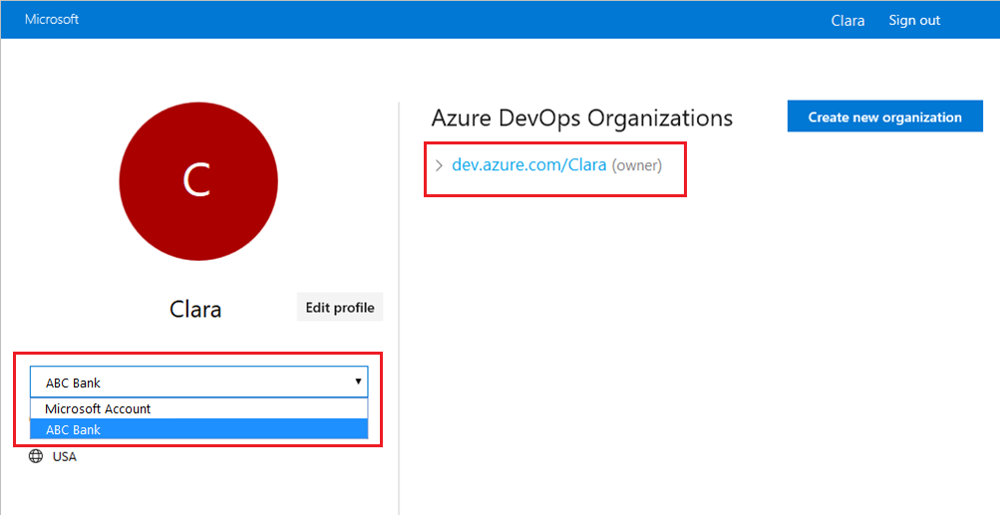
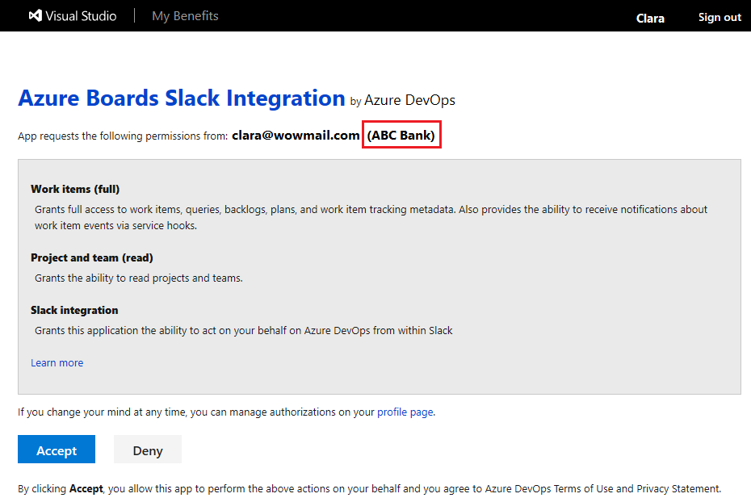

### Configuration failed. Please make sure that the organization '{organization name}' exists and that you have sufficient permissions.

To resolve this authentication issue, complete the following steps:

1. Sign out of Azure DevOps by going to `https://aka.ms/VsSignout` in your browser.

2. Open an **InPrivate** (Microsoft Edge) or **Incognito** (Chrome) browser window.

3. Go to `https://aex.dev.azure.com/me` and sign in with your credentials.

4. Select the correct directory from the dropdown menu under your profile icon. Choose the directory that contains the organization with the project you want to link.

   > [!div class="mx-imgBorder"]
   > 

5. In the **same browser**, start a new tab, go to `https://slack.com`, and sign in to your work space (**use web client**). Run the `/azboards signout` command followed by the `/azboards signin` command. 

6. Select the `Sign in` button and you get redirected to a consent page like the one in the following example. Ensure that the directory shown beside the email is same as what was chosen in the previous step. Accept and complete the sign-in process.

    > [!div class="mx-imgBorder"]
    > 
