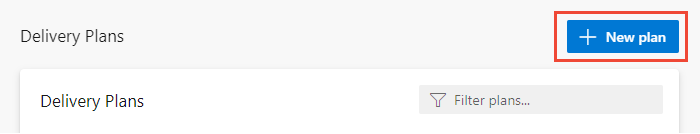
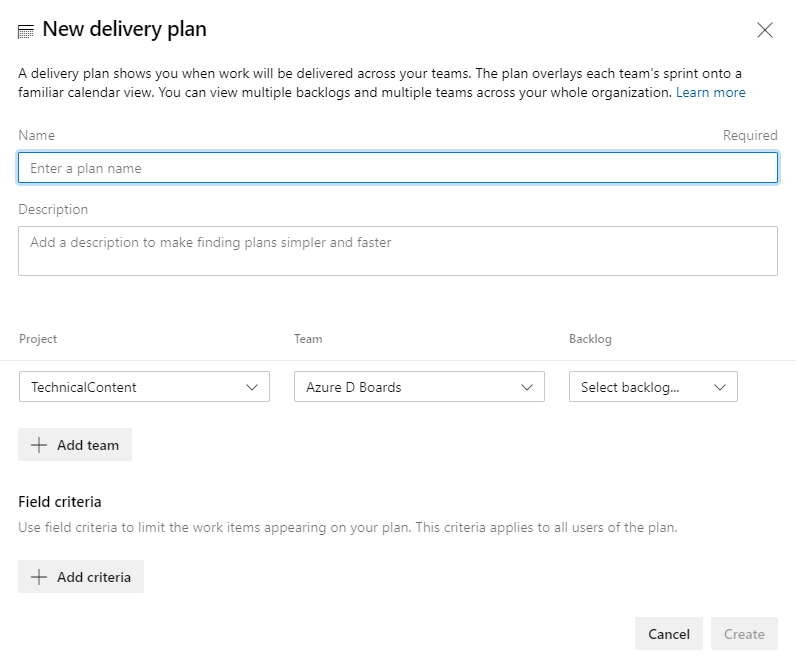

 

# Add or edit a Delivery Plan 

[!INCLUDE [temp](../includes/version-vsts-only.md)]

Delivery Plans provide a highly interactive calendar view of multiple team backlogs. For the use cases, benefits, and interactions you can perform, see [Review team Delivery Plans](review-team-plans.md). 

Use this article to learn how to perform these tasks:

- Open a plan from the list of defined plans 
- Add and edit a plan
- Add field criteria, customize cards, and add markers

> [!NOTE]   
> This article describes how to add or edit Delivery Plans 2.0 which is available for Azure DevOps Services. The next update of Azure DevOps Server, update 2, will support Delivery Plans 2.0.  For information on the Delivery Plans Marketplace extension which supports TFS 2017 and later Azure DevOps Server versions, see [Delivery Plans 1.0](../extensions/delivery-plans.md). 

## Prerequisites

- To add or edit a Delivery Plan, you must be a member of the Contributors group for the project where you add the plan. 
- To add team backlogs to a plan, you must have view permissions to those projects. 
- To view a Delivery Plan, you must be a member of the Project Collection Valid Users group. Users granted **Stakeholder** access for a private project can view plans. Users granted **Stakeholder** access for a public project can add and view plans. 
- To manage permissions for a Delivery Plan or edit or delete a plan, you must be the creator of the plan, a member of the Project Administrators or Project Collection Administrators group, or granted explicit permission through the plan's Security dialog. For details, see [Edit or manage Delivery Plan permissions](edit-delivery-plan-permissions.md).  
 
## Before you define a plan

To add and configure a Delivery Plan, the following elements must be configured:
- [Teams and team backlogs](../../organizations/settings/add-teams.md)
- [Area paths and team area paths assignments](../../organizations/settings/set-area-paths.md)
- [Iteration (sprint) paths and team iterations](../../organizations/settings/set-iteration-paths-sprints.md). Iteration Paths must be assigned Start and End Dates or they won't appear on the plan. Also, Iteration Paths must be selected for the team whose backlogs you select, or work items associated with those Iteration Paths won't appear on the plan.   
- Teams have defined [product backlog items](../backlogs/create-your-backlog.md), or [portfolio backlogs](../backlogs/define-features-epics.md) and assigned those items to either a **Start Date** and **End Date** or an **Iteration Path**.   
- Team Backlog settings have enabled the backlogs to show in the delivery plans. To learn more, see [Select backlog navigation levels for your team](../../organizations/settings/select-backlog-navigation-levels.md).

 
> [!TIP]  
> If you edit a plan and don't see the changes you made appear in the plan, refresh your browser. A browser refresh is needed some times to trigger the updates.   

## Plan customization options
 

Once you open the Plan settings dialog, choose one of the following tabs to set your customization options. 

---
:::row:::
   :::column span="1":::
      **Tab** 
   :::column-end:::
   :::column span="3":::
      **Use to...**
   :::column-end:::
:::row-end:::
---
:::row:::
   :::column span="1":::
      **Overview** 
   :::column-end:::
   :::column span="3":::
      Modify the plan **Name** or **Description** 
   :::column-end:::
:::row-end:::
---
:::row:::
   :::column span="1":::
      **[Teams](#teams)** 
   :::column-end:::
   :::column span="3":::
      Add or remove a team backlog. You can add up to 15 backlog levels. You can add a mix of backlog levels.  
   :::column-end:::
:::row-end:::
---
:::row:::
   :::column span="1":::
      **[Field criteria](#field-criteria)** 
   :::column-end:::
   :::column span="3":::
      Specify field criteria to filter work item types displayed on the plan. All criteria is evaluated as an AND statement.  
   :::column-end:::
:::row-end:::
---
:::row:::
   :::column span="1":::
      **[Markers](#markers)** 
   :::column-end:::
   :::column span="3":::
      Add milestone markers to the plan. Specify a label and select a color.   
   :::column-end:::
:::row-end:::
---
:::row:::
   :::column span="1":::
      **[Fields](#fields)** 
   :::column-end:::
   :::column span="3":::
      Add or remove fields from cards to display on the plan. 
   :::column-end:::
:::row-end:::
---
:::row:::
   :::column span="1":::
      **[Styles](#styles)** 
   :::column-end:::
   :::column span="3":::
      Add styling rules to change card color based on field criteria. 
   :::column-end:::
:::row-end:::
---

<a id="teams" />
## Add a plan  

1. Open **Boards>Delivery Plans**. 

	> [!div class="mx-imgBorder"]  
	>  

1. To add a plan, choose **New Plan**. 

	> [!div class="mx-imgBorder"]  
	>  

	All users have permissions to create a plan and manage the plans they create.   
2. Fill in the form to name, describe, and specify the team backlogs that you want to appear within your plan. You can add up to 15 teams to a plan.   

	> [!div class="mx-imgBorder"]  
	>   

When defining a plan, note the following:  
- Use the name and description field to clearly identify your plan within the project 
- You can choose one or more teams from any project defined in the organization or collection, up to a maximum of ten teams   
- You can choose one or more [active backlogs for a team](../../organizations/settings/select-backlog-navigation-levels.md) 
	> [!NOTE] 
	> If you aren't able to select a backlog level, check the Team Backlog settings to ensure the backlog level is enabled for the team. To learn more, see [Select backlog navigation levels for your team](../../organizations/settings/select-backlog-navigation-levels.md).
- You can reorder the team backlogs by dragging and dropping them into the sequence you want 
-  To filter for specific work items, specify the field criteria. For example, to exclude bugs from the view, add the following criteria: `Work Item Type <> Bug`. 

<a id="field-criteria" />

## Edit a plan 

Once you've defined a plan, you can further customize it. 

1. Choose the **More actions** :::image type="icon" source="../../media/icons/more-actions.png" border="false"::: to open **Plans settings** dialog. 

2. Then, choose the page you want to edit. You can customize the plan in the following ways: 
   - Edit the teams you've selected and their backlog level  
   - Set field criteria to further limit the work items that will appear on the plan 
   - Add markers to show important upcoming events on your timeline 
   - Customize the fields that display on the cards, similar to how you [customize them for your Kanban or taskboard](../../boards/boards/customize-cards.md).  
     > [!NOTE]  
     > You can't add rich-text (HTML) fields, such as the Description field, to a card even if it appears in the list. These field types represent to many challenges to format on a card.  
 
  Here, we add the **Tags** field criteria. Only work items that contain the *RC Review* tag will appear in the Delivery Plan. 

  :::image type="content" source="media/plans/plan-settings-field-criteria.png" border="true" alt-text="Plan settings dialog, Field criteria page":::   

## Choose fields to appear on cards 
 
Show those fields that are useful for your review purposes or if they contain keywords that you may want to use to filter your plan. Unlike the Kanban board, you can't change the field displayed on the card. You must open the work item to make field changes.   

> [!TIP]   
> To add a custom field, you must first [add it to the process used to customize the project](../../organizations/settings/work/add-custom-field.md). 
 
1. From the Plan settings dialog, choose the **Fields** tab. Place a check mark in the check box for those fields you want to have appear on the board. 

1. To add a field, choose the :::image type="icon" source="../media/icons/green_plus_icon.png" border="false"::: plus icon and enter the name of a field  you want to add. 

	Here we select all standard fields and add the **Story Points** and **Priority** fields to display on cards. 

	:::image type="content" source="media/plans/plan-settings-fields.png" alt-text="Plan settings, Fields tab.":::

	> [!TIP]  
	> To show the **Title** of the parent work item, choose the **Parent** field. Choosing the **Parent** title from a card opens the parent work item. To change the parent work item, open the child work item and remove the link and add a different parent work item. You can filter your plan based on parent work items, whether the **Parent** field is added to cards or not. 

1. To remove a field, choose the :::image type="icon" source="../media/icons/trash-can.png" border="false"::: delete icon next to the field.

1. When done with your changes, choose **Save**.

<a id="markers" />

## Add milestone markers

1. To set a marker, open **Markers**, specify a date and specify a hexadecimal color, or simply choose the color palette icon to change to a new color selected by the system.  	

	:::image type="content" source="media/plans/plan-settings-markers.png" border="true" alt-text="Plans settings, Markers tab, two markers defined.":::   

	Markers appear on the plan as shown: 

	:::image type="content" source="media/plans/markers.png" border="true" alt-text="Screenshot of Plans, Markers appear on calendar.":::   

1. When done with your changes, choose **Save**.

<a id="styles" />

## Change card color 

With styling rules, you can cause cards to change color when their corresponding work items meet the field criteria that you set. This feature is similar to the one you can define for Kanban boards as described in [Customize cards](../boards/customize-cards.md). Here we highlight the card based on its **Tags** assignment. 

:::image type="content" source="media/plans/card-tag-style.png" border="true" alt-text="Screenshot of a card with style applied.":::   

1. To change the card color, open the **Styles** tab. You can specify up to 10 styles. There are some limits to the fields you choose.   

	:::image type="content" source="media/plans/plan-settings-styles.png" border="true" alt-text="Plans settings, Styles tab, two styles defined.":::   

1. Choose **+Add styling rule**. Enter a name for the style and choose the color from the color picker. Then specify the field criteria. You can add multiple field values. For style purposes, they are all evaluated as a logical AND. Choose the field and the value for the field. 
 
	For example, here we choose to highlight cards with a **Priority=1**. 

	:::image type="content" source="media/plans/specify-style.png" border="true" alt-text="Plans settings, Styles tab, define a new style.":::   

	> [!NOTE]   
	> Some fields aren't supported for selection, such as the **Title** field, **Description** and other rich-text fields, **Assigned To** and other identity fields. Also, you may be able to select a field but not be able to specify a value or the value you want. For example, you can't specify **Tags** that are *Empty* or *Not Empty*. 

## Programmatically manage Delivery Plans  

You can manage plans using the [REST API, Plans](/rest/api/azure/devops/work/plans/create?view=azure-devops-rest-6.0&preserve-view=true ).

## Related articles  

- [Review team plans](review-team-plans.md)
- [Edit Delivery Plan permissions](edit-delivery-plan-permissions.md)
- [Backlogs, boards, and plans](../backlogs/backlogs-boards-plans.md)  
- [Add teams](../../organizations/settings/add-teams.md)  
- [Portfolio management](portfolio-management.md)  
- [Manage teams and configure team tools](../../organizations/settings/manage-teams.md)  
 