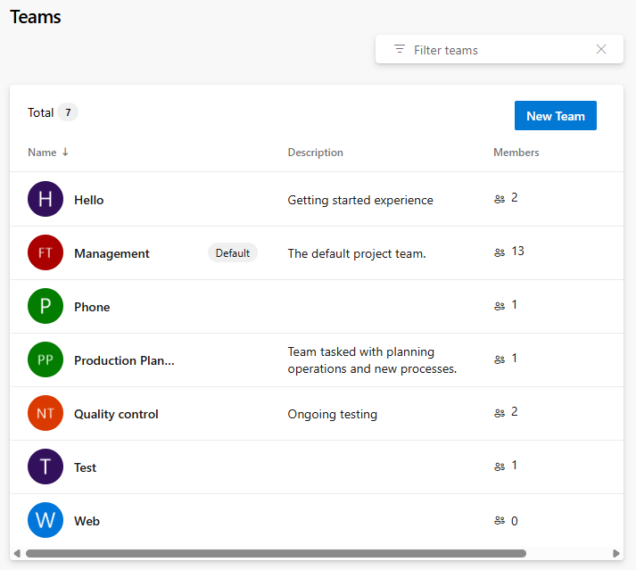
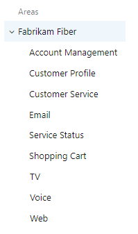
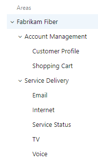
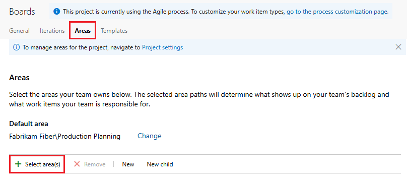
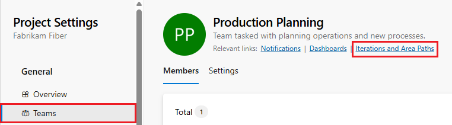
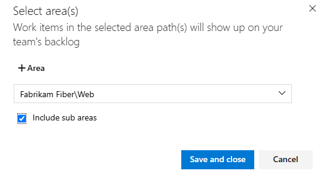
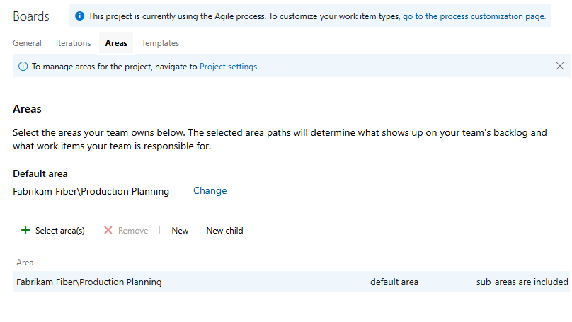
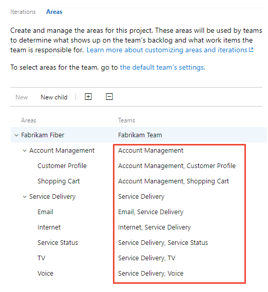

# Configure a hierarchy of teams

[!INCLUDE [version-lt-eq-azure-devops](../../includes/version-lt-eq-azure-devops.md)]

## Introduction

In [Portfolio Management](portfolio-management.md), we explored how management teams and feature teams can use their backlogs to prioritize and focus on the most critical work items. This article delves into configuring teams to optimally support the distinct backlog views tailored for both management and feature teams.

Effective team configuration is essential for ensuring that each team has a clear and focused view of their responsibilities and priorities. By setting up a hierarchical team structure, you can enhance collaboration, streamline workflow management, and ensure alignment with organizational goals. This structure not only facilitates better visibility into each team's workload but also promotes accountability and efficiency across projects.

Specifically, we guide you through the steps to configure a team structure similar to the following example. This setup enables each team to maintain its own customized view of the work, facilitating better focus and productivity.

## Prerequisites 

[!INCLUDE [prerequisites-project-admin](../includes/prerequisites-project-admin.md)]

## Add a team for each management area

The first step is to add a team for each feature team and management area. You can also rename teams that you already added. When you're done, you have a set of teams similar to the ones shown.  

> [!div class="mx-imgBorder"]  
> 

1. From the web portal, choose **Project settings** and open **Teams**. 

  

2. Choose **New team**. Give the team a name, and optionally a description. 

    > [!div class="mx-imgBorder"]
    > 

    Repeat this step for all feature and management teams you want to create. 

## Move area paths into a hierarchical structure

In this step, you want to move the areas paths associated with feature teams from a flat structure to a hierarchical structure. 

| Flat area structure | Hierarchical area structure |
|---------------------|-----------------------------|
| |  |

To move area paths into a hierarchical structure, do the following steps:

1. Select (1) **Project settings**, expand **Work** if needed, and select (2) **Project configuration** > (3) **Areas**.   

    > [!div class="mx-imgBorder"]  
    >    

2. Next, choose the  :::image type="icon" source="../../media/icons/actions-icon.png" border="false"::: actions icon for one of the area paths associated with a feature team and select **Edit**. Then change the **Location** to move it under its corresponding management team area path.  

    For example, here we move the Customer Profile to under Account Management.

    > [!div class="mx-imgBorder"]
    > 

    Repeat this step for all feature team area paths. 

## Include subarea paths for management teams

By including subarea paths for the management teams, you automatically include the backlog items of their feature teams onto the management team's backlog. The default setting for all teams is to exclude subarea paths. 

> [!NOTE]   
> Sub-area paths may break a team's ability to reorder or reparent items on the backlog. Also, it can introduce uncertainties with regards to assignments made to the board Column, Done, and Lane fields. For more information, see [Exercising select features with shared area paths](#op-issues) later in this article. 

To define both areas and iterations do the following steps:

1. Select **Project settings** > **Teams**, and then choose the team whose settings you want to modify. 

   Here we open the Account Management team. 

   > [!div class="mx-imgBorder"]  
   >    

2. Select **Iterations and areas** > **Areas**. 

    > [!div class="mx-imgBorder"]  
    >    

    To switch the team context, use the team selector within the breadcrumbs.

3. Choose **Select area(s)**, and select the area path for **Account Management** and check the **Include sub areas** checkbox. 

    > [!div class="mx-imgBorder"]  
    >    

    Verify that only this area path is selected for the team and is the default area path. Remove any other previously selected area paths.  

    > [!div class="mx-imgBorder"]  
    >    

    Repeat this step for all your management areas. If you want to enable rollup across all feature teams and management areas to the top-level area, repeat this step for the default team. In our example that corresponds to Fabrikam Fiber.

## Define a single sprint cadence for all teams 

If your feature teams use Scrum or use sprints to assign their work, set up a series of sprints that all teams can use. By default, you see a set of predefined sprints. Add more sprints and set their sprint dates from **Project Settings** as described in [Add iterations and set iteration dates](../../organizations/settings/set-iteration-paths-sprints.md). You can rename and edit the default sprints as needed.

> [!NOTE]
> While maintaining a single sprint cadence simplifies project administration, you can create different cadences as needed. For example, some teams may follow a monthly cadence while others follow a 3-week cadence. Simply define a node under the top project node for each cadence, and then define the sprints under those nodes. For example: 
> - Fabrikam Fiber/CY2019
> - Fabrikam Fiber/3Week Sprints
> 
> Here we define the start and end dates of the first 6 sprints corresponding to a 3-week cadence. 

> [!div class="mx-imgBorder"]  
>    

## Configure other team settings 

For teams to be well defined, add team administrators and have them verify or configure other team settings. For more information, see [Manage and configure team tools](../../organizations/settings/manage-teams.md). 

## Review area paths assigned to teams

From **Project Settings>Project configuration>Areas**, you can review which **Area Paths** are assigned to which teams. To modify the assignments, choose the team and change the team's area path assignments. 

> [!div class="mx-imgBorder"]  
>    

## Exercising select features with shared area paths 

When you share area paths across two or more teams, understand how Azure Boards manages conflicts that can arise when exercising these features: 
- Reordering or reparenting work items on a backlog or board
- Updates made to  **Board column**, **Board column done**, and **Board Lane** fields when dragging items to a different column 

### Reordering and reparenting work items 

All backlogs and boards support drag-and-drop functionality for reordering and reparenting work items. Changes made in one team's backlogs and boards are automatically reflected in other team backlogs and boards that share the same area path. You might need to refresh the page to see these updates.

Drag-and-drop can only be used to reorder or reparent work items that are assigned to area paths selected for your team. When the **Parents** view option is enabled, work items that your team doesn't own might appear in your backlog. Any work item marked with the :::image type="icon" source="../../media/icons/info.png" border="false"::: information icon can't be reordered or reparented, as another team owns it.
 
:::image type="content" source="media/config-teams/information-message-owned-by-other-team.png" alt-text="Screenshot of information message on team ownership.":::

### Board column updates  

Because each team can customize their board columns and swimlanes, the values assigned to board fields might differ when another team updates a work item from a different board. Even if the management team and the feature teams configure their [Feature board columns](../boards/add-columns.md) with identical workflow mappings, updates made to work items on one team's board don't automatically reflect on another team's board. The card column updates consistently across all boards only when a work item moves to a column that maps to a workflow state.

By design, the team with the longest area path takes precedence in resolving conflicts and determines the values for the **Board Column**, **Board Column Done**, and **Board Lane** fields. If two or more teams share area paths of equal depth, the results are nondeterministic.

To address this, the primary workaround is to maintain single ownership of work items by [defining area paths and assigning them to a specific team](../../organizations/settings/set-area-paths.md). Alternatively, you can add custom workflow states that all teams can use uniformly. For more details, refer to [Customize the workflow (Inheritance process)](../../organizations/settings/work/customize-process-workflow.md).

## Next steps
> [!div class="nextstepaction"]
> [Review team Delivery Plans](review-team-plans.md)

## Related articles

- [Create your backlog](../backlogs/create-your-backlog.md)  
- [Create a board](../boards/kanban-quickstart.md)
- [Organize your backlog](../backlogs/organize-backlog.md)  
- [Work with multi-team ownership of backlog items](../backlogs/backlogs-overview.md#multi-team)
- [Fix display, reordering, and nesting issues](../backlogs/resolve-backlog-reorder-issues.md)
 
