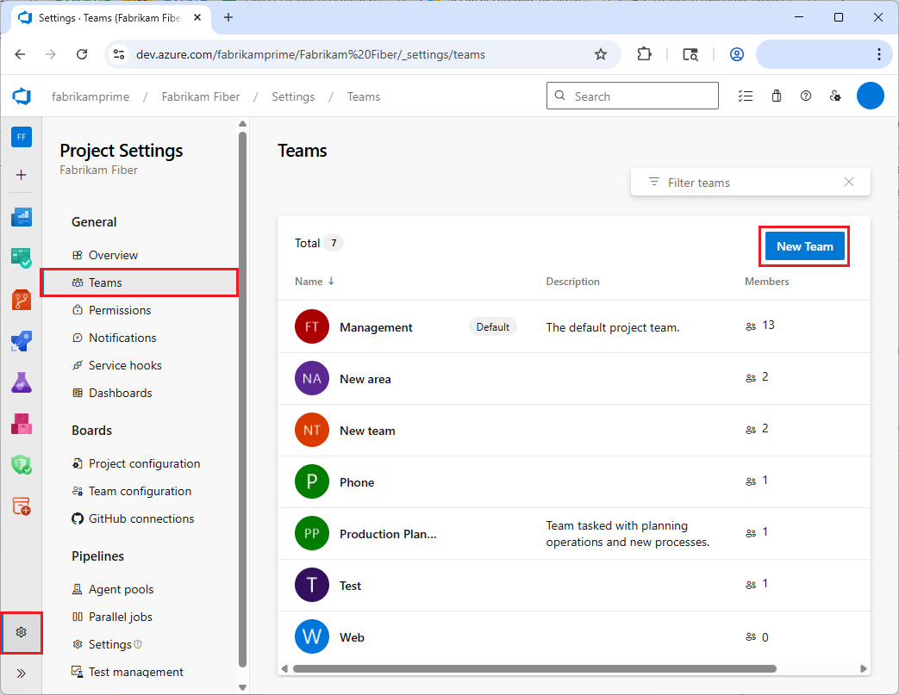
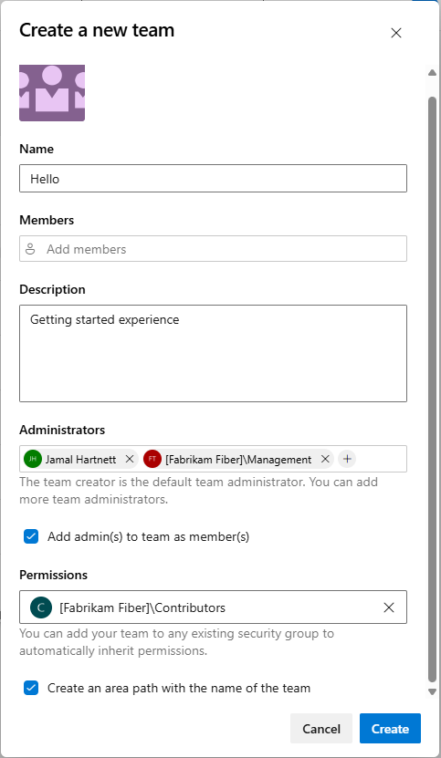
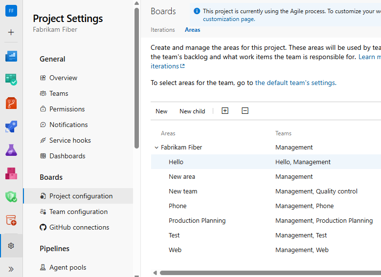
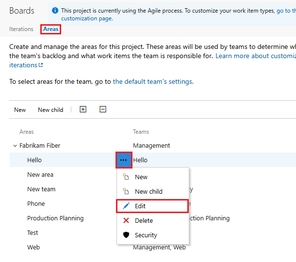
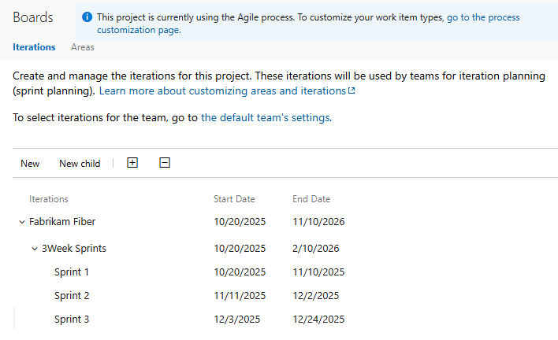

# Configure a hierarchy of teams

[!INCLUDE [version-lt-eq-azure-devops](../../includes/version-lt-eq-azure-devops.md)]

This article explains how to configure a hierarchy of teams that supports tailored backlog views for management and feature teams. By using customized backlog views, each team can prioritize and manage their own work based on their specific goals and responsibilities. A hierarchical team structure ensures that your organization remains agile, focused, and aligned with its strategic objectives.

A hierarchical team structure:

- Enhances collaboration, communication, and teamwork across different functions.
- Streamlines workflow management to simplify processes and reduce bottlenecks.
- Supports accountability, efficiency, and productivity across projects by increasing visibility into each team's workload.
- Aligns with organizational goals, ensuring that all teams work towards common objectives.

Effective team configuration gives each team a clear and focused view of its responsibilities and priorities. Customized backlogs give management and feature teams improved visibility and clear insights into their owb workloads and progress. Teams can concentrate on the most critical tasks without getting overwhelmed by unrelated work items. Streamlined processes lead to faster decision-making and project execution. For more information about how management teams and feature teams can use their backlogs to prioritize and focus on their most critical work items, see [Manage product and portfolio backlogs](portfolio-management.md).

## Prerequisites 

[!INCLUDE [prerequisites-project-admin](../includes/prerequisites-project-admin.md)]

## Add a team for each management area

To start setting up a hierarchical team structure, add a team for each feature team and management area, or rename teams that already exist. To add a team:

1. In your Azure DevOps project, select **Project settings** > **Teams** from the left navigation menu, and then select **New Team**.

   

1. On the **Create a new team** form, give the team a name, optionally add a description, members, and administrators, and then select **Create**. 

   

Select **New Team** for each team you want to add. You can also rename existing teams. Select the team in the **Teams** list, select the **Settings** tab, enter a new name under **Team Details** > **Team name**, and select **Save**.

The final team list looks similar to the following example.

>[!NOTE]
>For teams to be well defined, add other team administrators to verify or configure other team settings. For more information, see [Manage and configure team tools](../../organizations/settings/manage-teams.md).

## Move area paths into a hierarchical structure

Next, move the areas paths associated with feature teams into a hierarchical structure. The following example shows a flat list of area paths moved into a hierarchical area structure.

| Flat area structure | Hierarchical area structure |
|---------------------|-----------------------------|
| |  |

1. In **Project Settings**, select **Boards** > **Project configuration** and then select the **Areas** tab.

1. Select the **More actions** icon next to one of the area paths associated with a feature team and select **Edit**.

1. On the **Edit area** screen under **Location**, select a management team area path, and then select **Save and close**.

Repeat this step for all feature team area paths. You can review which **Area Paths** are assigned to which teams and change the assignments from **Project Settings** > **Project configuration** > **Areas**.

## Include subarea paths for management teams

The default setting for all team backlogs is to exclude subarea paths. For management teams, you can include subarea paths so backlog items from feature teams are automatically included in the management team backlogs.

> [!NOTE]
> Subarea paths might hinder a team's ability to reorder or reparent items on their backlog. Subarea paths can also introduce uncertainties in assignments in the backlog's **Column**, **Done**, and **Lane** fields. For more information, see [Exercise select features with shared area paths](#op-issues).

To define area paths:

1. In **Project settings** > **Teams**, select the management team whose settings you want to modify.

      

1. On the team's page, select **Iterations and Area Paths**.

      

1. On the **Boards** page, select the **Areas** tab, and then select **Select area(s)**.

1. On the **Select area(s)** screen, select the area path for the team name you want to include, select the **Include sub areas** checkbox, and then select **Save and close**.

      

1. On the **Areas** page, verify that only this area path is selected for the team and is the default area path. Remove any other area paths.

      

Repeat this step for all your management teams. To switch teams, use the team selector in the breadcrumb navigation at the top of the screen.

If you want to enable rollup across all feature teams and management areas to the top-level area, repeat this step for the default team.

## Define a single sprint cadence for all teams 

If your feature teams use Scrum or use sprints to assign work, set up a series of sprints for all teams to use. On the **Project Settings** > **Boards** > **Project configuration** page, you see a set of predefined sprints by default. You can add more sprints and set their dates from **Project Settings** as described in [Add iterations and set iteration dates](../../organizations/settings/set-iteration-paths-sprints.md). You can also rename and edit the default sprints as needed.

Maintaining a single sprint cadence simplifies project administration, but you can create different cadences as needed. For example, some teams may follow a monthly cadence while others follow a 3-week cadence.

You can define a node under the top project node for each cadence, for example **Fabrikam Fiber/CY2025** and **Fabrikam Fiber/3Week Sprints**, and then define the sprints under those nodes. The following example defines the start and end dates for the first three sprints corresponding to a 3-week cadence.

> 

## Understand issues with shared area paths

When you share area paths across two or more teams, conflicts can arise when:

- Reordering or reparenting work items on a backlog or board.
- Making updates to  **Board column**, **Board column done**, and **Board Lane** fields when dragging items to different columns.

### Work item reordering and reparenting

Backlogs and boards support drag-and-drop functionality for reordering and reparenting work items. Changes made in one team's backlogs and boards are automatically reflected in other team backlogs and boards that share the same area path. You might need to refresh the page to see these updates.

You can use drag-and-drop to reorder or reparent only work items that are assigned to your team's area paths. When the **Parents** view option is enabled, work items your team doesn't own might appear in your backlog. An information icon next to these items indicates that the item can't be reordered or reparented because another team owns it.
 
:::image type="content" source="media/config-teams/information-message-owned-by-other-team.png" alt-text="Screenshot of information message on team ownership.":::

### Board column updates

Because each team can customize their board columns and swimlanes, the values assigned to board fields might differ when a team updates a work item from a different board. Even if the management team and the feature teams configure their [board columns](../boards/add-columns.md) with identical workflow mappings, updates to work items on one team's board don't automatically reflect on another team's board. The card column updates consistently across all boards only when a work item moves to a column that maps to a workflow state.

By design, the team with the longest area path takes precedence in resolving conflicts and determines the values for the **Board Column**, **Board Column Done**, and **Board Lane** fields. If two or more teams share area paths of equal depth, the results are nondeterministic.

The main workaround is to maintain single ownership of work items by [defining area paths and assigning them to a specific team](../../organizations/settings/set-area-paths.md). Alternatively, you can add custom workflow states that all teams can use uniformly. For more information, see [Customize the workflow (Inheritance process)](../../organizations/settings/work/customize-process-workflow.md).

## Next step
> [!div class="nextstepaction"]
> [Review team delivery plans](review-team-plans.md)

## Related content

- [Create and manage your backlog](../backlogs/create-your-backlog.md)  
- [Use backlogs to manage projects](../backlogs/backlogs-overview.md)
- [Organize your backlog and map child work items to parents](../backlogs/organize-backlog.md)  
- [Use your board](../boards/kanban-quickstart.md)
- [Troubleshoot reordering and nesting issues](../backlogs/resolve-backlog-reorder-issues.md)
 
