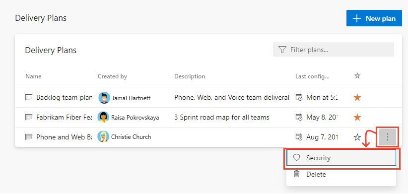
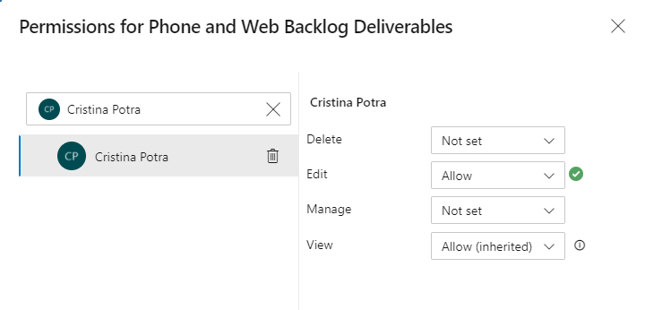

# Edit or manage Delivery Plan permissions 

[!INCLUDE [temp](../includes/version-vsts-tfs-2017-on.md)]

You can control who has access to a Delivery Plan by setting it's permissions. You can grant or restrict access to users and groups to delete, edit, view, or  manage permissions of delivery plans. 

::: moniker range="azure-devops"
By default all members of an organization or project collection can view Delivery Plans, including users with Stakeholder access for private projects. The plan creator, as well as project and collection administrators, can edit or delete a plan, or change the plan's permissions. To learn more about Delivery Plans, see [Review team delivery plans](review-team-plans.md).  
::: moniker-end  

::: moniker range=">= tfs-2017 <= azure-devops-2020"
By default all members of an organization or project collection can view Delivery Plans, except users with Stakeholder access for private projects. The plan creator, as well as project and collection administrators, can edit or delete a plan, or change the plan's permissions. To learn more about Delivery Plans, see [Delivery Plans 1.0](../extensions/delivery-plans.md).  
::: moniker-end  

::: moniker range="tfs-2017"
> [!NOTE]  
> **Feature availability**: Delivery plans are available for TFS 2017.2 and later versions, you can access plans by installing the [Delivery Plans Marketplace extension](https://marketplace.visualstudio.com/items?itemName=ms.vss-plans).
::: moniker-end  

## Prerequisites

- In order to edit the permissions for a Delivery Plan, you must be the creator of the plan, a member of the Project Administrators or Project Collection Administrators group, or granted explicit permission through the plan's **Security** dialog. 
 
## Edit permissions for a Delivery Plan

::: moniker range="azure-devops"

1. Open **Boards>Delivery Plans**. 

	> [!div class="mx-imgBorder"]  
	>  

1. To grant permissions to a group or user to manage or edit a specific plan, choose  :::image type="icon" source="../../media/icons/more-actions.png" border="false"::: **More options** to open the **Security** dialog for the plan.  

	> [!div class="mx-imgBorder"]  
	>   
2. Add a user, team group, or other security group who you want to grant permissions to or restrict access. For details, see [Set permissions at the project- or collection-level](../../organizations/security/set-project-collection-level-permissions.md). By default, non-administrators can't delete or edit a plan. 

3. With the user or group selected, set the permission you want them to have to **Allow**. **Manage** set to **Allow** enables the user to manage permissions for the plan.

	For example, here we grant permission to Cristina to edit the plan.

	> [!div class="mx-imgBorder"]  
	> 

4. When done, close the dialog. The changes are automatically saved.  

::: moniker-end 

::: moniker range="azure-devops-2019 || azure-devops-2020"

1. Open **Boards>Plans**. For details, see [Review team delivery plans](../extensions/delivery-plans.md).  

1. To grant permissions to a group or user to manage or edit a specific plan, choose the  :::image type="icon" source="../../media/icons/actions-icon.png" border="false"::: actions icon to open the **Security** dialog for the plan.  

	> [!div class="mx-imgBorder"]  
	>      

2. Add a user, team group, or other security group who you want to grant permissions to or restrict access. For details, see [Set permissions at the project- or collection-level](../../organizations/security/set-project-collection-level-permissions.md). By default, non-administrators can't delete or edit a plan. 

3. With the user or group selected, set the permission you want them to have to **Allow**. **Manage** set to **Allow** enables the user to manage permissions for the plan.

	For example, here we grant permission to Raisa to edit the plan.

	> [!div class="mx-imgBorder"]  
	> 

4. Choose **Save changes** when done. 

::: moniker-end 

::: moniker range=">= tfs-2017 <= tfs-2018"  

1. Open **Work>Plans**. For details, see [Review team delivery plans](../../boards/plans/review-team-plans.md).  

1. To grant permissions to a group or user to manage or edit a specific plan, choose the  :::image type="icon" source="../../media/icons/actions-icon.png" border="false"::: actions icon to open the **Security** dialog for the plan.  

	> [!div class="mx-imgBorder"]  
	>      

2. Add a user, team group, or other security group who you want to grant permissions to or restrict access. (For details, see [Set permissions at the project- or collection-level](../../organizations/security/set-project-collection-level-permissions.md)). By default, non-administrators can't delete or edit a plan. 

3. With the user or group selected, set the permission you want them to have to **Allow**. 

	For example, here we grant permission to Raisa to edit the plan.

	> [!div class="mx-imgBorder"]  
	> 

4. Choose **Save changes** when done. 

::: moniker-end  

## Related articles

- [Review team delivery plans](review-team-plans.md)  
- [About permissions and inheritance](../../organizations/security/about-permissions.md)
- [Stakeholder access quick reference](../../organizations/security/stakeholder-access.md)

