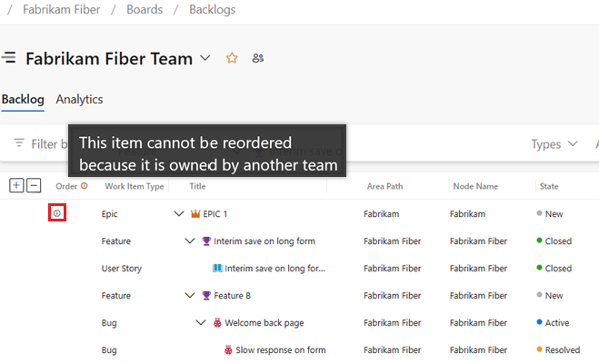

# Manage your product and portfolio backlogs 

[!INCLUDE [version-lt-eq-azure-devops](../../includes/version-lt-eq-azure-devops.md)]

Portfolio backlogs give product owners insight into the work of multiple agile feature teams. Product owners define high-level goals as Epics or Features, which feature teams break down into user stories to prioritize and develop.

[!INCLUDE configure-customize]

Setting up a team structure like the one shown provides each feature team with a distinct backlog to plan, prioritize, and track their work. Portfolio or product owners can create their vision, roadmap, and goals for each release, monitor progress across projects, and manage risks and dependencies.

To support the following elements, [set up a hierarchical team and backlog structure](configure-hierarchical-teams.md):

- **Organize and manage backlogs:** Enable autonomous feature teams to organize and manage their own backlogs.
- **Plan and monitor:** Use portfolio management views to plan epics and features and monitor the progress of feature teams.
- **Assign backlog items:** Assign backlog items to feature teams from a common backlog.

[!INCLUDE [image differences](../includes/image-differences.md)]

## Manage view of team progress 

In the following example, we show the **Epics** portfolio backlog for the **Management** team. Drilling down, you see all the backlog items and features, even though they belong to one of three different teams: Customer Service, Phone, and Web.

> [!div class="mx-imgBorder"]  
>    

> [!IMPORTANT]
> You can establish child links with work items from different projects. But, if the processes differ between projects, the hierarchy isn't visible on the backlog for those child items in separate projects. You can still view all associated child items directly on the work item form.

## Visualize team backlog ownership and progress 

Each team has its own home page or dashboards, product and portfolio backlogs, boards, and Taskboards. These pages show work relevant only to each team, based on assignments made to the work item area and iteration paths. For more information, see [About teams and Agile tools](../../organizations/settings/about-teams-and-settings.md).

To visualize ownership and progress involving other teams, do the following tasks:

- **Show parent items:** [Configure your backlog to show parent epics or features owned by other teams](../backlogs/backlogs-overview.md).
- **Use queries:** [Create queries to include work items from other teams](../work-items/move-work-items.md). Add these queries to your team’s dashboard for better visibility.
- **Utilize Plans:** Use the ["Plans" feature](review-team-plans.md) in Azure Boards, which gives you cross-team visibility into work items across multiple teams. This action lets you see all backlog items and features, even if they belong to different teams.

> [!TIP]
> Add **Node Name** to the **Column Options** to show the team name assigned to each work item. 

For example, the Fabrikam Fiber Team's backlog view includes work items assigned to their area path, **Fabrikam Fiber**, and the parent Epic, which is assigned to the **Fabrikam** team. Items owned by other teams appear with an information icon, :::image type="icon" source="../../media/icons/info.png" border="false":::. Hover over the information icon for the Epic to see more details.

> [!div class="mx-imgBorder"]  
>    

## Assign work from a common backlog

The hierarchical team and backlog structure enables autonomous teams to take ownership of their backlogs and allows for assigning work to teams from a common backlog. During sprint or product planning meetings, product owners and development leads can review the backlog. Teams can then assign specific items to various teams by setting the feature team Area Path.

In the following view of the Account Management backlog, all items still assigned to **Account Management** have yet to be assigned to specific teams.

> [!div class="mx-imgBorder"]  
>  

During the planning meeting, open each item, make notes, and assign it to the appropriate team for action. 

> [!TIP]
> Select multiple work items and perform a bulk edit of the area path. For more information, see [Bulk modify work items](../backlogs/bulk-modify-work-items.md).    

In the following example, all backlog items were assigned to feature teams while all features and epics remain owned by Account Management. 

> [!div class="mx-imgBorder"]  
>  

## Add portfolio backlogs 

If you need more than three backlog levels, add more. For more information, see [Customize your backlogs or boards for a process](../../organizations/settings/work/customize-process-backlogs-boards.md).

## Track dependencies across teams 

The simplest way to track dependencies across teams is to link work items using the **Related** link type. For time-based dependencies, use the **Predecessor/Successor** link types. You can then create queries to find work items with these relationships. For more information, see [Link work items to other objects](../backlogs/add-link.md).
 
::: moniker range="azure-devops"
Using Delivery Plans, you can track dependencies across projects within an organization. For more information, see [Track dependencies using Delivery Plans](../plans/track-dependencies.md). 
::: moniker-end

## View portfolio feature progress

::: moniker range=">= azure-devops-2022"

To view feature progress based on linked requirements, add a rollup column or view a delivery plan. For more information, see [Display rollup](../backlogs/display-rollup.md) and [Review delivery plans](review-team-plans.md). 

::: moniker-end

::: moniker range="< azure-devops-2022"

To view feature progress based on linked requirements, use the Feature Timeline. For more information, see [View portfolio progress with the Feature Timeline](/previous-versions/azure/devops/all/extensions/feature-timeline). 

::: moniker-end

## Next steps

> [!div class="nextstepaction"]
> [Configure a hierarchy of teams](configure-hierarchical-teams.md)

## Related articles
 
- [Create your backlog](../backlogs/create-your-backlog.md)
- [Get started with Kanban](../boards/kanban-quickstart.md)
- [Assign work to sprints](../sprints/assign-work-sprint.md)
- [Organize your backlog](../backlogs/organize-backlog.md)
- [Understand limitations of multi-team board views](../boards/kanban-overview.md)
 