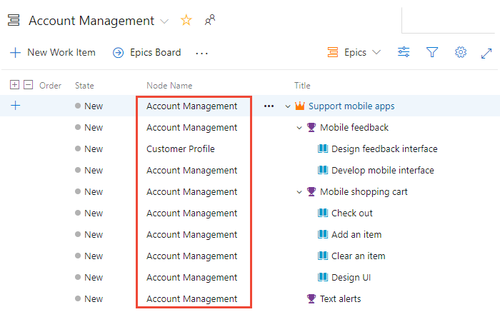

# Portfolio management 

[!INCLUDE [temp](../_shared/version-vsts-tfs-all-versions.md)]

Portfolio backlogs provide product owners insight into the work performed by several agile feature teams. Product owners can define the high-level goals as Epics or Features, and feature teams can break these down into the user stories they'll prioritize and develop.  

In this article you'll learn:  

>[!div class="checklist"]    
> * How to support a management view of multiple team progress
> * How feature teams can focus on their team backlog progress  
> * How to assign work from a common backlog
> * How to set up a hierarchical set of teams and backlogs

By setting up a team structure like the one shown, you provide each feature team with their distinct backlog to plan, prioritize, and track their work. And, portfolio or product owners can  create their vision, roadmap, and goals for each release, monitor progress across their portfolio of projects, and manage risks and dependencies.  

 

[Set up a hierarchical team and backlog structure](configure-hierarchical-teams.md) when you want to support the following elements:

- Autonomous feature teams that can organize and manage their backlog of work
- Portfolio management views for planning epics and features and monitoring progress of subordinate feature teams
- Assign backlog items to feature teams from a common backlog 

[!INCLUDE [image differences](../_shared/image-differences.md)]

## Management view of team progress 

In this example, we show the **Epics** portfolio backlog for the **Management** team. Drilling down, you can see all the backlog items and features, even though they belong to one of three different teams: Customer Service, Phone, and Web.  

::: moniker range=">= azure-devops-2019"

> [!div class="mx-imgBorder"]  
>    

::: moniker-end

::: moniker range=">= tfs-2017 <= tfs-2018"

In this example, we show the **Epics** portfolio backlog for the **Management** team. Drilling down, you can see all the backlog items and features, even though they belong to one of three different teams: Customer Service, Phone, and Web.   

> [!div class="mx-imgBorder"]  
> 

::: moniker-end

::: moniker range=">= tfs-2013 <= tfs-2015"

The Fabrikam Account Management portfolio owner has several campaigns to initiate and deliver in the coming year. He creates an epic for each campaign and then breaks each epic down into various features that contribute to each campaign. 

With the hierarchical structure implemented, portfolio owners working in Account Management can view the epic, feature, and product backlogs for their area. 

 

All work items under the Fabrikam/Account Management area path appear in their backlog view. You can expand a single item or use the expand  and collapse  icons to expand or collapse one level of the hierarchy. 

::: moniker-end

::: moniker range=">= tfs-2017 <= tfs-2018"

> [!TIP]    
> Program managers can also gain insight into progress across teams using [Delivery plans](review-team-plans.md). See also [Visibility across teams](visibility-across-teams.md).  

::: moniker-end

## Feature team backlog ownership and view of progress 

Each feature team has its own team home page or dashboards, product and portfolio backlogs, Kanban boards, and taskboards. These pages only show work relevant to each team, based on assignments made to the work item area and iteration paths. For details, see [About teams and Agile tools](../../organizations/settings/about-teams-and-settings.md).

> [!TIP]
> Add **Node Name** to the column options to show the team assigned to the work item.   

::: moniker range=">= azure-devops-2019"

The Customer Service feature team's view of the backlog only includes those work items assigned to their area path, **Fabrikam Fiber/Customer Service**. Here we show parents which provide a few of the features and epics to which the backlog items belong. Items that are owned by other teams appear with hollow-filled bars. For example, Mobile feedback and Text alerts belong to the Account Management team. 

Items that are owned by other teams appear with an information icon, .

> [!div class="mx-imgBorder"]  
>    

::: moniker-end

::: moniker range=">= tfs-2017 <= tfs-2018"

Items that are owned by other teams appear with an information icon, . 

> [!div class="mx-imgBorder"]  
>    

::: moniker-end

::: moniker range="tfs-2017"

Backlog displays with work item icons is supported for TFS 2017.2 and later versions. For TFS 2017.1 and earlier versions, items that are owned by other teams appear with hollow-filled bars.  

 

::: moniker-end

::: moniker range="<= tfs-2015"

The Customer Profile feature team's view of the backlog only includes those work items assigned to their area path, **Fabrikam/Account Management/Customer Profile**. Here we show parents which provides a few of the features and epics to which the backlog items belong. Items that are owned by other teams appear with hollow-filled bars. For example, Mobile feedback and Text alerts belong to the Account Management team.   

 

::: moniker-end

 
## Assign work from a common backlog
While the hierarchical team and backlog structure works well to support autonomous teams to take ownership of their backlog, it also supports assigning work to teams from a common backlog. During a sprint or product planning meeting, product owners and development leads can review the backlog and assign select items to various teams, by assigning them to the feature team Area Path. 

In this view of the Account Management backlog, all items still assigned to **Account Management** have yet to be assigned.

::: moniker range=">= azure-devops-2019" 

> [!div class="mx-imgBorder"]  
>  

During the planning meeting, you can open each item, make notes, and assign the item to the team to work on it. 

> [!TIP]
> You can multi-select work items and perform a bulk edit of the area path. See [Bulk modify work items](../backlogs/bulk-modify-work-items.md).    

Here, all backlog items have been assigned to feature teams. While all features and epics remain owned by Account Management. 

> [!div class="mx-imgBorder"]  
>  

::: moniker-end

::: moniker range=">= tfs-2017 <= tfs-2018"

In this view of the Account Management backlog, all items still assigned to **Account Management** have yet to be assigned.

> [!div class="mx-imgBorder"]  
>  

During the planning meeting, you can open each item, make notes, and assign the item to the team to work on it. 

> [!TIP]    
> You can multi-select work items and perform a bulk edit of the area path. See [Bulk modify work items](../backlogs/bulk-modify-work-items.md).    

Here, all backlog items have been assigned to feature teams. While all features and epics remain owned by Account Management. 

> [!div class="mx-imgBorder"]  
>  

::: moniker-end

::: moniker range="<= tfs-2015"

In this view of the Account Management backlog, all items still assigned to **Account Management** have yet to be assigned.

 

During the planning meeting, you can open each item, make notes, and assign the item to the team to work on it. 

Here, all backlog items have been assigned to feature teams. While all features and epics remain owned by Account Management. 

::: moniker-end

## Add portfolio backlogs 

::: moniker range=">= azure-devops-2019"

If you need more than three backlog levels, you can add more. To learn how, see [Customize your backlogs or boards for a process](../../organizations/settings/work/customize-process-backlogs-boards.md). 

::: moniker-end
 
::: moniker range="<= tfs-2018"

If you need more than three backlog levels, you can add more. To learn how, see [Add portfolio backlogs](../../reference/add-portfolio-backlogs.md).

::: moniker-end

## Track dependencies across teams 

The simplest way to track dependencies across teams is to link work items using the **Related** link type. You can then create queries that find work items containing these relationships. 

See [Manage dependencies, link work items to support traceability](../queries/link-work-items-support-traceability.md) to learn more.

## Try this next
> [!div class="nextstepaction"]
> [Configure a hierarchy of teams](configure-hierarchical-teams.md)

## Related articles
 
- [Create your backlog](../backlogs/create-your-backlog.md)  
- [Kanban quickstart](../boards/kanban-quickstart.md)
- [Assign work to sprints](../sprints/assign-work-sprint.md)
- [Organize your backlog](../backlogs/organize-backlog.md)
- [Limitations of multi-team Kanban board views](../boards/kanban-overview.md#limits-multi-team)

 