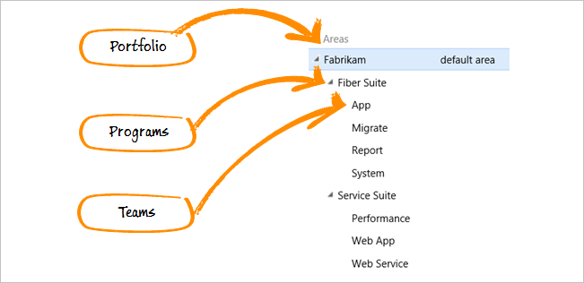
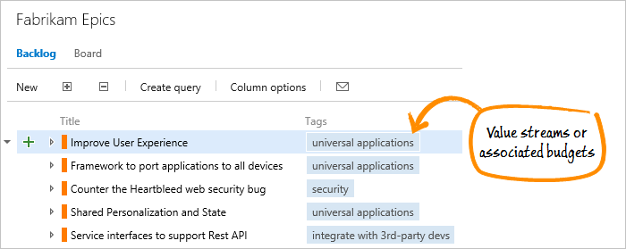
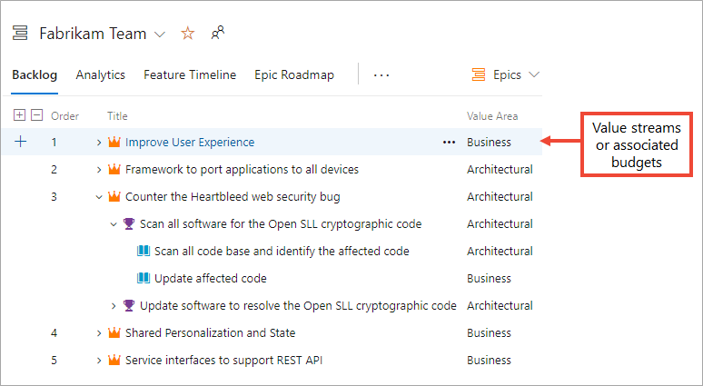

# How SAFe&reg; concepts map to Azure Boards artifacts 

[!INCLUDE [temp](../includes/version-vsts-tfs-all-versions.md)]

<!--- Intro To be provided --> 

If you're interested in using SAFe, you can configure projects created with the [Scrum](../work-items/guidance/scrum-process.md), [Agile](../work-items/guidance/agile-process.md), or [CMMI](../work-items/guidance/cmmi-process.md) processes to track SAFe criteria. Moreover, just as Azure Boards supports Scrum and Agile practices, it can support SAFe and large numbers of teams to work together on epics that span releases. 

This article illustrates how the following SAFe artifacts map to specific Azure Boards artifacts. 

>[!div class="checklist"]  
> * SAFe® roles and a team hierarchical structure  
> * SAFe® Agile, program, and portfolio teams  
> * SAFe® deliverables such as epics, features, and stories  
> * SAFe® Product, program, and portfolio views  
> * SAFe® Release trains, sprints, and other timeboxes  
> * SAFe® Iteration goals and objectives 
> * SAFe® Value streams and budgets  
> * SAFe® Portfolio Vision and Strategic Themes
> * SAFe® Roadmaps
> * SAFe® Milestones and events
> * SAFe® Retrospectives and reviews

The following image illustrates how you can configure Azure Boards to support a three-level team hierarchy and map teams to their respective area and iteration paths. The examples build from the [Agile process](../work-items/guidance/agile-process.md), However, the changes can be applied to any project and process hosted on Azure Boards.

  

Examples provided below illustrate how to configure a three-level team hierarchy and map teams to their respective area and iteration paths. The examples build from the [Agile process](../work-items/guidance/agile-process.md), However, the changes can be applied to any project hosted on Azure Boards or an on-premises TFS.

<a id="roles" />

## SAFe® roles  

Scrum Master, Product Owner, Release Train Engineer, Product Manager, Functional Manager, Business Owner, Epic Owners 

SAFe&reg; roles of Product Owner, Business Owners, Dev Team map to Azure Boards team structure 

SAFe&reg; roles of Product Owner, Business Owners, Dev Team map to Azure Boards team structure 

What are the Azure Board tools they use, when, how
<!--- To be provided --> 

<a id="teams" />
 
## Agile teams, program and portfolio teams 

Because your Agile tools support a hierarchical team structure, each team has its own view of their work which rolls up to the next level within the team hierarchy.  

::: moniker range=">= azure-devops-2019"

::: moniker-end

::: moniker range="<= tfs-2018"

  

::: moniker-end

To support SAFe® teams, you reconfigure the default team as the Portfolio team to manage your epics. You then create sub-teams for program-level work and team-level work. Work can be tracked across teams and throughout each of the levels.

<a id="work-items" />

## Epics, features, stories, capabilities, and enablers

All work and deliverables are captured in work items. Each work item is associated with a specific work item type with a predefined workflow. Each Azure Boards process provides support for specific  work item types which you can use to track any of the SAFe deliverables. 

The work item types available to you are based on the [process used when your project was created](../../boards/work-items/guidance/choose-process.md)&mdash;Agile, Basic, Scrum, or CMMI&mdash;as illustrated in the following images.  

[!INCLUDE [temp](../includes/work-item-types.md)]

The items in your backlog may be called *User Stories* (Agile) *Issues* (Basic), *Product backlog items* (Scrum), or *Requirements* (CMMI). All four are similar: they describe the customer value to be delivered and the work to be performed.   

You can use Features and User Stories to track Capabilities and Enablers. Or, you if you have specific tracking and reporting needs, you can add custom work item types to track these types of deliverables. For more information, see [Customize Azure Boards, Add custom work item types](safe-customize.md).  

Work items provide support for the following tasks: 
- Add information, update status, and assign to a project member or sprint
- Link work items, attach files
- Add comments and view a discussion thread

Product and portfolio backlogs enable teams to quickly add and prioritize their Epics, Features, and User Stories.   

<a id="backlogs-boards" />

## Portfolio, program, and feature team backlogs and boards

SAFe® backlogs map to team, program, and portfolio backlogs. 

Out of the box, the Agile process supports user story, feature, and epic backlog levels. The hierarchical backlog structure shows work done to support features and user stories in the progress of an epic.  
::: moniker range=">= azure-devops-2019"

::: moniker-end

::: moniker range="<= tfs-2018"

::: moniker-end

<a id="iterations" />

## Program Increments, releases, and sprints  

SAFe Release Trains, Releases, Iterations, Program Increments (PIs), and Sprints map easily to your iteration paths. By sharing iterations across the team hierarchy, you manage the releases in a cohesive manner. 

::: moniker range=">= azure-devops-2019"

  

::: moniker-end

::: moniker range="<= tfs-2018"

  

::: moniker-end

Because epics can span several release trains, the Portfolio team isn't associated with any specific iterations. Program teams track their Feature deliverables, which ship with a PI. And Feature teams work in Sprints to complete several stories. Each team chooses which iterations will support them to track their focused set of deliverables.

::: moniker range=">= azure-devops-2019"

 

::: moniker-end

::: moniker range="<= tfs-2018"

   

::: moniker-end

<a id="misc-artifacts" />

## Iteration goals and objectives 

Use the Project wiki or Team dashboards to capture Iteration goals. and objectives. 
Use the Kanban board - Definition of Done - to align team members around updating the status of work.  
 
<a id="tags" />

## Value streams and budgets 
 
You can use tags for a quick and easy way to map epics to their Value Streams, strategic themes, enablers, and associated budgets. 

::: moniker range=">= azure-devops-2019"

  

::: moniker-end

::: moniker range="<= tfs-2018"

    

::: moniker-end

With tags that you add to work items, you can:

- Filter any backlog or Kanban board
- Create queries based on tags, and filter query results by tags
- Create progress and trend charts or reports based on tags 

For a more robust mapping of work to architecture or business features, you can specify the Value Area for each epic, feature, or story.  

::: moniker range=">= azure-devops-2019"

  

::: moniker-end

::: moniker range="<= tfs-2018"

    

::: moniker-end

<a id="wiki" />

## Portfolio Vision, Strategic Themes

Information can be widely shared with an organization using the Azure DevOps project wiki. The wiki is a similar to a git repository that supports adding and editing pages using markdown and a WYSIWYG editor. It versions each page so that it is easy to track who made changes and recover past versions.   

Use your project wiki to support sharing the following SAFe® artifacts: 

- Portfolio Vision
- Strategic Themes 

::: moniker range="<= tfs-2018"
> [!NOTE]  
> The Project Wiki is available with TFS 2018 and later versions. 
::: moniker-end

<a id="roadmap" />

## SAFe&reg; Roadmaps  

SAFe&reg; roadmaps can be viewed via Delivery Plans and Feature Timeline extensions 

<!--- To be provided --> 

### Near term PI roadmap

### Solution Train roadmap 

<a id="milestones" />

## Milestones and key events 

<a id="retrospectives" />

## Retrospectives and reviews

To support teams performing retrospectives and reviews, we recommend using the [Retrospectives extension by Microsoft DevLabs](https://marketplace.visualstudio.com/items?itemName=ms-devlabs.team-retrospectives). 

This extension allows teams to create their own retrospecive boards and capture the following tasks: 
- Collect feedback on project milestones
- Organize and prioritize that feedback
- Create and track actionable tasks to help each team in their improvement processes.
 

::: moniker range="<= tfs-2018"

> [!NOTE]  
> The [Retrospectives extension by Microsoft DevLabs](https://marketplace.visualstudio.com/items?itemName=ms-devlabs.team-retrospectives) is supported on TFS 2018 and later versions. 

::: moniker-end

## Try this next

> [!div class="nextstepaction"]
> [Azure reports and SAFe® metrics](safe-metrics.md)

## Related articles

- [Agile culture](agile-culture.md)  
- [Practices that scale](practices-that-scale.md)  
- [Scale Agile to Large Teams](/azure/devops/learn/agile/scale-agile-large-teams)