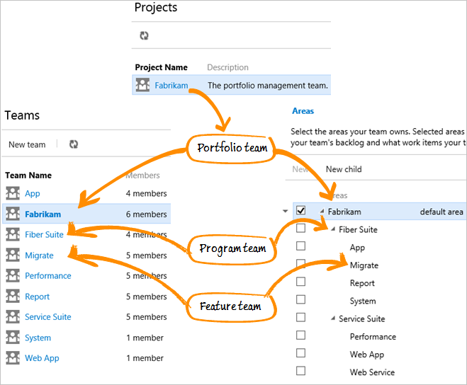
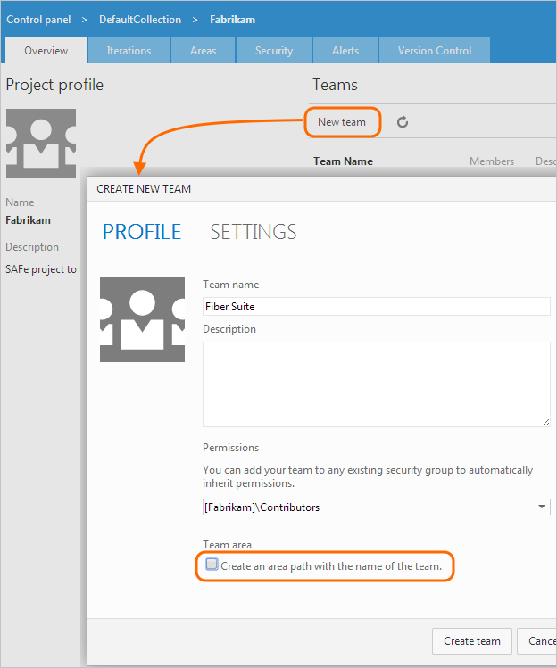
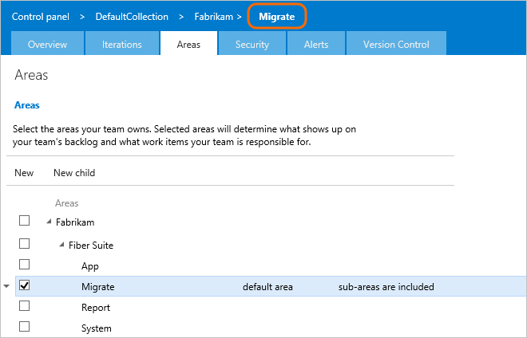
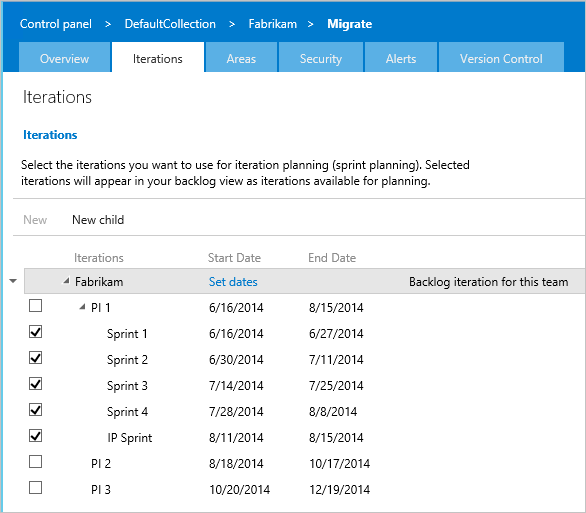
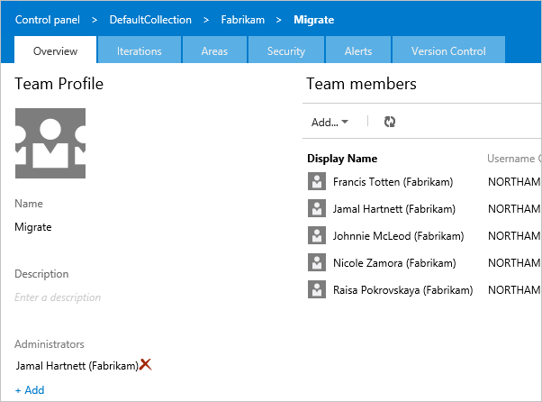
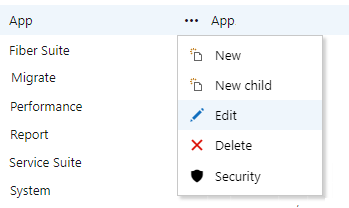
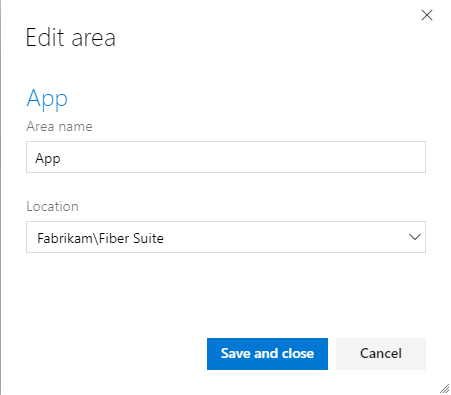
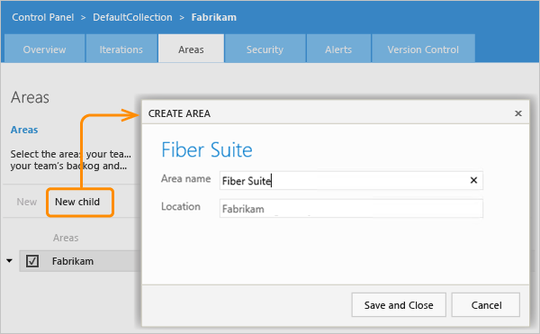
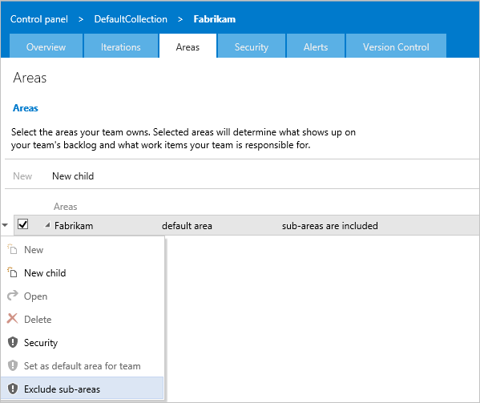
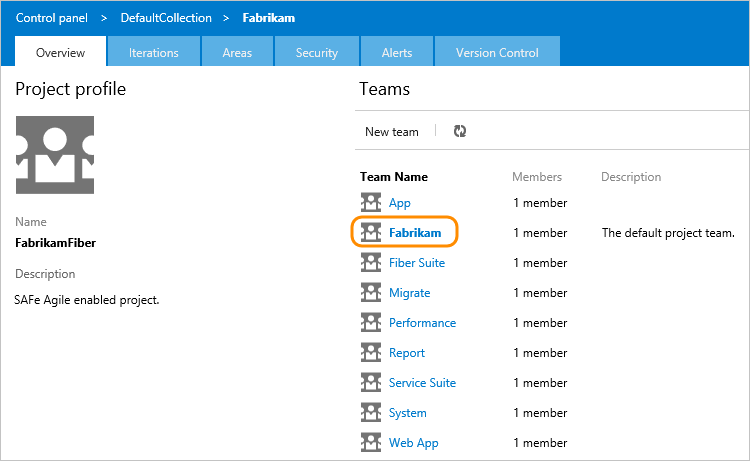

# Configure Azure Boards to support SAFe®

[!INCLUDE [temp](../includes/version-vsts-tfs-all-versions.md)]

This article walks you through the steps for converting a new project with a single team defined to one that is configured to support SAFe® programs and portfolios. Specifically, you'll learn how to configure Azure Boards to support SAFe® programs and portfolios by performing the following tasks: 

>[!div class="checklist"]      
> * Define Agile feature, program, and portfolio teams  
> * Configure a hierarchy of Area Paths to support your teams  
> * Define Iteration Paths to support SAFe® release trains, Program Increments, sprints, and Innovation and Planning (IP) Iterations 
> * Configure each team to support SAFe® 

You'll need to be a [member of the Project Administrators group](../../organizations/security/add-users-team-project.md) to make these configurations.    
If you're new to Azure Boards, we recommend that you review [About teams and Agile tools](../../organizations/settings/about-teams-and-settings.md) and [About area and iteration (sprint) paths](../../organizations/settings/about-areas-iterations.md) prior to adding and configuring your teams. 

Once you've performed these core configurations, you can then consider customizing your project to support specific business needs. This is addressed in [Customize Azure Boards to support SAFe&reg; ](safe-customize.md). 

> [!TIP]   
> If you plan to add custom work item types, portfolio backlogs, or workflows; you may want to make those customizations first and then define and configure your teams. 

## Team hierarchy 

::: moniker range=">= azure-devops-2019"

In this article, we'll go from having one project, named "Fabrikam" and one team, which shares the name of the project, to the following set of nine teams. 

> [!div class="mx-imgBorder"]  
> 

We'll then configure the area path to the following hierarchy and configuring each team's area path. This configuration supports each team's backlog view and rollup of views within the hierarchy.  

> [!div class="mx-imgBorder"]  
> 

> [!TIP]    
> If you have a large number of teams, area paths, and iterations that you need to add, you may want to use command line or programmatic tools. See the [Command line and  programmatic tools](#programmatic-tools) provided later in this article. 

::: moniker-end

::: moniker range="<= tfs-2018" 

In this article, we'll go from having one project, named "Fabrikam" and one team, which shares the name of the project, to the following structure of three levels and nine teams. The area path hierarchy and configuring each team's area path supports each team's backlog view and rollup of views within the hierarchy.  

 

::: moniker-end

Each project has a default team. You can configure additional teams for program-level and feature team-level work. And, you can also redefine the default team as the portfolio team that manages epics.  

In this way, all teams can manage their own workload and priorities while clearly understanding how their work supports those epics managed in the portfolio team's backlog. At the same time, the portfolio team can monitor progress of its backlog on their own Kanban board, prioritize the items on their backlog, and view progress across release trains.

All this might sound complicated, but it actually takes very little configuration to set up the teams and get started.
In order to go from one project with one default team, area, and set of iterations, we'll first configure an area path structure to support the hierarchy of teams we want. Then we'll make sure that the iteration paths support the release structure we want and the program and feature teams to use. Finally, we'll create, configure, and populate the membership of teams.  

::: moniker range="azure-devops"

## Define your teams 

To start, we'll simply add each team, creating a default area path for each. Later in this article, we'll configure those area paths into the necessary hierarchy. This structure maps the following SAFe teams to Azure Boards teams:  
- Portfolio team -> default top-level team, the Fabrikam team (already defined) 
- Program teams -> secondary-level teams, Fiber Suite and Service Suite  
- Feature teams -> tertiary-level teams defined under Fiber Suite and Service Suite.  

You'll need to be a [project administrator](../../organizations/security/add-users-team-project.md) to perform these steps. If you need more-detailed guidance, see [Portfolio management](portfolio-management.md).  

Add each team, one by one.

> [!NOTE]   
> The following procedure uses the **New Teams Page** user interface that is in preview. To enable this feature, see [Enable preview features](../../project/navigation/preview-features.md).

1. From the web portal, choose **Project settings** and open **Teams**. 

	> [!div class="mx-imgBorder"]
	> 

1. Choose **New team**. 

	> [!div class="mx-imgBorder"]
	> 

1. Give the team a name, and optionally a description. 

	Here we add the *App* team. Choose the team administrator and ensure the **Create an area path with the name of the team** checkbox is checked. Optionally add team members.  

	> [!div class="mx-imgBorder"]
	> 

	Assign the team's Scrum Master, Program Manager, or Portfolio Manager as the team administrator. This allows them to configure the team tools to support their business needs. 

1. Repeat steps 2 and 3 to define all teams.  

1. Optional. If you have two or more Portfolio teams, create a team for each of them.   

::: moniker-end

::: moniker range="<= tfs-2018"

### Create and configure each Program team

1. From the Overview page for the project, create a new team. Make sure that you clear the checkbox for Create an area path with the name of the team.  

	  

2. Choose the team from the list, go to the Areas page, and select the check box next to the area path that you previously created for that team.  

	  

3. Use the context menu to exclude sub-areas. By excluding sub-areas, the team's backlog only includes those items whose Area Path matches the team's default area path.

	  

4. Next, configure the iterations that will be active for the program team. In this example, we have configured three PIs, each with five two-week sprints. Four of the sprints are regular sprints and the last sprint is an Innovation and Planning (IP) sprint.  
	  
  
	Because the Fiber Suite program team is concerned with Release Trains, we choose PI 1, 2, and 3, but we don't choose the individual sprints.

6. Once you've selected which iterations are active for the team, add users to the new team. Ideally, you would add the scrum masters for each feature team, product owners, as well as the Release Train Engineers (RTEs) to the program teams, such as Fiber Suite.  

	  

6. If you've more than one team at the program level, repeat steps 1 through 4 for each program team. 

### Create and configure each Feature team

Next, we'll create some feature teams to get work done at the third level of the team hierarchy. Each feature team will contribute sprint work that rolls up into the PI. The number of teams you create will depend on the size of your organization.

1. Create a new team from the administration page for the original team, and name the team. Just like before, make sure you clear the check box next to **Create an area path with the name of the team**.

	  

2. Just as before, choose the team from the list, go to the Areas page, and select the check box next to the area path that you previously created for that team.  

	  

3. Configure iterations for the team, using the PIs and sprints you created earlier. Unlike the program teams, this time select the individual sprints as the working iterations for the feature team.  

	  

4. Lastly, add the accounts for the developers, testers, and the scrum master for the team. Your Agile tools support assigning a scrum master to multiple teams. The scrum master can track work across multiple teams.  

	 

5. Repeat steps 1 through 4 for each feature team in your organization. Make sure that the default area path you configure for the team is sub-area path under its corresponding program-level area path. This ensures rollup from feature teams to program teams.

::: moniker-end

## Configure Area Paths 

To support your team hierarchy, you'll now configure the area paths created in the first step of defining teams into a hierarchy. 

::: moniker range=">=azure-devops-2019"

1. From the **Project Settings** page, choose **Project configuration** and then **Areas**. You should see a flat list of Area Paths. 

	> [!div class="mx-imgBorder"]
	> 

2. You'll want to choose each feature team's Area Path under the top Area Path and move it under the Area Path hierarchy to which it belongs. 

	For example, highlight the *App* Area Path, open the  context menu, and choose **Edit**.   

	> [!div class="mx-imgBorder"]
	> 

3. Change the **Location** to *Fiber Suite*, it's parent program area path. 

	> [!div class="mx-imgBorder"]
	> 
	
	Choose **Save and close** when done. 

3. Repeat steps 2 and 3 for the remaining feature team area paths. 

	If you have defined two or more portfolio teams, you'll need to change the move each program team's area path under their corresponding portfolio team's area path. 

3. When finished, your area path structure should appear similar to that shown in the following image.  

	> [!IMPORTANT]  
	> This structure shows that area paths are owned by Agile feature teams, program teams, and the portfolio team. We'll correct this structure later in this article when we configure each team to be the sole owner of its area path.   

	> [!div class="mx-imgBorder"]
	> 

::: moniker-end

::: moniker range="<= tfs-2018"

1.  Connect to the project you want to configure to support SAFe, and use the gear icon  to open the administration page for the default team.  
2.  On the **Areas** page, create a child under the top-level area path and name it to correspond to one of the program teams you'll create.

	  

3.  Next, create a second area at the same child level, and name it after the second program team.  

4.  Under each program area, create a child area for each feature team that will support their respective program team. You should end up with a 3-level area path hierarchy.

	  
::: moniker-end

## Define Iteration Paths  

To track progress towards Releases, create your iteration path structure. Unlike area paths, multiple teams can share the same iteration path structure. Sharing the iteration structure lets multiple teams work in the same sprint cadence towards the same release trains.  

If you already have iterations for your default team, you can rename them. You'll want to create an iteration structure that supports your entire team structure, not just one team.  

::: moniker range=">=azure-devops-2019"

1. From the **Project Settings** page, choose **Project configuration** and then **Iterations**.  

1. Under the default iteration, which shares the same name as the project, create a child iteration that will represent your first program increment (PI). Optionally, add a start and end date for the PI, but keep in mind that the iteration will be broken down further into sprints.

	> [!div class="mx-imgBorder"]
	>  

2. Next, create a child iteration for each Sprint within the PI. Set dates for these sprints to correspond your feature teams' cadences.  

	> [!div class="mx-imgBorder"]
	> 

3. Continue to add as many iterations as needed to meet the timebox cadence structure for all your teams. 

	When finished, you should have a structure similar to the following image. 

	> [!div class="mx-imgBorder"]
	> 

::: moniker-end

::: moniker range="<= tfs-2018"

1. Under the default iteration, which shares the same name as the project, create a child iteration that will represent your first program increment (PI). Optionally, add a start and end date for the PI, but keep in mind that the iteration will be broken down further into sprints.

	

2. Next, create a child iteration for each Sprint within the PI. Set dates for these sprints to correspond your feature teams' cadences.  

	

::: moniker-end

::: moniker range=">= azure-devops-2019"  
"
## Configure your teams 

Now that your teams, Area Paths, and Iteration Paths are defined, the next step is to configure each team. You'll want to configure the following settings for each team. 
- Active backlogs
- Working with bugs  
- Set default Iteration Path
- Select team Iteration Paths 

These are the recommended settings to make based on the team level.

***
:::row:::
   :::column span="":::
     **Configure**
   :::column-end:::
   :::column span="":::
      **Agile feature team**
   :::column-end:::
   :::column span="":::
      **Program team**
   :::column-end:::
   :::column span="":::
      **Portfolio team**
   :::column-end:::
:::row-end:::
:::row:::
   :::column span="":::
      Backlog navigation levels
   :::column-end:::
   :::column span="":::
      Features, Stories  
   :::column-end:::
   :::column span="":::
      Features, Stories  
   :::column-end:::
   :::column span="":::
      Epics
   :::column-end:::
:::row-end:::
:::row:::
   :::column span="":::
      Working with bugs
   :::column-end:::
   :::column span=""::: 
      Bugs are managed with requirements
   :::column-end:::
   :::column span=""::: 
      Bugs are not managed on backlogs and boards
   :::column-end:::
   :::column span="":::
      Bugs are not managed on backlogs and boards 
   :::column-end:::
:::row-end:::
:::row:::
   :::column span="":::
      Default Iteration
   :::column-end:::
   :::column span=""::: 
      @CurrentIteration 
   :::column-end:::
   :::column span=""::: 
      @CurrentIteration 
   :::column-end:::
   :::column span="":::
      @CurrentIteration  
   :::column-end:::
:::row-end:::
:::row:::
   :::column span="":::
      Backlog Iteration
   :::column-end:::
   :::column span=""::: 
      Fabrikam\PI 1 
   :::column-end:::
   :::column span=""::: 
      Fabrikam 
   :::column-end:::
   :::column span="":::
      Fabrikam 
   :::column-end:::
:::row-end:::
:::row:::
   :::column span="":::
      Selected iterations 
   :::column-end:::
   :::column span="":::
      Sprint 1 thru Sprint 4, IP Sprint
   :::column-end:::
   :::column span="":::
      PI 1, PI 2, PI 3
   :::column-end:::
   :::column span="":::
      None
   :::column-end:::
:::row-end:::
:::row:::
   :::column span="":::
      Areas
   :::column-end:::
   :::column span="":::
      Include sub-areas
   :::column-end:::
   :::column span="":::
      Exclude sub-areas
   :::column-end:::
   :::column span="":::
      Exclude sub-areas
   :::column-end:::
:::row-end:::

***

1. From the **Project Settings** page, choose **Team configuration**.  

	Choose the team you want to configure from the Team selector. 

	> [!div class="mx-imgBorder"]
	> 

1. On the **General** page, uncheck backlogs you don't want to be active. 

	For example, for the Portfolio team, only check the **Epics** checkbox. 

	> [!div class="mx-imgBorder"]
	> 

	For program and Agile feature teams, uncheck the **Epics** checkbox. 

	> [!div class="mx-imgBorder"]
	> 

1. For program and portfolio teams, choose the **Working with bugs** radio button as shown. 

	> [!div class="mx-imgBorder"]
	> 

	And, for Agile feature teams, choose the  **Working with bugs** option to track bugs along with requirements.  

	> [!div class="mx-imgBorder"]
	> 

1. Choose the **Iterations** tab to configure the team's iterations. 

	For Agile feature teams, configure the settings as shown. 

	> [!div class="mx-imgBorder"]
	> 

	For program teams, choose only the PI iterations. 

	> [!div class="mx-imgBorder"]
	> 

1. For program and portfolio teams, choose the **Areas** tab to change the default setting from **Include sub areas** to **Exclude sub areas**. 

	Open the  context menu, and choose **Exclude sub areas**.   

	> [!div class="mx-imgBorder"]
	>  

1. Repeat steps 2 through 5 as needed for each team you need to configure. 

1. After you've completed step 5 for all teams, verify the Area Path-Team structure. Choose **Project configuration** and **Areas**. The Area Path and team structure should now appear as shown, where each team owns their Area Path and doesn't share it with any other team. 

	> [!div class="mx-imgBorder"]
	>  

::: moniker-end

::: moniker range="<= tfs-2018"

## Configure your teams

In this section, we'll show how to configure a hierarchical team structure which maps to the hierarchical area paths we created previously.
This structure maps the following SAFe teams to your Agile tools' teams:  
- Portfolio team -> default top-level team, the Fabrikam team  
- Program teams -> secondary-level teams, Fiber Suite and Service Suite  
- Feature teams -> tertiary-level teams defined under Fiber Suite and Service Suite.  
- 
  If you need more-detailed guidance, see [Portfolio management](portfolio-management.md).  

You'll need to be a [project administrator](../../organizations/security/add-users-team-project.md) to perform these steps. 
 

### Create and configure each Program team

1. From the Overview page for the project, create a new team. Make sure that you clear the checkbox for Create an area path with the name of the team.  

	  

2. Choose the team from the list, go to the Areas page, and select the check box next to the area path that you previously created for that team.  

	  

3. Use the context menu to exclude sub-areas. By excluding sub-areas, the team's backlog only includes those items whose Area Path matches the team's default area path.

	  

4. Next, configure the iterations that will be active for the program team. In this example, we have configured three PIs, each with five two-week sprints. Four of the sprints are regular sprints and the last sprint is an Innovation and Planning (IP) sprint.  
	  
  
	Because the Fiber Suite program team is concerned with Release Trains, we choose PI 1, 2, and 3, but we don't choose the individual sprints.

6. Once you've selected which iterations are active for the team, add users to the new team. Ideally, you would add the scrum masters for each feature team, product owners, as well as the Release Train Engineers (RTEs) to the program teams, such as Fiber Suite.  

	  

6. If you've more than one team at the program level, repeat steps 1 through 4 for each program team. 

### Create and configure each Feature team

Next, we'll create some feature teams to get work done at the third level of the team hierarchy. Each feature team will contribute sprint work that rolls up into the PI. The number of teams you create will depend on the size of your organization.

1. Create a new team from the administration page for the original team, and name the team. Just like before, make sure you clear the check box next to **Create an area path with the name of the team**.

	  

2. Just as before, choose the team from the list, go to the Areas page, and select the check box next to the area path that you previously created for that team.  

	  

3. Configure iterations for the team, using the PIs and sprints you created earlier. Unlike the program teams, this time select the individual sprints as the working iterations for the feature team.  

	  

4. Lastly, add the accounts for the developers, testers, and the scrum master for the team. Your Agile tools support assigning a scrum master to multiple teams. The scrum master can track work across multiple teams.  

	 

5. Repeat steps 1 through 4 for each feature team in your organization. Make sure that the default area path you configure for the team is sub-area path under its corresponding program-level area path. This ensures rollup from feature teams to program teams.

### Configure the Portfolio team

Now that your sub-team structure is configured, we reconfigure the default team to act as the Portfolio team. While this team will continue to have the name of the project, the changes you make to this top-level team will help ensure that it effectively tracks epics across PIs at the highest level.  

1. On the Areas page for the project, change the settings so that sub-areas are not included. Make sure you choose the project and not the default team, Fabrikam.  

	  

2. On the Iterations page, clear the check boxes next to all iterations except for the root level, which cannot be cleared. Because the Portfolio team is only concerned with epics that span PIs, it only uses the root iteration and not the PIs or sprints. Portfolio teams don't work in sprints.  

	  

3. Lastly, add and remove users from the Portfolio team appropriate to this level. From the Overview page, choose the default team.  

	   

	If you're following SAFe, you'll probably want to add portfolio managers, enterprise-level architects, and Release Train Engineers (RTEs) at this level and remove everyone else.

	

::: moniker-end

<a id=programmatic-tools" /> 

::: moniker range="azure-devops"

## Command line and programmatic tools

You can use Azure DevOps command line tools to add or update the following artifacts:

- **Teams**: [Azure DevOps team create](../../organizations/settings/add-teams.md#add-team-cli) 
- **Area Paths**: [Azure DevOps area project create](../../organizations/settings/set-area-paths.md#add-area)
- **Iteration Paths**: [Azure DevOps iteration project create](../../organizations/settings/set-iteration-paths-sprints.md#add-project-iteration) 

::: moniker-end

::: moniker range="azure-devops-2019"
## Programmatic tools
::: moniker-end

::: moniker range=">= azure-devops-2019"

You can use Azure DevOps REST APIs to add or update the following artifacts:

- **Teams**: [Teams (REST API)](/rest/api/azure/devops/core/teams)  
- **Area Paths**: [Classification nodes (REST API)](/rest/api/azure/devops/wit/classification%20nodes)
- **Iteration Paths**: [Classification nodes (REST API)](/rest/api/azure/devops/wit/classification%20nodes) 

::: moniker-end

## Try this next

> [!div class="nextstepaction"]
> [Customize Azure Boards to support SAFe®](safe-customize.md)  

## Related articles

- [Add teams](../../organizations/settings/add-teams.md)
- [Define area paths and assign to a team](../../organizations/settings/set-area-paths.md)
- [Define iteration paths and configure team iterations](../../organizations/settings/set-iteration-paths-sprints.md) 
- [Azure DevOps CLI](/cli/azure/ext/azure-devops/)  
- [Teams (REST API)](/rest/api/azure/devops/core/teams)  

<!---

	From the team profile, you can do these additional tasks:  
   - [Add team administrators](../../organizations/settings/add-team-administrator.md)
   - [Navigate to team notifications](../../notifications/howto-manage-team-notifications.md)
   - [Navigate to and set default team dashboard permissions](../../report/dashboards/dashboard-permissions.md)

To configure other team features, see [Manage teams and configure team tools](../../organizations/settings/manage-teams.md).

-->