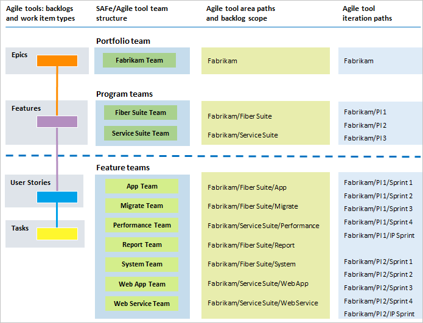
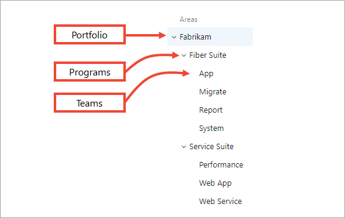
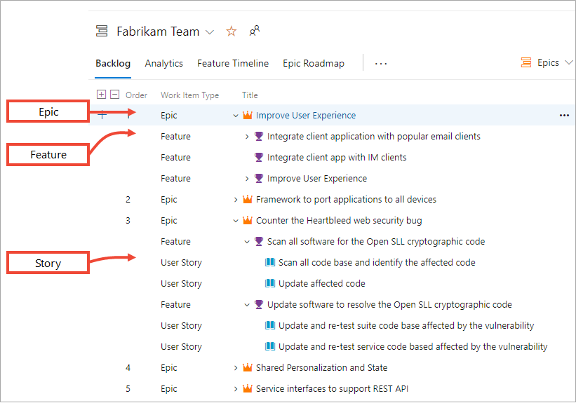
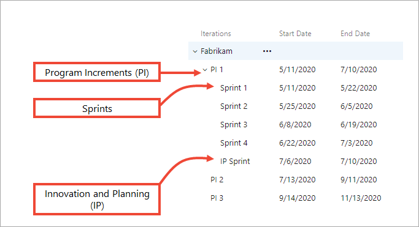
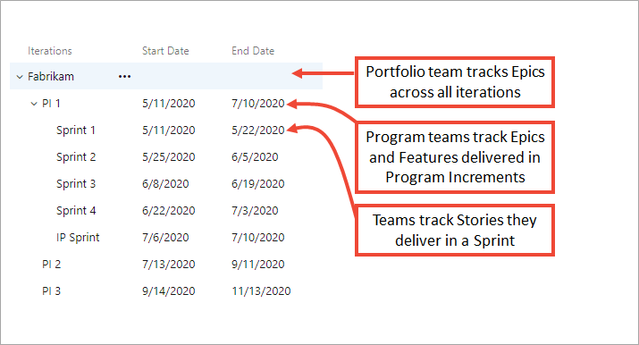
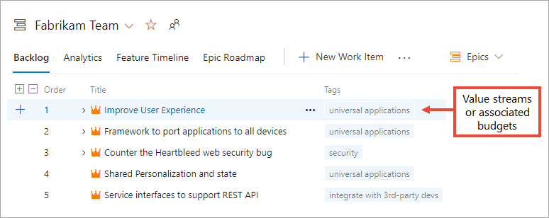
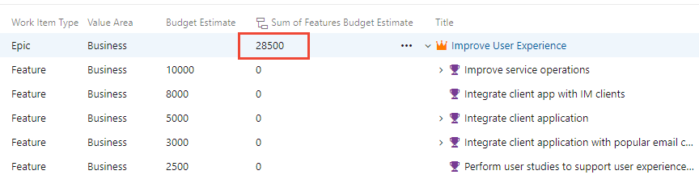
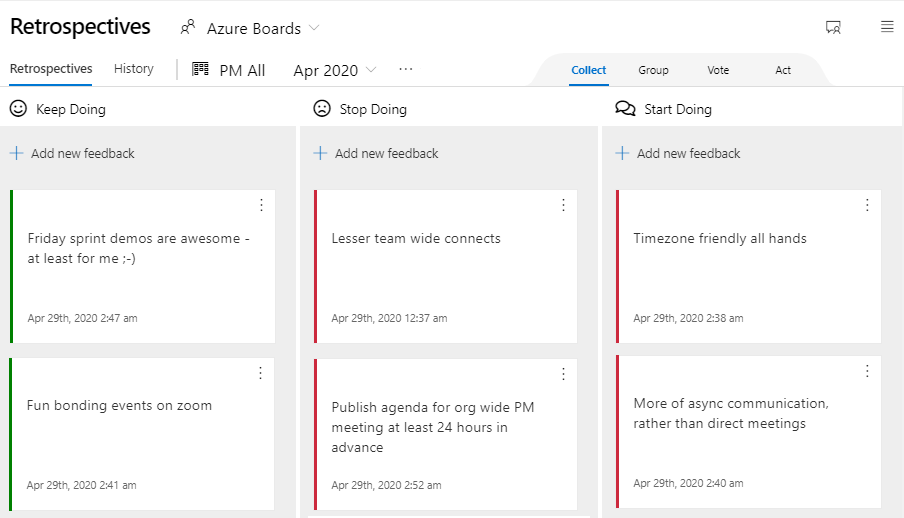

# Implement SAFe® with Azure Boards - Complete guide

[!INCLUDE [version-lt-eq-azure-devops](../../includes/version-lt-eq-azure-devops.md)]

This guide walks you through implementing the Scaled Agile Framework (SAFe®) with Azure Boards. Learn to configure teams, customize processes, plan and track work, monitor progress, and validate your implementation across portfolio, program, and team levels.

Azure Boards supports SAFe® practices through teams, backlogs, boards, reports, and metrics. This article explains how Azure Boards artifacts support SAFe practices and artifacts.

## What you accomplish

>[!div class="checklist"]
> - **[Understand SAFe® concepts](#safe-concepts)** and Azure Boards mapping.
> - **[Configure basic SAFe® structure](#basic-configuration)** with team hierarchies.
> - **[Apply advanced customization](#advanced-customization)** for SAFe® artifacts.
> - **[Monitor progress and metrics](#monitor-metrics)** with dashboards and reports.
> - **[Review and validate configuration](#review-validate)** with testing checklists.
> - **[Plan and track SAFe® programs](#plan-track)** across all levels.
> - **[Automate management](#automation-tools)** with command-line tools.

This approach works with any Azure DevOps process template and scales from small to large enterprise deployments.

## Prerequisites

Complete these requirements before implementing SAFe® with Azure Boards.

| Category | Requirement | Details |
|----------|-------------|---------|
| **SAFe® Knowledge** | Review SAFe® framework fundamentals | If you're new to SAFe®, start with [SAFe® framework fundamentals](https://www.scaledagileframework.com/). |
| **Permissions** | Project Administrator access | Ensure you have [Project Administrator permissions](../../organizations/security/change-project-level-permissions.md) to configure teams, areas, and iterations. |
| **Organization Planning** | Understand your SAFe® structure | Document your organization's portfolio themes, value streams, and Agile Release Trains (ARTs). |
| **Stakeholder Alignment** | Identify key stakeholders | Engage Portfolio Managers, Program Managers, and Scrum Masters early in the planning process. |

<a id="safe-concepts"></a>

## SAFe® concepts and Azure Boards mapping

SAFe® organizes work into three levels that map directly to Azure Boards:

| SAFe® Level | Azure Boards work items | Azure Boards teams | Iterations |
|-------------|-------------------------|-------------------|------------|
| Portfolio | Epics | Portfolio teams | No specific iterations |
| Program | Features | Program teams | Program Increments (8-12 weeks) |
| Team | User Stories, Tasks, Bugs | Agile feature teams | Sprints (2-3 weeks) |



**Key concepts:**
- **Program Increments (PIs)**: 8-12 week iterations containing 4-5 sprints plus IP sprint
- **Agile Release Trains (ARTs)**: Program teams managing features
- **Innovation and Planning (IP) Sprints**: Dedicated sprints for innovation work
- **Value Streams**: Track using tags or custom fields with rollup capabilities

For Scrum and Kanban implementation details, see [About Sprints, Scrum, and project management](../sprints/scrum-overview.md) and [About Boards and Kanban](../boards/kanban-overview.md).

## SAFe® Framework configurations

SAFe® provides four configurations to support different organizational needs:

### Essential SAFe®
The foundational level supporting Agile Release Trains (ARTs) with:
- Team and Program levels
- Program Increments and iterations
- Features and Stories
- Basic PI planning and execution

### Large Solution SAFe®
Adds solution-level coordination for complex systems:
- Solution Trains
- Capabilities work items
- Solution backlogs
- Cross-ART coordination

### Portfolio SAFe®
Adds portfolio management capabilities:
- Epic work items and portfolio backlogs
- Lean portfolio management
- Strategic themes and portfolio vision
- Value stream alignment

### Full SAFe®
Combines all levels for enterprise-scale implementations including Essential, Large Solution, and Portfolio levels.

### SAFe® architectural overview

> [!div class="mx_imgBorder"]  
>   

*Reproduced with permission from © 2011-2020 [Scaled Agile Inc.](https://www.scaledagile.com/). All rights reserved.*

## How SAFe® artifacts map to Azure Boards

| SAFe® term or artifact | Azure Boards term or artifact |
|------------------------|-------------------------------|
| Agile teams | [Teams](safe-concepts.md#teams) - Define hierarchy of teams |
| Agile Release Train (ART) | [Teams](safe-concepts.md#teams) - Agile teams managing Features |
| Budgets | [Tags, Value Area](safe-concepts.md#tags) - Track budget/value stream work |
| Capabilities | [Work item](safe-concepts.md#work-items) - Plan and track like Epics/Features |
| Enablers | [Work item](safe-concepts.md#work-items) - Track as work items in backlogs |
| Innovation and Planning (IP) Iteration | [Iteration Path](safe-concepts.md#iterations) - Define IP iteration paths |
| Portfolio Backlog | [Portfolio backlog](safe-concepts.md#backlogs-boards) - List Epics with child expansion |
| Portfolio Kanban | [Portfolio Epics board](safe-plan-track-boards.md#portfolio-team-board) |
| Program Backlog | [Feature backlog](safe-concepts.md#backlogs-boards) - List program Features |
| Program Kanban | [Program Features board](safe-plan-track-boards.md#program-team-board) |
| Solution Backlog | [Solution portfolio backlog](safe-customize.md#custom-backlog) - Custom work item type |
| Strategic Themes | [Wiki](safe-concepts.md#wiki) - Capture in project wiki |
| Team Backlog | [Stories backlog](safe-concepts.md#backlogs-boards) - List team User Stories |
| Team Kanban | [Stories board](safe-plan-track-boards.md#agile-team-board) |

### SAFe® 5.0 Business Agility

SAFe® practices help organizations build a culture of agility, alignment, and autonomy while remaining customer-centric.

See these related articles for how Azure Boards supports business agility:
- [Agile culture](agile-culture.md)
- [Practices that scale](practices-that-scale.md)

<a id="team-structure-artifacts"></a>

### SAFe® team structure and artifacts

The following diagram shows a three-level team hierarchy mapped to area and iteration paths. The examples use the Agile process as a base, but you can apply these patterns to any supported process.


### Agile feature, program, and portfolio teams

Azure Boards gives each team its own view of work. Configure a hierarchical team structure so each team focuses on its work and roll-up occurs to higher levels.



To support SAFe® teams, promote the default team to act as the Portfolio team for Epics, then create program and team subteams. Track work across teams by assigning area paths and iteration paths appropriately.

For detailed configuration steps, see [Configure basic SAFe® structure](#basic-configuration).

### Stories, Features, Epics, Enablers, and Capabilities

Capture all deliverables in work items. Each work item uses a specific work item type and workflow. The available work item types depend on the process chosen when you created the project—Agile, Basic, Scrum, or CMMI.

[!INCLUDE [temp](../includes/work-item-types.md)]

Backlog items can be called *User Stories* (Agile), *Issues* (Basic), *Product backlog items* (Scrum), or *Requirements* (CMMI). They all describe customer value and the work to deliver it.

- Track Enablers using User Stories or Features, and track Capabilities using Features or Epics
- Add custom work item types if you need specialized tracking

Work items support:
- Descriptions and acceptance criteria
- Assignment to a team (area path) and an owner
- State updates and iteration assignment
- Linking, attachments, and tags
- Comments and discussion threads

For more about work items, see [Track work with user stories, issues, bugs, features, and epics](../work-items/about-work-items.md).

### Team backlogs and boards

Map SAFe® backlogs to team, program, and portfolio backlogs. The Agile process provides User Story, Feature, and Epic backlog levels out of the box. Use hierarchical backlogs to show the work that supports Features and the progress of Epics.



Each team can configure their board view independently to support their specific SAFe® role and responsibilities.

### Program increments, releases, and sprints

Map SAFe® Release Trains, Program Increments (PIs), Releases, and Sprints to iteration paths. Share iterations across the team hierarchy so teams align on release schedules.



Because Epics can span multiple release trains, the Portfolio team typically isn't bound to specific iterations. Program teams track Features by PI; Feature teams use Sprints to complete Stories.



### Value streams and budgets

Use tags or custom fields to map Features and Epics to Value Streams, Strategic Themes, and budgets. Define rollup fields or use queries and charts to aggregate budget estimates from child Features up to Epics.



With tags and queries, you can:
- Filter backlogs and boards
- Build queries and filter results by tag
- Create charts and reports based on tags

For robust mappings, add a Value Area custom field on Epics, Features, or Stories and use rollup to gather estimates into portfolio views.

> [!div class="mx-imgBorder"]
> 

**Value Area assignment guidelines:**
- Set **Value Area** = *Architectural* for Features mapped to architecture epics
- Default *Business* value applies to features supporting business epics
- Apply the same principles to Stories that support architectural vs. business features
- Use tags to track other investment themes

For advanced value stream tracking options, see [Add custom fields for SAFe® tracking](#add-custom-field).

### Portfolio Vision and Strategic Themes

Use the project wiki to share Portfolio Vision, Strategic Themes, taxonomy, goals, and objectives. The wiki versions pages and supports Markdown, so you can track edits and recover previous versions.

Consider documenting:
- How to use tags or custom fields to specify value streams
- Taxonomy terms for your organization
- How release trains and sprints get used
- Key milestones and events
- Customer-centric programs

For details, see [About Wikis, READMEs, and Markdown](../../project/wiki/about-readme-wiki.md).

### Iteration goals and objectives

Capture iteration goals and objectives in:
- Project wiki for versioned documentation
- Team dashboards using Markdown widgets
- Work item descriptions for PI or sprint objectives

Both the wiki and dashboards support Markdown and let teams store goals, objectives, and guidance that you can easily share and update.

### Milestones and key events

Represent SAFe® milestones (end of PIs, Sprints, Release Train events, or IP iterations) using:
- A custom Milestone or Release work item field (picklist)
- Tags on work items to mark milestone association
- Work items that represent the milestone with target dates
- One-day iteration paths for specific event dates

Use queries, dashboards, and charts to track milestone progress and ensure alignment across teams.

### Shared services team structure

Model shared services (for example, UX or Security) as their own teams and area paths. Shared-area work items appear on the backlogs and boards of the teams they support.

> [!div class="mx_imgBorder"]
> 

This structure allows shared services teams to:
- Maintain their own backlog and sprint planning
- Support multiple program teams simultaneously
- Track their contribution to various SAFe® deliverables

### Retrospectives and reviews

Use the [Retrospectives extension by Microsoft DevLabs](https://marketplace.visualstudio.com/items?itemName=ms-devlabs.team-retrospectives) to run retrospectives, capture feedback, and create follow-up work.

> [!div class="mx_imgBorder"]
> 

The extension helps teams:
- Collect feedback on milestones and PI events
- Organize and prioritize feedback
- Create and track action items for continuous improvement

### Share information across teams

Share information across SAFe® teams with:
- Rich work item fields and attachments for detailed specifications
- Project and team dashboards using Markdown widgets—see [Add Markdown to a dashboard](../../report/dashboards/add-markdown-to-dashboard.md)
- The project wiki for versioned, shareable documentation—see [About Wikis, READMEs, and Markdown](../../project/wiki/about-readme-wiki.md)

For Markdown syntax guidance, see:
- [Syntax guidance for Markdown usage in Wiki](../../project/wiki/markdown-guidance.md)
- [Syntax guidance for basic Markdown usage](../../project/wiki/markdown-guidance.md)

<a id="basic-configuration"></a>

## Configure basic SAFe® structure

This section walks you through converting a single-team project to support SAFe® programs and portfolios.

### Target team structure

Create the following team hierarchy:

> [!div class="mx_imgBorder"]  
> 

> [!NOTE]   
> Azure Boards doesn't support a hierarchy of teams. However, by configuring the Area Paths as shown, you effectively create a team hierarchy through the Area Path structure.

The final area path configuration looks like this:

> [!div class="mx_imgBorder"]  
> 

### Step 1: Define your teams

Start by adding each team, which automatically creates a default area path for each.

> [!NOTE]   
> The following procedure uses the **New Teams Page** user interface. To enable this feature, see [Manage or enable features](../../project/navigation/preview-features.md).

1. From the web portal, choose **Project settings** > **Teams**.

2. Select **New team**.

3. Configure each team:
   - Give the team a name and optional description
   - Assign a team administrator (Scrum Master, Program Manager, or Portfolio Manager)
   - Check **Create an area path with the name of the team**
   - Optionally add team members

4. Repeat for all teams in your SAFe® structure:
   - Portfolio team (use existing default team)
   - Program teams (for example, Fiber Suite, Service Suite)
   - Agile feature teams (for example, App, Mobile, Web, and so on.)

### Step 2: Configure Area Paths hierarchy

Transform the flat area path structure into a hierarchy that supports your team relationships.

1. From **Project Settings**, choose **Project configuration** > **Areas**.

2. Drag and drop each feature team's area path under their parent program team's area path.

   > [!div class="mx_imgBorder"]
   > 

3. Continue until your area path structure matches your team hierarchy.

### Step 3: Define Iteration Paths for SAFe®

Create an iteration structure that supports Program Increments, sprints, and IP sprints.

1. From **Project Settings**, choose **Project configuration** > **Iterations**.

2. Create Program Increment iterations:
   - Add child iterations under the root for each PI (for example, "PI 1," "PI 2")
   - Set start and end dates for 8-12 week periods

3. Create sprint iterations under each PI:
   - Add 4-5 sprint iterations per PI
   - Set two-week sprint durations
   - Include one IP (Innovation and Planning) sprint per PI

   > [!div class="mx_imgBorder"]
   > 

### Step 4: Configure team settings

Configure each team according to their level in the SAFe® hierarchy.

#### Portfolio Team Configuration

1. From **Project Settings** > **Team configuration**, select your portfolio team.

2. **General tab**:
   - Check only **Epics** for backlog navigation
   - Set **Working with bugs** to "Bugs don't appear on backlogs and boards"

   > [!div class="mx_imgBorder"]
   > 

3. **Iterations tab**:
   - Set **Default iteration** to @CurrentIteration
   - Set **Backlog iteration** to root (project name)
   - Don't select any specific iterations

4. **Areas tab**:
   - Set to **Exclude sub areas**

#### Program Team Configuration

1. **General tab**:
   - Check **Features** and **Stories**, uncheck **Epics**
   - Set **Working with bugs** to "Bugs don't appear on backlogs and boards"

2. **Iterations tab**:
   - Select only PI iterations (not individual sprints)

3. **Areas tab**:
   - Set to **Exclude sub areas**

#### Agile Feature Team Configuration

1. **General tab**:
   - Check **Features** and **Stories**, uncheck **Epics**
   - Set **Working with bugs** to "Bugs are managed with requirements"

2. **Iterations tab**:
   - Select sprint iterations (including IP sprints)

3. **Areas tab**:
   - Keep default **Include sub areas** setting

<a id="customization"></a>

## Advanced customization

The main reason to customize your process is to support progress tracking and monitoring, report key metrics, and meet specific business needs. This section covers process customizations you can implement to complement your SAFe® practices. Most of these customizations are optional.

### About customization and the inherited process

Azure Boards provides a graphical user interface to support customization of your projects through the Inherited process. All projects that use an inherited process automatically update when customizations get made to that process.

For an overview of all customizations you can make, see [About process customization and inherited processes](../../organizations/settings/work/inheritance-process-model.md).

<a id="customize-work-items"></a>

### Customize work item types

Each work item type defines the fields that capture and store information. You can customize existing work item types in the following ways to support specific SAFe® tracking requirements:

- [Add custom fields](#add-custom-field) to support tracking budget costs, value streams, or customer-centric information
- [Customize existing fields](#customize-fields), such as modifying picklists or changing field labels
- [Add custom rules](#custom-rules) to make fields required or specify actions under select conditions
- [Change the workflow](#custom-workflow) to reflect your team's workflow process
- [Add custom controls or extensions](#custom-control) to support custom functions such as calculated fields

For more information, see [Add and manage work item types](../../organizations/settings/work/customize-process-work-item-type.md).

<a id="add-custom-field"></a>

### Add custom fields for SAFe® tracking

Add custom fields to support tracking data requirements not met by existing fields. Consider adding these fields to support SAFe® practices:

| Field name | Work Item Types | Notes |
|------------|-----------------|-------|
| Budget cost | Feature, Epic | Capture estimated costs. Use rollup to capture total estimated cost of Epic's Features. |
| Category or Group | Feature, Epic, User Story | Specify picklist for SAFe® categories: *Feature*, *Capability*, *Enabler*, or *Solution*. |
| Milestone | Feature, Epic, User Story | Specify picklist of milestone events that work items should meet. |
| Value Stream | Feature, Epic, User Story | Specify picklist to support taxonomy of value streams. |

For more information, see [Add a custom field to a work item type](../../organizations/settings/work/add-custom-field.md).

#### Field versus tags usage

You can capture value streams using fields or tags. Consider these factors:

- **Fields**: More formal, can require through rules, support query charts
- **Tags**: Informal, adhoc method, anyone can add new tags
- **Filtering**: Both support filtering of backlogs, boards, and queries
- **Growth**: Tag numbers can grow quickly without governance

<a id="customize-fields"></a>

### Customize existing fields

Customize existing fields to support:

- Relabel field names
- Change field placement or remove from forms
- Add or change picklists (for example, expand *Value Area* beyond *Business* and *Architectural*)
- Change default field assignments
- Make fields required
- [Add field rules](#custom-rules)

For field reference, see [Work item field index](../work-items/guidance/work-item-field.md). For customization details, see [Add and manage fields for an inherited process](../../organizations/settings/work/customize-process-field.md).

<a id="custom-rules"></a>

### Add custom rules

Field rules support business use cases by specifying actions based on conditions. For example, make fields required based on other field values.

> [!div class="mx-tdBreakAll"]
> |Supported conditions |Supported actions |
> |-------------|----------|
> | | 

For more information, see [Add a rule to a work item type (Inheritance process)](../../organizations/settings/work/custom-rules.md).

<a id="custom-workflow"></a>

### Customize workflows for SAFe®

Customize workflows for User Stories, Features, and Epics to match your SAFe® process. Early customization minimizes board configuration for teams.

The default Agile process includes *New*, *Active*, *Resolved*, and *Closed* states. Consider adding workflow states like *Backlog*, *Analyze*, *Develop*, *Test*, and *Done* to match your process flow.

> [!div class="mx_imgBorder"]
> 

For more information, see:
- [Customize the workflow (Inheritance process)](../../organizations/settings/work/customize-process-workflow.md)
- [Add columns to your board](../boards/add-columns.md)
- [Definition of Done](../boards/add-columns.md#definition-of-done)

<a id="custom-control"></a>

### Add custom controls and extensions

Custom controls add rich functionality to work item forms. Controls are extensions from the [Marketplace Extensions for Azure DevOps](https://marketplace.visualstudio.com/).

**SAFe®-relevant extensions:**
- [WorkBoard OKRs](https://marketplace.visualstudio.com/items?itemName=wobo-okrs.workboard-ado-extension): Align and measure Objectives and Key Results (OKRs) across the business

<a id="custom-work-item-types"></a>

### Add custom work item types

While User Story, Feature, and Epic support most SAFe® scenarios, consider adding work item types for:
- Customer feedback capture
- Customer requests
- Solution-level tracking

When you define new work item types, consider:
- Information to capture, track, and report
- How work gets captured
- Workflow to support tracking

Minimize customizations when possible - use existing work item types with custom fields if suitable.

<a id="customize-backlogs"></a>

### Customize backlogs for SAFe® hierarchy

Each team's backlog supports specific work item types:
- **Agile Release Teams**: User Stories and Bugs (optional)
- **Program Teams**: Features  
- **Portfolio Teams**: Epics

You can add up to three more portfolio backlogs to support SAFe® hierarchy:

> [!div class="mx_imgBorder"]
> 

> [!TIP]
> For a Solution (Capabilities) Backlog parent to Program (Features) Backlog, disable the inherited Epic work item type and recreate as custom. See [Customize process backlogs and boards](../../organizations/settings/work/customize-process-backlogs-boards.md).

For more information, see [Customize your backlogs or boards (Inheritance process)](../../organizations/settings/work/customize-process-backlogs-boards.md).

### SAFe® marketplace extensions

Add these extensions for enhanced SAFe® functionality:

- [Delivery Plans](../plans/review-team-plans.md)
- [Feature Timeline and Epic Roadmap](https://marketplace.visualstudio.com/items?itemName=ms-devlabs.workitem-feature-timeline-extension)
- [Dependency Tracker](../extensions/dependency-tracker.md)
- [Retrospectives](https://marketplace.visualstudio.com/items?itemName=ms-devlabs.team-retrospectives)

> [!NOTE]
> Before customizing your project, read [Configure and customize Azure Boards](../configure-customize.md) for detailed information on administrating projects for multiple teams and business objectives.

<a id="monitor-metrics"></a>

## Monitor progress and metrics

Azure Boards provides built-in SAFe® metrics through:

- **Rollup columns**: Aggregate progress across work item hierarchy
- **Velocity reports**: Track team completion rates
- **Cumulative Flow Diagrams**: Monitor flow and identify bottlenecks
- **Lead/Cycle time**: Measure delivery performance
- **Delivery Plans**: Cross-team roadmap views


### Key SAFe® dashboards

Configure dashboards with:
- Team velocity widgets
- CFD charts for each level
- Feature timeline roadmaps
- Epic progress rollup

For dashboard setup details, see [About dashboards, charts, reports, & widgets](../../report/dashboards/overview.md).

### View progress rollup

Use rollup columns in each team's backlog to view and monitor progress. The following example shows progress aggregated from child work items.

> [!div class="mx_imgBorder"]  
>  

Other rollup options include:

- Progress by specific work item types.
- Progress by story points (completed vs. planned).
- Count of work items completed in a time period.
- Sum of a numeric field to aggregate numerical data.

For details on configuring and displaying rollup progress or totals, see [Display Rollup Progress or Totals](../backlogs/display-rollup.md).

### View team velocity 

Each team can view velocity through the in-context velocity report. The report presents a bar chart of planned, completed, completed late, and incomplete work items for the last six (or more) iterations. The chart shows the average velocity for the displayed iterations.

> [!div class="mx_imgBorder"]  
>   

Use the average to help forecast how much work a team can take on.

### Use the Forecast tool 

Teams can assign Story Points to User Stories and then use Forecast to estimate how much they can complete. For details, see [Forecast your product backlog](../sprints/forecast.md).

> [!div class="mx_imgBorder"]  
> 

### View the Cumulative Flow Diagram (CFD) 

Each backlog and board offer configurable CFD views so teams at every SAFe® level can monitor flow and identify bottlenecks.

> [!div class="mx_imgBorder"]  
> 

Use CFD charts from the backlog or board view, and add them to dashboards as needed. For more, see [View/configure a Cumulative Flow Diagram](../../report/dashboards/cumulative-flow.md).  

### View Lead Time and Cycle Time charts

Add Lead time and Cycle time widgets to a team dashboard to learn:

- Lead time: average days to complete deliverables from creation date.
- Cycle time: average days to complete deliverables from the work-start date.
- Number of outliers for deeper analysis.

Both widgets display as scatter-plot control charts with interactive elements. For guidance, see [Cumulative flow, lead time, and cycle time guidance](../../report/dashboards/cumulative-flow-cycle-lead-time-guidance.md). 

#### Example Lead Time widget

> [!div class="mx_imgBorder"]  
>  

#### Example Cycle Time widget

> [!div class="mx_imgBorder"]  
>  

<a id="roadmaps"></a>

### View and update roadmaps    

Use Delivery Plans, Feature Timeline, and Epic Roadmap tools to review SAFe® deliverables and roadmaps. Delivery Plans show teams and work item types you specify and allow interactive planning.

#### Review feature team Delivery Plans  

Program teams review story and feature roadmaps for their Agile Release Teams. The following example shows the Fiber Suite teams' story deliverables.

> [!div class="mx_imgBorder"]  
>  

Expand a feature team to view details. Delivery Plans let you drag and drop work items to update sprint assignments, or open work items to update fields and add comments.

> [!div class="mx_imgBorder"]
>  

#### Review the portfolio features deliverable 

Portfolio teams review Features under development by program teams. The following example shows Features mapped to Program Increment timeboxes.

> [!div class="mx_imgBorder"]
>  

#### Review feature timeline roadmaps 

Feature Timeline provides another roadmap view. The following example shows Epics in the Feature Timeline tool. Configure progress bars to reflect completed stories or effort.

> [!div class="mx_imgBorder"]
> 

<a id="review-validate"></a>

## Review and validate your configuration

Use this comprehensive checklist to ensure your SAFe® configuration is properly set up before teams start using the system.

### Validation checklist

Verify these key areas before teams begin using the system:

**Team Structure**
- [ ] Portfolio team shows only Epics
- [ ] Program teams show Features and Stories (no Epics)
- [ ] Area paths create proper hierarchy

**Iterations**
- [ ] PI iterations span 8-12 weeks
- [ ] Sprint iterations are 2-3 weeks within PIs
- [ ] IP sprints are included

**Work Items**
- [ ] Hierarchy links function (Epic → Feature → Story)
- [ ] Team backlogs show correct work items
- [ ] Rollup columns display properly

### Quick test

1. Create sample Epic → Feature → Story hierarchy
2. Verify each team sees appropriate work items
3. Test sprint planning with correct iterations
4. Confirm reporting works at each level

> [!IMPORTANT]
> Complete validation before the first Program Increment.

<a id="plan-track"></a>

## Plan and track SAFe® programs and portfolios

### Define work hierarchy

Create work items and establish Epic → Feature → Story relationships using the mapping tool:

1. **Portfolio level**: Create Epics with business/architectural value area designation
2. **Program level**: Create Features and map to parent Epics
3. **Team level**: Create Stories and map to parent Features

For bulk import, use Excel with area path assignments to establish hierarchy automatically.

#### Map work items using the mapping tool

1. From any backlog, choose :::image type="icon" source="../../media/icons/view-options-icon.png" border="false"::: > **Mapping**
2. Select parent backlog (Epics for Features, Features for Stories)
3. Drag child items onto parent items
4. Enable **Parents** view to verify relationships


### Manage boards and planning

Each team uses boards for visual management and planning tools:

- **Portfolio boards**: Track Epic progress with child item rollup
- **Program boards**: Manage Feature development across PIs
- **Team boards**: Plan sprints and track story completion

For detailed board customization, see [Customize your boards](../configure-customize.md).

<a id="automation-tools"></a>

## Command-line and programmatic tools

Automate large-scale SAFe® setup with:

### Azure DevOps CLI
```bash
# Create teams and configure iterations
az boards team create --name "Portfolio Team"
az boards iteration create --name "PI 1" --start-date "2025-01-01"
```

### Bulk operations
- **Excel import**: Work item hierarchy with area path assignment
- **PowerShell scripts**: Team configuration automation  
- **REST APIs**: Custom integration and bulk updates

For complete CLI reference, see [Azure DevOps CLI documentation](../../cli/index.md).
