# Configure Azure Boards to support SAFe®

[!INCLUDE [temp](../includes/version-azure-boards-plus-azure-devops-server-2020.md)]

This tutorial walks you through the steps to convert a new project with a single team to one that is configured to support SAFe® programs and portfolios. Specifically, you'll learn how to configure Azure Boards to support SAFe® programs and portfolios by performing the following tasks: 

>[!div class="checklist"]      
> * Define Agile, program, and portfolio teams  
> * Configure a hierarchy of Area Paths to support your teams  
> * Define Iteration Paths to support SAFe® release trains, PIs, sprints, and IPs  
> * Configure each team to support SAFe® 

You'll need to be a [member of the Project Administrators group](../../organizations/security/add-users-team-project.md) to make these configurations.  

Once you've performed these core configurations, you can then consider customizing your project to support specific business needs. Customization options are addressed in [Customize Azure Boards to support SAFe&reg; ](safe-customize.md). 

> [!TIP]   
> If you plan to add custom work item types, portfolio backlogs, or workflows; you may want to make those customizations first and then define and configure your teams. 
 
If you're new to Azure Boards, we recommend that you review [About teams and Agile tools](../../organizations/settings/about-teams-and-settings.md) and [About area and iteration (sprint) paths](../../organizations/settings/about-areas-iterations.md) prior to adding and configuring your teams. Also, two excellent articles to review around team structure and Agile culture are [Introduction to planning efficient workloads with DevOps](/devops/plan/planning-efficient-workloads-with-devops) and [Building productive, customer focused teams](/devops/plan/building-productive-teams). 

[!INCLUDE [temp](../includes/note-safe-articles.md)]

## Team hierarchy 

In this article, we'll go from having one project and one team, both named "Fabrikam", to the following set of nine teams. 

> [!div class="mx-imgBorder"]  
> 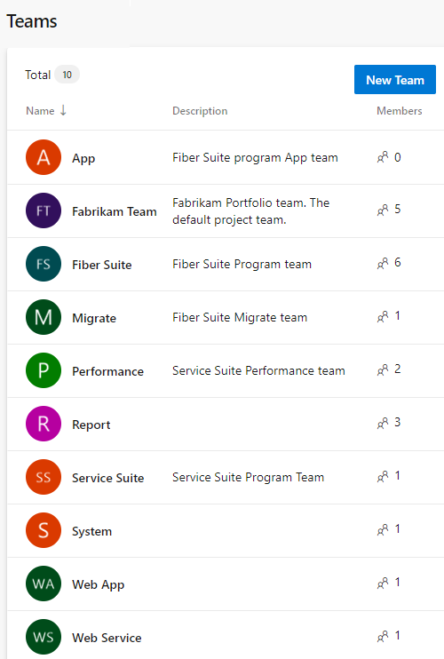

> [!NOTE]   
> Azure Boards doesn't support a hierarchy of teams. However, by configuring the Area Paths as indicated in this article, you effectively create a type of team hierarchy. The hierarchy is defined through the structure of Area Paths.  

We'll then configure the area path to the following hierarchy and configuring each team's area path. This configuration supports each team's backlog view and rollup of views within the hierarchy.  

> [!div class="mx-imgBorder"]  
> 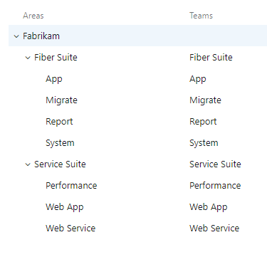

> [!TIP]    
> If you have a large number of teams, area paths, and iterations that you need to add, you may want to use command line or programmatic tools. See the [Command line and  programmatic tools](#command-line-and-programmatic-tools) provided later in this article. 

In this way, all teams can manage their own workload and priorities while clearly understanding how their work supports those epics managed in the portfolio team's backlog. At the same time, the portfolio team can monitor progress of its backlog on their own Kanban board, prioritize the items on their backlog, and view progress across release trains.

While the above may sound complicated, it actually takes little configuration to set up the teams and get started.
In order to go from one project with one default team, we'll first define each team while automatically creating a default area path for that team. Then we'll reconfigure the flat set of area paths to a hierarchical structure. Next, will define the iteration paths to support the release structure we want and the program and Agile teams to use. Lastly, we'll configure each team and populate the membership of teams.  

<a id="define-teams" />

## Define your teams 

To start, we'll add each team, creating a default area path for each. Later in this article, we'll configure those area paths into the necessary hierarchy. This structure maps the following SAFe® teams to Azure Boards teams:  
- Portfolio team -> default top-level team, the Fabrikam team (already defined) 
- Program teams -> secondary-level teams, Fiber Suite and Service Suite  
- Agile teams -> tertiary-level teams defined under Fiber Suite and Service Suite.  

You'll need to be a [project administrator](../../organizations/security/add-users-team-project.md) to perform these steps. If you need more-detailed guidance, see [Portfolio management](portfolio-management.md).  

Add each team, one by one.

> [!NOTE]   
> The following procedure uses the **New Teams Page** user interface that is in preview. To enable this feature, see [Manage or enable features](../../project/navigation/preview-features.md).

1. From the web portal, choose **Project settings** and open **Teams**. 

	> [!div class="mx-imgBorder"]
	> 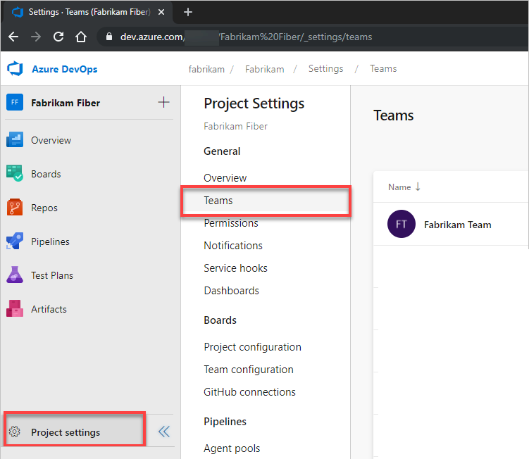

1. Choose **New team**. 

	> [!div class="mx-imgBorder"]
	> 

1. Give the team a name, and optionally a description. 

	Here we add the *App* team. Choose the team administrator and ensure the **Create an area path with the name of the team** checkbox is checked. Optionally add team members.  

	> [!div class="mx-imgBorder"]
	> 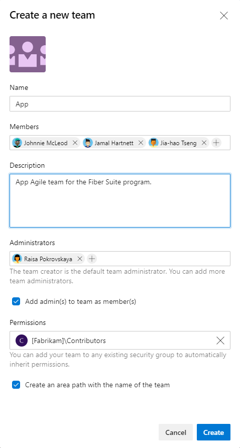

	Assign the team's Scrum Master, Program Manager, or Portfolio Manager as the team administrator. As team administrators, they can configure their team's tools to support their Agile practices and business needs. 

1. Repeat steps 2 and 3 to define all teams.  

1. Optional. If you have two or more Portfolio teams, create a team for each of them.   

<a id="configure-area-paths" /> 

## Configure Area Paths 

To support your team hierarchy, you'll now configure the area paths created in the first step of defining teams into a hierarchy. 

1. From the **Project Settings** page, choose **Project configuration** and then **Areas**. You should see a flat list of Area Paths. 

	> [!div class="mx-imgBorder"]
	> 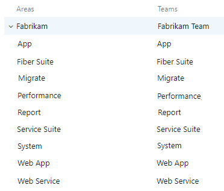

2. You'll want to choose each feature team's Area Path under the top Area Path and move it under the Area Path hierarchy to which it belongs. 

    You can drag and drop each area path under the parent node where it belongs. For example, here we drag the Migrate node to the Fiber Suite node. 

	> [!div class="mx-imgBorder"]
	> 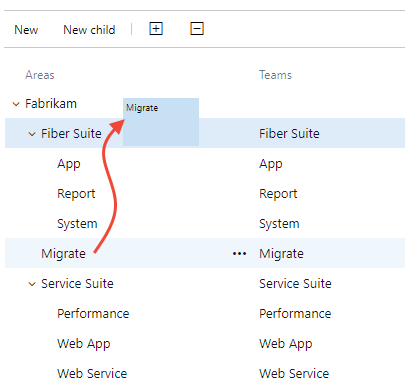

	Alternatively, you can open the conext menu for the Area Path, choose Edit, and select the node where you want to move it.  

3. Repeat step 2 and 3 for the remaining Agile team area paths. 

	If you have defined two or more portfolio teams, you'll need to change the move each program team's area path under their corresponding portfolio team's area path. 

3. When finished, your area path structure should appear similar to that shown in the following image.  

	> [!IMPORTANT]  
	> This structure shows that area paths are owned by Agile teams, program teams, and the portfolio team. We'll correct this structure later in this article when we configure each team to be the sole owner of its area path.   

	> [!div class="mx-imgBorder"]
	> 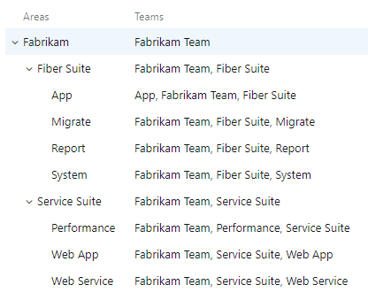

## Define Iteration Paths  

To track progress towards Releases, create your iteration path structure. Unlike area paths, multiple teams can share the same iteration path structure. Sharing the iteration structure lets multiple teams work in the same sprint cadence towards the same release trains.  

> [!IMPORTANT]  
> Deleting, renaming, or moving iteration paths causes a loss of associated historical data.   

If you already have iterations for your default team, you can rename them. You'll want to create an iteration structure that supports your entire team structure, not just one team.  

1. From the **Project Settings** page, choose **Project configuration** and then **Iterations**.  

1. Under the default iteration, which shares the same name as the project, create a child iteration that will represent your first program increment (PI). Optionally, add a start and end date for the PI, but keep in mind that the iteration will be broken down further into sprints.

	> [!div class="mx-imgBorder"]
	> 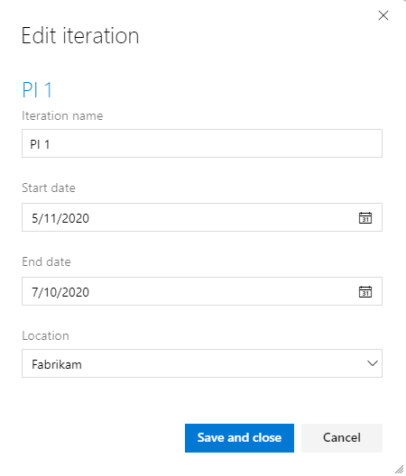 

2. Next, create a child iteration for each Sprint within the PI. Set dates for these sprints to correspond your Agile teams' cadences.  

	> [!div class="mx-imgBorder"]
	> 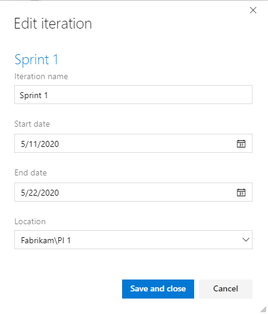

3. Continue to add as many iterations as needed to meet the timebox cadence structure for all your teams. 

	When finished, you should have a structure similar to the following image. 

	> [!div class="mx-imgBorder"]
	> 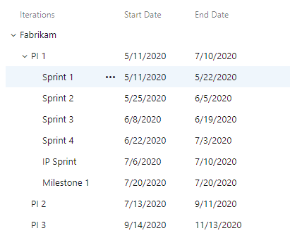

	> [!TIP]
	> You can drag and drop Iteration Paths to structure your iterations, similar to as shown in Step 2 under Configure Area Paths. Azure Boards always lists the iteration paths in order of their dates under each parent node. 

<a id="configure-your-teams" /> 

## Configure your teams 

Now that your teams, Area Paths, and Iteration Paths are defined, the next step is to configure each team. You'll want to configure the following settings for each team. 
- Active backlogs
- Working with bugs  
- Set default Iteration Path
- Select team Iteration Paths 

The following table lists the recommended settings to make based on the team level.

***
:::row:::
   :::column span="":::
     **Configure**
   :::column-end:::
   :::column span="":::
      **Agile feature team**
   :::column-end:::
   :::column span="":::
      **Program team**
   :::column-end:::
   :::column span="":::
      **Portfolio team**
   :::column-end:::
:::row-end:::
:::row:::
   :::column span="":::
      Backlog navigation levels
   :::column-end:::
   :::column span="":::
      Features, Stories  
   :::column-end:::
   :::column span="":::
      Features, Stories  
   :::column-end:::
   :::column span="":::
      Epics
   :::column-end:::
:::row-end:::
:::row:::
   :::column span="":::
      Working with bugs
   :::column-end:::
   :::column span=""::: 
      Bugs are managed with requirements
   :::column-end:::
   :::column span=""::: 
      Bugs are not managed on backlogs and boards
   :::column-end:::
   :::column span="":::
      Bugs are not managed on backlogs and boards 
   :::column-end:::
:::row-end:::
:::row:::
   :::column span="":::
      Default Iteration
   :::column-end:::
   :::column span=""::: 
      @CurrentIteration 
   :::column-end:::
   :::column span=""::: 
      @CurrentIteration 
   :::column-end:::
   :::column span="":::
      @CurrentIteration  
   :::column-end:::
:::row-end:::
:::row:::
   :::column span="":::
      Backlog Iteration
   :::column-end:::
   :::column span=""::: 
      Fabrikam
   :::column-end:::
   :::column span=""::: 
      Fabrikam 
   :::column-end:::
   :::column span="":::
      Fabrikam 
   :::column-end:::
:::row-end:::
:::row:::
   :::column span="":::
      Selected iterations 
   :::column-end:::
   :::column span="":::
      Sprint 1 thru Sprint 4, IP Sprint
   :::column-end:::
   :::column span="":::
      PI 1, PI 2, PI 3
   :::column-end:::
   :::column span="":::
      None
   :::column-end:::
:::row-end:::
:::row:::
   :::column span="":::
      Areas
   :::column-end:::
   :::column span="":::
      Include sub areas
   :::column-end:::
   :::column span="":::
      Exclude sub areas
   :::column-end:::
   :::column span="":::
      Exclude sub areas
   :::column-end:::
:::row-end:::

   
   

***

> [!NOTE]
> By setting the Default Iteration to **\@CurrentIteration**, all work items created from the team's backlog or board are assigned to the current iteration based on the current date. By setting the Backlog Iteration to the root, **Fabrikam**, indicates that only the Area Path acts as a filter for work items to appear on the team backlogs and boards. 

1. From the **Project Settings** page, choose **Team configuration**.  

	Choose the team you want to configure from the Team selector. 

	> [!div class="mx-imgBorder"]
	> 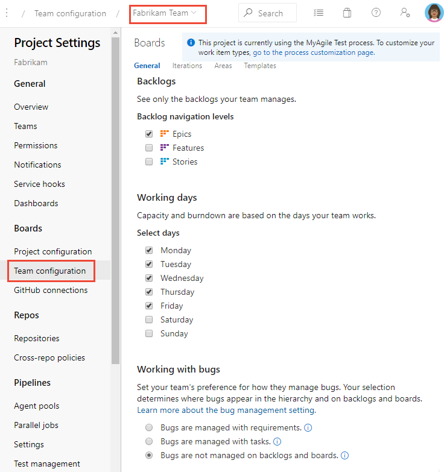

1. On the **General** page, uncheck backlogs you don't want to be active. 

	For example, for the Portfolio team, only check the **Epics** checkbox. 

	> [!div class="mx-imgBorder"]
	> 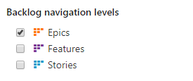

	For program and Agile teams, uncheck the **Epics** checkbox. 

	> [!div class="mx-imgBorder"]
	> 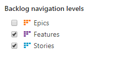

1. For program and portfolio teams, choose the **Working with bugs** radio button as shown. 

	> [!div class="mx-imgBorder"]
	> 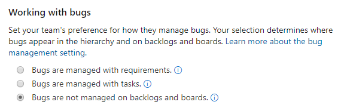

	And, for Agile teams, choose the  **Working with bugs** option to track bugs along with requirements.  

	> [!div class="mx-imgBorder"]
	> 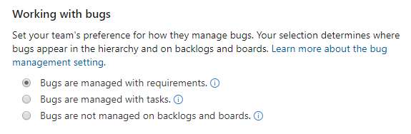

1. Choose the **Iterations** tab to configure the team's iterations. 

	For Agile teams, configure the settings as shown. 

	> [!div class="mx-imgBorder"]
	> 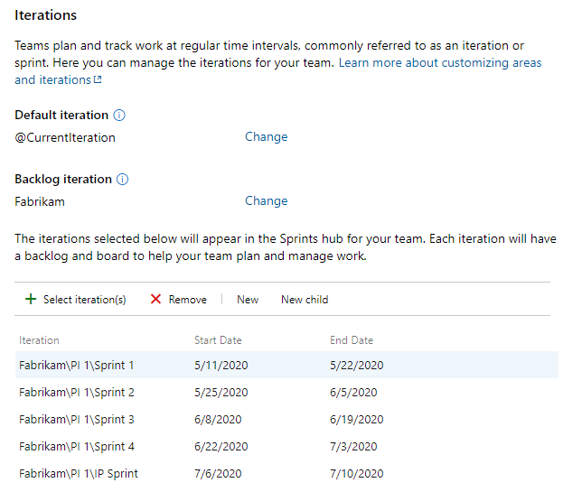

	For program teams, choose only the PI iterations. 

	> [!div class="mx-imgBorder"]
	> 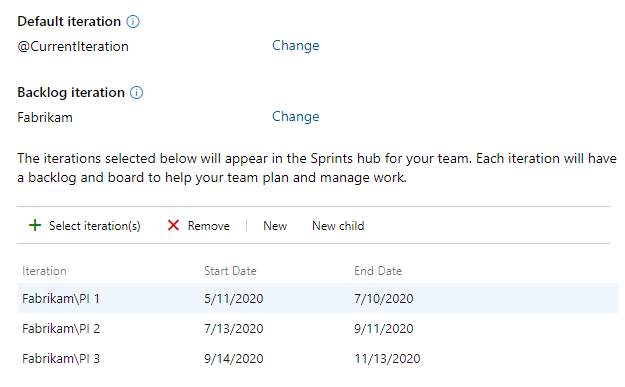

1. For program and portfolio teams, choose the **Areas** tab to change the default setting from **Include sub areas** to **Exclude sub areas**. 

	Open the  :::image type="icon" source="../../media/icons/actions-icon.png" border="false"::: context menu, and choose **Exclude sub areas**.   

	> [!div class="mx-imgBorder"]
	> 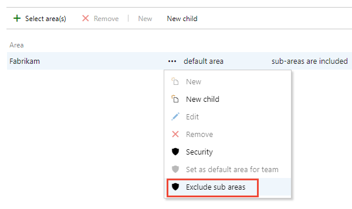  

	> [!NOTE]
	> Because we created each team with the **Create an area path with the name of the team** checked, each team is already preconfigured with their default area path. This Area Path acts as the main filter for work items that appear on each team's backlogs and boards. 

1. Repeat steps 2 through 5 as needed for each team you need to configure. 

1. After you've completed step 5 for all teams, verify the Area Path-Team structure. Choose **Project configuration** and **Areas**. The Area Path and team structure should now appear as shown, where each team owns their Area Path and doesn't share it with any other team. 

	> [!div class="mx-imgBorder"]
	>  

## Configure teams to support Shared Services 

For teams that support several other teams, such as a UX Design team, configure your teams as described in the following steps. 

1. Add a team for each Shared Services team. Refer to [Define your teams](#define-teams) for details.  

1. Return to the **Project configuration>Area Paths** page and under each shared services area path, add sub area paths for each Agile team supported by the shared services. For details, see [Configure Area Paths](#configure-area-paths) provided earlier in this article. 

    For example, here we add four sub area paths under the UX Design area path, one for each Agile team supported by the UX Design team. 

	> [!div class="mx-imgBorder"]
	> 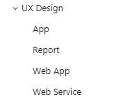

1. Configure each Shared Services team as an Agile feature team as described in [Configure your teams](#configure-your-teams). 

1. For each Agile team, open the **Team configuration>Areas** page as shown in Step 5 of [Configure your teams](#configure-your-teams). Choose **Select areas** and add the sub area path for that team.   

    Here we add the **UX Design\App** sub area path to the App feature team.  

	> [!div class="mx-imgBorder"]
	> 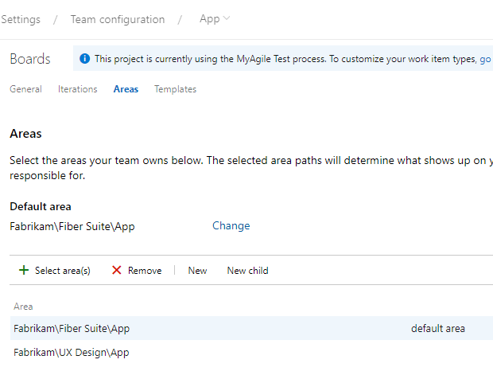

1. Return to the **Project configuration>Area Paths** page and verify that the Area Path structure appears as expected for each Shared Services area path. 

    For the UX Design team, the structure should appear as shown.  

	> [!div class="mx-imgBorder"]
	> 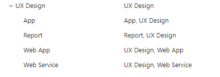

    Work items that appear on shared area paths appear on the backlogs and boards of the associated teams. 

<a id="programmatic-tools" /> 
<a id="command-line-and-programmatic-tools" /> 

::: moniker range=">= azure-devops-2020"

## Command-line and programmatic tools

You can use Azure DevOps command-line tools to add or update the following artifacts:

- **Teams**: [Azure DevOps team create](/cli/azure/boards/iteration/team#ext-azure-devops-az-boards-iteration-team-add) 
- **Area Paths**: [Azure DevOps area project create](/cli/azure/boards/area/project#ext-azure-devops-az-boards-area-project-create)
- **Iteration Paths**: [Azure DevOps iteration project create](/cli/azure/boards/iteration/project#ext-azure-devops-az-boards-iteration-project-create) 

::: moniker-end

::: moniker range="azure-devops-2019"

## Programmatic tools

::: moniker-end

::: moniker range=">= azure-devops-2019"

You can use Azure DevOps REST APIs to add or update the following artifacts:

- **Teams**: [Teams (REST API)](/rest/api/azure/devops/core/teams)  
- **Area Paths**: [Classification nodes (REST API)](/rest/api/azure/devops/wit/classification%20nodes)
- **Iteration Paths**: [Classification nodes (REST API)](/rest/api/azure/devops/wit/classification%20nodes) 

::: moniker-end

## Try this next

> [!div class="nextstepaction"]
> [Customize Azure Boards to support SAFe®](safe-customize.md)  

## Related articles

- [Add teams](../../organizations/settings/add-teams.md)
- [Manage teams and configure team tools](../../organizations/settings/manage-teams.md)
- [Define area paths and assign to a team](../../organizations/settings/set-area-paths.md)
- [Define iteration paths and configure team iterations](../../organizations/settings/set-iteration-paths-sprints.md) 
- [Azure DevOps CLI](/cli/azure//)  
- [Teams (REST API)](/rest/api/azure/devops/core/teams)  

 

