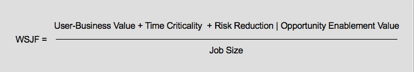

# Customize Azure Boards to support SAFe&reg;  

[!INCLUDE [temp](../includes/version-vsts-tfs-all-versions.md)]

Most of the customizations outlined in this article are optional. 

The main reason to customize your process is to support monitoring or reporting additional metrics. 

However, you may want to consider the following customizations based on your business needs 

In this article you'll learn about select process customizations you can make and why you might want to make them to support your SAFe practices.  
>[!div class="checklist"]      
> * Add custom work item types  
> * Add portfolio backlogs 
> * Customize the workflow 
> * Add custom rules
> * Add custom fields 

:::row:::
   :::column span="":::
      **Configure or customize**
   :::column-end:::
   :::column span="2":::
      **Notes**
   :::column-end:::
:::row-end:::
:::row:::
   :::column span="":::
      Custom work item types
   :::column-end:::
   :::column span="2":::
      Notes
   :::column-end:::
:::row-end:::
:::row:::
   :::column span="":::
      Custom workflow
   :::column-end:::
   :::column span="2":::
      Notes
   :::column-end:::
:::row-end:::
:::row:::
   :::column span="":::
      Custom field
   :::column-end:::
   :::column span="2":::
      Notes
   :::column-end:::
:::row-end:::

## Custom work item types

## Track bugs as requirements or tasks? 

## Custom portfolio backlogs 

## Custom workflow

You may want to customize the workflow so that it matches your workflow process. By doing this early, you set up teams to ... 

> [!div class="mx-imgBorder"]  
>   

## Custom fields and customized fields
Customize pick lists

## Custom rules

::: moniker range="tfs-2013"

## Required customization

If you're working with TFS 2013, see the [Upgrade/Publish TFS 2013 Process Templates with PowerShell: blog post by Gordon Beeming](http://31og.com/post/upgradepublish-tfs-2013-process-templates-with-powershell). This post provides a PowerShell script which you can use to apply the customizations documented in the TFS 2013 version of this article.   

::: moniker-end 

<a id="project-scale" />

## When to add another project 
 

- [About projects and scaling your organization](../../organizations/projects/about-projects.md)

- [Plan your organizational structure](../../user-guide/plan-your-azure-devops-org-structure.md)

<a id="wsjf" />

## WSJF (Weighted Shortest Job First)

We recommend using the [WSJF extension by Microsoft DevLabs](https://marketplace.visualstudio.com/items?itemName=MS-Agile-SAFe.WSJF-extension) to compute and store WSJF for your SAFe® deliverables. 
 
SAFe® defines WSJF (Weighted Shortest Job First) as a calculation of cost of delay versus job size. This value can help teams prioritize their portfolio backlogs with the items contributing the highest ROI.

 

Four values are used to calculate WSJF:

- Business Value
- Time Criticality
- Risk Reduction | Opportunity Enablement Value
- Job Size

 

For details on adding and managing the extension, see the [WSJF extension overview](https://marketplace.visualstudio.com/items?itemName=MS-Agile-SAFe.WSJF-extension). 

## Related articles

<!--- To be provided --> 
