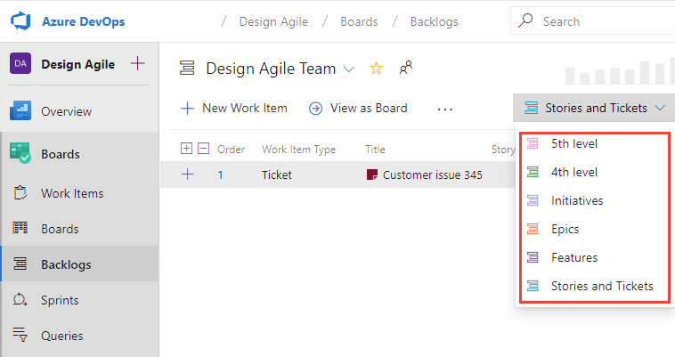

# Customize Azure Boards to support SAFe&reg;  

[!INCLUDE [temp](../includes/version-azure-boards-plus-azure-devops-server-2020.md)]

The main reason to customize your process is to support tracking and monitoring progress, reporting on key metrics, and meeting specific business requirements. In this article you'll learn about select process customizations you can make and why you might want to make them to support your SAFe® practices. Most of these customizations are optional. 

Specifically, you'll learn how Azure Boards supports SAFe® practices through the following operations. 

>[!div class="checklist"]      
> - Customize work item types or add custom work item types 
> - Add a custom field or customizing existing fields  
> - Customize the workflow  
> - Add custom rules to a work item type   
> - Add custom controls or custom extensions  
> - Customize your backlogs or add a custom portfolio backlog   

[!INCLUDE [temp](../includes/note-safe-articles.md)]

## About customization and the inherited process

Azure Boards provides a graphical user interface to support customization of your projects. This feature is called the Inherited process. All projects that use an inherited process are automatically updated when customizations are made to that process.  
For an overview of all the customizations you can make to an  inherited process, see [About process customization and inherited processes](../../organizations/settings/work/inheritance-process-model.md). 
 

<a id="customize-wits" />

## Customize work item types 

Each work item type defines the fields that capture and store information. You can customize existing work item types in the following ways to support specific SAFe® tracking requirements.  

- [Add a custom field](#add-custom-field) to support tracking budget costs, value streams, or customer-centric information  
- [Customize existing fields](#customize-fields), such as modifying the picklist or changing a field label  
- [Add custom rules](#custom-rules) to make select fields required or specify actions to take under select conditions 
- [Change the workflow](#custom-workflow) to reflect your team's Kanban workflow process  
- [Add a custom control or extension](#custom-control) to support custom functions such as a calculated field. 

For details on customizing a work item type, see [Add and manage work item types](../../organizations/settings/work/customize-process-work-item-type.md).

<a id="add-custom-field" /> 

## Add a custom field 

You add a custom field to support tracking data requirements that aren't met with the existing set of fields. Some fields to consider adding to one or more work item types include those listed in the following table. 

:::row:::
   :::column span="":::
      **Field name**
   :::column-end:::
   :::column span="":::
      **Work Item Types**
   :::column-end:::
   :::column span="2":::
      **Notes**
   :::column-end:::
:::row-end:::
:::row:::
   :::column span="":::
      Budget cost
   :::column-end:::
   :::column span="":::
      Feature, Epic
   :::column-end:::
   :::column span="2":::
      Use to capture estimated costs. Can use rollup to capture the total estimated cost of an Epic's Features.
   :::column-end:::
:::row-end:::
:::row:::
   :::column span="":::
      Category or Group
   :::column-end:::
   :::column span="":::
      Feature, Epic, User Story
   :::column-end:::
   :::column span="2":::
      Use to specify a picklist to indicate the work item is cataloged as one of the following SAFe® categories: *Feature*, *Capability*, *Enabler*, or *Solution*.  
   :::column-end:::
:::row-end:::
:::row:::
   :::column span="":::
      Milestone
   :::column-end:::
   :::column span="":::
      Feature, Epic, User Story
   :::column-end:::
   :::column span="2":::
      Use to specify a picklist of Milestone of Events which a story, feature, or epic should meet.
   :::column-end:::
:::row-end:::
:::row:::
   :::column span="":::
      Value Stream
   :::column-end:::
   :::column span="":::
      Feature, Epic, User Story
   :::column-end:::
   :::column span="2":::
      Use to specify a picklist to support a taxonomy of value streams you want to associate with work. 
   :::column-end:::
:::row-end:::

For details on adding a custom field, see [Add a custom field to a work item type](../../organizations/settings/work/add-custom-field.md). 

### Field versus tags usage  

You can capture a value stream using a field or tags. Tags represent a more informal and adhoc method for categorizing work. A specific field, particularly one with preset items, is more formal. When determining how you want to use tags and fields, consider the following: 

- You can make a field required through custom rules, however, you can't require tags be added to a work item. 
- You can create query charts based on custom fields, however, you can't specify a tag for use in query charts. 
- You can filter backlogs, boards, and queries based on fields or tags. 
- The number of tags created can quickly grow as anyone can add new tags as long as they have the correct permissions. 

<!--- pros/cons of using picklists versus tags  --> 

<a id="customize-fields" /> 

## Customize existing fields  

You customize existing fields to support one or more of the following actions: 
- Relabel the name of the field.
- Change where the field appears on the work item form or remove it from the form. 
- Add or change a picklist (drop-down menu). For example, the *Value Area* provides two options, *Business* and *Architectural*. You can add to this picklist of values. 
- Change the default assignment made to a field. 
- Make a field required.
- [Add a rule to a field](#custom-rules) as described in the next section. 

For an index of existing fields, see [Work item field index](../work-items/guidance/work-item-field.md). For details on customizing a field, see [Add and manage fields for an inherited process](../../organizations/settings/work/customize-process-field.md).  
 

<a id="custom-rules" /> 

## Add rules to a field  

Field rules provide support for a number of business use cases. Rules specify an action to take based on a selected condition. For example you can make a field required based on the value assigned to another field. You can add several rules to a field. 

The following images show the supported conditions and actions you can select from. 

 
::: moniker range="azure-devops"

> [!div class="mx-tdBreakAll"]  
> |Supported conditions |Supported actions |
> |-------------|----------|  
> | | 

::: moniker-end

 

::: moniker range="azure-devops-2020"

> [!div class="mx-tdBreakAll"]  
> |Supported conditions |Supported actions |
> |-------------|----------|  
> | | 

::: moniker-end

::: moniker range="azure-devops-2019"

> [!div class="mx-tdBreakAll"]  
> |Supported conditions |Supported actions |
> |-------------|----------|  
> | | 

::: moniker-end

For details on setting field rules, see [Add a rule to a work item type (Inheritance process)](../../organizations/settings/work/custom-rules.md). 

<a id="custom-workflow" /> 

## Customize the workflow

You may want to customize the workflow for User Stories, Features, and Epics so that it matches your workflow process. By doing this early, you minimize the Kanban board configuration teams must do. 

The default workflow for the Agile process include *New*, *Active*, *Resolved*, and *Closed* states. While each team can add workflow columns to their Kanban board, you might want to customize the workflow to track these additional columns instead. That way the Kanban boards for all teams are set up to use the same workflow states. 

For example, you can add and rename workflow States to match the Kanban columns shown in the following image&mdash;*Backlog*, *Analyze*, *Develop*, *Test*, and *Done*.  

> [!div class="mx-imgBorder"]  
>   

Review with your team's what workflow states will most support their Agile practices. For additional details, review the following articles:  
- [Customize the workflow (Inheritance process)](../../organizations/settings/work/customize-process-workflow.md)  
- [Add columns to your Kanban board](../boards/add-columns.md)  
- [Definition of Done](../boards/definition-of-done.md)  

<a id="custom-control" /> 

## Custom controls 

With custom controls, you can add rich functionality to a work item form. A custom control is an extension that's been added to the [Marketplace Extensions for Azure DevOps](https://marketplace.visualstudio.com/).  

You can add controls from the Marketplace or create your own. 

- [WorkBoard OKRs](https://marketplace.visualstudio.com/items?itemName=wobo-okrs.workboard-ado-extension) Integrates WorkBoard helps organizations align, localize and measure Objectives and Key Results (OKRs) across the business. With this integration, teams can view and update their OKRs from within Azure DevOps. 

<a id="custom-wit" />

## Add custom work item types 

The User Story, Feature, and Epic work item types are meant to support product planning and tracking. However, other work item types might be useful to support your SAFe® organization's customer-centric focus. Specifically, you might want to add work items to capture customer feedback, customer requests, and more. 

When defining a new work item type, think through the following: 
- Information you want to capture, track, and report on 
- How work will be captured 
- The workflow to support tracking the work

To keep things simple, however, it's always best to minimize the amount of customizations you make. So, if you can get by with existing work item types, you might consider adding custom field(s) as needed to track specific information.  

<a id="custom-backlog" />
<a id="add-custom-backlog" />

## Customize your backlogs  

Each team's backlog and board is designed to support specific work item types. For the Agile process, the work item types are as listed. 
- **Agile Release Teams**: User Stories and, optionally, Bugs
- **Program Teams**: Features
- **Portfolio Teams**: Epics

However, you can add other work item types, existing or custom, to these backlogs. Each team can subscribe to the set of backlogs that they need to track. 

Also, you can add up to three additional portfolio backlogs as shown in the following illustration. Portfolio backlogs are designed to be hierarchical. For SAFe, you may want to add a Solution Backlog that appears as a parent to the Epic backlog. 

> [!div class="mx-imgBorder"]  
>   

For details on customizing backlogs, see [Customize your backlogs or boards (Inheritance process)](../../organizations/settings/work/customize-process-backlogs-boards.md). 

## Add even more functionality 

You add the following Marketplace extensions to get access to a number of rich features that support SAFe. 

- [Delivery Plans](../plans/review-team-plans.md)
- [Feature Timeline and Epic Roadmap](https://marketplace.visualstudio.com/items?itemName=ms-devlabs.workitem-feature-timeline-extension)
- [Dependency Tracker](../extensions/dependency-tracker.md)
- [Retrospectives](https://marketplace.visualstudio.com/items?itemName=ms-devlabs.team-retrospectives)

## Try this next

> [!div class="nextstepaction"]
> [Plan and track SAFe® programs and portfolios](safe-plan-track-boards.md) 

## Related articles

Prior to customizing your project, we recommend you read the [Configure and customize Azure Boards](../configure-customize.md). It provides detailed information on administrating a project for several teams and supporting various business objectives.  

See also: 

- [Grant or restrict access](../../organizations/security/restrict-access.md) 
- [Develop a web extension for Azure DevOps Services](../../extend/get-started/node.md)
- [About projects and scaling your organization](../../organizations/projects/about-projects.md)
- [Plan your organizational structure](../../user-guide/plan-your-azure-devops-org-structure.md)

<!--- 

<a id="project-scale" />

## When to add another project 
 

## Required customization

If you're working with TFS 2013, see the [Upgrade/Publish TFS 2013 Process Templates with PowerShell: blog post by Gordon Beeming](https://gordonbeeming.xyz/blogs/dev/2014/9/upgradepublish-tfs-2013-process-templates-with-powershell). This post provides a PowerShell script which you can use to apply the customizations documented in the TFS 2013 version of this article.   

--> 
