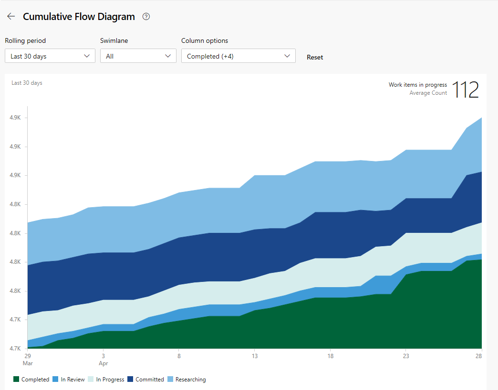

# Metrics and reports

[!INCLUDE [temp](../includes/version-vsts-tfs-all-versions.md)]

Azure Boards provides a number of in-context charts, dashboard widgets, and work tracking charts that allow you to monitor and report on a variety of SAFe metrics.

## Reporting tools

Azure Boards provides the following tools to support teams in deriving metrics and monitoring and reporting progress. 

- In-context reports 
- Managed query charts such as pie, bar, stacked bar, trend, and pivot
- Dashboard widgets 
- Team and project dashboards 
- Analytic Views to support Power BI reports 
- OData queries to use with Power BI reports 

For an overview of these tools, see [About dashboards, charts, reports, & widgets](../../report/dashboards/overview.md).  An additional backlog tool is Forecast which teams can use in their iteration planning. 

Supported SAFe metrics  

## Progress reports 

### Feature and Epic progress reports  

Need to develop a report using Analytics view and Power BI. Want something to approximate the following: 

> [!div class="mx-imgBorder"]  
> 

### Rollup  

Quick progress views are available from each team's backlog through rollup columns. Here's an example that shows progress based on completion of child work items.  

> [!div class="mx-imgBorder"]  
>  

Other rollup options include progress by specific work item types, progress by story points, count of work items, or sum of a numeric field. To learn more, see [Display rollup progress or totals](../backlogs/display-rollup.md). 

## Cumulative Flow Diagram (CFD) 

Each Azure Boards backlog and board provide configurable CFD views. So each team at every level of SAFe implementation can monitor progress using these built-in charts. 

The following image shows an example CFD chart for User Stories with all Kanban columns displayed. 

> [!div class="mx-imgBorder"]  
> 

Teams can use their CFD to identify bottlenecks and monitor the batch size of work in their various Kanban states. 

In-context CFD charts are quickly accessible from each backlog and board view. Also, CFD charts can be added to team and project dashboards. To learn more, see [View/configure a Cumulative Flow Diagram](../../report/dashboards/cumulative-flow.md).  

## Lead time and cycle time charts

Other metrics that teams use are derived from the Lead time and cycle time charts. These charts can be added to a team dashboard and monitored to learn the following information: 

- Lead time: Days on average to complete deliverables from date created
- Lead time: Days on average to complete deliverables from date work started
- Number of outliers 
 
Both Lead Time and Cycle Time widgets display as scatter-plot control charts. They display summary information as well as provide several interactive elements. To learn more, see [Cumulative flow, lead time, and cycle time guidance](../../report/dashboards/cumulative-flow-cycle-lead-time-guidance.md). 

#### Example Lead Time widget

> [!div class="mx-imgBorder"]  
>  

#### Example Cycle Time widget

> [!div class="mx-imgBorder"]  
>  

## Iteration planning, team velocity, and forecast

Team velocity is often used as an input to support iteration or sprint planning.  

## Team velocity  

Each team has access to their velocity through the in-context velocity report. These reports show a bar chart count of planned, completed, completed late, and incomplete work items for the last six or more iterations. As shown in the example below, the chart also provides the average velocity calculated for the number of iterations shown. 

> [!div class="mx-imgBorder"]  
>   

This average can be used to forecast work by plugging it into the forecast tool. 

## Forecast tool 

By assigning Story Points to each User Story, a team can determine how much work they can complete using the Forecast tool. For details on its usage, see [Forecast your product backlog](../sprints/forecast.md).

> [!div class="mx-imgBorder"]  
> 

<a id="misc-artifacts" />

## Iteration goals, managing dependencies, and other ... 

Use Team dashboards to capture Iteration Goals. 

