# Plan and track SAFe® programs and portfolios  

[!INCLUDE [temp](../includes/version-azure-boards-plus-azure-devops-server-2020.md)]

Once you've configured your Agile tools to support SAFe®, trace relationships can be created from Stories all the way up to Epics. Additionally, you can view progress from the portfolio, program, and feature team levels.  

This article walks you through some of the basic tools you'll use to plan and track your SAFe® programs and portfolios. Specifically, you'll learn how to quickly perform these tasks:

>[!div class="checklist"]      
> - Define epics, features, and stories  
> - Group or map stories to features, and features to epics
> - Assign value streams  
> - Plan a sprint 
> - Review feature team progress
> - Review program features
> - Review portfolio epics 

[!INCLUDE [temp](../includes/note-safe-articles.md)]

## Define Portfolios and Epics 

To get started, each team needs to add work items for each deliverable that supports the product vision. Each team can do that by working from their backlog and then mapping their work to create a hierarchy of work. 

Or, they can develop a list of work items and import them using Excel. By specifying each team's area path for each work item, they create the mapped hierarchy. 

The following sections indicate how to work from Excel or through the web portal. 

### Import a top-down plan using Excel  

You can import work items using Excel. As shown in the following image, Epics, Features, and User Stories are defined in a tree-list with their Value Area, Area Path and a few tags defined. The State value is New. 

> [!div class="mx-imgBorder"]
> 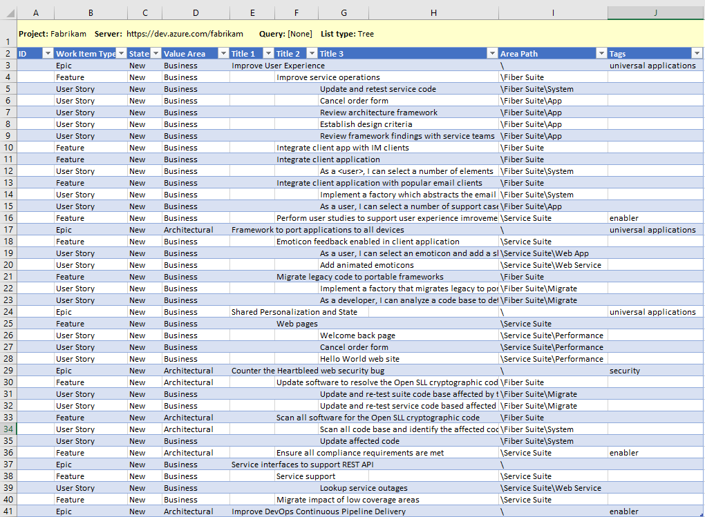 

Once you publish the list, work item IDs are assigned. Each team can then start working with their work items, adding details and assigning work to team members and to sprints. 

To learn more about bulk update, see the [Bulk add or update work items](#bulk-update) section provided later in this article. 

### Document Portfolio Vision and Strategic Themes  

We recommend you use the project wiki to capture and share the Portfolio Vision, Strategic Themes and other information relevant to your programs. Consider defining and sharing the following information:  

- How to use tags or custom fields to specify value streams 
- Taxonomy terms as described in [Scale Agile to Large Teams](/devops/plan/scaling-agile)
- How release trains and sprints are used 
- Key milestones and events  
- Customer centric programs 

Information can be easily shared and updated by any member of the team. 
To learn more about using the project wiki, see [About Wikis, READMEs, and Markdown](../../project/wiki/about-readme-wiki.md)

### Define and prioritize Epics

1. Open the Fabrikam team's Epics portfolio backlog and choose **New Work Item**. 
	Enter the title of the Epic and choose **Add at selection**. 

	> [!div class="mx-imgBorder"]
	> 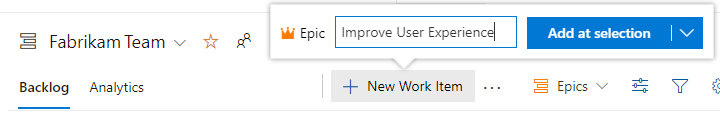

2.	Continue adding Epics as needed by continuing to type in their titles. You can add details later. 

	When finished, you should have a list of Epics as shown: 

	> [!div class="mx-imgBorder"]
	> 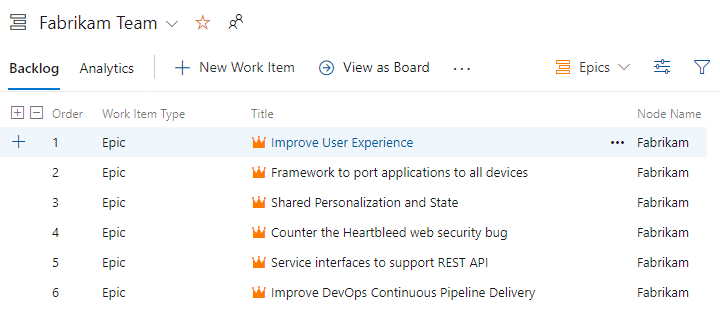

3. As needed, you can drag and drop Epics within the list to reflect their priority. 

4. Define details. Choose each work item title to open the form. Add information to the Description, assign to an owner, add tags, and choose the Value Area. 

	Here we assign the first epic to Jamal, add a Description, and specify Business for the Value Area. 

	> [!div class="mx-imgBorder"]
	> 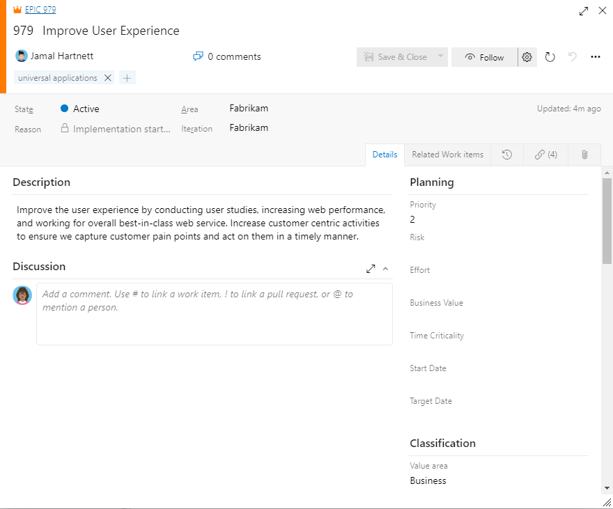

	To perform bulk updates to several work items, see [Bulk add or update work items](#bulk-update) section provided later in this article. 

> [!NOTE]   
> Since an important aspect of SAFe® is to map work to business or architecture goals, you'll want to make sure to set the **Value Area**=*Architectural* for any Feature mapped to an architecture epic. Because the default choice is *Business*, you don't have to change the field for any item that supports a business epic. You can also add tags to track the investment.  
> 
> The same principles apply to Stories in progress. You can map them to Features, change the **Value Area** to *Architecture* for work that you do to support architectural epics, and add tags for tracking themes.  

## Define Programs and Features

In a similar fashion to portfolio teams, program teams work from their Features backlog and define the features that support the Epics they are tasked with delivering. 

Each program manager defines and prioritizes their features. Here, we show the Fiber Suite team add Features. 

###  Define Features

1. Open the Fiber Suite team's Features backlog and choose **New Work Item**. 

	Enter the title of the Feature and choose **Add at selection**. 

	> [!div class="mx-imgBorder"]
	> 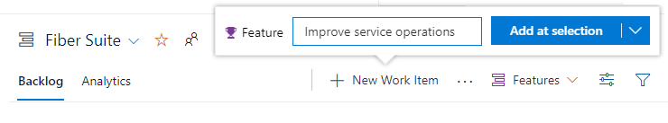

2.	Continue adding Features as needed by continuing to type in their titles. You can add details later. 

	When finished, you should have a list of Features as shown. The Node Name indicates the last node in the area path specified for the work item. By adding Features from the team's Feature Backlog, the Area Path is automatically assigned the team's Default Area Path. For the Fiber Suite, that is Fabrikam\Fiber Suite. 

	> [!div class="mx-imgBorder"]
	> 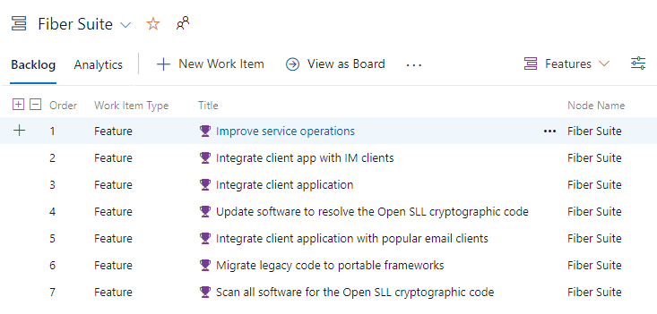

3. As needed, you can drag and drop Features within the list to reflect their priority. 

4. Define feature details. Choose each work item title to open the form. Add information to the Description, assign to an owner, add tags, and choose the Value Area. 

### Map Features to Epics 

In this next step you'll map each Feature to it's parent Epic. The Mapping tool quickly create parent-child links between Epics and Features. 

1. From the Features backlog, choose the :::image type="icon" source="../../media/icons/view-options-icon.png" border="false"::: view options icon and select **Mapping**.  

	> [!div class="mx-imgBorder"]
	> 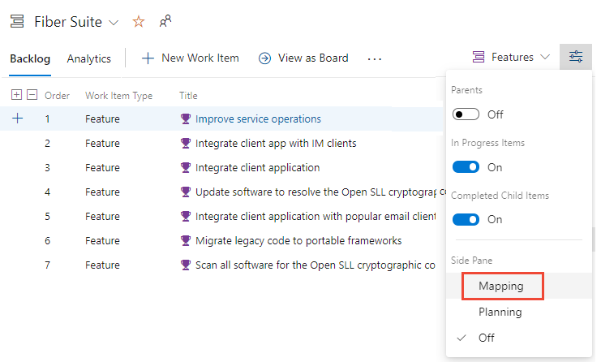

2.	Choose the Fabrikam Team's backlog of Epics.   

	> [!div class="mx-imgBorder"]
	> 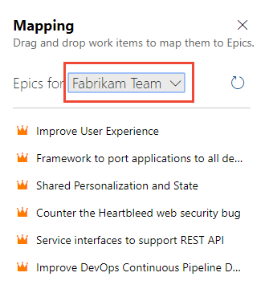

1. One by one, drag each Feature onto it's parent Epic. 

	> [!div class="mx-imgBorder"]
	> 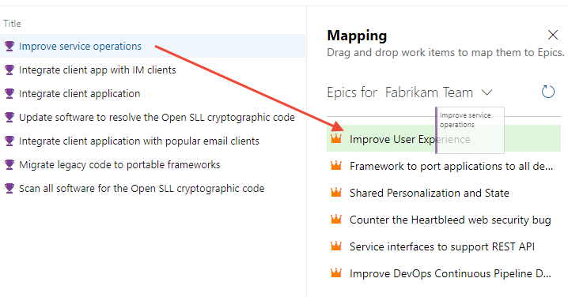

1.	When finished, choose the :::image type="icon" source="../../media/icons/view-options-icon.png" border="false"::: view options icon and enable **Parents** and turn **Mapping** off. 

	Your list should look something like that shown in the following image. The   :::image type="icon" source="../../media/icons/info.png" border="false":::  info icon appears next to each Epic, indicating that the work item is owned by another team than the one currently selected.  

	> [!div class="mx-imgBorder"]
	> 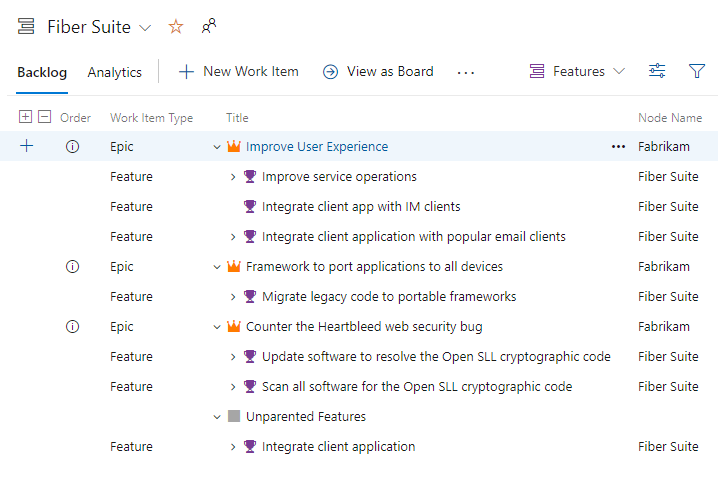

## Define Agile feature team deliverables 

In a similar manner to portfolio and program teams, each Agile feature team add Stories to their backlog to support the Features assigned to them. 

###  Define Stories

1. Open the App team's Stories backlog and choose **New Work Item**. 

	Enter the title of the User Story and choose **Add at selection**. 

	> [!div class="mx-imgBorder"]
	> 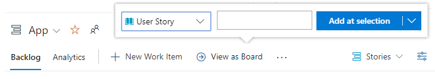

2.	Continue adding User Stories as needed by continuing to type in their titles. You can add details later. 

	When finished, you should have a list of Stories as shown: 

	> [!div class="mx-imgBorder"]
	> 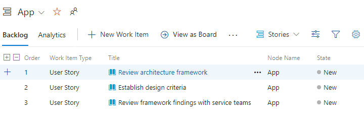

3. As needed, you can drag and drop User Stories within the list to reflect their priority. 

4. Define story details. Choose each work item title to open the form. Add information to the Description and Acceptance Criteria, assign to an owner, add tags, specify the Story Points, and choose the Value area. 

	> [!div class="mx-imgBorder"]
	> 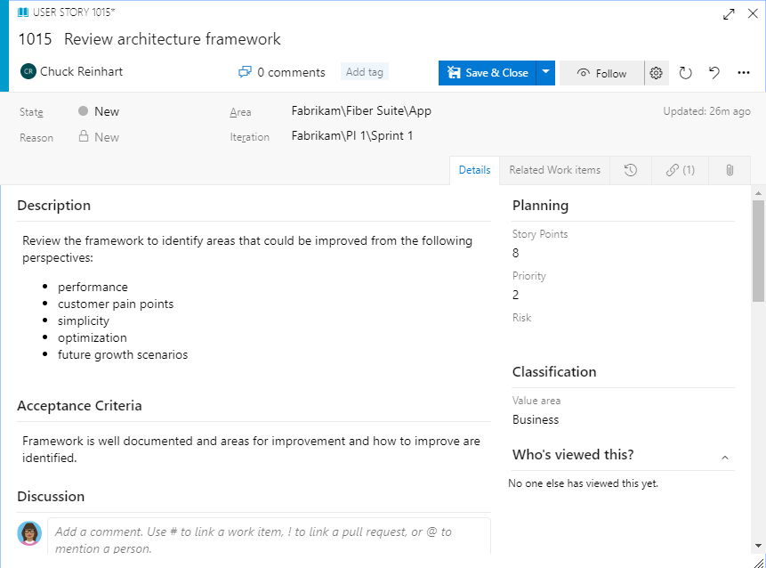

	To perform bulk updates to several work items, see [Bulk add or update work items](#bulk-update) section provided later in this article. 

### Map Stories to Features 

Just as you earlier mapped each Feature to it's parent Epic, now you'll map each User Story to it's parent Feature. The Mapping tool quickly create parent-child links between Features and User Stories. 

1. From the Stories backlog, choose the :::image type="icon" source="../../media/icons/view-options-icon.png" border="false"::: view options icon and select **Mapping**.  

	> [!div class="mx-imgBorder"]
	> 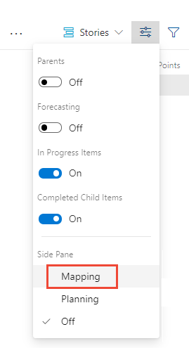

2.	Choose the Fiber Suite's backlog of Features. 

	> [!div class="mx-imgBorder"]
	> 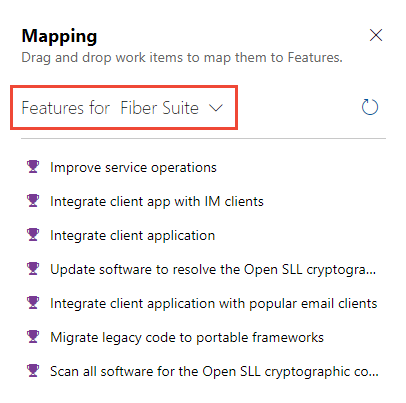

1. One by one, drag each User Story onto it's parent Feature. 

	> [!div class="mx-imgBorder"]
	> 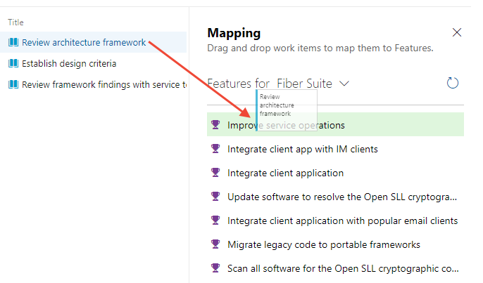

1.	When finished, choose the :::image type="icon" source="../../media/icons/view-options-icon.png" border="false"::: view options icon and enable **Parents** and turn **Mapping** off. 

	Your list should look something like that shown in the following image. The  :::image type="icon" source="../../media/icons/info.png" border="false":::  info icon appears next to each Epic and Feature, indicating that the work item is owned by another team than the one currently selected.  

	> [!div class="mx-imgBorder"]
	> 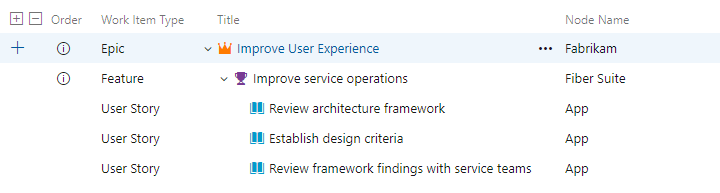

## View Kanban boards, update status  

Each team's Kanban board provides a visual interactive space for the team to plan and update status. With it, your team can track the critical information they need by seeing which work items are in progress, where the bottlenecks are, who work is assigned to, and more.

For an overview of Kanban board tools and usage, see [About Boards and Kanban](../boards/kanban-overview.md). Each team can customize the boards columns, card fields, card styles, and more. To learn more, see [Customize your boards](../get-started/customize-boards.md).

### Open a Kanban Board  

You open the Kanban board from any backlog by choosing the **View as Board** link. 

> [!div class="mx-imgBorder"]
> 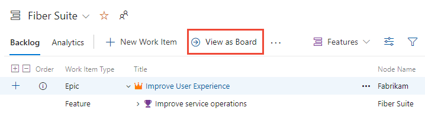

Each board supports the following tasks: 
- Add work items and child work items
- Update status through drag-and-drop
- Add and specify the labels of each column
- Configure the display of cards, add tags, fields, and apply rules 
- Configure swimlanes and set WIP limits 
- Assign values or update fields displayed on cards 
- Filter based on keywords and key fields

<a id="portfolio-team-board" />

### Portfolio Kanban board  

Child items of Epics are listed within each card. You can expand and collapse the list of child items. 

> [!div class="mx-imgBorder"]
> 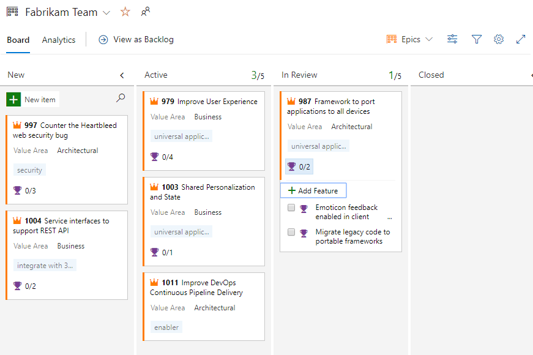
 
<a id="program-team-board" />

### Program team Kanban board 

> [!div class="mx-imgBorder"]
> 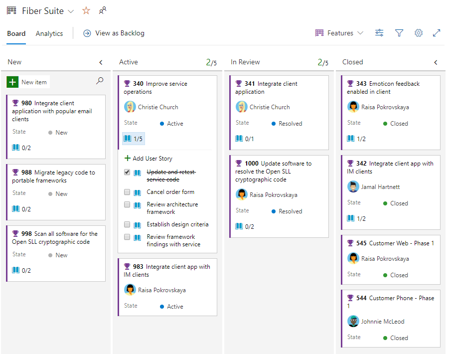

<a id="agile-team-board" />

### Agile team Kanban board 

> [!div class="mx-imgBorder"]
> 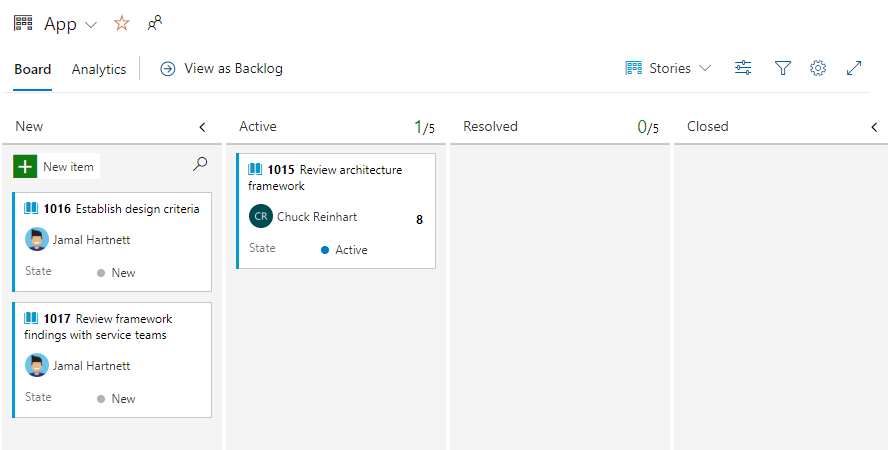

## Plan a sprint 

Each Agile release team can plan their sprints using the sprint planning tools. Starting with sprint planning, each team can move their backlog items to a sprint using the Planning tool. 

As shown in the following image, the App team plans their sprints. 

> [!div class="mx-imgBorder"]
> 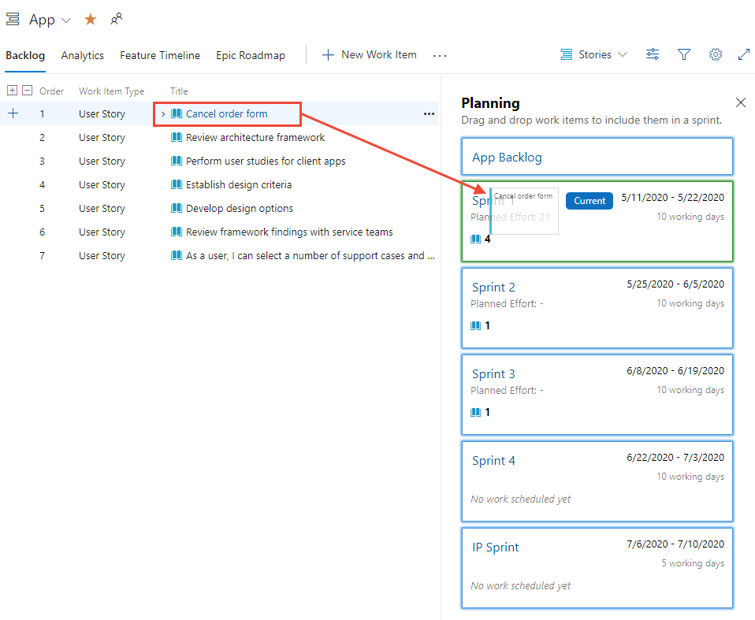

To learn more about planning and conducting sprints, see the tutorials for [Plan and work a sprint](../sprints/assign-work-sprint.md). 

## Plan a release train  

In a similar manner to Agile release teams sprint planning, each program team can plan a release train. 

Here we show the Fiber Suite program team plan the releases for their features.  

> [!div class="mx-imgBorder"]
> 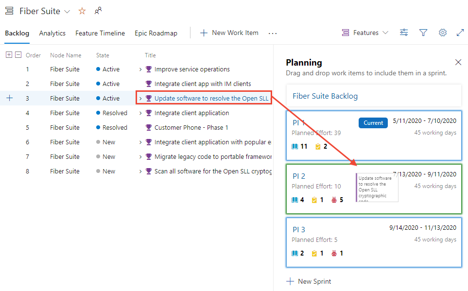

<a id="work-item-tips" />

## Tips for working with work items  

When creating and updating work items, understand what you can and can't do.  
- You can only assign a work item to one team member; if you need to assign similar work to more than one user, copy the work item and make the assignment 
- Can only assign a work item to a single Area Path and Iteration Path
- The quickest way to add backlog work items is from the backlog or Kanban board 
- You can use [work item templates](../backlogs/work-item-template.md) to quickly fill in work item fields

<a id="bulk-update" />

## Bulk add or update work items 

Common fields you may want to bulk update include: 
- Area Path
- Assigned to
- Iteration Path
- Tags (Add or Remove) 
- Value Area 

You can bulk update and change the work item type from the web portal. Or, if needed, you can remove of delete work items. See the following articles:

- [Bulk modify (web)](../backlogs/bulk-modify-work-items.md)  
- [Move or change work item type](../backlogs/move-change-type.md)  
- [Remove or delete work items](../backlogs/remove-delete-work-items.md)   

Also, you can bulk add or update work items with the following tools: 

- [Bulk add or modify work items (Excel)](../backlogs/office/bulk-add-modify-work-items-excel.md)
- [Bulk import or update work items (CSV)](../queries/import-work-items-from-csv.md)  

## Try this next

> [!div class="nextstepaction"]
> [Review progress, delivery plans, and roadmaps](safe-review-roadmaps-progress.md) 

## Related articles

- [About work items](../work-items/about-work-items.md)  
- [About Boards and Kanban](../boards/kanban-overview.md)  
- [About About Sprints, Scrum and project management](../sprints/scrum-overview.md)  
- [Plan and work a sprint](../sprints/assign-work-sprint.md)  
- [Use work item templates](../backlogs/work-item-template.md)  
- [Track your work when assigned to two or more teams](../sprints/set-capacity.md#track-capacity-per-team)

