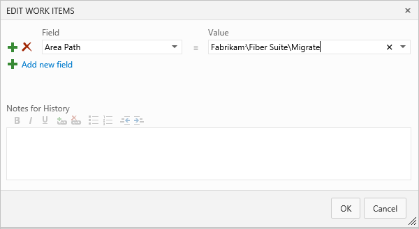
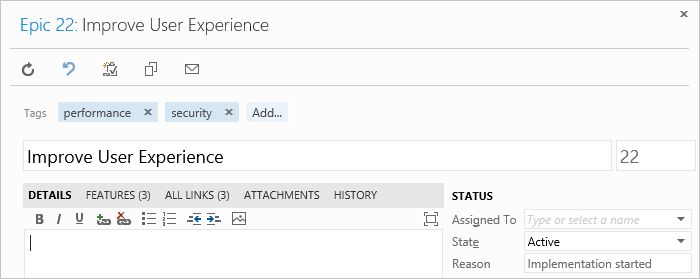
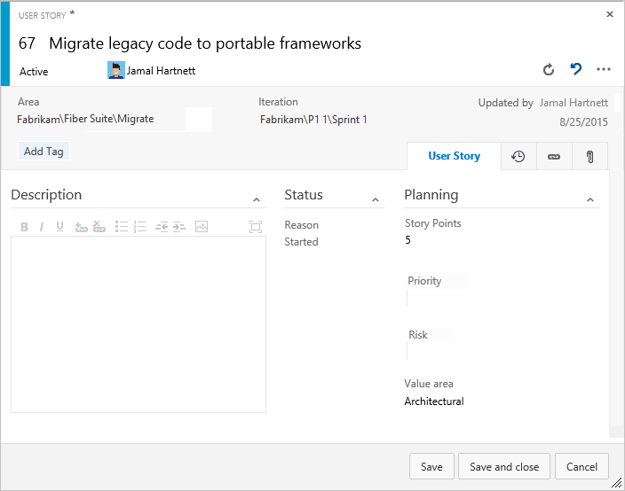

# Plan and track SAFe® programs and portfolios  

[!INCLUDE [temp](../includes/version-vsts-only.md)]

Once you've configured your Agile tools to support SAFe®, trace relationships can be created from Stories all the way up to Epics. Additionally, you can view progress from the portfolio, program, and feature team levels.  

This article walks you through some of the basic tools you'll use to plan and track your SAFe® programs and portfolios. Specifically, you'll learn how to quickly perform these tasks:

>[!div class="checklist"]      
> - Define epics, features, and stories  
> - Group or map stories to features, and features to epics
> - Assign value streams  
> - Plan a sprint 
> - Review feature team progress
> - Review program features
> - Review portfolio epics 

> [!TIP]    
> If you have a number of Epics, Features, or Stories already defined, you can bulk import them using a CSV file or through Excel. Also, you can use these tools to update a number of fields to existing work items. To learn more about bulk update, see the [Bulk add or update work items](#bulk-update) section provided later in this article. 

[!INCLUDE [temp](../includes/note-safe-articles.md)]

## Define Portfolios and Epics 

Portfolio teams can perform the following tasks as indicated. 

### Document Portfolio Vision and Strategic Themes  

We recommend you use the project wiki to capture and share the Portfolio Vision, Strategic Themes and other information relevant to your programs. Consider defining and sharing the following information:  

- How to use tags or custom fields to specify value streams 
- Taxonomy terms as described in [Scale Agile to Large Teams](/azure/devops/learn/agile/scale-agile-large-teams)
- How release trains and sprints are used 
- Key milestones and events  
- Customer centric programs 

Information can be easily shared and updated by any member of the team. 
To learn more about using the project wiki, see [About Wikis, READMEs, and Markdown](../../project/wiki/about-readme-wiki.md)

### Define and prioritize Epics

1. Open the Fabrikam team's Epics portfolio backlog and choose **New Work Item**. 
	Enter the title of the Epic and choose **Add at selection**. 

	> [!div class="mx-imgBorder"]
	> 

2.	Continue adding Epics as needed by continuing to type in their titles. You can add details later. 

	When finished, you should have a list of Epics as shown: 

	> [!div class="mx-imgBorder"]
	> 

3. As needed, you can drag and drop Epics within the list to reflect their priority. 

4. Define details. Choose each work item title to open the form. Add information to the Description, assign to an owner, add tags, and choose the Value Area. 

	Here we assign the first epic to Jamal, add a Description, and specify Business for the Value Area. 

	> [!div class="mx-imgBorder"]
	> 

	To perform bulk updates to several work items, see [Bulk add or update work items](#bulk-update) section provided later in this article. 

> [!NOTE]   
> Since an important aspect of SAFe® is to map work to business or architecture goals, you'll want to make sure to set the **Value Area**=*Architectural* for any feature mapped to an architecture epic. Because the default choice is *Business*, you don't have to change the field for any item that supports a business epic. You can also add tags to track the investment.  
> 
> The same principles apply to user stories in progress. You can map them to features, change the requirement type to Architecture for work that you do to support architectural epics, and add tags for tracking themes.  

## Define Programs and Features

In a similar fashion to portfolio teams, program teams work from their Features backlog and define the features that support the Epics they are tasked with delivering. 

Each program manager defines and prioritizes their features. Here, we show the Fiber Suite team add Features. 

###  Define Features

1. Open the Fiber Suite team's Features backlog and choose **New Work Item**. 

	Enter the title of the Feature and choose **Add at selection**. 

	> [!div class="mx-imgBorder"]
	> 

2.	Continue adding Epics as needed by continuing to type in their titles. You can add details later. 

	When finished, you should have a list of Features as shown. THe Node Name indicates the last node in the area path specified for the work item. By adding Features from the team's Feature Backlog, the Area Path is automatically assigned the team's Default Area Path. For the Fiber Suite, that is Fabrikam\Fiber Suite. 

	> [!div class="mx-imgBorder"]
	> 

3. As needed, you can drag and drop Features within the list to reflect their priority. 

4. Define feature details. Choose each work item title to open the form. Add information to the Description, assign to an owner, add tags, and choose the Value Area. 

### Map Features to Epics 

In this next step you'll map each Feature to it's parent Epic. The Mapping tool quickly create parent-child links between Epics and Features. 

1. From the Features backlog, choose the  view options icon and select **Mapping**.  

	> [!div class="mx-imgBorder"]
	> 

2.	Choose the Fabrikam Team's backlog of Epics.   

	> [!div class="mx-imgBorder"]
	> 

1. One by one, drag each Feature onto it's parent Epic. 

	> [!div class="mx-imgBorder"]
	> 

1.	When finished, choose the  view options icon and enable **Parents** and turn **Mapping** off. 

	Your list should look something like that shown in the following image. The   info icon appears next to each Epic, indicating that the work item is owned by another team than the one currently selected.  

	> [!div class="mx-imgBorder"]
	> 

## Define Agile feature team deliverables 

In a similar manner to portfolio and program teams, each Agile feature team add Stories to their backlog to support the Features assigned to them. 

###  Define Stories

1. Open the App team's Stories backlog and choose **New Work Item**. 

	Enter the title of the User Story and choose **Add at selection**. 

	> [!div class="mx-imgBorder"]
	> 

2.	Continue adding User Stories as needed by continuing to type in their titles. You can add details later. 

	When finished, you should have a list of Stories as shown: 

	> [!div class="mx-imgBorder"]
	> 

3. As needed, you can drag and drop User Stories within the list to reflect their priority. 

4. Define story details. Choose each work item title to open the form. Add information to the Description and Acceptance Criteria, assign to an owner, add tags, specify the Story Points, and choose the Value area. 

	> [!div class="mx-imgBorder"]
	> 

	To perform bulk updates to several work items, see [Bulk add or update work items](#bulk-update) section provided later in this article. 

### Map Stories to Features 

Just as you earlier mapped each Feature to it's parent Epic, now you'll map each User Story to it's parent Feature. The Mapping tool quickly create parent-child links between Features and User Stories. 

1. From the Stories backlog, choose the  view options icon and select **Mapping**.  

	> [!div class="mx-imgBorder"]
	> 

2.	Choose the Fiber Suite's backlog of Features. 

	> [!div class="mx-imgBorder"]
	> 

1. One by one, drag each User Story onto it's parent Feature. 

	> [!div class="mx-imgBorder"]
	> 

1.	When finished, choose the  view options icon and enable **Parents** and turn **Mapping** off. 

	Your list should look something like that shown in the following image. The  info icon appears next to each Epic and Feature, indicating that the work item is owned by another team than the one currently selected.  

	> [!div class="mx-imgBorder"]
	> 

## View Kanban boards, update status  

Each team's Kanban board provides a visual interactive space for the team to plan and update status. With it, your team can track the critical information they need by seeing which work items are in progress, where the bottlenecks are, who work is assigned to, and more.

For an overview of Kanban board tools and usage, see [About Boards and Kanban](../boards/kanban-overview.md). Each team can customize the boards columns, card fields, card styles, and more. To learn more, see [Customize your boards](../get-started/customize-boards.md)

### Open a Kanban Board  

You open the Kanban board from any backlog by choosing the **View as Board** link. 

> [!div class="mx-imgBorder"]
> 

### Portfolio Kanban board  

Child items of Epics are listed within each card. You can expand and collapse the list of child items. 

> [!div class="mx-imgBorder"]
> 
 
### Program team Kanban board 

> [!div class="mx-imgBorder"]
> 

### Agile Feature team's Kanban boards 

> [!div class="mx-imgBorder"]
> 

## Plan a release train  

Fiber Suite 

## Plan a sprint 

App team 

<a id="work-item-tips" />

## Work items tips 

 - Can only assign a work item to one project member 
 - Can only assign to a single Iteration Path
 - Can only assign to a single Area Path 

<a id="bulk-update" />

## Bulk add or update work items 

Common fields you may want to bulk update include: 
- Area Path
- Assigned to
- Iteration Path
- Tags (Add or Remove) 
- Value Area 

You can bulk update and change the work item type from the web portal. Or, if needed, you can remove of delete work items. See the following articles:

- [Bulk modify (web)](../backlogs/bulk-modify-work-items.md)  
- [Move or change work item type](../backlogs/move-change-type.md)  
- [Remove or delete work items](../backlogs/remove-delete-work-items.md)   

Also, you can bulk add or update work items with the following tools: 

- [Bulk add or modify work items (Excel)](../backlogs/office/bulk-add-modify-work-items-excel.md)
- [Bulk import or update work items (CSV)](../queries/import-work-items-from-csv.md)  

## Try this next

> [!div class="nextstepaction"]
> [Review progress, delivery plans, and roadmaps](safe-review-roadmaps-progress.md) 

## Related articles

<!--- To be provided --> 
- [Track your work when assigned to two or more teams](../sprints/set-capacity.md#track-capacity-per-team): Shows how a developer or tester can track work when they support more than one feature team.

<!---
Filtering tips

--> 

<!---
## Map features to epics, and stories to features

The program team can map features to epics using the mapping pane. Feature teams can use the same experience to map their stories to features.
 
  

### Portfolio team's view 

To track the progress of epics that span Releases, the Portfolio team's backlog shows epics. Each epic can be expanded to show the features and user stories that support it.

  

The Portfolio team can also view the progress of epics on their Kanban board.

  

> [!TIP]  
> You can also [customize the card color based on various criteria](../../boards/boards/customize-cards.md#style-rule), such as the Value Area=Architectural, by applying styling rules.  

## Program teams' progress view 

Program teams, primarily concerned with Release Trains, can see the features in their backlog, along with the PIs with which they're associated.

  

Just like the Portfolio team, they can also toggle their view to see which epics their features support, or the user stories that support their features, or both. 
Another view available to program teams shows query-based graphs of release train progress, backlog items, or active tasks during a shipping sprint. A customizable home page view is available to each team.

  

Since so much of a program team's work revolves around PIs and Release Trains, a custom report showing the scheduled shipping dates and what is projected to be on any given train might be useful. In addition, you can take advantage of the [rich reporting options and built-in reports](../../report/dashboards/overview.md).

## Feature teams' view of progress

For individual feature teams, their backlog view shows the Stories that they're working on.

  

Because feature teams don't own epics or features, epics and features don't appear in their team-level backlog views. However, if the team wants to know which epics and features their stories support, they can turn on those views from their backlog.

  

They can also break down their work into tasks and use the taskboard to keep themselves on track during specific sprints.

The chart view of queries becomes very useful in the Innovation and Planning (IP) sprint, when feature teams work together to stabilize the features scheduled for a Release.  

  

For everything else, it is very much business as usual for individual feature teams. They can sprint in their usual cadences, use their Kanban board and taskboard to track progress and break down work into manageable chunks.  

However, now their progress on individual stories is visible to their program and portfolio management teams. The management view reflects what they do.

## Update the Area Path for existing work items

For any existing work items to show up on a team's backlog, you must update the Area path of each work item to the team's default area path. You can use the bulk edit feature from your web browser or you can use Excel.  

1. Create a query that contains the work items you want to edit, select the ones you want to edit, and then open the context menu from any one of the selected items.  

	   

2. Select the area path that corresponds to the team's default area path.  

	   

3.  Bulk save all work items that you modified.

	  

	For more info on bulk modifying work items, see [Bulk modify work items](../backlogs/bulk-modify-work-items.md).

## Add epics and map epics to features

You add epics in the same way you add user stories and features. From the Portfolio team's backlog page for epics, add an epic backlog item.

   

Add as many epics as you need. Drag them to reorder them and have them listed in their order of importance.

   

The default Business Value for epics is Business, but you can change this to Architectural by opening the form.  

  

You can also add tags to your epics, to help you track the investment themes each epic supports.  

Now view your epics on the Kanban board. To get this view, you need to [customize the Kanban columns to rename and add intermediate workflow states](../boards/add-columns.md). For a description of these states&mdash;Funnel, Review, Analysis, Portfolio Backlog, and Implementing (not shown)&mdash;see [Business Epic Kanban Abstract](http://scaledagileframework.com/business-epic-kanban/).

However, this is not very interesting yet. Nothing is in progress, and you can't drill down to see which features support your epics. You'll want to map existing features to the epics you just created, and map user stories to those features, if they're not already mapped.  

## Map multiple items if you've an existing backlog 

Mapping work items is easy using the mapping pane. First, turn on the mapping pane from the features or stories backlog page. Here, we choose the Fiber Suite team and turn on both the mapping pane and the view to see the hierarchy of features mapped to epics.

Note that if you've already changed the area path of all your features to the appropriate program-level team, the features list will be empty, because the Portfolio team does not own any features! In that case, switch to one of the program teams.  

Drag items from the backlog onto the item you want to associate as a parent. Keep in mind that you can only map features to epics. Similarly, you can only map the third level of backlog item (whether that is user story, backlog item, or requirement) to features. 

Repeat this process at each backlog level until you've created the hierarchy you want. 

  

What about features already in progress? They definitely won't appear on the Portfolio team's backlog. They are the responsibility of the program teams, so they appear on that team's backlog. (This is actually a function of the area path set for the work item; a work item will only appear on a team's backlog if you assign it to the area path you created for that team.) You can map them from there.  

You can also [bulk edit work items and manage their hierarchy in Microsoft Excel](../backlogs/office/bulk-add-modify-work-items-excel.md).  

Since an important aspect of SAFe® is to map work to business or architecture goals, you'll want to make sure to set the Value Area=Architectural for any feature mapped to an architecture epic. (Because the default choice is Business, you don't have to change the field for any item that supports a business epic.) You can also add tags to track the investment.  

The same principles apply to user stories in progress. You can map them to features, change the requirement type to Architecture for work that you do to support architectural epics, and add tags for tracking themes.  

  

--> 
 

