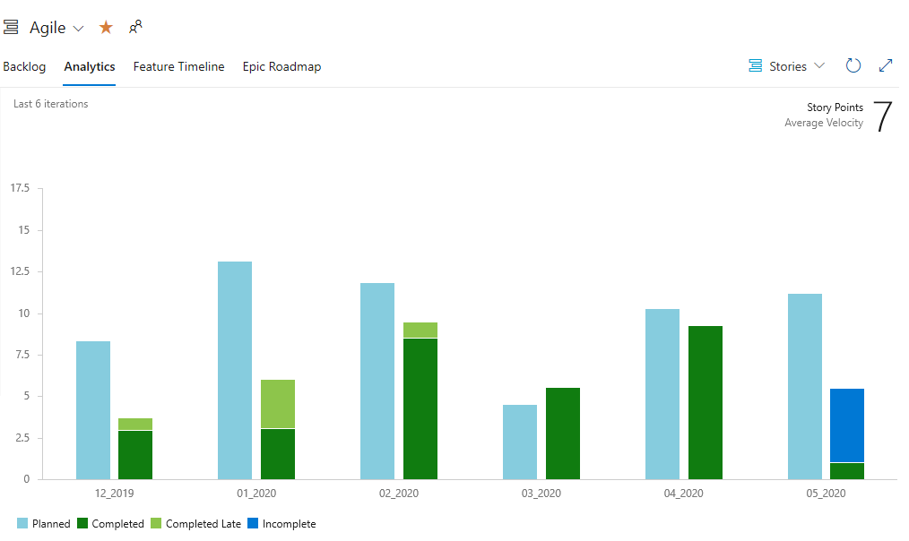
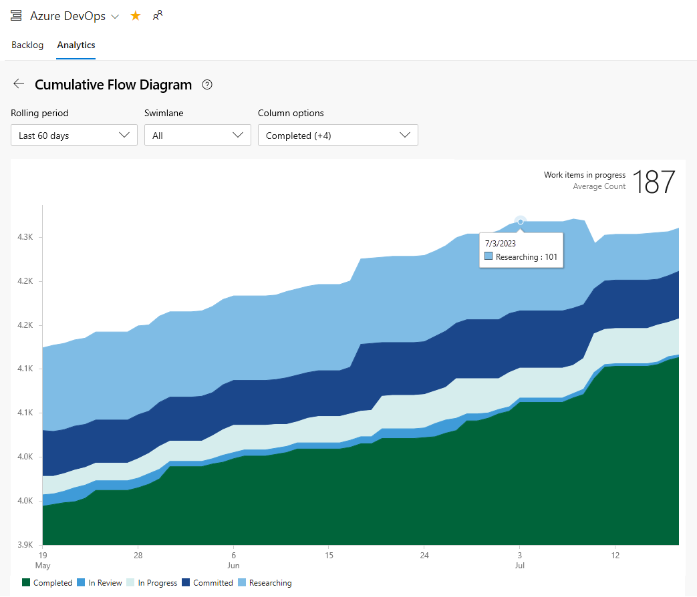
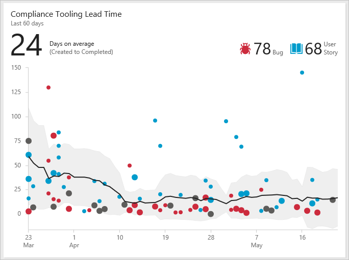
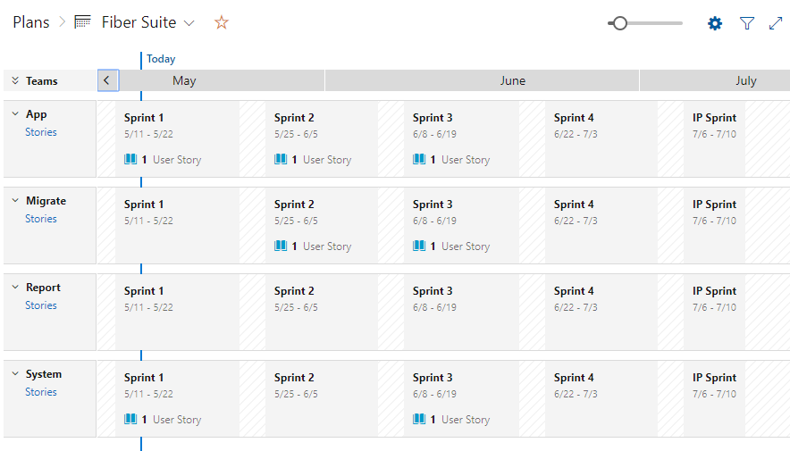
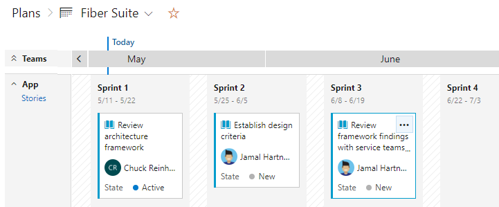
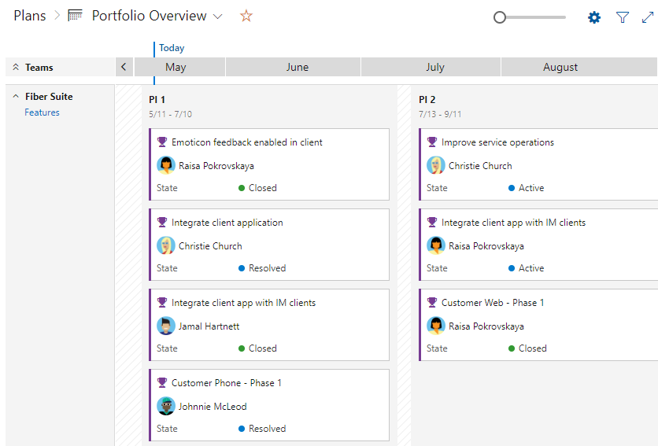
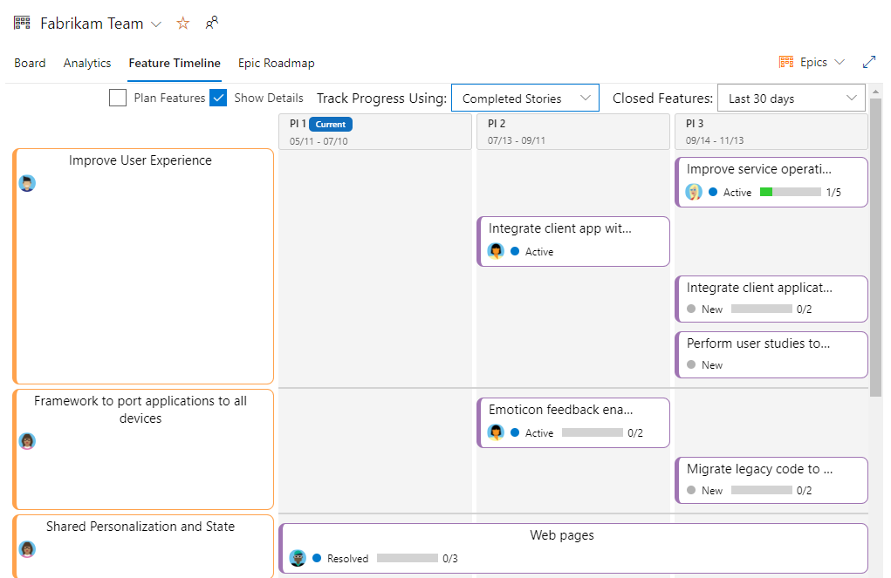

# View SAFe® progress, roadmaps, and metrics

[!INCLUDE [temp](../includes/version-azure-boards-plus-azure-devops-server-2020.md)]

With team's configured and working backlogs and boards, you're ready to start viewing and monitoring progress. 

Azure Boards provides a number of in-context charts and dashboard widgets that allow you to monitor and report on a variety of SAFe® metrics. Specifically Azure Boards provides access to the following tools to support teams in deriving SAFe® metrics and monitoring and reporting progress. 

- Rollup columns on backlogs 
- In-context reports 
- Managed query charts such as pie, bar, stacked bar, trend, and pivot
- Dashboard widgets 
- Team and project dashboards 
- Analytic Views to support Power BI reports 
- OData queries to use with Power BI reports 

For an overview of these tools, see [About dashboards, charts, reports, & widgets](../../report/dashboards/overview.md). An additional backlog tool is Forecast which teams can use in their iteration planning. 

In this tutorial, we illustrate some of the out-of-the-box charts and widgets that you'll have instant access to monitor some of these key SAFe® metrics 

>[!div class="checklist"]      
> - Progress reports
> - Cumulative Flow Diagram 
> - Lead time and cycle time charts
> - Iteration planning, team velocity, and forecast

[!INCLUDE [temp](../includes/note-safe-articles.md)]

## View progress rollup 

Quick progress views are available from each team's backlog through rollup columns. Here's an example that shows progress based on completion of child work items.  

> [!div class="mx-imgBorder"]  
>  

Other rollup options include progress by specific work item types, progress by story points, count of work items, or sum of a numeric field. To learn more, see [Display rollup progress or totals](../backlogs/display-rollup.md). 

## View team velocity 

Each team has access to their velocity through the in-context velocity report. These reports show a bar chart count of planned, completed, completed late, and incomplete work items for the last six or more iterations. As shown in the example below, the chart also provides the average velocity calculated for the number of iterations shown. 

> [!div class="mx-imgBorder"]  
>   

This average can be used to forecast work by plugging it into the forecast tool. 

## Forecast tool 

By assigning Story Points to each User Story, a team can determine how much work they can complete using the Forecast tool. For details on its usage, see [Forecast your product backlog](../sprints/forecast.md).

> [!div class="mx-imgBorder"]  
> 

## View Cumulative Flow Diagram (CFD) 

Each Azure Boards backlog and board provide configurable CFD views. So each team at every level of SAFe® implementation can monitor progress using these built-in charts. 

The following image shows an example CFD chart for User Stories with all Kanban columns displayed. 

> [!div class="mx-imgBorder"]  
> 

Teams can use their CFD to identify bottlenecks and monitor the batch size of work in their various Kanban states. 

In-context CFD charts are quickly accessible from each backlog and board view. Also, CFD charts can be added to team and project dashboards. To learn more, see [View/configure a Cumulative Flow Diagram](../../report/dashboards/cumulative-flow.md).  

## Lead time and cycle time charts

Other metrics that teams use are derived from the Lead time and cycle time charts. These charts can be added to a team dashboard and monitored to learn the following information: 

- Lead time: Days on average to complete deliverables from date created
- Cycle time: Days on average to complete deliverables from date work started
- Number of outliers 
 
Both Lead Time and Cycle Time widgets display as scatter-plot control charts. They display summary information as well as provide several interactive elements. To learn more, see [Cumulative flow, lead time, and cycle time guidance](../../report/dashboards/cumulative-flow-cycle-lead-time-guidance.md). 

#### Example Lead Time widget

> [!div class="mx-imgBorder"]  
>  

#### Example Cycle Time widget

> [!div class="mx-imgBorder"]  
>  

<a id="roadmaps" />

## View and update roadmaps    

You can review roadmaps of SAFe® deliverables using the Delivery Plans, Feature Time, and Epic Roadmap tools. Delivery Plans are fully configurable to show the teams and work item types of interest.  

### Review feature team Delivery Plans  

Program teams can review roadmaps of the deliverables of their Agile Release Teams. As an example, the following image shows a snapshot of the Fiber Suite teams story deliverables. 

> [!div class="mx-imgBorder"]  
>  

You can expand each feature team to see details. Story deliverables are assigned to the PI 1 sprints. Delivery Plans are fully interactive, allowing you to drag and drop work items to update their sprint assignments, or open work items to update fields, add comments, and other information. 

> [!div class="mx-imgBorder"]  
>  

### Review portfolio features deliverable 

Portfolio teams can review the Features under development by their program teams. For example, Features under development by the Fiber Suite team are shown in the following delivery plan view. The Features under development show up under the Program Increment timeboxes.  
 
> [!div class="mx-imgBorder"]  
>  

### Review feature timeline roadmaps 

The feature timeline tool provides another view into progress of deliverables. Here we show the Fabrikam Team's Epics as shown in the Feature Timeline tool. Progress bars are configurable based on completed stories or effort.  

> [!div class="mx-imgBorder"]  
>  

<!---

## Feature and Epic progress reports  

Need to develop a report using Analytics view and Power BI. Want something to approximate the following: 

**Replace with an Azure DevOps report**

> [!div class="mx-imgBorder"]  
> 

--> 

## Try this next

> [!div class="nextstepaction"]
> [Sign up for Azure Boards for free](../get-started/sign-up-invite-teammates.md) 

## Related articles

- [Review team Delivery Plans](review-team-plans.md)
- [View portfolio progress with the Feature Timeline](../extensions/feature-timeline.md)

