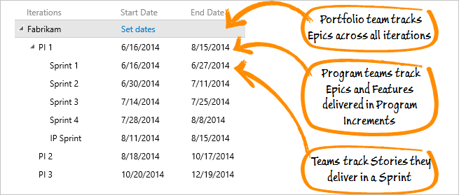
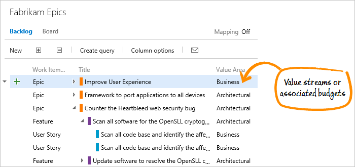
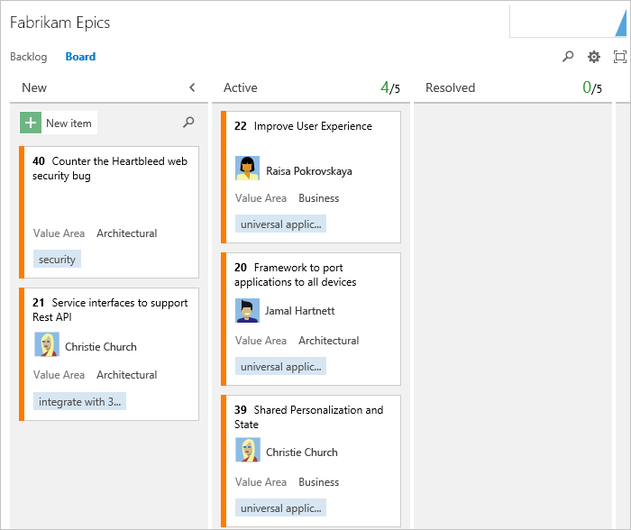
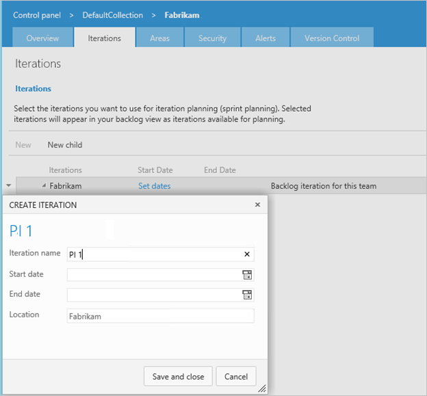
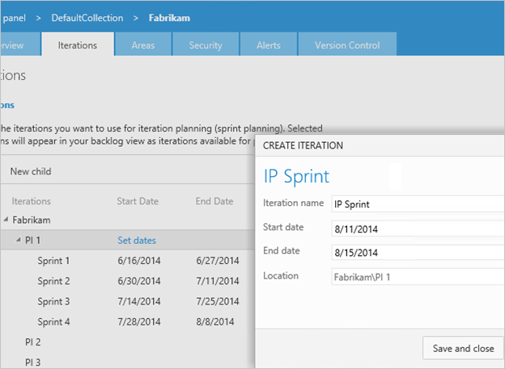
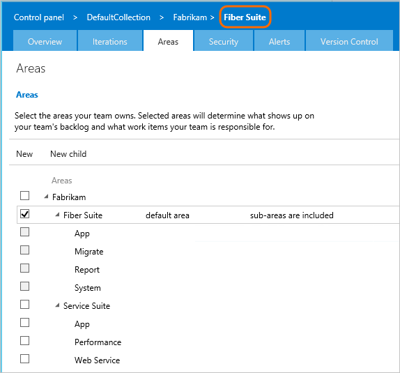
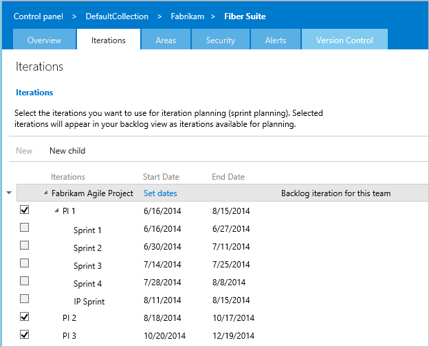
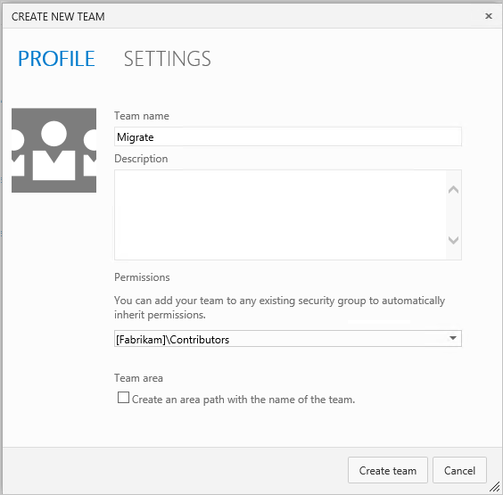
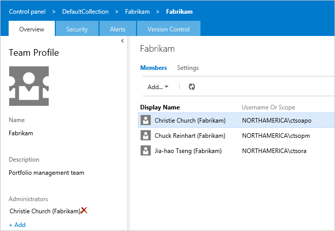
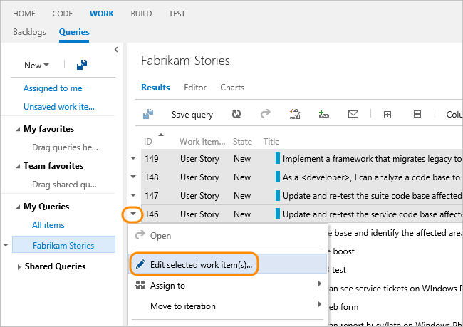

# Implement Scaled Agile Framework&reg; to support epics, release trains, and multiple backlogs  

[!INCLUDE [temp](../_shared/version-vsts-tfs-all-versions.md)]

As enterprises are benefiting from individual agile teams, the question now is how do we scale these practices across teams and gain a portfolio view of the progress of agile teams throughout the enterprise? To address these needs, many businesses are using the Scaled Agile Framework&reg; (SAFe&reg;).  

If you're interested in using SAFe, you can configure projects created with the [Scrum](../work-items/guidance/scrum-process.md), [Agile](../work-items/guidance/agile-process.md),  or [CMMI](../work-items/guidance/cmmi-process.md) processes to track SAFe criteria. Moreover, just as your Agile tools support Scrum and Agile practices, it can support SAFe and large numbers of teams to work together on epics that span releases. 

In this article you'll learn how SAFe concepts map to your Agile tools, how to plan and track SAFe projects using your Agile tools, and how to configure your Agile tools to support SAFe.  

If you're familiar with Scrum but not familiar with SAFe, [these videos at Scaled Agile Framework Foundations](http://scaledagileframework.com/foundations) from Inbar Oren, the Lean Samurai, are a good way to orient yourself.  

SAFe and Scaled Agile Framework are registered trademarks of [Scaled Agile Inc.](http://www.scaledagile.com/) 

##Map SAFe&reg; concepts to Agile tool concepts

The SAFe big picture addresses how a portfolio vision is met by a hierarchy of teams, all concerned with specific objectives. This framework breaks down epics into features and stories, which teams work on in Sprints and deliver through Program Increments (PIs) and Release Trains. Also, the portfolio backlog can track how deliverables map to value streams and associated budgets.  

Reproduced with permission from &#169; 2011-2016  [Scaled Agile Inc.](http://www.scaledagile.com/). All rights reserved.  

Examples provided below illustrate how to configure a three-level team hierarchy and map teams to their respective area and iteration paths. The examples build from the [Agile process](../work-items/guidance/agile-process.md), However, the changes can be applied to any project hosted on Azure Boards or an on-premises TFS.

  

##SAFe&reg; portfolios, programs, and teams map to Agile tool teams and projects  

Because your Agile tools support a hierarchical team structure, each team has its own view of their work which rolls up to the next level within the team hierarchy.  

  

To support SAFe teams, you reconfigure the default team as the Portfolio team to manage your epics. You then create sub-teams for program-level work and team-level work. Work can be tracked across teams and throughout each of the levels.

###SAFe&reg; backlogs map to your Agile tools backlogs
Out of the box, the Agile process supports user story, feature, and epic backlog levels. The hierarchical backlog structure shows work done to support features and user stories in the progress of an epic.  

###SAFe&reg; releases, iterations, and sprints map to iterations

SAFe Release Trains, Releases, Iterations, Program Increments (PIs), and Sprints map easily to your iteration paths. By sharing iterations across the team hierarchy, you manage the releases in a cohesive manner. 

  

Because epics can span several release trains, the Portfolio team isn't associated with any specific iterations. Program teams track their Feature deliverables, which ship with a PI. And Feature teams work in Sprints to complete several stories. Each team chooses which iterations will support them to track their focused set of deliverables.

  

###SAFe&reg; value streams and budgets map to tags and the Value Area field  
You can use tags for a quick and easy way to map epics to their Value Streams, strategic themes, and associated budgets.

  

With tags that you add to work items, you can:

- Filter any backlog or Kanban board
- Create queries based on tags, and filter query results by tags
- Create progress and trend charts or reports based on tags 

For a more robust mapping of work to architecture or business features, you can specify the Value Area for each epic, feature, or story.  

  

##Plan and track SAFe&reg; projects using your Agile tools 

Once you've configured your Agile tools to support SAFe, trace relationships can be created from stories all the way up to epics. Additionally, you can view progress from the portfolio, program, and feature team levels.  

###Map features to epics and stories to features
The program team can map features to epics using the mapping pane. Feature teams can use the same experience to map their stories to features.
 

  

###Portfolio team's view of progress

To track the progress of epics that span Releases, the Portfolio team's backlog shows epics. Each epic can be expanded to show the features and user stories that support it.

  

The Portfolio team can also view the progress of epics on their Kanban board.

  

 
> [!TIP]  
>You can also [customize the card color based on various criteria](../../boards/boards/customize-cards.md#style-rule), such as the Value Area=Architectural, by applying styling rules.  

###Program teams' progress view 
Program teams, primarily concerned with Release Trains, can see the features in their backlog, along with the PIs with which they're associated.

  

Just like the Portfolio team, they can also toggle their view to see which epics their features support, or the user stories that support their features, or both.  

Another view available to program teams shows query-based graphs of release train progress, backlog items, or active tasks during a shipping sprint. A customizable home page view is available to each team.

  

Since so much of a program team's work revolves around PIs and Release Trains, a custom report showing the scheduled shipping dates and what is projected to be on any given train might be useful. In addition, you can take advantage of the [rich reporting options and built-in reports](../../report/dashboards/overview.md).

###Feature teams' view of progress
For individual feature teams, their backlog view shows the Stories that they're working on.

  

Because feature teams don't own epics or features, epics and features don't appear in their team-level backlog views. However, if the team wants to know which epics and features their stories support, they can turn on those views from their backlog.

  

They can also break down their work into tasks and use the taskboard to keep themselves on track during specific sprints.

The chart view of queries becomes very useful in the Innovation and Planning (IP) sprint, when feature teams work together to stabilize the features scheduled for a Release.  

  

For everything else, it is very much business as usual for individual feature teams. They can sprint in their usual cadences, use their Kanban board and taskboard to track progress and break down work into manageable chunks.  

However, now their progress on individual stories is visible to their program and portfolio management teams. The management view reflects what they do.  

##Configure your Agile tools to support SAFe&reg;  
In this section, we'll go from having one project, named "Fabrikam" and one team, which shares the name of the project, to the following structure of three levels and nine teams. The area path hierarchy and configuring each team's area path supports each team's backlog view and rollup of views within the hierarchy.  

 

Each project has a default team. You can configure additional teams for program-level and feature team-level work. And, you can also redefine the default team as the portfolio team that manages epics.  

In this way, all teams can manage their own workload and priorities while clearly understanding how their work supports those epics managed in the portfolio team's backlog. At the same time, the portfolio team can monitor progress of its backlog on their own Kanban board, prioritize the items on their backlog, and view progress across release trains.

All this might sound complicated, but it actually takes very little configuration to set up the teams and get started.
In order to go from one project with one default team, area, and set of iterations, we'll first configure an area path structure to support the hierarchy of teams we want. Then we'll make sure that the iteration paths support the release structure we want and the program and feature teams to use. Finally, we'll create, configure, and populate the membership of teams.  

You'll need to be a [member of the Project Administrators group](../../organizations/security/add-users-team-project.md) to make these configurations.    

###Create areas to support your team hierarchy

1.  Connect to the project you want to configure to support SAFe, and use the gear icon  to open the administration page for the default team.  
2.  On the **Areas** page, create a child under the top-level area path and name it to correspond to one of the program teams you'll create.

	  

3.  Next, create a second area at the same child level, and name it after the second program team.  

4.  Under each program area, create a child area for each feature team that will support their respective program team. You should end up with a 3-level area path hierarchy.

	  

###Create iterations to support your release trains and sprints
To track progress towards Releases, create your iteration path structure. Unlike area paths, multiple teams can share the same iteration path structure. Sharing the iteration structure lets multiple teams work in the same sprint cadence towards the same release trains.  

If you already have iterations for your default team, you can rename them. You'll want to create an iteration structure that supports your entire team structure, not just one team.  

1. Under the default iteration, which shares the same name as the project, create a child iteration that will represent your first program increment (PI). Optionally, add a start and end date for the PI, but keep in mind that the iteration will be broken down further into sprints.

	

2. Next, create a child iteration for each Sprint within the PI. Set dates for these sprints to correspond your feature teams' cadences.  
	

###Create and configure your teams
In this section, we'll show how to configure a hierarchical team structure which maps to the hierarchical area paths we created previously.
This structure maps the following SAFe teams to your Agile tools' teams:  
- Portfolio team -> default top-level team, the Fabrikam team  
- Program teams -> secondary-level teams, Fiber Suite and Service Suite  
- Feature teams -> tertiary-level teams defined under Fiber Suite and Service Suite.  
- 
If you need more-detailed guidance, see [Portfolio management](portfolio-management.md).  

You'll need to be a [project administrator](../../organizations/security/add-users-team-project.md) to perform these steps. 
####Create and configure each Program team

1. From the Overview page for the project, create a new team. Make sure that you clear the checkbox for Create an area path with the name of the team.  

	  

2. Choose the team from the list, go to the Areas page, and select the check box next to the area path that you previously created for that team.  

	  

3. Use the context menu to exclude sub-areas. By excluding sub-areas, the team's backlog only includes those items whose Area Path matches the team's default area path.

	  

4. Next, configure the iterations that will be active for the program team. In this example, we have configured three PIs, each with five two-week sprints. Four of the sprints are regular sprints and the last sprint is an Innovation and Planning (IP) sprint.  
	  
  
	Because the Fiber Suite program team is concerned with Release Trains, we choose PI 1, 2, and 3, but we don't choose the individual sprints.

6. Once you've selected which iterations are active for the team, add users to the new team. Ideally, you would add the scrum masters for each feature team, product owners, as well as the Release Train Engineers (RTEs) to the program teams, such as Fiber Suite.  

	  

6. If you've more than one team at the program level, repeat steps 1 through 4 for each program team. 

####Create and configure each Feature team
Next, we'll create some feature teams to get work done at the third level of the team hierarchy. Each feature team will contribute sprint work that rolls up into the PI. The number of teams you create will depend on the size of your organization.

1. Create a new team from the administration page for the original team, and name the team. Just like before, make sure you clear the check box next to **Create an area path with the name of the team**.

	  

2. Just as before, choose the team from the list, go to the Areas page, and select the check box next to the area path that you previously created for that team.  

	  

3. Configure iterations for the team, using the PIs and sprints you created earlier. Unlike the program teams, this time select the individual sprints as the working iterations for the feature team.  

	  

4. Lastly, add the accounts for the developers, testers, and the scrum master for the team. Your Agile tools support assigning a scrum master to multiple teams. The scrum master can track work across multiple teams.  

	 

5. Repeat steps 1 through 4 for each feature team in your organization. Make sure that the default area path you configure for the team is sub-area path under its corresponding program-level area path. This ensures rollup from feature teams to program teams.

####Configure the Portfolio team
Now that your sub-team structure is configured, we reconfigure the default team to act as the Portfolio team. While this team will continue to have the name of the project, the changes you make to this top-level team will help ensure that it effectively tracks epics across PIs at the highest level.  

1. On the Areas page for the project, change the settings so that sub-areas are not included. Make sure you choose the project and not the default team, Fabrikam.  

	  

2. On the Iterations page, clear the check boxes next to all iterations except for the root level, which cannot be cleared. Because the Portfolio team is only concerned with epics that span PIs, it only uses the root iteration and not the PIs or sprints. Portfolio teams don't work in sprints.  

	  

3. Lastly, add and remove users from the Portfolio team appropriate to this level. From the Overview page, choose the default team.  

	   

	If you're following SAFe, you'll probably want to add portfolio managers, enterprise-level architects, and Release Train Engineers (RTEs) at this level and remove everyone else.

	

###Update the Area Path for existing work items
For any existing work items to show up on a team's backlog, you must update the Area path of each work item to the team's default area path. You can use the bulk edit feature from your web browser or you can use Excel.  

1. Create a query that contains the work items you want to edit, select the ones you want to edit, and then open the context menu from any one of the selected items.  

	   

2. Select the area path that corresponds to the team's default area path.  

	   

3.  Bulk save all work items that you modified.

	  

	For more info on bulk modifying work items, see [Bulk modify work items](../backlogs/bulk-modify-work-items.md).

###Add epics and map epics to features
You add epics in the same way you add user stories and features. From the Portfolio team's backlog page for epics, add an epic backlog item.

   

Add as many epics as you need. Drag them to reorder them and have them listed in their order of importance.

   

The default Business Value for epics is Business, but you can change this to Architectural by opening the form.  

  

You can also add tags to your epics, to help you track the investment themes each epic supports.  

Now view your epics on the Kanban board. To get this view, you need to [customize the Kanban columns to rename and add intermediate workflow states](../boards/add-columns.md). For a description of these states&mdash;Funnel, Review, Analysis, Portfolio Backlog, and Implementing (not shown)&mdash;see [Business Epic Kanban Abstract](http://scaledagileframework.com/business-epic-kanban/).

However, this is not very interesting yet. Nothing is in progress, and you can't drill down to see which features support your epics. You'll want to map existing features to the epics you just created, and map user stories to those features, if they're not already mapped.  

###Map multiple items if you've an existing backlog 
Mapping work items is easy using the mapping pane. First, turn on the mapping pane from the features or stories backlog page. Here, we choose the Fiber Suite team and turn on both the mapping pane and the view to see the hierarchy of features mapped to epics.

Note that if you've already changed the area path of all your features to the appropriate program-level team, the features list will be empty, because the Portfolio team does not own any features! In that case, switch to one of the program teams.  

Drag items from the backlog onto the item you want to associate as a parent. Keep in mind that you can only map features to epics. Similarly, you can only map the third level of backlog item (whether that is user story, backlog item, or requirement) to features. 

Repeat this process at each backlog level until you've created the hierarchy you want. 

  

What about features already in progress? They definitely won't appear on the Portfolio team's backlog. They are the responsibility of the program teams, so they appear on that team's backlog. (This is actually a function of the area path set for the work item; a work item will only appear on a team's backlog if you assign it to the area path you created for that team.) You can map them from there.  

You can also [bulk edit work items and manage their hierarchy in Microsoft Excel](../backlogs/office/bulk-add-modify-work-items-excel.md).  

Since an important aspect of SAFe is to map work to business or architecture goals, you'll want to make sure to set the Value Area=Architectural for any feature mapped to an architecture epic. (Because the default choice is Business, you don't have to change the field for any item that supports a business epic.) You can also add tags to track the investment.  

The same principles apply to user stories in progress. You can map them to features, change the requirement type to Architecture for work that you do to support architectural epics, and add tags for tracking themes.  

  

::: moniker range="tfs-2013" 

## Required customization

If you're working with TFS 2013, see the [Upgrade/Publish TFS 2013 Process Templates with PowerShell: blog post by Gordon Beeming](http://31og.com/post/upgradepublish-tfs-2013-process-templates-with-powershell). This post provides a PowerShell script which you can use to apply the customizations documented in the TFS 2013 version of this article.   

::: moniker-end 

## Resources
Resources mentioned earlier in this article and a few more are provided here for convenient reference.  
- SAFe enabled processes: Link to a download of the three Agile tool processes: [Scrum](../work-items/guidance/scrum-process.md), [Agile](../work-items/guidance/agile-process.md), and [CMMI](../work-items/guidance/cmmi-process.md).  

- [Scaled Agile Framework](http://scaledagileframework.com/): SAFe resource site.  
- [SAFe in 7 minutes](http://www.youtube.com/watch?feature=player_embedded&v=RXzurBazN-I): video from Inbar Oren, the Lean Samurai (also viewable from the [Scaled Agile Framework Foundations](http://scaledagileframework.com/foundations/)).
- [Scaling Agile and SAFe Metrics with TFS](http://www.incyclesoftware.com/2014/08/scaling-agile-and-safe-metrics-with-tfs/): Blog post that illustrates a SQL Server report developed by InCycle to illustrate how TFS can be used to support scaled agile or SAFe.  
- Agile Portfolio Management: Using TFS to support backlogs across multiple teams : white paper that shows how to configure TFS to support multiple teams and multiple backlogs.  
- [Support rollup of work and other fields](../../reference/xml/support-rollup-of-work-and-other-fields.md): Describes how to configure TFS to support rollup, the summed values of select fields for all child work items of a parent. Because TFS supports multiple levels of nesting, when you perform rollup, you want to make sure you don't double-count values.  
- [Out of the box Reports (SQL Server Reporting Services)](../../report/sql-reports/reporting-services-reports.md): Summarizes the reports TFS provides to monitor progress and code quality.  
- [Track your work when assigned to two or more teams](../sprints/set-capacity.md#track-capacity-per-team): Shows how a developer or tester can track work when they support more than one feature team.  

### About the authors
This article has been updated from the previous white paper developed in collaboration with the following authors:  
- Gordon Beeming is a Software Developer at Derivco in the sunny city of Durban, South Africa. He spends most his time hacking away at the keyboard in Visual Studio or with his family relaxing. His blog is at [31og.com](http://31og.com) and you can follow him on Twitter at [twitter.com/gordonbeeming](http://twitter.com/gordonbeeming).  
- Brian Blackman is a principal consultant with Microsoft Premier Developer, focusing on affecting ISV partners and Enterprises success in engineering and the marketplace. He has an MBA, and is a CSM, CSP, MCSD (C++), and MCTS and is a Visual Studio ALM Ranger. When he is not Ruck Mastering and contributing to Visual Studio ALM Ranger projects, he spends his time writing code, creating and delivering workshops, and consulting in various concentrations, especially helping organizations in their quest for business agility.  
- Gregg Boer is a principal program manager at Microsoft. Gregg is the product owner for the Agile management experience provided by Azure DevOps and on-premises TFS.
- Kathryn Elliott is a senior technical writer at Microsoft.  
- Susan Ferrell is a senior technical writer and a Visual Studio ALM Ranger.  
- Willy-Peter Schaub is a program manager with the Visual Studio ALM Rangers at the Microsoft Canada Development Center. Since the mid-'80s, he has been striving for simplicity and maintainability in software engineering. His blog is at [blogs.msdn.com/b/willy-peter_schaub](http://blogs.msdn.com/b/willy-peter_schaub) and you can follow him on Twitter at [twitter.com/wpschaub](http://twitter.com/wpschaub).  
- Special thanks to the following technical experts for reviewing this article: Mike Douglas (independent consultant, ALM Ranger), Richard Hundhausen (independent consultant, ALM Ranger) and Bill Heys (independent consultant, ALM Ranger), Hosam Kamel (technology solution professional for Microsoft and ALM Ranger).  

