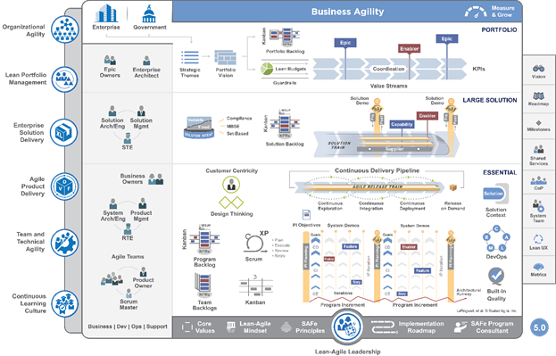

# Implement Scaled Agile Framework&reg; 

[!INCLUDE [temp](../includes/version-vsts-tfs-all-versions.md)]

As enterprises are benefiting from individual agile teams, the question now is how do we scale these practices across teams and gain a portfolio view of the progress of agile teams throughout the enterprise? To address these needs, many businesses are using the Scaled Agile Framework&reg; (SAFe&reg;). 

If you're familiar with Scrum but not familiar with SAFe®, [these videos at Scaled Agile](https://www.scaledagileframework.com/videos-and-presentations/) are a good way to orient yourself.  

## The Scaled Agile Framework®

The SAFe® big picture addresses how a portfolio vision is met by a hierarchy of teams, all concerned with specific objectives. This framework breaks down epics into features and stories, which teams work on in Sprints and deliver through Program Increments (PIs) and Release Trains. Also, the portfolio backlog can track how deliverables map to value streams and associated budgets.  

::: moniker range=">= azure-devops-2019" 
### Version 5.0 

 

::: moniker-end

::: moniker range="<= tfs-2018" 

 

### SAFe® 5.0 

 

Business Agility 
Enterprise Solution Delivery
Agile Product Delivery 

::: moniker-end

Reproduced with permission from &#169; 2011-2020  [Scaled Agile Inc.](http://www.scaledagile.com/). All rights reserved.  

SAFe and Scaled Agile Framework are registered trademarks of [Scaled Agile Inc.](http://www.scaledagile.com/) 

### SAFe® 5.0 Business Agility 

 

Many SAFe® practices include growing a culture that supports agility, alignment, and autonomy, all while being customer centric. 

## Essential SAFe®

Essential SAFe&reg; requires support for the artifacts and practices illustrated in the following poster. 

 
 
All of these artifacts and practices are supported by Azure Boards. 

- **Stories, Features**, and **Enablers**: Implemented as work items which capture information and status of work to track 
- **Team Backlogs** and **Program Backlogs**: Implemented as team backlogs which filter work items assigned to a team and support prioritizing and grouping of work.  
- **Scrum** and **Kanban**: These practices are fully supporting using Kanban boards, Sprint backlogs and Taskboards, teams, and sprint cadences. 
- **Iterations**, **Innovation and Planning (IP) Iteration**, **Program Increments (PI)**, **Milestones**, and **Release Trains**: Implemented via a flat-list or a hierarchical configuration of Iteration Paths. 
- **Agile Release Train**: Implemented by a set of Agile teams and Program teams configured to support specific team and program views. 
- **PI Objectives**, **Team Goals**: Teams can use the built-in project wiki to share their objectives and goals. 
- **Solution context**: TBD. 

## Portfolio SAFe®

Portfolio SAFe® adds support for managing portfolios through epics, enablers, and value streams.  

 

Azure Boards provides supports for portfolio components includes the following:

- **Epics**: Map to the Epic work item type and allow tracking, grouping, and rollup of child items. 
- **Portfolio backlogs**: Implemented as a portfolio backlog that supports filtering of work based on review of business needs.  .   
- **Portfolio Vision** and **Strategic Themes**: Business owners and portfolio managers can use the built-in project wiki to share their vision, objectives and goals. 
- **Lean budgets**: TBD. 
- **Value Streams**: TBD. 
- **KPIs**: TBD. 

## Large Solution SAFe®

With large solutions, SAFe&reg; identifies these additional artifacts for tracking solutions and capabilities. 
- Solution backlog
- Capabilities 
- Solution Train 

 

### Full SAFe® 

Full SAFe® includes the three levels of Essential SAFe®, Large Solution SAFe®, and Portfolio SAFe®. 

 

## Azure Boards implementation of SAFe®

The following articles provide details on how SAFe® concepts map to your Agile tools and how to implement SAFe® using Azure Boards.  

>[!div class="checklist"]  
> * [How SAFe® concepts map to Azure Boards artifacts](safe-concepts.md)  
> * [Azure reports and SAFe® metrics](safe-metrics.md)  
> * [Configure Azure Boards to support SAFe®](safe-configure-boards.md )  
> * [Customize Azure Boards to support SAFe®](safe-customize.md)   
> * [Plan and track SAFe® programs and portfolios](safe-plan-track-boards.md) 

## Quick reference mapping

The following table maps SAFe terms or artifacts to the equivalent Azure Boards term or artifact. Choose the link to learn about implementation details. 

:::row:::
   :::column span="":::
      **SAFe® term or artifact**
   :::column-end:::
   :::column span="3":::
      **Azure Boards term or artifact** 
   :::column-end:::
:::row-end:::
:::row:::
   :::column span="":::
      Agile teams
   :::column-end:::
   :::column span="3":::
      [**Teams**](safe-concepts.md#teams). You define a hierarchy of teams to meet the needs of feature or development teams, program and portfolio teams, or solution train teams. 
   :::column-end:::
:::row-end:::
:::row:::
   :::column span="":::
      Agile Release Train (ART) 
   :::column-end:::
   :::column span="3":::
       [**Teams**](safe-concepts.md#teams). Agile teams manage the work of deliverables for a set of features. Each Agile team has a set of Agile tools to support the flow of work and review progress and deliverables. 
   :::column-end:::
:::row-end:::
:::row:::
   :::column span="":::
      Budgets
   :::column-end:::
   :::column span="3":::
      [**Tags, Value Area**](safe-concepts.md#tags). You can use tags or the *Value Area* field to track work associated with a specific budget or value stream. 
   :::column-end:::
:::row-end:::
:::row:::
   :::column span="":::
      Capabilities
   :::column-end:::
   :::column span="3":::
      [**Work item**](safe-concepts.md#work-items). You define, plan, and track Capabilities similar to Epics, Features, and Stories. You capture them in work items and within various team backlogs. 
   :::column-end:::
:::row-end:::
:::row:::
   :::column span="":::
      Enablers
   :::column-end:::
   :::column span="3":::
      [**Work item**](safe-concepts.md#work-items). You define, plan, and track Enablers similar to Epics, Features, and Stories. You capture them in work items and within various team backlogs. 
   :::column-end:::
:::row-end:::
:::row:::
   :::column span="":::
      Epics
   :::column-end:::
   :::column span="3":::
      [**Epic work item**](safe-concepts.md#work-items). You define an Epic using the Epic work item type. Epics are at the top of the work item hierarchy of Epics, Features, and Stories.   
   :::column-end:::
:::row-end:::
:::row:::
   :::column span="":::
      Features
   :::column-end:::
   :::column span="3":::
      [**Feature work item**](safe-concepts.md#work-items). You define a Feature using the Feature work item type. Features are a container for a number of Stories and are represented in their own portfolio backlog.  
   :::column-end:::
:::row-end:::
:::row:::
   :::column span="":::
      Innovation and Planning (IP) Iteration 
   :::column-end:::
   :::column span="3":::
      [**Iteration Path**](safe-concepts.md#iterations). You define Iteration Paths for a project and set their start and end dates. Each team subscribes to the iterations they work with. 
   :::column-end:::
:::row-end:::
:::row:::
   :::column span="":::
      Iteration 
   :::column-end:::
   :::column span="3":::
      [**Iteration Path**](safe-concepts.md#iterations). You define Iteration Paths for a project and set their start and end dates. Each team subscribes to the iterations they work with.   
   :::column-end:::
:::row-end:::
:::row:::
   :::column span="":::
      Milestones
   :::column-end:::
   :::column span="3":::
      [**Milesones and key events**](safe-concepts.md#milestones). Milestones can be configured as a one day event or a work item which acts as a successor to a number of work item deliverables.  (Sanity check on this) 
   :::column-end:::
:::row-end:::
:::row:::
   :::column span="":::
      Portfolio Backlog
   :::column-end:::
   :::column span="3":::
      [**Portfolio backlog**](safe-concepts.md#backlogs-boards). A portfolio backlog lists the epics associated with a portfolio with the option to expand and display the child Features and Stories.  
   :::column-end:::
:::row-end:::
:::row:::
   :::column span="":::
      Portfolio Kanban
   :::column-end:::
   :::column span="3":::
      [**Epic Board**](safe-concepts.md#backlogs-boards). The Epics board displays Epics as cards that supports viisualizing and managing the flow of Epics and Features from concept to completion. 
   :::column-end:::
:::row-end:::
:::row:::
   :::column span="":::
      Portfolio Vision 
   :::column-end:::
   :::column span="3":::
      [**Wiki**](safe-concepts.md#wiki). Use the project wiki to share broadly within the organization information related to strategy, solutions, and how teams will collaborate to produce portfolio and program deliverables.    
   :::column-end:::
:::row-end:::
:::row:::
   :::column span="":::
      Program Backlog
   :::column-end:::
   :::column span="3":::
      [**Feature backlog**](safe-concepts.md#backlogs-boards). A Feature backlog lists the Features associated with a progream with the option to expand and display the child Stories.  
   :::column-end:::
:::row-end:::
:::row:::
   :::column span="":::
      Program Kanban
   :::column-end:::
   :::column span="3":::
      [**Features Board**](safe-concepts.md#backlogs-boards). The Features board displays Features as cards that supports viisualizing and managing the flow of Features and Stories from concept to completion.
   :::column-end:::
:::row-end:::
:::row:::
   :::column span="":::
      Program Increment (PI) 
   :::column-end:::
   :::column span="3":::
      [**Iteration Path**](safe-concepts.md#iterations). Iteration Paths define a timebox for a project with start and end dates. Iteration Paths can be defined from one week to 12 weeks long. 
   :::column-end:::
:::row-end:::
:::row:::
   :::column span="":::
      Retrospectives and reviews 
   :::column-end:::
   :::column span="3":::
      [**Retrospectives**](safe-concepts.md#retrospectives). Each team can add a board to capture, prioritize, and create action items to support their improvement processes. 
   :::column-end:::
:::row-end:::
:::row:::
   :::column span="":::
      Roadmap
   :::column-end:::
   :::column span="3":::
      [**Delivery Plans, Feature Timeline**](safe-concepts.md#roadmap). Azure Boards provides configurable views to review roadmaps and team deliverables.
   :::column-end:::
:::row-end:::
:::row:::
   :::column span="":::
      Shared Services
   :::column-end:::
   :::column span="3":::
      TBD. TBD 
   :::column-end:::
:::row-end:::
:::row:::
   :::column span="":::
      Solution
   :::column-end:::
   :::column span="3":::
      TBD. TBD 
   :::column-end:::
:::row-end:::
:::row:::
   :::column span="":::
      Solution Backlog
   :::column-end:::
   :::column span="3":::
      [**Portfolio backlog**](safe-concepts.md#backlogs-boards). TBD. 
   :::column-end:::
:::row-end:::
:::row:::
   :::column span="":::
      Strategic Themes 
   :::column-end:::
   :::column span="3":::
      [**Wiki**](safe-concepts.md#wiki). Strategic Themes, similar to Portfolio Vision, can be captured in a project wiki.  
   :::column-end:::
:::row-end:::
:::row:::
   :::column span="":::
      Stories
   :::column-end:::
   :::column span="3":::
      [**User Story work item**](safe-concepts.md#work-items). User Stories capture the desired functionality to be delivered and are typically sized so as to be completed with a single iteration.    
   :::column-end:::
:::row-end:::
:::row:::
   :::column span="":::
      Team Backlog
   :::column-end:::
   :::column span="3":::
      [**Stories backlog**](safe-concepts.md#backlogs-boards). The Stories backlog lists the User Stories assigned to the area path associated with the team.   
   :::column-end:::
:::row-end:::
:::row:::
   :::column span="":::
      Value Streams
   :::column-end:::
   :::column span="3":::
      [**Tags, Value Area**](safe-concepts.md#tags). You can use tags or the Value Area field to track work associated with a specific budget or value stream. 
   :::column-end:::
:::row-end:::
:::row:::
   :::column span="":::
      Weighted Shortest Job First (WSJF)
   :::column-end:::
   :::column span="3":::
      [**WSJF extension field**](safe-customize.md#wsjf). You can add the WSJF calculated field to work items to compute and store WSJF. 
   :::column-end:::
:::row-end:::

<!--- 
Plan, Do, Check Adjust 
Filtering Kanban boards to view Team deliverables 

--> 

## Try this next

> [!div class="nextstepaction"]
> [How SAFe&reg; concepts map to Azure Boards artifacts](safe-concepts.md)

## Resources

Resources mentioned earlier in this article and a few more are provided here for convenient reference.  
- SAFe enabled processes: Link to a download of the three Agile tool processes: [Scrum](../work-items/guidance/scrum-process.md), [Agile](../work-items/guidance/agile-process.md), and [CMMI](../work-items/guidance/cmmi-process.md).  

- [Scaled Agile Framework](http://scaledagileframework.com/): SAFe resource site.  
- [SAFe in 7 minutes](http://www.youtube.com/watch?feature=player_embedded&v=RXzurBazN-I): video from Inbar Oren, the Lean Samurai.
- [Scaling Agile and SAFe Metrics with TFS](http://www.incyclesoftware.com/2014/08/scaling-agile-and-safe-metrics-with-tfs/): Blog post that illustrates a SQL Server report developed by InCycle to illustrate how TFS can be used to support scaled agile or SAFe.  
- Agile Portfolio Management: Using TFS to support backlogs across multiple teams : white paper that shows how to configure TFS to support multiple teams and multiple backlogs.  
- [Support rollup of work and other fields](../../reference/xml/support-rollup-of-work-and-other-fields.md): Describes how to configure TFS to support rollup, the summed values of select fields for all child work items of a parent. Because TFS supports multiple levels of nesting, when you perform rollup, you want to make sure you don't double-count values.  
- [Out of the box Reports (SQL Server Reporting Services)](../../report/sql-reports/reporting-services-reports.md): Summarizes the reports TFS provides to monitor progress and code quality.  
- [Track your work when assigned to two or more teams](../sprints/set-capacity.md#track-capacity-per-team): Shows how a developer or tester can track work when they support more than one feature team.  

### About the authors

This article has been updated from the previous white paper developed in collaboration with the following authors:  
- Gordon Beeming is a Software Developer at Derivco in the sunny city of Durban, South Africa. He spends most his time hacking away at the keyboard in Visual Studio or with his family relaxing. His blog is at [31og.com](https://lazy-developer.xyz/) and you can follow him on Twitter at [twitter.com/gordonbeeming](http://twitter.com/gordonbeeming).  
- Brian Blackman is a principal consultant with Microsoft Premier Developer, focusing on affecting ISV partners and Enterprises success in engineering and the marketplace. He has an MBA, and is a CSM, CSP, MCSD (C++), and MCTS and is a Visual Studio ALM Ranger. When he is not Ruck Mastering and contributing to Visual Studio ALM Ranger projects, he spends his time writing code, creating and delivering workshops, and consulting in various concentrations, especially helping organizations in their quest for business agility.  
- Gregg Boer is a principal program manager at Microsoft. Gregg is the product owner for the Agile management experience provided by Azure DevOps and on-premises TFS.
- Kathryn Elliott is a senior technical writer at Microsoft.  
- Susan Ferrell is a senior technical writer and a Visual Studio ALM Ranger.  
- Willy-Peter Schaub is a former program manager with the Visual Studio ALM Rangers at the Microsoft Canada Development Center. Since the mid-'80s, he has been striving for simplicity and maintainability in software engineering. You can follow him on Twitter at [twitter.com/wpschaub](https://twitter.com/wpschaub).  
- Special thanks to the following technical experts for reviewing this article: Mike Douglas (independent consultant, ALM Ranger), Richard Hundhausen (independent consultant, ALM Ranger) and Bill Heys (independent consultant, ALM Ranger), Hosam Kamel (technology solution professional for Microsoft and ALM Ranger).  

<!---
Questions for review team: 
Solutions and Solution trains? 
Shared Services 
Milestones 
Customer Centric - Set up a public portal for Customers to submit Requests 

Iteration Paths support:
- Program Increments
- Release Trains
- Innovation Program 
- Continuous delivery in iterations 
- multiple planning horizons 
- 
alignment

Visualize flow everywhere 

Continuous Learning Culture

Many cultural elements 

Maybe a matrix of 

Organize around value 

--> 

## Related articles

- [Scale Agile to Large Teams](/azure/devops/learn/agile/scale-agile-large-teams)