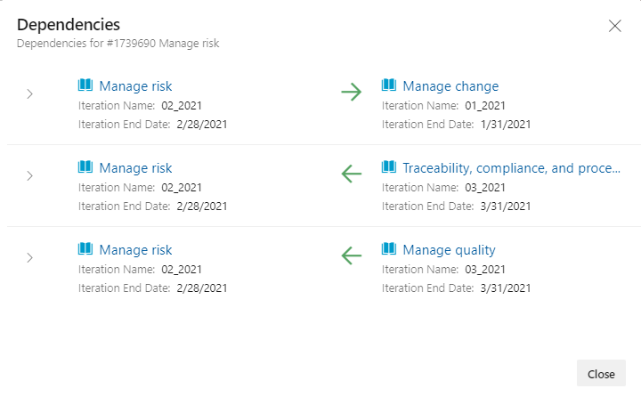
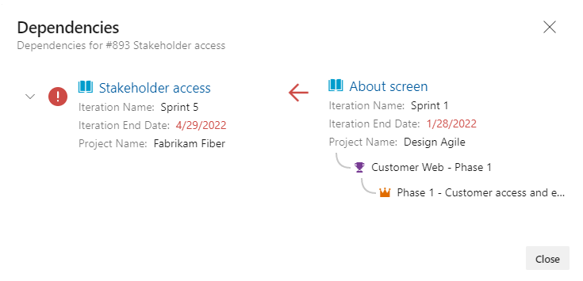

# Track dependencies using Delivery Plans 

[!INCLUDE [temp](../includes/version-all.md)] 

With Delivery Plans, you can track dependencies that have been added to work items. The only 

## Prerequisites

- To view a Delivery Plan, you must be a member of the Project Collection Valid Users group. Users granted **Stakeholder** access for a private project can view plans. Users granted **Stakeholder** access for a public project can add and view plans.  
- To open or modify a work item or add work items, you must have the **Edit work items in this node** set to **Allow** for the Area Paths assigned to the work item.  
 

## Show dependency lines for a work item 

## Open the dependency summary for a work item 

## Identify dependency issues 

To view dependencies for a work item, hover over the upper-right corner and choose the dependency-links :::image type="icon" source="../media/icons/dependency-links.png" border="false"::: icon. 

For example, here we show a work item with dependencies to several work items within the same project.   

> [!div class="mx-imgBorder"]  
>   

When the dependency is to a work item in another project, the project information is shown as well as other link relationships. A red exclamation mark and red colored arrows indicate there is an issue with the dependency.  

> [!div class="mx-imgBorder"]  
>   

## Related articles  

- [Add or edit a Delivery Plan](add-edit-delivery-plan.md)
- [Review team plans](review-team-plans.md)
- [Interactively filter your backlogs, boards, and plans](../backlogs/filter-backlogs-boards-plans.md)
- [Backlogs, boards, and plans](../backlogs/backlogs-boards-plans.md)  
 
 