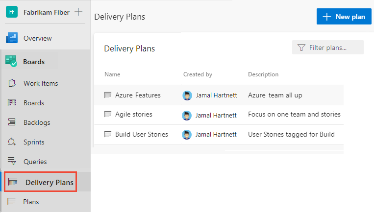

# Track dependencies by using Delivery Plans 

[!INCLUDE [version-gt-eq-2022](../../includes/version-gt-eq-2022.md)] 

With Delivery Plans, you can track dependencies that have been added to work items. Dependency tracking supports the **Predecessor/Successor** link type between work items. The following image shows several work items that have dependencies. Those cards with a :::image type="icon" source="media/dependencies/dependency-green-icon.png" border="false"::: green icon indicate there are no dependency issues. Those cards with a :::image type="icon" source="media/dependencies/dependency-red-icon.png" border="false"::: red icon indicate there are issues with one or more dependencies. Dependency issues arise when a predecessor work item is scheduled to finish after a successor work item. 

:::image type="content" source="media/dependencies/dependencies-with-without-issues.png" alt-text="Screenshot of delivery plan showing work items with dependencies and dependencies with issues.":::

To view dependencies, you must first define the Delivery Plan and dependencies between work items. To learn how, see [Add or edit a Delivery Plans](add-edit-delivery-plan.md) and [Link user stories, issues, bugs, and other work items](../backlogs/add-link.md#link-several-work-items). 
 

> [!TIP]  
> You can create dependencies between work items in different projects and different teams within the same organization, but not in projects in different organizations. You can open a work item and add a dependency through the links tab. 

## Prerequisites

- To view a Delivery Plan, you must be a member of the Project Collection Valid Users group. Users granted **Stakeholder** access for a private project can view plans. Users granted **Stakeholder** access for a public project can add and view plans.  
- To open or modify a work item or add work items, you must have the **Edit work items in this node** set to **Allow** for the Area Paths assigned to the work item.  

**For work items and dependency lines to appear on the plan** 
- [Team product or portfolio backlog must be enabled](../../organizations/settings/select-backlog-navigation-levels.md) in order to select it for a plan. 
- Work items must belong to a team's [product backlog](../backlogs/create-your-backlog.md) or [portfolio backlog](../backlogs/define-features-epics.md). Only work items belonging to a category selected for viewing on a team's backlog and meet any [field criteria defined for the plan](add-edit-delivery-plan.md#field-criteria) appear on the plan. 
- [Sprints must be selected for each team](../../organizations/settings/set-iteration-paths-sprints.md#select-team-sprints-and-set-the-default-iteration-path) defined in the plan.
- [Start and end dates](../../organizations/settings/set-iteration-paths-sprints.md#add-iterations-and-set-iteration-dates) must be defined for each project iteration.
- [**Iteration Paths**](../sprints/assign-work-sprint.md) or [**Start Date/Target Date**](../queries/query-by-date-or-current-iteration.md#date-and-iteration-path-fields) must be assigned to each work item. When defined, **Start Date/Target Date** overrides the sprint assigned to a work item. 
- For dependency icons and lines to show, [work items must be linked](../backlogs/add-link.md) using **Predecessor-Successor** link type. 
- Team or teams must be expanded to view dependency icons and dependency lines. 

> [!TIP]  
> If you edit a plan and don't see the changes you made appear in the plan, refresh your browser. A browser refresh is needed some times to trigger the updates.  

## Show dependency lines for a work item 

1. Open the Delivery Plan from **Boards>Delivery Plans**. 

	> [!div class="mx-imgBorder"]  
	>  

1. To view dependency lines for a work item, select the top or bottom of its card. To dismiss the lines, select the top or bottom of the card again, or anywhere else within the plan. 

	Dependency lines that have no issues show up as black lines. 

	:::image type="content" source="media/dependencies/dependency-lines-no-issue.png" alt-text="Screenshot of dependency lines that have no issues.":::

	> [!TIP]    
	> To view dependency lines across team backlogs, make sure to expand both teams.  

	Dependency lines that have issues, show up with red lines. The issues indicate that the successor work item is scheduled to end before the predecessor work item is completed.  

	:::image type="content" source="media/dependencies/dependency-lines.png" alt-text="Screenshot of dependency lines that show issues between several work items.":::

1. To view the issue, choose the :::image type="icon" source="media/dependency-issue-icon.png" border="false"::: icon. 

	:::image type="content" source="media/dependencies/dependency-lines-issue-alert.png" alt-text="Screenshot of card showing dependent work items with an issue in predecessor-successor linkage.":::

 

## Open the dependency summary for a work item 

To drill down into specific dependencies, open the Dependencies dialog for the work item. Choose the icon that indicates the work item has dependencies, either the :::image type="icon" source="media/dependencies/dependency-green-icon.png" border="false"::: green or :::image type="icon" source="media/dependencies/dependency-red-icon.png" border="false"::: red icon.  

For example, here we choose the link icon for a work item with dependencies to several work items within the same project and another project.   

:::image type="content" source="media/dependencies/card-dependency-link.png" alt-text="Screen shot of card and link icon.":::

The Dependencies dialog indicates that the work item has three predecessors and no issues.

:::image type="content" source="media/dependencies/dependency-dialog-with-no-issues-cross-project.png" alt-text="Dependencies dialog for a work item with no issues.":::

## Identify dependency issues 

When issues exist, they're highlighted in red. The issue always has to do with an end date for a successor work item occurring before the end date of the predecessor work item. Determine the end date by using either the **Target Date** for the work item or the **End Date** of the work item's assigned **Iteration Path**. 

For example, the following Dependencies dialog indicates that two predecessor work items are scheduled to complete before the successor work item is scheduled to complete. A red exclamation mark and red colored arrows indicate there's an issue with the dependency.   

When the dependency is to a work item in another project, the project information is shown as are other link relationships. 

:::image type="content" source="media/dependencies/dependencies-cross-project.png" alt-text="Dependencies dialog for a work item with dependencies-cross-project.":::

## Related articles  

- [Add or edit a Delivery Plan](add-edit-delivery-plan.md)
- [Review team Delivery Plans](review-team-plans.md)
- [Interactively filter your backlogs, boards, and plans](../backlogs/filter-backlogs-boards-plans.md)
- [Backlogs, boards, and plans](../backlogs/backlogs-boards-plans.md)  
 
 