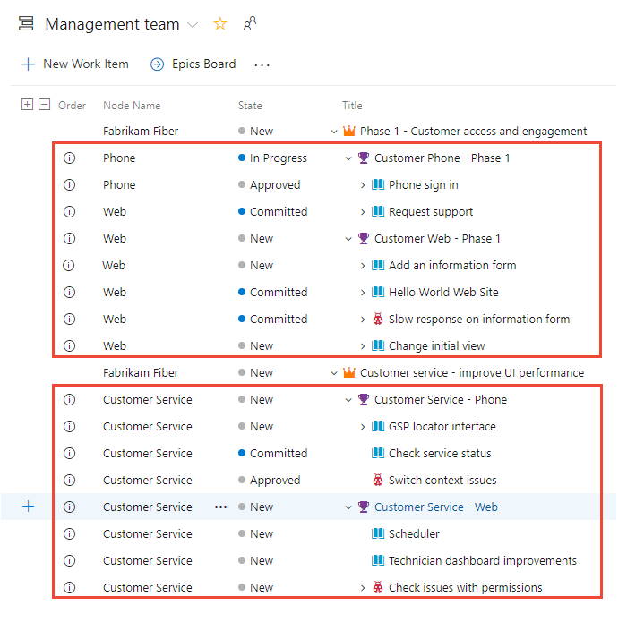
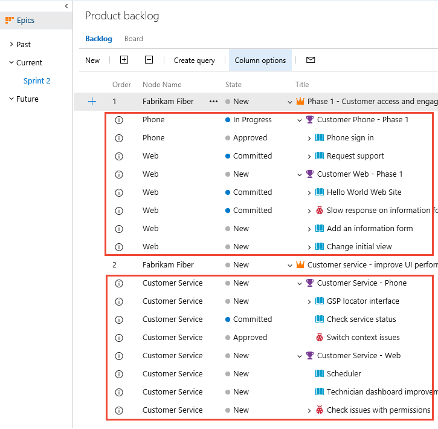
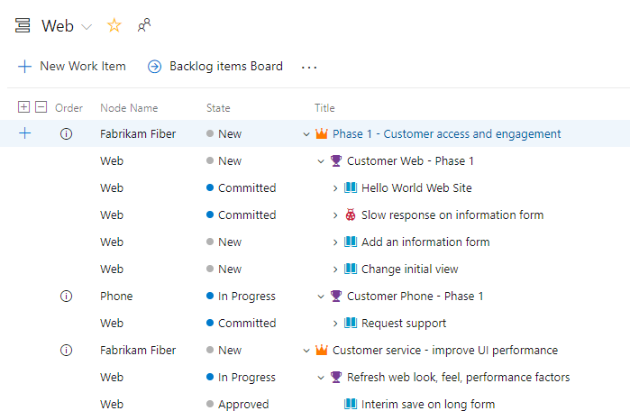
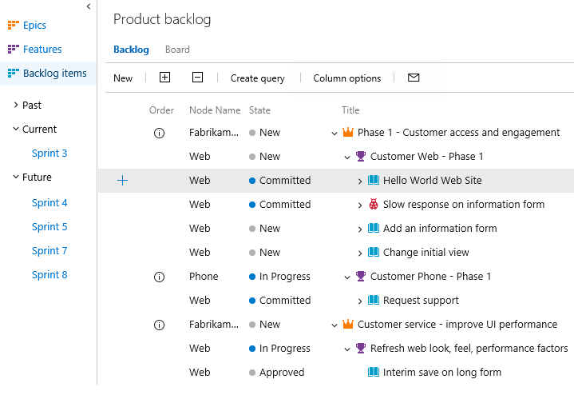
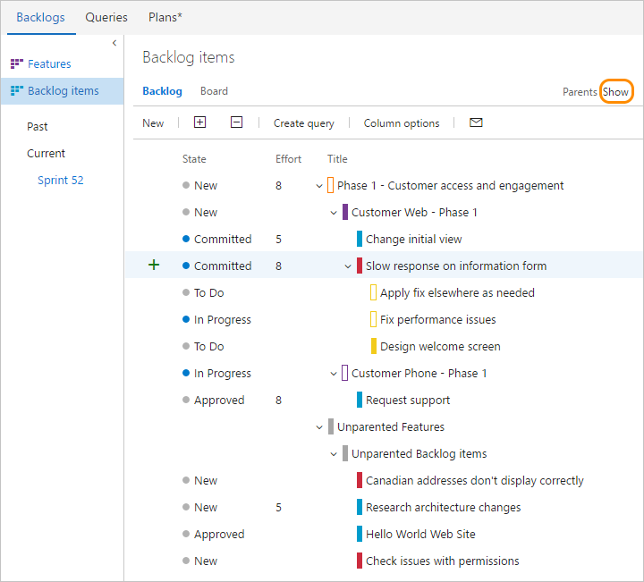
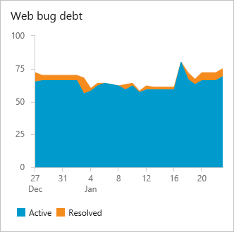

# Visibility across teams

[!INCLUDE [temp](../../_shared/version-vsts-tfs-all-versions.md)]

Agile tools provide each team a wealth of ways to gain visibility into their work&mdash;to manage priorities and status and to monitor progress and trends. However, how do you gain visibility across several teams? What tools should you use?

You have three main ways to track progress across several teams.

- Management teams can define [Delivery Plans](#plans) that provide visibility into the deliverables several teams have scheduled
- Each management team can use their Agile tools, and in particular [portfolio backlogs](#portfolio-backlogs), to gain visibility of the feature teams defined under their area path
- Management teams can create [dashboards](#dashboards) that monitor status, progress, and trends across several teams.

For an overview of all team tools, see [Manage teams and configure team tools](../../organizations/settings/manage-teams.md).

## Delivery Plans support a view of team backlogs on a calendar timeline

With a Delivery Plan, you gain a tailor-made view across several teams and their development backlogs&mdash;stories, features, or epics. You can use these views to drive alignment across teams by overlaying several backlogs onto your delivery schedule.

> [!NOTE]
> Delivery Plans, a [Visual Studio Marketplace extension](https://marketplace.visualstudio.com/items?itemName=ms.vss-plans), is available for Azure Boards and TFS 2017.2 and later versions. All users with [basic access](../../organizations/security/change-access-levels.md) can view, add, and configure Delivery Plans. Stakeholders, however, don't have access to Delivery Plans.

When you configure a Delivery Plan, you select the teams and backlog levels of interest. You can then interact with the plan to update it and drill into more details. To learn more about Delivery Plans, see [Review team plans](review-team-plans.md).

## Use portfolio backlogs to track features and epics

The first level of gaining visibility across several teams is to configure your teams and backlogs to support the views you want.

We recommend that you structure your teams as follows:

- Add a management team for a group of feature teams; these teams own epics and turn on only the Epic portfolio backlog level
- Add feature teams to manage features, stories and tasks, and turn on the stories and features backlog levels

The management team creates the epics, and then they or their feature teams break the epics down into features and then [map their features to the epics](../backlogs/organize-backlog.md) on the management backlog.

> [!TIP]
>By breaking down large goals, epics, scenarios, or features into smaller ones, teams can make better estimates and identify risks and dependencies.

Limiting the backlog levels for each team&#151;Epics for management teams and Features and Stories for feature teams&#151;helps each team to stay focused on monitoring the progress of their work. For details on managing team backlog levels, see [Select backlog navigation levels](../../organizations/settings/select-backlog-navigation-levels.md).

With the multi-team portfolio backlog view, you can:
- Review priorities with your team and reorder features to support current priorities
- You can drill down to see the status of each feature's child user stories or PBIs
- Filter the backlog based on keyword or tag to focus on specific teams or categorized items
- (Optional) You can use the [mapping feature](../backlogs/organize-backlog.md) to map user stories or PBIs to features

### View child items owned by other teams 
Management teams can drill down from their portfolio backlog to see how **Epics** are progressing. Drilling down, you can see all the backlog items and features, even though they belong to one of three different teams: Customer Service, Phone, and Web.

::: moniker range=">= azure-devops-2019"
Items that are owned by other teams appear with an information icon, .  

> [!div class="mx-imgBorder"]  
>    

> [!TIP]    
> Add the **Node Name** field as a column to identify the area path/team associated with the work items. 

::: moniker-end 

::: moniker range=">= tfs-2017 <= tfs-2018"  
Items that are owned by other teams appear with an information icon, .  

> [!div class="mx-imgBorder"]  
>   

> [!TIP]    
> Add the **Node Name** field as a column to identify the area path/team associated with the work items. 

::: moniker-end 

::: moniker range="<= tfs-2015" 

Items that are owned by other teams appear with hollow-filled bars.  

 

::: moniker-end 

### View backlog items and parent items owned by other teams

Feature teams can turn **Show parents** on their backlogs to see context and those items owned by other teams. 

::: moniker range=">= azure-devops-2019"

Items that are owned by other teams appear with an information icon, . 

> [!div class="mx-imgBorder"]  
>    

::: moniker-end 

::: moniker range=">= tfs-2017 <= tfs-2018"  
Items that are owned by other teams appear with an information icon, . 
   
> [!div class="mx-imgBorder"]  
>    
::: moniker-end 

::: moniker range="<= tfs-2015" 
Items that are owned by other teams appear with hollow-filled bars.  

::: moniker-end 

> [!TIP]
> When estimating stories or product backlog items, start with one story point per person per day. Feature teams can later calibrate and adjust those estimates as needed. For example, the [velocity](../../report/dashboards/velocity-chart-data-store.md) of a seasoned team will be higher than a new team. The size of the work stays the same, but a seasoned team can just deliver faster.

To learn more about this configuration, see [Portfolio management](portfolio-management.md), [Add teams](../../organizations/settings/add-teams.md), and [Organize your backlog](../backlogs/organize-backlog.md).

::: moniker range=">= tfs-2015"
## Add management dashboards with multi-team views

A second method for gaining visibility across teams is to define multi-team focused dashboards that let you view progress, status, and trends. You do this primarily by defining queries that either capture the progress of a single team or several teams. You can then create charts and view trends for each team or for several teams.

The two areas of most interest to management teams are project health and bug debt. The widget catalog provides 10+ widgets you can add to a dashboard to track the status, progress, and health of your project and teams. Also, you can find additional widgets in the [Visual Studio Marketplace](https://marketplace.visualstudio.com/search?term=widgets&target=AzureDevOps&category=All%20categories&sortBy=Relevance), Azure DevOps tab.  

For example, here we've added three query-based charts, one for each team, to a dashboard that shows the active and resolved bugs over the previous 4 weeks.

    

When defining multi-team dashboards, consider the following:
- What are you wanting to learn and how will it drive your organization's actions
- What time frame is of interest.

Review [Agile culture](agile-culture.md) and [Practices that scale](practices-that-scale.md) for guidance on team autonomy and organizational alignment.

::: moniker-end

### Project health and progress against goals dashboard 
Use the [Query Results widget](../../report/dashboards/widget-catalog.md#query-results-widget) to provide a list of features by state: 

- Completed features (Done or Closed)
- New features (New or Proposed)
- Features being actively worked (In Progress or Active)

Use the [Chart for work items widget](../../report/dashboards/widget-catalog.md#chart-wit-widget) to add query-based charts. To learn more about creating query-based charts, see [Charts](../../report/dashboards/charts.md).

<!---TIPS
consider the time frame you want to monitor
snapshot or trends
what's shipping when?
Track bug debt, progress
Active bugs
Stale bugs
Hi priority bugs
Triage bugs
Active bug trends
-
-->

### Technical debt, bug debt, and activity dashboard 
Another measure of project health and the health of the teams is to monitor bug activity and bug debt. Consider the charts you can create that will help you answer these questions: 
 
- Are bugs getting fixed? at a rate that's acceptable? 
- How stale are bugs? 
- Is the bug debt per team being maintained? 
- Is the ratio of high priority bugs being kept within organizational goals? 

For tips on creating queries based on counts or numeric fields, see [Query by numeric field](../queries/query-numeric.md).

 
::: moniker range=">= azure-devops-2019"
## Use Analytics to gain visibility across teams   

You can add [Widgets based on the Analytics Service](../../report/dashboards/analytics-widgets.md) to a dashboard that show progress for a team. From one dashboard, you can add widgets for any team within the project. 

::: moniker-end

## Related articles

As you can see, there are a number of ways you can monitor progress and trends across several teams. The methods you choose will depend on your focus and organizational goals.

Here are some additional topics that address working with multiple teams:

- [Backlogs, boards, and plans](../backlogs/backlogs-boards-plans.md)
- [Review team plans](review-team-plans.md)
- [Add teams](../../organizations/settings/add-teams.md)
- [Portfolio management](portfolio-management.md)

## Limitations of multi-team Kanban board views 

While the management teams you configure can use the Kanban board to monitor feature progress by turning on the Features backlog, there are limitations inherent within these views. Even if the management team and the feature teams configure their Feature [Kanban board columns](../boards/add-columns.md) with identical workflow mapping, updating the Features on one team's Kanban board won't be reflected on another team's Kanban board. 
Only when the work item state changes does the card column reflect the same on all boards.

> [!IMPORTANT]   
> Work items that appear on more than one team's Kanban board can yield query results that don't meet your expectations. Because each team can customize the Kanban board columns and swimlanes, the values assigned to work items which appear on different boards may not be the same. The primary work around for this issue is to maintain single ownership of work items by [team area path](../../organizations/settings/set-area-paths.md). Another option is to add custom workflow states which all teams can use. For details, see [Customize your work tracking experience](../../reference/customize-work.md). 

<!---

With the multi-team Kanban board view, you can:
- View and update the status of work items
- Drill down to see the status of child user stories or PBIs
- [Filter product and portfolio backlogs](/azure/devops/boards/backlogs/filter-backlogs) to view items by feature team, feature owner, tag, or expected delivery date
- Monitor the [cumulative flow](../../report/dashboards/cumulative-flow.md) of all features being worked on by your teams
- Organize features into swimlanes to track work that you want to expedite

### Rollup of estimates and remaining work across multiple teams

Many project managers are interested in getting numeric rollup of estimates&mdash;Story Points or Effort&mdash; or the Remaining Work field. Rollup provides summed values of select fields for all child work items of a parent.

Natively, Azure Boards and TFS provide rollup of Remaining Work for tasks on the taskboard.

To learn about other methods available to you to support rollup, see [Support rollup of work and other fields](https://msdn.microsoft.com/library/dn217871.aspx).

Waterfall -  corresponding method with Project and Project Professional
Dashboards, and suggestions for dashboard development (drawing from how Agile team uses dashboards)
Plans - for visibility across time and teams
Account pages - quick access to your work

Progress against an agreed upon goal
Issues and Risks
Customer value prop
Key metrics and how they are changing
	Velocity
	Bug debt trends

Overall project health
Agile &mdash;Team's Velocity any changes over time
Waterfall &mdash;completeness of milestone delivery
Dependencies status
Different metrics than VP &mdash;code coverage, % complete, burndown
Code coverage
% Complete
Burndown

For example, a manager with five teams tracks the features across teams using the Features Kanban board. Each team tracks and prioritizes their user stories using their own backlogs and boards.

To accomplish this, the following configurations are made:
6 teams are defined, one for each feature team and one for the management team
The management team configures its backlogs to only view Features and Epics
Feature teams configure their backlogs to view User Stories and Features

This configuration supports management's ability to monitor progress across the five teams at the level they need to monitor, and allow each individual feature team to stay focused on their product backlog of user stories.

You can replicate this further for program managers who want to monitor progress across broad initiatives by setting up a program management team that monitors Epics.
-->

