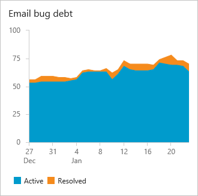
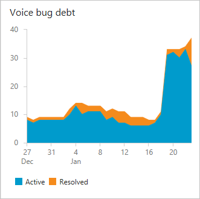

# Manage priorities and gain visibility across teams

[!INCLUDE [version-lt-eq-azure-devops](../../includes/version-lt-eq-azure-devops.md)]

Agile tools give each team many ways to gain visibility into work&mdash;to manage priorities, monitor status, and track progress and trends. But how do you gain visibility across several teams? Which tools should you use?

You can track cross-team progress in three main ways:

- Management teams define [Delivery Plans](#plans) to view scheduled deliverables across teams.
- Management teams use [portfolio backlogs](#portfolio-backlogs) to view feature teams under their area path.
- Management teams create [dashboards](#dashboards) that monitor status, progress, and trends across teams.

For an overview of team tools, see [Manage teams and configure team tools](../../organizations/settings/manage-teams.md).

## Delivery Plans support a view of team backlogs on a calendar timeline

With Delivery Plans, you create a timeline view that overlays multiple teams' backlogs&mdash;stories, features, or epics&mdash;onto a delivery schedule. Use this view to drive alignment and coordinate work across teams.

::: moniker range="azure-devops"  

When you configure a Delivery Plan, select the teams and backlog levels of interest. Then interact with the plan to update assignments and drill into details. For more information, see [Review team plans](review-team-plans.md).

:::image type="content" source="media/plans/overview-with-callouts.png " border="false" alt-text="Screenshot that shows Delivery Plans with callouts and collapsed teams.":::   
::: moniker-end 

::: moniker range="< azure-devops"  

When you configure a Delivery Plan, select the teams and backlog levels of interest. Then interact with the plan to update assignments and drill into details. For more information, see [Delivery Plans](../plans/review-team-plans.md).

::: moniker-end 

 

## Use portfolio backlogs to track features and epics

Start by configuring teams and backlogs to support the cross-team views you want. We recommend this team structure:

- Add a management team for a group of feature teams; management teams own Epics and enable only the Epic portfolio backlog level.
- Add feature teams to manage Features, Stories, and Tasks; feature teams enable the Features and Stories backlog levels.

Management teams create Epics and then break them into Features. Teams map Features to Epics on the management backlog. See [Organize your backlog](../backlogs/organize-backlog.md) for mapping details.

> [!TIP]
> Break down large goals, epics, or features into smaller items so teams can estimate more accurately and identify risks and dependencies earlier.

Limit backlog levels per team&mdash;Epics for management teams, Features and Stories for feature teams&mdash; to help teams focus on their responsibilities. For details on backlog levels, see [Select backlog navigation levels](../../organizations/settings/select-backlog-navigation-levels.md).

With the multi-team portfolio backlog view you can:
- Review priorities and reorder Features to reflect current goals.
- Drill down to view the status of each Feature's child Stories or PBIs.
- Filter the backlog by keyword or tag to focus on specific teams or categories.
- Optionally use the [mapping feature](../backlogs/organize-backlog.md) to map Stories or PBIs to Features.

### View child items owned by other teams 

Management teams can drill down in a portfolio backlog to see Epic progress and the child backlog items that other teams own. The following example shows items owned across Customer Service, Phone, and Web teams.

::: moniker range="<=azure-devops"
Items owned by other teams show an information icon,  :::image type="icon" source="../../media/icons/info.png" border="false"::: .  

> [!div class="mx-imgBorder"]  
>    

> [!TIP]    
> Add the **Node Name** column to identify the area path/team associated with each work item. 
::: moniker-end 

### View backlog items and parent items owned by other teams

Feature teams can turn on **Show parents** for their backlog to see context and items owned by other teams.

::: moniker range="<=azure-devops"
Items owned by other teams show an information icon,  :::image type="icon" source="../../media/icons/info.png" border="false"::: . 

> [!div class="mx-imgBorder"]  
>    
::: moniker-end 

> [!TIP]
> When you estimate Stories or PBIs, start with roughly one story point per person per day and then calibrate as teams mature. For example, a seasoned team's velocity typically exceeds a new team's velocity even though the work size stays the same.

For more on configuring teams and backlogs, see [Portfolio management](portfolio-management.md), [Add teams](../../organizations/settings/add-teams.md), and [Organize your backlog](../backlogs/organize-backlog.md).

## Add management dashboards with multi-team views

Define dashboards that focus on multi-team views to track progress, status, and trends. Build these dashboards around queries that capture a single team or several teams, then create charts to visualize trends.

Management teams often focus on project health and bug debt. The widget catalog provides many widgets you can add to dashboards; you can also find community widgets in the [Visual Studio Marketplace](https://marketplace.visualstudio.com/search?term=widgets&target=AzureDevOps&category=All%20categories&sortBy=Relevance).

For example, here are three query-based charts&mdash;one per team&mdash;showing active and resolved bugs over the last four weeks:

  
  

When you design multi-team dashboards, consider:
- What do you want to learn, and how will it guide actions?
- What time frame matters for the metrics you choose?

See [Agile culture](agile-culture.md) and [Practices that scale](practices-that-scale.md) for guidance on team autonomy and organizational alignment.

### Project health and progress against goals dashboard 

Use the [Query Results widget](../../report/dashboards/widget-catalog.md#query-results-widget) to list Features by state:

- Completed Features (Done or Closed)
- New Features (New or Proposed)
- Features being actively worked (In Progress or Active)

Use the [Chart for work items widget](../../report/dashboards/widget-catalog.md#chart-wit-widget) for query-based charts. For details, see [Charts](../../report/dashboards/charts.md).

### Technical debt, bug debt, and activity dashboard 

Monitor bug activity and bug debt to answer these questions:
- Are bugs being fixed at an acceptable rate?
- How stale are unresolved bugs?
- Is each team's bug debt within organizational goals?
- Is the ratio of high-priority bugs acceptable?

For tips on queries using counts or numeric fields, see [Query by numeric field](../queries/query-numeric.md).

::: moniker range="<=azure-devops"

## Use the Analytics Service to gain visibility across teams   

You can add [Analytics-based widgets](../../report/dashboards/analytics-widgets.md) to dashboards to show progress for any team in a project. From one dashboard you can include widgets for teams across the project.

::: moniker-end

## Track capacity when working on more than one team 

Track capacity for individuals who work on multiple teams. For details, see [Set sprint capacity, Track capacity when working on more than one team](../sprints/set-capacity.md#track-capacity-per-team).

## Limitations of multi-team board views 

Although management teams can monitor Feature progress by enabling the Features backlog, multi-team board views have limitations. Even when teams configure identical board column mappings, updating Features on one team's board doesn't reflect on another team's board until the work item's state actually changes. Only a state change synchronizes column placement across boards.

> [!IMPORTANT]   
> Work items that appear on multiple teams' boards can produce query results that don't match expectations. Each team can customize board columns and swimlanes, so values shown on different boards might differ. To reduce confusion, maintain single ownership of work items by [team area path](../../organizations/settings/set-area-paths.md). Alternatively, add shared workflow states that all teams use. For more, see [Customize your work tracking experience](../../reference/customize-work.md). 

## Related content

- [Learn about backlogs, boards, and plans](../backlogs/backlogs-boards-plans.md)
- [Review team plans](review-team-plans.md)
- [Add teams](../../organizations/settings/add-teams.md)
- [Manage your portfolio](portfolio-management.md)
