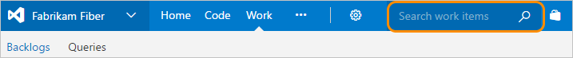

# About managed queries  

[!INCLUDE [temp](../includes/version-all.md)]

List bugs, user stories, or other work items based on field criteria you specify using queries. You can then review these lists with your team, triage work, or perform bulk work item updates. In addition to managed queries, the semantic search tool provides some overlapping and different functionality worth exploring. 

 
## Supported query features 

The following sections provide an overview of the features supported to define queries and manage queries. 
<!--- In addition to these features, additional functionality is described in [Query support for cross-service, integration, and extensions](query-support-integration-cross-service-extensions.md). --> 

<!--- interactive, filter  --> 

[!INCLUDE [temp](../includes/feature-matrix-filter-queries.md)]

<a id="macros" /> 

[!INCLUDE [temp](../includes/feature-matrix-query-macros.md)]

[!INCLUDE [temp](../includes/feature-matrix-manage-queries.md)]

### Unsupported features

Work item queries only support querying of work items and work items linked to other work items. Some of the limitations or restrictions of work item queries are:

- You can't construct a managed query that shows a hierarchical view of Test Plans, Test Suites, and Test Cases. These items aren't linked together using parent-child link types. You can [view the hierarchy through the Test>Test Plans page](../../test/create-a-test-plan.md). 
- You can't construct a managed query that shows what builds, releases, code, or other non-work item objects are linked to work items. 
- You can't run a query to list work items linked from one project to another. 
- You can't export a cross-project query to Excel. Direct links queries exported to Excel export as a flat-list. 

<a id="ad-hoc-v-managed" /> 
<a id="semantic-v-managed" /> 

## Managed work item queries versus semantic searches

You have two ways to find and list work items: managed queries and semantic or ad hoc searches. If you are looking for a single work item, use the ad hoc search box. If you want to generate a list of work items to triage, update, chart, or share with others, then use a managed query.

> [!NOTE]    
> With semantic search, you search against a more fully indexed set of fields than that of managed queries.

---
:::row:::
   :::column span="1":::
      **Use a managed query**
   :::column-end:::
   :::column span="1":::
      **Use a semantic search**
   :::column-end:::
:::row-end:::
---
:::row:::
   :::column span="1":::
      - List items to perform bulk updates to fields
      - Review work that's in progress or recently closed  
      - Triage work (set priority, review, update)   
      - Create a chart and add it to a dashboard  
      - Create a chart to get a count of items or sum a field  
      - Create a chart that shows a burndown or burnup over time 
      - View a tree of parent-child related work items 
      - List work items with link relationships  
      - List work items for a single project, multiple projects, or across all projects  
   :::column-end:::
   :::column span="1":::
      - Find a specific work item using its ID or a keyword 
      - Find one or more work items across all projects in a fast, flexible manner
      - Perform full text search across all work item fields
      - Review work items assigned to a specific team member
      - Search against specific work item fields to quickly narrow down a list of work items
      - Determine what key words will support a managed search
      - List work items for a single project, multiple projects, or across all projects  
   :::column-end:::
:::row-end:::
---

To get started, see the following articles:  
- [View and run a query](view-run-query.md)   
- [Perform a semantic search](search-box-queries.md)  
- [Define a query](using-queries.md)   

For specific examples, see [Query quick reference, Example queries](query-index-quick-ref.md).  
 

## Query types (flat, direct links, tree)

Azure Boards supports three query types. The icon next to each query indicates the query type. Use the following guidance to choose the query type based on what you want to accomplish with the query. 

 

> [!div class="mx-imgBorder"]  
> 

---
:::row:::
   :::column span="1":::
      **Query type**
   :::column-end:::
   :::column span="3":::
      **Usage guidance**
   :::column-end:::
:::row-end:::
---
:::row:::
   :::column span="1":::
      **Flat list of work items**
   :::column-end:::
   :::column span="3":::
      - List items to perform bulk updates to fields 
      - Triage a list of work items 
      - Create a query chart and add it to a dashboard  
      - Create a chart to get a count of items or sum a field 
      - Export a list of items to Excel to update fields
   :::column-end:::
:::row-end:::
---
:::row:::
   :::column span="1":::
      **Work items and direct links**
   :::column-end:::
   :::column span="3":::
      - List linked work items to perform bulk updates to fields 
      - Triage a list of linked work items  

        Exporting to Excel exports as a flat list. Direct links queries are imported as a flat list as modifying multiple types of links isn't a supported feature in Excel.  
   :::column-end:::
:::row-end:::
---
:::row:::
   :::column span="1":::
      **Tree of work items**
   :::column-end:::
   :::column span="3":::
      - List a tree of Parent-Child related work items, or other tree-topology link type 
      - Triage a hierarchical list of work items 
      - Export a hierarchical list of items to Excel to update fields or modify the hierarchy
   :::column-end:::
:::row-end:::
---
  

To learn more about link types, see [Link type reference](link-type-reference.md).

<a id="my-shared"/>

## My Queries, Shared Queries, and Favorites

Only you can view and run queries that you save under **My Queries** with the queries directory. Also, you can favorite one of these queries to have it appear within your query selector.

Queries you and others save under **Shared Queries** can be viewed by everyone with access to the project. Shared queries can be organized within folders and favorited by you or for a team. Also, you can set permissions on the folders and queries to prevent others from moving or editing them. 

For details, see:
- [Manage queries & query folders ](organize-queries.md)
- [Set query permissions](set-query-permissions.md)
- [Favorite a query](view-run-query.md) and [Set personal or team favorites](../../project/navigation/set-favorites.md#favorite-a-shared-query)

::: moniker range=">= azure-devops-2019"

## Query directory, query folders, and breadcrumbs 

The **Queries** page  contains a directory-focused view which you can filter to find specific queries of interest. 
When working in the **Queries** pages, you can navigate to a subfolder, folder, or page.

Also, you can choose a query that you've favorited from the selector menu, Or, you can choose to browse all queries which returns you to the **All Queries** page. 
  
> [!div class="mx-imgBorder"]  
>  

For more information, see [Query FAQs, Navigate and Folders](query-faqs.yml).

::: moniker-end
 

## Taskboard versus query list items

You may notice and wonder why the contents of the taskboard differ from those listed with its created query? To learn more, see [taskboard items versus query list items](../backlogs/backlogs-boards-plans.md#task-board-items).

## About query charts and widgets

To learn about query charts and widgets, see these articles:  
- [Chart a flat-list query](../../report/dashboards/charts.md)   
- [Chart for work items widget](../../report/dashboards/widget-catalog.md#chart-wit-widget)  
- [Query results widget](../../report/dashboards/widget-catalog.md#query-results-widget)   
- [Query tile widget](../../report/dashboards/widget-catalog.md#query-tile-widget) 

 
## Add a custom field to support queries

To add a custom field to support your query needs, see [Customize your work tracking experience](../../reference/customize-work.md). 

## Related articles

- [Query quick reference](query-index-quick-ref.md)
- [Work item field index](../work-items/guidance/work-item-field.md) 
- [Set query permissions](set-query-permissions.md)  
- [Perform work item search](../../project/search/work-item-search.md) 
- [Query fields, operators, and macros](query-operators-variables.md) 
- [Excel](../backlogs/office/bulk-add-modify-work-items-excel.md) or [Project](../backlogs/office/create-your-backlog-tasks-using-project.md) 

<!--- [Query support for cross-service, integration, and extensions](query-support-integration-cross-service-extensions.md) -->

<!--- 
### Additional tips for working with queries

- To find work items that are assigned to you, add the **@Me** macros as the value for the **Assigned To** field in one of the query clauses.  
- All valid users with standard access can create queries and folders under the **My Queries** area. To create queries and query folders under **Shared Queries**, you must have the Contribute permission set. For more information, see [Set permissions on queries](../queries/set-query-permissions.md).
- You can modify any query by adding criteria to focus on a product area, an iteration, or another field. To modify a query, [open the query editor](using-queries.md).   
- You can open any query in [Excel](../backlogs/office/bulk-add-modify-work-items-excel.md), where you can update the fields of one or more work items and publish your changes to the database for tracking work items.  
- You can [visualize status or progress](../../report/dashboards/charts.md) by creating a pie-chart, column chart, or trend chart for flat-list queries. 

::: moniker range=">= azure-devops-2019"
For additional tips when working with the new queries experience or the directory-focused queries views, see [Query FAQs](query-faqs.yml). 
::: moniker-end

If you're just getting started, read [View, run, or email a work item query](view-run-query.md). For a quick reference to query editor tasks and sample queries, see [Query quick reference](query-index-quick-ref.md). 

--->

 
<!--- 
### Ad hoc searches

::: moniker range=">= azure-devops-2019"  

You perform semantic or ad hoc searches using the work item search box (shown below)   

Choose any **Boards** page, enter a keyword or phrase in the search box, and press *Enter* or choose the :::image type="icon" source="../../project/search/media/shared/start-search-icon.png" border="false"::: start search icon.  

> [!div class="mx-imgBorder"]
>     

::: moniker-end   

::: moniker range="<= tfs-2018"  

You perform semantic or ad hoc searches using the work item search box (shown below). 

In the search box, check that the text says _Search work items_. If it doesn't, use the selector to select it. Enter a keyword or phrase in the search box, and press *Enter* or choose the :::image type="icon" source="../../project/search/media/shared/start-search-icon.png" border="false"::: start search icon. 

::: moniker-end   

For details about semantic or ad hoc searches, see [Perform a semantic or ad hoc work item search](search-box-queries.md). 

### Managed queries 

::: moniker range=">= azure-devops-2019"  

You add and run managed queries using the built-in query-editor available from the **Boards>Queries** page.

> [!div class="mx-imgBorder"]
>   

::: moniker-end   

::: moniker range="<= tfs-2018"  
 
You add and run managed queries using the built-in query-editor available from the **Work>Queries** page.
::: moniker-end  

::: moniker range=">= tfs-2015 <= tfs-2018"  

   

::: moniker-end  

::: moniker range="tfs-2013"  

  

::: moniker-end
  
 

-->
