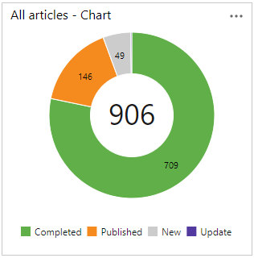
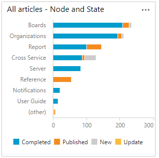
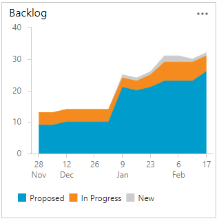

# About managed queries  

[!INCLUDE [temp](../includes/version-all.md)]

List bugs, user stories, or other work items based on field criteria you specify using queries. You can then review these lists with your team, triage work, or  bulk update work items. In addition to managed queries, the semantic search tool provides some overlapping and different functionality worth exploring. 

Use managed queries to support these operations:  
- Bulk update of work items using the web portal  
- Triage and update work items  
- Review a hierarchy of work items  
- Share a list of work items with a team member 
  

 
## Get started using queries

If you're just getting started, read [View, run, or email a work item query](view-run-query.md). For a quick reference to query editor tasks and sample queries, see [Query quick reference](query-index-quick-ref.md). 

- To find work items that are assigned to you, add the **@Me** macros as the value for the **Assigned To** field in one of the query clauses.  
- All valid users with standard access can create queries and folders under the **My Queries** area. To create queries and query folders under **Shared Queries**, you must have the Contribute permission set. For more information, see [Set permissions on queries](../queries/set-query-permissions.md).
- You can modify any query by adding criteria to focus on a product area, an iteration, or another field. To modify a query, [open the query editor](using-queries.md).   
- You can open any query in [Excel](../backlogs/office/bulk-add-modify-work-items-excel.md), where you can update the fields of one or more work items and publish your changes to the database for tracking work items.  
- You can [visualize status or progress](../../report/dashboards/charts.md) by creating a pie-chart, column chart, or trend chart for flat-list queries. 

## Query capabilities 

The following sections provide an overview of the functions supported to define and manage work item queries. 

- Query filters are defined through the Query Editor.
- Query macros can be selected for specific fields to create a query clause.
- Query results and query management features are capabilities available through the Query Results page.

[!INCLUDE [temp](../includes/feature-matrix-filter-queries.md)]

<a id="macros" /> 

[!INCLUDE [temp](../includes/feature-matrix-query-macros.md)]

[!INCLUDE [temp](../includes/feature-matrix-manage-queries.md)]

### Unsupported features

Work item queries only support querying of work items and work items linked to other work items. Here are a few of the tasks that managed queries don't support: 

- Hierarchical views of Test Plans, Test Suites, and Test Cases. These items aren't linked together using parent-child link types. Instead, you can [view the hierarchy through the Test>Test Plans page](../../test/create-a-test-plan.md). 
- Views showing linked objects such as builds, releases, code, or other non-work item objects. 
- List work items linked from one project to another.  
- Export a cross-project query to Excel. Direct links queries export to Excel as a flat-list. 

## Query types (flat, direct links, tree)

Azure Boards supports three query types. The icon next to each query indicates the query type. Use the following guidance to choose the query type based on what you want to accomplish with the query. 

> [!div class="mx-imgBorder"]  
> 

---
:::row:::
   :::column span="1":::
      **Query type**
   :::column-end:::
   :::column span="3":::
      **Usage guidance**
   :::column-end:::
:::row-end:::
---
:::row:::
   :::column span="1":::
      **Flat list of work items**
   :::column-end:::
   :::column span="3":::
      - List items to perform bulk updates to fields 
      - Triage a list of work items 
      - Create a query chart and add it to a dashboard  
      - Create a chart to get a count of items or sum a field 
      - Export a list of items to Excel to update fields
   :::column-end:::
:::row-end:::
---
:::row:::
   :::column span="1":::
      **Work items and direct links**
   :::column-end:::
   :::column span="3":::
      - List items which are dependent on other work items
      - Find items related or dependent on other work items
      - List linked work items to perform bulk updates to fields 
      - Triage a list of linked work items  
      - List test-related linked work items 
      - Find orphaned backlog items, work items that have no parent 
      > [!NOTE]
      > **Work items and direct links** queries export to Excel as a flat list. Direct links queries are imported as a flat list as modifying multiple types of links isn't a supported feature in Excel.  
   :::column-end:::
:::row-end:::
---
:::row:::
   :::column span="1":::
      **Tree of work items**
   :::column-end:::
   :::column span="3":::
      - List a tree of Parent-Child related work items, or other tree-topology link type 
      - Triage a hierarchical list of work items 
      - Export a hierarchical list of items to Excel to update fields or modify the hierarchy
   :::column-end:::
:::row-end:::
---
  

To learn more about link types, see [Link type reference](link-type-reference.md).

<a id="my-shared"/>

## My Queries, Shared Queries, and Favorites

Only you can view and run queries that you save under **My Queries** with the queries directory. Also, you can favorite one of these queries to have it appear within your query selector.

Queries you and others save under **Shared Queries** can be viewed by everyone with access to the project. Shared queries can be organized within folders and favorited by you or for a team. Also, you can set permissions on the folders and queries to prevent others from moving or editing them. 

For details, see:
- [Manage queries & query folders ](organize-queries.md)
- [Set query permissions](set-query-permissions.md)
- [Favorite a query](view-run-query.md) and [Set personal or team favorites](../../project/navigation/set-favorites.md#favorite-a-shared-query)

::: moniker range=">= azure-devops-2019"

## Query directory, query folders, and breadcrumbs 

The **Queries** page  contains a directory-focused view which you can filter to find specific queries of interest. 
When working in the **Queries** pages, you can navigate to a subfolder, folder, or page.

Also, you can choose a query that you've favorited from the selector menu, Or, you can choose to browse all queries which returns you to the **All Queries** page. 
  
> [!div class="mx-imgBorder"]  
>  

For more information, see [Query FAQs, Navigate and Folders](query-faqs.yml).

::: moniker-end
 

## Query charts and widgets

You can quickly create pie, bar, pivot, and trend charts from a flat-list query. Queries must be flat-list and return 1000 or less work items. You can add your query charts to a dashboard, retitle, and reconfigure them. 

    
    

Query-based widgets provide support for presenting query information on a dashboard. For example, the number of active bugs or a list of work items that you can interact with. To learn about query charts and widgets, see these articles: 
 
- [Chart a flat-list query](../../report/dashboards/charts.md)   
- [Chart for work items widget](../../report/dashboards/widget-catalog.md#chart-wit-widget)  
- [Query results widget](../../report/dashboards/widget-catalog.md#query-results-widget)   
- [Query tile widget](../../report/dashboards/widget-catalog.md#query-tile-widget) 

## Add a custom field to support queries

To add a custom field to support your query needs, see [Customize your work tracking experience](../../reference/customize-work.md). 

## Taskboard versus query list items

You may notice and wonder why the contents of the taskboard differ from those listed with its created query? To learn more, see [taskboard items versus query list items](../backlogs/backlogs-boards-plans.md#task-board-items).

::: moniker range="< azure-devops"

## Full-text search queries and collation settings

To support full-text search queries, the collation settings of the SQL Server database should correspond to a language that has a word breaker registered with SQL Server. If you use an unsupported language, you could receive unexpected results when you run a work item query that specifies the **Contains** or **Contains Words** operators with text strings.

To learn more, see the following articles:

-   [sys.fulltext\_languages (Transact-SQL)](/sql/relational-databases/system-catalog-views/sys-fulltext-languages-transact-sql)
-   [ALTER FULLTEXT INDEX (Transact-SQL)](/sql/t-sql/statements/alter-fulltext-index-transact-sql)
-   [SQL Server 2008 Full-Text Search: Internals and Enhancements](/sql/relational-databases/search/improve-the-performance-of-full-text-queries)
-   [Query Fields, Operators, Values, and Variables](/sql/t-sql/language-elements/language-elements-transact-sql)

::: moniker-end

[!INCLUDE [temp](../includes/rest-apis-queries.md)]

## Related articles

- [Query FAQs](query-faqs.yml)
- [Query quick reference](query-index-quick-ref.md)
- [Cross-service and enhanced query operations](query-support-integration-cross-service-extensions.md)
- [Work item field index](../work-items/guidance/work-item-field.md) 
- [Set query permissions](set-query-permissions.md)   
- [Query fields, operators, and macros](query-operators-variables.md) 
- [Bulk add or modify work items with Excel](../backlogs/office/bulk-add-modify-work-items-excel.md)   
 

 