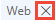
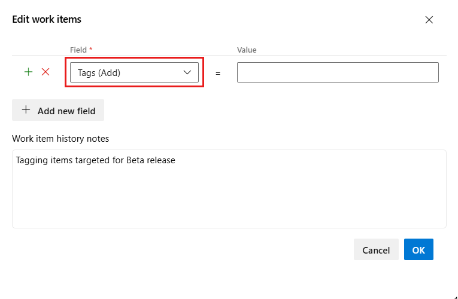
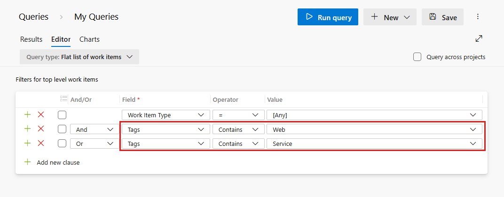
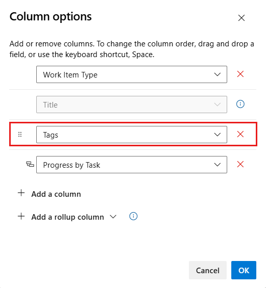
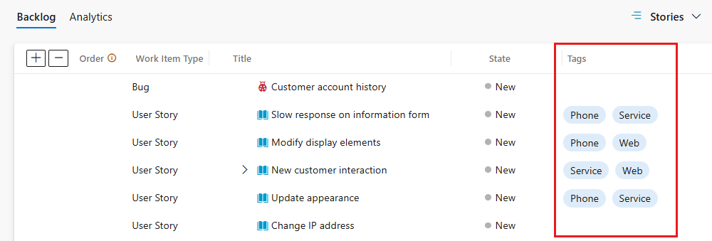
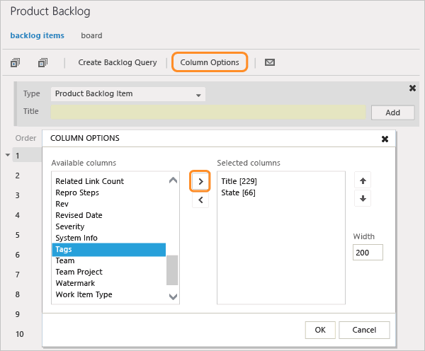
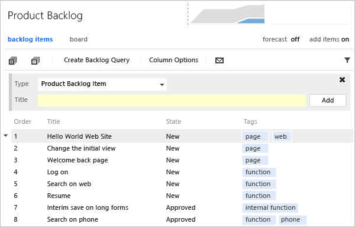
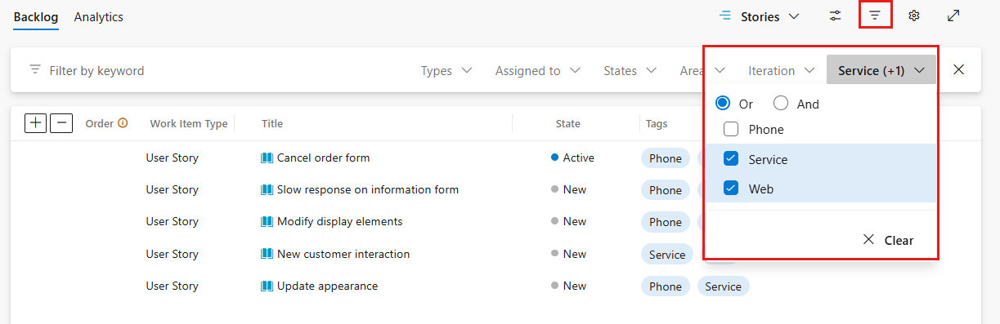
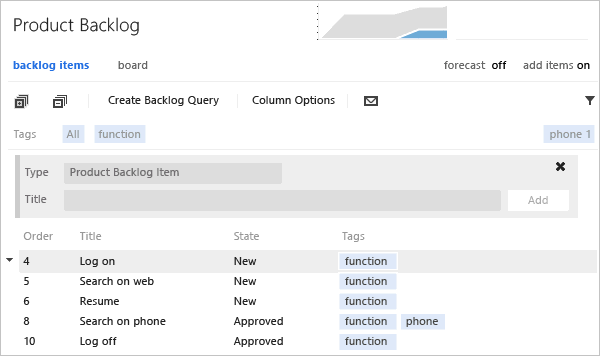
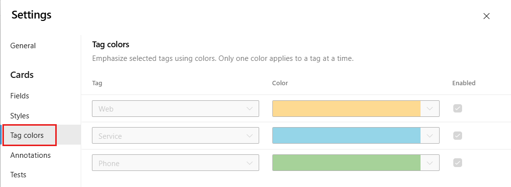

# Add work item tags to categorize and filter lists and boards  
 
[!INCLUDE [temp](../includes/version-all.md)]


Tagging work items helps you quickly filter the product backlog or a work 
item query by categories that you define. 
A tag corresponds to a one or two keyword phrase that you define and that supports your needs to filter a backlog or query, or define a query. 

Tags are a better choice to filter work items than using text strings as described in [Guidance to create high-performing queries](high-performing-queries.md).

You can add and modify tags from the web portal, from Team Explorer plug-in for Visual Studio. Also, you can open a query in [Excel](../backlogs/office/bulk-add-modify-work-items-excel.md) to perform bulk modifications of tags.  

> [!NOTE]   
> Tags are a shared resource, they're associated with a project and not a team. If your project contains multiple teams, all teams will add to and work from the same set of tags.  

[!INCLUDE [temp](../includes/prerequisites-work-items.md)] 

::: moniker range="azure-devops"
> [!NOTE]   
> Users with **Stakeholder** access for public projects are allowed to add new tags. 
::: moniker-end


<a id="assign"></a>

## Add tags to a work item

Tags should be 400 characters or less and not contain separators such as a `,` (comma), `;` (semicolon), or other formatting character. 

::: moniker range=">= tfs-2017"
From the web portal, open a work item and add a tag. Choose **Add tag** and type your keyword. Or, select from the list of previously assigned tags.  

> [!div class="mx-imgBorder"]
> 
::: moniker-end

::: moniker range=">= tfs-2013 <= tfs-2015"
From the web portal, open a work item and add a tag. Choose **Add** and type your keyword. Or, select from the list of previously assigned tags.  

  
::: moniker-end

To add several tags at one time, type a comma between tags. Tags are case sensitive.  

Tags that appear in the tag bar are already assigned to the work item. To unassign a tag, simply choose the x on the tag,.   

::: moniker range="azure-devops"
> [!NOTE]   
> By default, all Contributors and Stakeholders of public projects are granted permissions to add new and existing 
> tags. Stakeholders in private projects can add tags that are already defined, but not add 
> new tags. To grant or restrict permissions to create new tags, you set 
> the permission **Create tag definition** at the project-level. To learn
> more, see [Add administrators, set permissions at the project-level or project collection-level](../../organizations/security/set-project-collection-level-permissions.md).
::: moniker-end	


<a id="bulk-modify"></a>

## Bulk add or remove tags 

::: moniker range=">= tfs-2017"

You can bulk update work items to add or remove tags from the web portal.
You bulk modify tags in the same way as you [bulk modify other fields using the web portal](../backlogs/bulk-modify-work-items.md#tags). Or, you can use [Excel](../backlogs/office/bulk-add-modify-work-items-excel.md) to bulk add or remove tags.   

> [!div class="mx-imgBorder"]
>  

::: moniker-end

::: moniker range="<= tfs-2015"

[Use Excel to bulk modify tags](../backlogs/office/bulk-add-modify-work-items-excel.md).

::: moniker-end

> [!NOTE]   
> Bulk modify of tags from the Visual Studio client isn't supported. 


<a id="query"></a>

## Query for work items based on tags  

To query work items based on tags, add a clause for each tag you want to use to support your query.  

::: moniker range="tfs-2013"
> [!Note]    
> Adding tags to a query is supported from TFS 2013.2 and later versions.
::: moniker-end

> [!TIP]    
> You can use the **Contains** or **Does Not Contain** operators. To learn more about queries, see [Create managed queries](using-queries.md). 

For example, here we query for all work items that are tagged either ```Web``` or ```Service```. 

> [!div class="mx-imgBorder"]
>  


[!INCLUDE [temp](../includes/query-clause-tip.md)]

<a id="no-tags" />

> [!NOTE]
> The ability to query for work items that don't have any tags attached to them is not a supported feature. If you'd like to up vote the request to support this feature, you can do so on our Developer Community page, [Be able to search for empty tags](https://developercommunity.visualstudio.com/t/be-able-to-search-for-empty-tags/907425). 

<a id="show-tags"></a>

## Show tags in your backlog or query results

::: moniker range=">= tfs-2017"
Choose **Column Options** to add the **Tags** field to the product backlog or a work item query. If the option doesn't appear, choose **More commands** :::image type="icon" source="../media/icons/actions-icon.png" border="false":::  to select it from the menu of options.    

> [!div class="mx-imgBorder"]
> 

All tags that have been added to the listed work items appear.

> [!div class="mx-imgBorder"]
>  
 
::: moniker-end
  

::: moniker range="<= tfs-2015"

1. Choose **Column Options** to add the **Tags** field to the product backlog or a work item query. If the option doesn't appear, choose **More commands** :::image type="icon" source="../media/icons/actions-icon.png" border="false"::: to select it from the menu of options. 

	

2. All tags that are assigned to the listed work items appear.

	 
 
::: moniker-end

<a id="filter"></a>

## Filter lists using tags  

From the web portal, you can filter backlogs, boards, and query results using tags. 
 
::: moniker range=">= tfs-2017"

Begin by choosing **Filter** :::image type="icon" source="../media/icons/filter-icon.png" border="false":::. 

Check the boxes of those tags that you want to filter on. Keep the **OR** selection to perform a logical OR for all the tags you selected. Or, choose the **AND** option to perform a logical AND on all the selected tags. 

> [!div class="mx-imgBorder"]
>  


::: moniker-end

::: moniker range="<= tfs-2015"

1. Turn on filtering and choose a tag.  

	  

	The list refreshes. Only those work items with the selected tag are displayed. Filtering the list disables add-a-backlog-item panel, stack ranking, and forecasting.  

	  

2. To apply a sub-filter, choose another tag. You filter successively by choosing from the set of tags that appear in the filter tag bar. To start your filter process over, choose All to show all tags.  

3. To show all items, choose All or choose the Tag filter image on backlog and queries pages filter icon to turn filtering off.   

::: moniker-end

## Delete, remove, or manage tags 

You can't delete a tag itself. However, if you delete a tag from all work items to which it's currently assigned, the system will delete the tag. The system automatically deletes unassigned tags after 3 days of disuse.  

If you misspell a tag, don't assign the misspelled tag to any work item and the system will automatically delete it within 3 days.  

::: moniker range=">= tfs-2018" 

Another option is to install the [Marketplace Tags Manager](https://marketplace.visualstudio.com/items?itemName=YodLabs.TagsManager2) which adds a **Tags** page under **Boards** or **Work** to manage tags. 

::: moniker-end

::: moniker range=">=tfs-2015"
  
## Color-code tags on boards

You can highlight tags on Kanban board cards by color-coding them. These colors only appear on the Kanban board that you configure. they don't appear on backlogs or taskboards. To learn more, see [Customize cards, color-code tags](../boards/customize-cards.md#color-tags). 
::: moniker-end   

::: moniker range="tfs-2015"  
Requires TFS 2015.1 or later version.  
::: moniker-end   

::: moniker range=">=tfs-2015"  

> [!div class="mx-imgBorder"]
> 

::: moniker-end   

::: moniker range="azure-devops"

<a id="group-by-tags"></a> 

## Chart work items and group by tags

> [!NOTE]   
> You can't group a query-based chart by tags, however, you can group a **Chart for Work Items** widget by tags that you add to a dashboard.    This feature is in public preview. To enable it, see [Manage or enable features](../../project/navigation/preview-features.md) and turn on **Enable group by tags for work item chart widget on dashboard**. 

To group a **Chart for Work Items** widget by tags, perform the same steps provided in [Track progress with status and trend query-based charts, Add a chart widget to a dashboard](../../report/dashboards/charts.md#add-chart-widget). Make sure that your flat-list query contains **Tags** in the query clause or as a column option. Then, choose **Tags** for the **Group by** selection. To filter the chart to show only some tags, choose the **Selected tags** radio button and then choose the tags you want the chart to display.  

:::image type="content" source="../../report/dashboards/media/charts/configure-chart-widget-tags.png" alt-text="Screenshot of Chart by Work Items, Configure, Group by Tags.":::

::: moniker-end

## Related articles

- [Best tool to add, update, and link work items](../work-items/best-tool-add-update-link-work-items.md)  
- [Use the query editor to list and manage queries](using-queries.md) 
- [Show tags on cards](../../boards/boards/customize-cards.md)
- [Bulk modify work items from the web portal](../backlogs/bulk-modify-work-items.md)  
- [Bulk modify work items from Excel](../backlogs/office/bulk-add-modify-work-items-excel.md)  

### Limits on number of tags

While no hard limit exists, creating more than 100K tags for a project collection can negatively impact performance. Also, the auto-complete dropdown menu for the tag control displays a maximum of 200 tags. When more than 200 tags are defined, begin typing to cause the tag control to display relevant tags.  

You can't assign more than 100 tags to a work item or you'll receive the following message:  

```
TF401243: Failed to save work item because too many new tags were added to the work item.
```

Simply save the work item with the tags (100 or less) that you've added, and then you can add more tags. 

Limit queries to fewer than 25 tags. More than that and the query will likely time out.  


::: moniker range="< azure-devops"

### Add tags to the default column view on the product backlog 

To add the Tags field as a column field for the product backlog, you modify the ProcessConfiguration file to include ```System.Tags```.  To learn how, see the [Process configuration XML element reference](../../reference/xml/process-configuration-xml-element.md).

::: moniker-end
