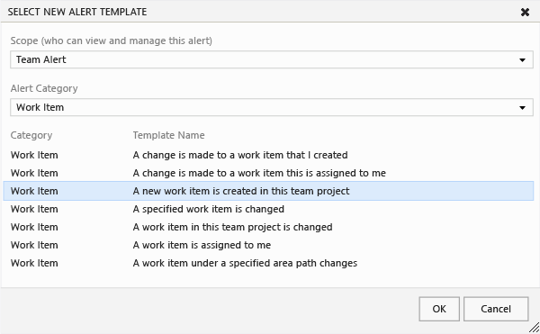

# Set alerts, get notified when changes occur 

<b>TFS 2017 | TFS 2015 | TFS 2013</b> 

> [!IMPORTANT]  
>this article describes how to manage alerts or email notifications when working from the web portal for an on-premises TFS. If you work in Azure Boards and TFS 2017.1 or later version, see [Manage your notifications](../../notifications/howto-manage-personal-notifications.md) and  [Manage notifications for a team](../../notifications/howto-manage-team-notifications.md). 

As changes occur to work items, code reviews, source control files, and builds, you can receive email notifications for alerts that you define. For example, you can set an alert to be notified whenever a bug that you opened is resolved or a work item is assigned to you. You can set personal alerts or [team alerts](#team-alerts).

## Set alerts just for yourself
1. Open alerts management (My alerts from your profile menu). If you don't see this option, then you must [configure an SMTP server to support TFS](/azure/devops/server/admin/setup-customize-alerts). 
	
	

2. Enter one or more email addresses. Separate addresses with a semi-colon. 
	
	  

3.	Select the check box for each alert of interest. **My work items** and **My build** refer to work items and builds that you created.
	
	

	Alert templates reference a customizable query. 
	
	The following alert types appear when your project is provisioned with Git for version control:  
	- **A commit is pushed to this project**  
	- **A pull request I've participated in is created or updated**  
	- **A build quality changes** 

	> [!TIP]    
	> When you clear an alert, you also clear all email addresses defined for the alert.  

4.	For more options, open custom alerts and choose one of the options available. Also, you can open a basic alert and modify its settings, such as changing the email format from HTML to plain text or SOAP. 
	
	

5.	Define alert filters in the same way you define query filters.
	
	
	
	For a list of available fields, see [Index of work item fields](../work-items/guidance/work-item-field.md).

6.	For even more options, open the Select New Alert Template. 
	
	

7.	Choose from one of the several alert types listed.
	
	

## Set alerts for your team
1.	If you're not a team administrator, [get added as one](../../organizations/settings/add-team-administrator.md). You need to be a team, project, or project collection administrator to create team alerts. 

2.	Open team alerts from Manage TFS Alerts.

	

3. Expand the team and open Select New Alert Template. 

	

4. Choose an alert type. 

	

5. Notice how the subscriber is set to the team context. Alerts are sent to each team member based on their preferred email address, which they set through their profile.
	
	

	> [!TIP]    
	> For the team context, the alert query interprets the **@Me**  variable as anyone who is a member of the team.

You can set filters for as many as 20 different alert types, specify the email addresses for yourself and other team members, and select the delivery format. Also, you can set team alerts to keep all team members notified of important changes. 

##Administer alerts for a project
To administer alerts for a project, you must be a member of the Project Collection Administrator or Team Foundation Administrator groups. To get added, see [Add an administrator](../../organizations/security/set-project-collection-level-permissions.md). If you're not a member of these groups, you won't see the options available for administering alerts.

As an administrator, you can view, create, edit, and delete alerts for team members and teams. 

###View alerts set for a project 

* From the web admin page for a project, open the Alerts tab and expand All alerts. 

	

###Find alerts set for a team member or team

* Choose the name of the team member from the drop down list, or type the name in the search box. 

	

	

###Create, edit, or delete an alert
1. To create an alert for a team member, first find the alerts defined for that subscriber as described in the previous step. Then, create an alert in the same way that a team member creates alerts. 

	

	To create an alert for a team, first find the alerts assigned to that team, and then create an alert in the same way. The team should appear in the Subscriber field. 

2. To edit or delete an alert, open it from the short cut menu.

	

## Related articles

- [Manage your notifications](../../notifications/howto-manage-personal-notifications.md) 
- [Manage notifications for a team](../../notifications/howto-manage-team-notifications.md) 
- [Set your profile and preferences](../../organizations/settings/set-your-preferences.md)  
- [Work across projects](../../project/navigation/work-across-projects.md) 
