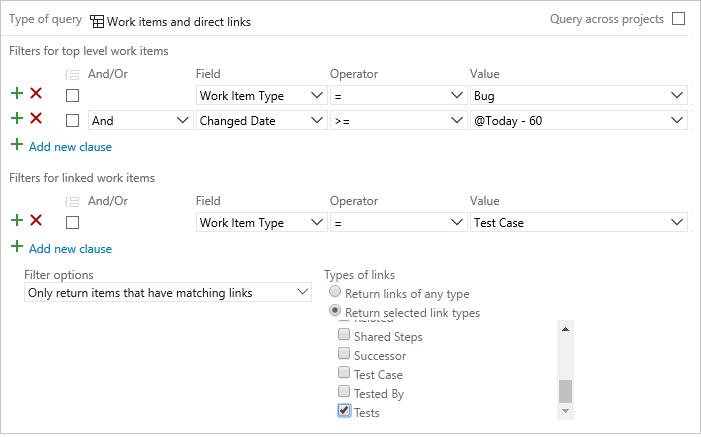

# Query based on build and test integration fields

[!INCLUDE [temp](../../_shared/version-vsts-tfs-all-versions.md)]

Work item fields that support build and test integration support the following actions:  
-   Associate bugs with the builds where they were found or fixed  
-   Query for bugs associated with a build 
-   Mark test cases as either manual or automated, and store information to support automated test cases  
-   For test cases and shared steps, define the action and validation steps and the data that are used to perform tests.

<!--- include information on limits of querying by test case -->  


## Supported operators and macros 
Most build and test integration fields have a data type of String, PlainText, or HTML. Query clauses that specify a text or rich-text field can use the operators and macros listed in the following table.

<table valign="top">
<thead>
<tr>
<th width="22%"><p>Data type</p></th>
<th width="78%"><p>Supported operators and macros</p></th>
</tr>
</thead>
<tbody valign="top">
<tr>
	<td><p> <strong>Rich-text (HTML)</strong> </p></td>
	<td>Contains Words, Does Not Contain Words, Is Empty<sup>1</sup>, Is Not Empty<sup>1</sup></td>
</tr>
<tr>
	<td><strong>Multi-line text strings (PlainText)</strong> </td>
	<td>Contains Words, Does Not Contain Words, Is Empty<sup>1</sup>, Is Not Empty<sup>1</sup></td>
</tr>
<tr>
	<td><strong>Single text (String)</strong> </td>
	<td>= , <> , > , < , >= , <= , =[Field], <>[Field], >[Field], <[Field], >=[Field], <=[Field], Contains, Does Not Contain, In, Not In, In Group, Not In Group, Was Ever
	<p>**Macros**: **[Any]**, valid with the **Work Item Type** field<br/>
	**@Project**<sup>2</sup>, valid with the **Team Project** field </p>
	</td>
</tr>
</tbody>
</table>

####Notes:
1. The **Is Empty** and **Is Not Empty** operators are supported for Azure DevOps Server 2019 RC2 and later versions
2. The **@Project** macro is supported for Azure Boards and TFS 2015.1 and later versions. The system automatically defaults to filtering based on the current project. To learn more, see [Query across projects](using-queries.md#across-projects). 


## Useful filters 
<table width="100%">
<tbody valign="top">
<tr>
<th width="50%">Filter for</th>
<th width="50%">Include these query clauses</th>
</tr>
<tr>
<td>Automated test cases
</td>
<td>
&#160;&#160;&#160;&#160;&#160;&#160;&#160;&#160;```Work Item Type _ = _ Test Case```  
```And Automation Status _ = _ Automated```  
</td>
</tr>

<tr>
<td>Query-based test suites
</td>
<td>
&#160;&#160;&#160;&#160;&#160;&#160;&#160;&#160;```Work Item Type _ = _ Test Suite```  
```And Test Suite Type _ = _ Query Based```  
</td>
</tr>


<tr>
<td>Requirement-based test suites
</td>
<td>
&#160;&#160;&#160;&#160;&#160;&#160;&#160;&#160;```Work Item Type _ = _ Test Suite```  
```And Test Suite Type _ = _ Requirement Based```  
</td>
</tr>

</tbody>
</table>  

<a id="linked-bugs" />
##List bugs and the test cases that test them

Open a new query, set the query type to Work items and direct links. Filter for bugs in the top-level and add the filter for Test Cases in the linked work items filter. 



> [!NOTE]    
>You can't construct a query that shows a hierarchical view of Test Plans, Test Suites, and Test Cases. These items aren't linked together using parent-child link types. You can [view the hierarchy through the **Test>Test Plans** page](../../test/create-a-test-plan.md). 

## Build and test data fields  

The following table describes the fields that are defined in one or more of the test WITs. For information about data types and field attributes, see [Work item fields and attributes](../work-items/work-item-fields.md).

To customize a field or picklist, see [Add or modify a field to support queries, reports, and workflow](../../reference/add-modify-field.md).


<table width="100%">
<thead>
<tr>
  <th width="20%">Field name</th>
  <th width="55%">Description</th>
  <th width="25%">Work item type</th>
</tr>
</thead>
<tbody valign="top">
<tr>
<td><p>Automation Status<sup> 1</sup></p></td>
<td><p>The status of a test case. You can specify the following values:</p>
<ul>
<li><p><strong>Automated</strong></p></li>
<li><p><strong>Not Automated</strong></p></li>
<li><p><strong>Planned</strong></p></li>
</ul>
<p>To run automated tests, see [Run automated tests from test plans](../../test/run-automated-tests-from-test-hub.md).</p>
<p>Reference name=Microsoft.VSTS.TCM.AutomationStatus, Data type=String</p>
</td>
<td>Test Case</td>

</tr>
<tr>
<td><p>Found In<sup> 2</sup></p></td>
<td><p>Product build number, also known as a revision, in which a bug was found.</p>
<p>Reference name=Microsoft.VSTS.Build.FoundIn, Data type=String</p>
<blockquote>
**Note:** You can also use the **Found in build** link type to link a work item to a build. This link type is available from Azure DevOps and only works with the current build processes (not XAML builds).   
</blockquote>
</td>
<td>Bug</td>

</tr>
<tr>
<td><p>Integration Build<sup> 2</sup></p></td>
<td><p>Product build number that incorporates the code or fixes a bug.</p>
<p>Reference name=Microsoft.VSTS.Build.IntegrationBuild, Data type=String</p>
<blockquote>
**Note:** You can also use the **Integrated in build** link type to link a work item to a build. This link type is available from Azure DevOps and only works with the current build processes (not XAML builds).  
</blockquote>
</td>
<td>All</td>
</tr>

<tr>
<td><p>Issue</p></td>
<td><p>Indicates that the Shared Steps is associated with an expected result. Allowed values are <strong>Yes</strong> and <strong>No</strong>. </p>
<p>Reference name=Microsoft.VSTS.Common.Issue, Data type=String</p></td>
<td>Shared Steps</td>
</tr>
<tr>
<td><p>Parameters<sup> 3</sup></p></td>
<td><p>Contains the parameters to use when running a manual test. </p>
<p>Microsoft.VSTS.TCM.Parameters, Data type=HTML</p></td>
<td>Shared Parameters, Shared Steps, Test Case</td>
</tr>
<tr>
<td><p>Steps</p></td>
<td><p>The action and validation steps that are required to perform the test.</p>
<p>Microsoft.VSTS.TCM.Steps, Data type=HTML</p></td>
<td>Shared Steps, Test Case</td>
</tr>
<tr>
<td><p>System Info</p></td>
<td><p>Information about the software and system configuration that is relevant to the test.</p>
<p>Microsoft.VSTS.TCM.SystemInfo, Data type=HTML</p></td>
<td>Bug, Feedback Response</td>
</tr>
<tr>
  <td>
Repro Steps (or Steps to reproduce) 
  </td>
  <td>
    <p>The steps that are required to reproduce unexpected behavior. Capture enough information so that other team members can understand the full impact of the problem as well as whether they have fixed the bug. This includes actions taken to find or reproduce the bug and expected behavior.
</p> 
	<p>Reference name=Microsoft.VSTS.TCM.ReproSteps, Data type=HTML</p>
  </td>
<td>Bug</td>
</tr>

<tr>
<td><p>Test Suite Type<sup> 1,4</sup></p></td>
<td><p>The test suite category. Allowed values are:</p>
<ul>
<li><p><strong>Query Based</strong>: Use to group together test cases that have a particular characteristic - for example, all the tests that have Priority=1. The suite will automatically include every test case that is returned by the query that you define.</p></li>
<li><p><strong>Static</strong>: Use to group together test cases designed to track the test status of backlog items. Each test case that you add to a requirement-based test suite is automatically linked to the backlog item.</p></li>
<li><p><strong>Requirement Based</strong>: Use to group together test cases with any characteristics or test suites.</p></li>
</ul>
<p>For more information, see [Create a test plan](../../test/create-a-test-plan.md).</p> 

	<p>Reference name=Microsoft.VSTS.TCM.TestSuiteType, Data type=String</p>
  </td>
<td><p>Test Suite</p></td>
</tr>
</tbody>
</table>

**Notes**  
1.  Do not customize the picklist for these fields. The system accepts only those values listed.  
2.  By adding a `GLOBALLIST` element to the `FIELD` definition, you can provide a drop-down menu of builds that users can choose from. To learn how, see [Builds and global list auto-population](#global-list) later in this article.
3.  Requires TFS 2013.2 or later version to be installed on the application-tier server and existing projects to be updated to support Shared Parameters. To learn more, see [Configure features after a TFS upgrade](../../reference/configure-features-after-upgrade.md).  
4.  Requires TFS 2013.3 or later version to be installed on the application-tier server and existing projects to be updated to support Test Plan and Test Suite. To learn more, see [Configure features after a TFS upgrade](../../reference/configure-features-after-upgrade.md). 

## Additional fields

The following fields do not appear on work item forms, but these fields are tracked for test cases or test suites. You can use some of these fields to filter queries and create reports. (None of these fields are added to the data warehouse nor indexed.) 

<table width="100%">
<thead>
<tr>
  <th width="20%">Field name</th>
  <th width="55%">Description</th>
  <th width="25%">Work item type</th>
</tr>
</thead>
<tbody valign="top">
<tr>
<td><p>Automated Test Storage</p></td>
<td><p>The assembly that contains the test that automates the test case.</p>
	<p>Reference name=Microsoft.VSTS.TCM.AutomatedTestStorage, Data type=String</p></td>
<td><p>Test Case</p></td>
</tr>
<tr>
<td><p>Automated Test Type</p></td>
<td><p>The type of test that automates the test case.</p>
<p>Reference name=Microsoft.VSTS.TCM.AutomatedTestType, Data type=String</p>
</td>
<td>Test Case</td>
</tr>

<tr>
<td><p>AutomatedTestId</p></td>
<td><p>The ID of the test that automates the test case. </p>
<p>Reference name=Microsoft.VSTS.TCM.AutomatedTestId, Data type=String</p></td>
<td>Test Case</td>

</tr>
<tr>
<td><p>AutomatedTestName</p></td>
<td><p>The name of the test that is used to automate the test case.</p>
<p>Reference name=Microsoft.VSTS.TCM.AutomatedTestName, Data type=String</p></td>
<td><p>Test Case</p></td>

</tr>
<tr>
<td><p>LocalDataSource</p></td>
<td><p>The local data source that supports the test. </p>
<p>Reference name=Microsoft.VSTS.TCM.LocalDataSource, Data type=HTML</p></td>
<td><p>Test Case</p></td>
 
</tr>
<tr>
<td><p>Query Text</p></td>
<td><p>Field used to capture the query defined for a Query-based suite type.</p>
<p>Reference name=Microsoft.VSTS.TCM.QueryText, Data type=PlainText</p></td>
<td><p>Test Suite</p></td>
</tr>
<tr>
<td><p>Test Suite Audit <sup> 1</sup></p></td>
<td><p>Tracks additional operations performed when modifying a test suite, for example: adding tests to a test suite or changing configurations. This field can be viewed through the History tab or through a separate query. There will be a consolidated history view, including changes performed to work items field and changes resulting from related artifacts such as test points and configurations.</p>
<p>Reference name=Microsoft.VSTS.TCM.TestSuiteAudit, Data type=PlainText</p></td>
<td>Test Suite</td>
</tr>

<tr>
<td><p>Test Suite Type ID <sup>1, 2</sup></p></td>
<td><p>A system assigned value that corresponds to the test suite category and only applicable to test suites. Assigned values are:</p>
<ul>
<li><p><strong>1</strong> (Static)</p></li>
<li><p><strong>2</strong> (Query-based)</p></li>
<li><p><strong>3</strong> (Requirement- based)</p></li>
</ul>
<p>Reference name=Microsoft.VSTS.TCM.TestSuiteTypeId, Data type=Integer</p></td>
<td>Test Suite</td>
</tr>
</tbody>
</table>

**Notes**  
1.  Requires TFS 2013.3 or later version to be installed on the application-tier server and existing projects to be updated to support Test Plan and Test Suite.  
2.  Do not customize the picklist for these fields. The system accepts only those values listed.


<a id="tf-build" /> 
::: moniker range="< azure-devops"
### Fields that integrate with Team Foundation Build
Team Foundation Build is the on-premise build system you can use with Azure DevOps Server and TFS. You can configure your build process by using Team Foundation Build, and Team Foundation Build can generate work items when a build fails. It can also add build information to work items that were resolved in a particular build. For this to work, Team Foundation Build requires that the following two fields be added to the work item type definition: **Found In** and **Integration Build**.

**Found In** and **Integrated in Build** fields are defined for Bugs in the default processes. These fields associate bugs with the builds where they were found or fixed. 

You can use the following code snippet to add these fields to a WIT definition.

> [!div class="tabbedCodeSnippets"]
```XML
<FIELD name="Found In" refname="Microsoft.VSTS.Build.FoundIn" type="String" reportable="dimension">
    <HELPTEXT>Product build number (revision) in which this item was found</HELPTEXT>
        <SUGGESTEDVALUES>
          <LISTITEM value="&lt;None&gt;" />
        </SUGGESTEDVALUES>
</FIELD>
<FIELD name="Integration Build" refname="Microsoft.VSTS.Build.IntegrationBuild" type="String" reportable="dimension">
    <HELPTEXT>Product build number this bug was fixed in</HELPTEXT>
        <SUGGESTEDVALUES>
          <LISTITEM value="&lt;None&gt;" />
        </SUGGESTEDVALUES>
</FIELD>
```


When the **Found In** field is present in a WIT definition, Team Foundation Build creates a work item when a build fails, and sets the **Found In** field to the build number of the build that just failed. If the **Found In** field is missing, Team Foundation Build does not create a work item for the failed build, and everything else works as expected.

When the **Integration Build** field is present in the WIT definition, Team Foundation Build identifies work items that were resolved with each build and then updates those work items to set the build number in which they were resolved in the **Integration Build** field. If the **Integration Build** field is missing, Team Foundation Build does not store the build number in the work items, and everything else works as expected.

::: moniker-end

<a id="global-list" /> 
### Builds and global list auto-population
The first time you queue a build for a project using Team Foundation Build, TFS automatically adds a global list labeled **Build - <project name>**. Each time a build is run, a **LISTITEM** is added to this global list with the name of the build.

::: moniker range="< azure-devops"

By adding a **GLOBALLIST** element to the **FIELD** definition, you can provide a drop-down menu of builds that users can choose from. For example:

> [!div class="tabbedCodeSnippets"]
```XML
<FIELD name="Found In" refname="Microsoft.VSTS.Build.FoundIn" type="String" reportable="dimension">
    <HELPTEXT>Product build number (revision) in which this item was found</HELPTEXT>
        <SUGGESTEDVALUES>
          <LISTITEM value="&lt;None&gt;" />
        </SUGGESTEDVALUES>
        <SUGGESTEDVALUES expanditems="true" filteritems="excludegroups">
          <GLOBALLIST name="Builds - TeamProjectName" />
        </SUGGESTEDVALUES>
</FIELD>
```

::: moniker-end


<a id="tf-build" /> 
### Fields that Integrate with Test Plans
With Test Plans, you can automate the creation of a bug or other type of work item when a test fails. For more information, see [Add findings to existing bugs with exploratory testing](../../test/add-to-bugs-exploratory-testing.md).

When a work item has been created in this manner, information about the system and the steps to reproduce the bug are captured in the **System Info** and **Repro Steps** fields.

::: moniker range="< azure-devops"
You can add these fields to work item types that you create for tracking defects using the following code snippet.

> [!div class="tabbedCodeSnippets"]
```XML
<FIELD name="System Info" refname="Microsoft.VSTS.TCM.SystemInfo" type="HTML" />
<FIELD name="Repro Steps" refname="Microsoft.VSTS.TCM.ReproSteps" type="HTML" />
```

::: moniker-end

### Fields that integrate with Team Foundation Version Control
One of the features available in Team Foundation version control (TFVC) enables you to associate or resolve work items when you check in code. You might have worked on a particular work item when you make a code change and you can set that association from within the source-control check-in window when you are finished working on the code.

The ability of Team Foundation version control to resolve a work item requires that work items contain a particular action. The source control system then queries work item tracking to determine whether the work item supports that action, and if it does support that action, it also queries for the source and destination states of the transition. If the action is found, the source control system can transition the work item according to the set transition when it checks in the code.

> [!NOTE]
> When you use the **Checkin** action, you must set appropriate *from* and *to* states to reflect the state transition that you want.

For more information about Actions, see [Automate field assignments based on State, Transition, or Reason](../../reference/xml/automate-field-assignments-state-transition-reason.md).

## Related articles

- [Work item field index](../work-items/guidance/work-item-field.md)  
- [Drive Git development from a work item](../backlogs/connect-work-items-to-git-dev-ops.md) 
- [Linking, traceability, and managing dependencies](link-work-items-support-traceability.md)  
- [Link and attachment queries](linking-attachments.md)

::: moniker range="tfs-2013"  
### Availability of test work item types 

Test Manager and the test work item types (WITs) use the following fields to track test plans, progress, and results. The availability of the WITs is based on the version of TFS installed on your application-tier. To learn more about using these WITs, see [Create a test plan](../../test/create-a-test-plan.md).

|TFS 2013.0|TFS 2013.2|TFS 2013.3 and later versions|
|---|---|---|
|<ul><li>Bug</li><li>Shared Steps</li><li>Test Case</li></ul>|<ul><li>Bug</li><li>Shared Parameters</li><li>Shared Steps</li><li>Test Case</li></ul>|<ul><li>Bug</li><li>Shared Parameters</li><li>Shared Steps</li><li>Test Case</li><li>Test Plan</li><li>Test Suite</li></ul>|

To learn more about upgrading an existing project to get WITs that your project currently doesn't have, see [Configure features after an upgrade](../../reference/configure-features-after-upgrade.md).

::: moniker-end  