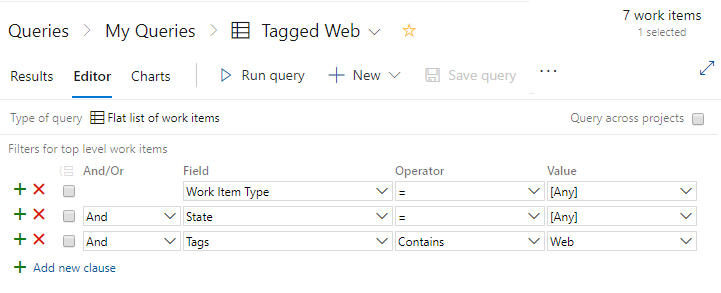

---
title: Learn how to create high-performing work item queries
titleSuffix: Azure Boards
description: Learn how to create high-performing work item queries in Azure Boards. 
ms.custom: "boards-queries, linked-from-support"  
ms.service: azure-devops-boards
ms.assetid: 
ms.author: chcomley
author: KathrynEE
ms.topic: best-practice
monikerRange: '<= azure-devops'
ms.date: 01/31/2022  
--- 

# Guidance to create high-performing queries in Azure Boards
 
[!INCLUDE [version-lt-eq-azure-devops](../../includes/version-lt-eq-azure-devops.md)]

While you can easily create work item queries, to create high-performing queries requires a deeper understanding. By improving your query performance, you improve your individual productivity, dashboard performance, and resource rate limits.  

> [!NOTE]   
> Reference to service or resource rate limits only applies to queries run against Azure DevOps Services. To learn more, see [Service limits and rate limits](../../user-guide/service-limits.md). 

This article provides general guidelines on how to write a high-performing query. These guidelines apply to the following queries you create:

::: moniker range="azure-devops"
- [Web portal queries](view-run-query.md)
- [Work Item Query Language (WIQL) queries](wiql-syntax.md) 
- [az boards query command line](view-run-query.md#run-a-query-from-the-command-line)
- [REST API queries](/rest/api/azure/devops/wit/queries)
::: moniker-end

::: moniker range="< azure-devops"
- [Web portal queries](view-run-query.md)
- [Work Item Query Language (WIQL) queries](wiql-syntax.md) 
- [REST API queries](/rest/api/azure/devops/wit/queries)
::: moniker-end

## Create focused, selective queries  

The first guideline for a high-performing query is to define a highly selective query. To do this, apply all filters that are necessary for your query. The more selective the query is, the smaller the result set is. The smaller the result set is, the more targeted and selective your query is. 

 
## Use tags to categorize work items

Use [work item tags](add-tags-to-work-items.md) to categorize your work items instead of a custom field. Queries that filter on tags usually perform faster over those queries that filter on string matches. 

Unlike custom field matches or partial matches, a query with a `Tags Contains` operation doesn't require a complete scan of all work item tables. 

> [!div class="mx-imgBorder"]  
>   

## Use `Contains words` for string matches
 
To filter on a string match, use the `Contains Words` instead of the `Contains` operator. The `Contains Words` operator runs a full-text search on the specified field, which tends to complete more quickly. 

The `Contains` operator runs a table scan, which is a slower operation than that used with the  `Contains Words` operator. It also consumes more CPU cycles. These CPU cycles can cause you to encounter rate limitations. For more information, see [Service limits and rate limits](../../user-guide/service-limits.md) and [Rate limits](../../integrate/concepts/rate-limits.md).

 
## Specify small groups with the `In Group` operator 

The `In Group` operator filters work items based on matches within a group of values. The group of values correspond to those contained within a team, security group, or [work tracking category](../work-items/agile-glossary.md#categories). For example, you can create a query to find all work items that are assigned to any member of a team. Or, find all work items that belong to the requirements category (`Microsoft.RequirementCategory`). 

When you filter on a group that contains a large number of members, your result set tends to be larger and non-selective.  Also, if a group corresponds to a large Azure Active Directory (Azure AD) group, the query generates a fairly large cost to resolve that group from Azure AD.  

## Avoid use of negated operators 

Negated operators&mdash;such as `<>, Not In, Not Under, Not In Group`&mdash;tend to generate non-selective queries and large result sets. 

Only use negated operators when absolutely necessary. Always try to find alternatives first. For example, if **Field1** has values *A*, *B*, *C*, *D*; specify the `Field1 In A, B, C` clause, instead of the negated `Field1 <> D` clause.

## Avoid string comparisons  

Queries that contain string comparisons generate table scans that are inherently inefficient. Instead, we recommend you use tags or a specific custom field as alternatives, particularly when a query performs poorly. 

## Limit `Or` operators

Try to limit the number of `Or` operators defined in your query. Queries run better when fewer `Or` operators are used. Too many `Or` operators can make your query non-selective. If your query runs slowly, reorder the `Or` operator clause towards the top of the query clauses.  
 

## Save your query 

Save your query to improve query performance. Due to internal optimizations, saved queries tend to perform better over unsaved queries. Always save your query when you plan to reuse it. Even WIQL queries run through a REST API, save the WIQL through the web portal to make your REST API calls less prone to future performance regressions. 

[!INCLUDE [temp](../includes/rest-apis-queries.md)]

## Related articles

- [Service limits and rate limits](../../user-guide/service-limits.md) 
- [Create managed queries](using-queries.md)
- [Query fields, operators & macros](query-operators-variables.md)
- [WIQL syntax](wiql-syntax.md)  
- [Query quick reference](query-index-quick-ref.md)
- [az boards query command](/cli/azure/boards#az-boards-query)